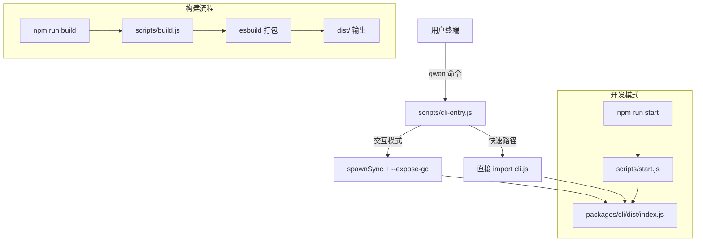

# Day 1: 环境搭建

## 🎯 学习目标

- 完成千问 Code 源码的克隆、依赖安装和构建
- 掌握本地运行和调试 CLI 的方法
- 理解项目的 Node.js 版本要求和基本工具链
- 配置 VS Code 调试器以便后续源码阅读

## 📖 核心概念

千问 Code 是一个基于 Node.js 的 AI 编程 Agent CLI 工具。它的技术栈要求：

| 项目       | 版本要求                                                     |
| ---------- | ------------------------------------------------------------ |
| Node.js    | >= 22.0.0（见 `.nvmrc` 和 `package.json` 的 `engines` 字段） |
| npm        | 随 Node 22 附带（用于 workspaces）                           |
| TypeScript | ESM 模式（`"type": "module"`）                               |
| 构建工具   | esbuild（打包）+ tsc（类型检查）                             |
| 测试框架   | Vitest                                                       |
| 代码规范   | ESLint 9 + Prettier                                          |

项目使用 **npm workspaces** 管理 monorepo，所有子包位于 `packages/` 目录下。根目录的 `package.json` 声明了 workspaces 列表：

```json
"workspaces": [
  "packages/*",
  "packages/channels/base",
  "packages/channels/telegram",
  "packages/channels/weixin",
  "packages/channels/dingtalk",
  "packages/channels/wecom",
  "packages/channels/feishu",
  "packages/channels/qqbot",
  "packages/channels/github",
  "packages/channels/plugin-example",
  "integrations/external-context",
  "!packages/desktop"
]
```

注意 `!packages/desktop` 被排除在 workspace 之外（桌面应用有独立的构建流程）。

## 🔍 源码导读

### 关键文件

| 文件                   | 作用                                    |
| ---------------------- | --------------------------------------- |
| `package.json`         | 根 workspace 配置，定义全局 scripts     |
| `.nvmrc`               | 锁定 Node.js 版本为 `22`                |
| `scripts/cli-entry.js` | 生产环境 bin 入口（处理 `--expose-gc`） |
| `scripts/start.js`     | 开发模式启动脚本                        |
| `scripts/build.js`     | 构建编排脚本                            |
| `esbuild.config.js`    | esbuild 打包配置                        |

### 启动命令链路

```
npm run start
  → node scripts/start.js
    → 加载 packages/cli 的 dist/index.js
      → scripts/cli-entry.js（生产 bin wrapper）
```

`scripts/cli-entry.js` 的前 50 行展示了它的核心逻辑：

```typescript
// 检查是否需要 --expose-gc（内存压力监控需要 global.gc()）
// 对 serve/mcp/help/version 等快速路径，直接在进程内执行
// 对交互模式，通过 spawnSync 重新启动并附加 --expose-gc
function isInProcessFastPath() {
  const first = cliArgs[0];
  if (first === 'serve' || first === 'mcp') {
    return true;
  }
  if (first === undefined || first.startsWith('-')) {
    return hasFlag('--help', '-h') || hasFlag('--version', '-v');
  }
  return false;
}
```

## 🏗️ 架构图



## 💻 动手练习

### 练习 1: 克隆与安装

```bash
# 1. 克隆仓库
git clone https://github.com/QwenLM/qwen-code.git
cd qwen-code

# 2. 确认 Node 版本（需要 >= 22）
node --version
# 如果使用 nvm：
nvm use  # 自动读取 .nvmrc

# 3. 安装依赖（npm workspaces 会自动链接所有子包）
npm install

# 4. 构建所有包
npm run build

# 5. 验证构建成功
npm run start -- --version
```

### 练习 2: 开发模式运行

```bash
# 直接启动交互模式（需要先 build）
npm run start

# 或者使用 dev 模式（支持热重载）
npm run dev
```

尝试在交互界面中输入 `/help` 查看所有可用命令。

### 练习 3: 配置 VS Code 调试器

在项目根目录创建 `.vscode/launch.json`：

```json
{
  "version": "0.2.0",
  "configurations": [
    {
      "name": "Debug Qwen Code CLI",
      "type": "node",
      "request": "launch",
      "program": "${workspaceFolder}/scripts/start.js",
      "console": "integratedTerminal",
      "env": {
        "DEBUG": "1"
      },
      "skipFiles": ["<node_internals>/**"]
    },
    {
      "name": "Debug with --inspect-brk",
      "type": "node",
      "request": "launch",
      "runtimeArgs": ["--inspect-brk"],
      "program": "${workspaceFolder}/scripts/start.js",
      "console": "integratedTerminal"
    }
  ]
}
```

然后在 `packages/cli/src/gemini.tsx` 的 `main()` 函数入口设置断点，按 F5 启动调试。

### 练习 4: 运行测试

```bash
# 运行所有包的单元测试
npm run test

# 只运行 core 包的测试
npm run test --workspace=packages/core

# 只运行 cli 包的测试
npm run test --workspace=packages/cli
```

## ✅ 自检问题

1. 千问 Code 要求的最低 Node.js 版本是多少？在哪里声明的？

<details><summary>答案</summary>

Node.js >= 22.0.0。在两个地方声明：

- `.nvmrc` 文件内容为 `22`
- 根 `package.json` 的 `"engines": { "node": ">=22.0.0" }`

</details>

2. `npm install` 在 monorepo 中做了什么额外工作？

<details><summary>答案</summary>

npm workspaces 会自动：

1. 将所有 `packages/*` 下的子包链接到根 `node_modules`
2. 解析子包之间的 `file:../xxx` 依赖为符号链接
3. 统一安装所有子包的外部依赖（hoisting）

</details>

3. `scripts/cli-entry.js` 中为什么交互模式需要 `--expose-gc`？

<details><summary>答案</summary>

交互模式是长时间运行的进程，内存压力监控器需要调用 `global.gc()` 来执行 critical-tier 的内存清理。`--expose-gc` 是 V8 的启动参数，暴露手动 GC 接口。快速路径（serve/mcp/help/version）是短命进程，不需要这个能力。

</details>

4. 如何只构建而不运行？构建产物在哪里？

<details><summary>答案</summary>

执行 `npm run build`。构建产物输出到各包的 `dist/` 目录。例如 `packages/cli/dist/index.js` 是 CLI 的入口文件，`packages/core/dist/` 是核心引擎的编译输出。

</details>

5. 开发调试时，如何在 `main()` 函数入口暂停执行？

<details><summary>答案</summary>

两种方式：

1. 使用 VS Code 的 `--inspect-brk` 配置，在 `packages/cli/src/gemini.tsx` 的 `main()` 函数设断点
2. 在代码中临时插入 `debugger;` 语句，然后用 `npm run debug` 启动

</details>

## 📚 延伸阅读

- `CONTRIBUTING.md` — 项目贡献指南，包含开发环境详细说明
- `Makefile` — 提供 `make build`、`make test` 等快捷命令
- `Dockerfile` — 了解生产环境的构建方式
- `scripts/dev.js` — 开发模式的热重载实现
