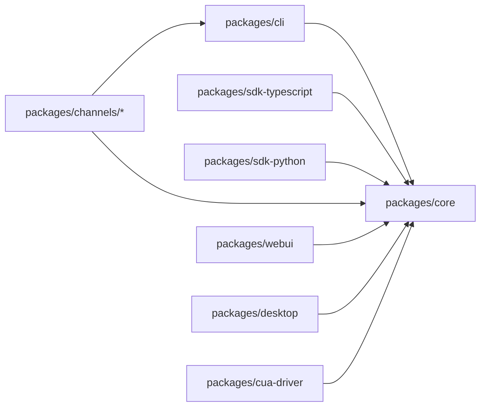
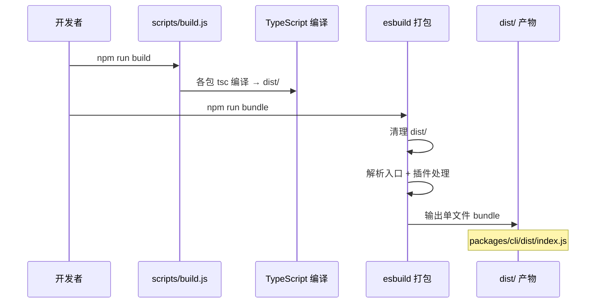
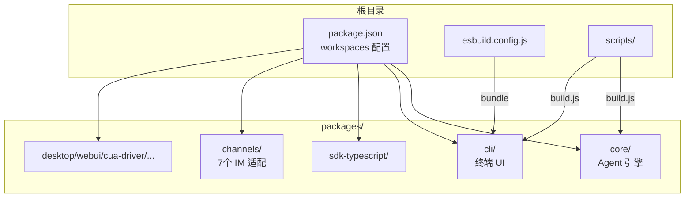

# Day 2: Monorepo 结构与构建系统

## 🎯 学习目标

- 理解 npm workspaces monorepo 的组织方式
- 掌握各子包的职责和依赖关系
- 理解 esbuild 打包流程和产物结构
- 能够独立构建、测试单个子包

## 📖 核心概念

### 为什么用 Monorepo？

千问 Code 由多个紧密协作的包组成：CLI 依赖 Core，SDK 依赖 Core，Channels 依赖 Core + CLI 的导出。Monorepo 的优势：

1. **原子变更** — 一次 PR 可以同时修改 core 和 cli
2. **统一版本** — 所有包共享版本号（当前 `0.21.0`）
3. **本地链接** — `file:../core` 依赖让开发时无需 publish

### 包职责划分

| 包                              | npm 名称                    | 职责                                                                |
| ------------------------------- | --------------------------- | ------------------------------------------------------------------- |
| `packages/core`                 | `@qwen-code/qwen-code-core` | Agent 引擎：LLM 调用、工具系统、权限、MCP、Memory                   |
| `packages/cli`                  | `@qwen-code/qwen-code`      | 终端 UI（React + Ink 7）+ CLI 入口                                  |
| `packages/sdk-typescript`       | —                           | TypeScript SDK，供外部程序集成                                      |
| `packages/sdk-python`           | —                           | Python SDK                                                          |
| `packages/channels/*`           | `@qwen-code/channel-*`      | IM 机器人适配（telegram/dingtalk/weixin/feishu/wecom/qqbot/github） |
| `packages/desktop`              | —                           | 桌面应用（排除在 workspace 外）                                     |
| `packages/webui`                | —                           | Web UI                                                              |
| `packages/cua-driver`           | —                           | Computer Use Agent 驱动                                             |
| `packages/chrome-extension`     | —                           | 浏览器扩展                                                          |
| `packages/vscode-ide-companion` | —                           | VS Code 伴侣扩展                                                    |

### 依赖方向



核心原则：**所有包依赖 core，core 不依赖任何业务包**。

## 🔍 源码导读

### 根 package.json 的 scripts

```typescript
// 关键 scripts（根 package.json）
{
  "start": "node scripts/start.js",           // 开发运行
  "build": "cross-env NODE_OPTIONS=\"--max-old-space-size=3072\" node scripts/build.js",
  "bundle": "npm run generate && node esbuild.config.js && node scripts/copy_bundle_assets.js",
  "test": "cross-env NODE_OPTIONS=\"--max-old-space-size=3072\" npm run test --workspaces --if-present --parallel"
}
```

注意 `--max-old-space-size=3072`：monorepo 全量构建/测试内存消耗大，需要提升 V8 堆上限。

### 子包的 package.json

`packages/core/package.json` 的关键字段：

```typescript
{
  "name": "@qwen-code/qwen-code-core",
  "type": "module",          // ESM
  "main": "dist/index.js",   // 编译后入口
  "exports": {
    ".": { "types": "./dist/index.d.ts", "import": "./dist/index.js" },
    "./transcriptRecords": { ... },
    "./goalWire": { ... },
    "./package.json": "./package.json",
    "./dist/*": "./dist/*",
    "./src/*": "./src/*"     // 允许直接引用源码（测试用）
  }
}
```

`packages/cli/package.json` 声明了 bin 入口：

```typescript
{
  "name": "@qwen-code/qwen-code",
  "bin": { "qwen": "dist/index.js" },  // 全局命令 `qwen`
  "dependencies": {
    "@qwen-code/qwen-code-core": "file:../core",  // 本地链接
    ...
  }
}
```

### esbuild 打包配置

`esbuild.config.js` 的核心逻辑：

```typescript
// 1. 清理 dist 目录
rmSync(path.resolve(__dirname, 'dist'), { recursive: true, force: true });

// 2. WASM 二进制内联插件
const wasmBinaryPlugin = {
  name: 'wasm-binary',
  setup(build) {
    // 将 .wasm?binary 导入转为内联 Uint8Array
    build.onResolve({ filter: /\.wasm\?binary$/ }, (args) => { ... });
    build.onLoad({ filter: /.*/, namespace: 'wasm-binary' }, (args) => {
      const contents = readFileSync(args.path);
      return { contents, loader: 'binary' };
    });
  },
};

// 3. OpenTelemetry exporter stub 插件（减少打包体积）
// 4. 主构建调用 esbuild.build({ entryPoints, bundle: true, ... })
```

### 构建流程



## 🏗️ 架构图



## 💻 动手练习

### 练习 1: 探索包依赖关系

```bash
# 查看 cli 包依赖了哪些本地包
cat packages/cli/package.json | grep "file:"

# 查看 core 包的外部依赖
cat packages/core/package.json | grep -A 50 '"dependencies"'
```

打开 `packages/cli/package.json`，找到所有 `file:../` 开头的依赖，列出 cli 直接依赖的本地包。

### 练习 2: 单独构建和测试一个包

```bash
# 只构建 core 包
npm run build --workspace=packages/core

# 只运行 core 的测试
npm run test --workspace=packages/core

# 只运行 cli 的测试
npm run test --workspace=packages/cli
```

### 练习 3: 理解 bundle 产物

```bash
# 执行 bundle
npm run bundle

# 查看产物大小
ls -lh packages/cli/dist/index.js

# 查看产物头部（确认是 ESM）
head -5 packages/cli/dist/index.js
```

### 练习 4: 追踪一个跨包导入

在 `packages/cli/src/gemini.tsx` 中找到对 `@qwen-code/qwen-code-core` 的 import 语句。然后到 `packages/core/src/index.ts`（或 `package.json` 的 exports 字段）确认该导入实际解析到哪个源文件。

## ✅ 自检问题

1. 为什么 `packages/desktop` 被排除在 workspaces 之外？

<details><summary>答案</summary>

桌面应用（Electron/Tauri）有独立的构建流程和依赖管理，将其纳入 npm workspaces 会导致依赖冲突或安装时间过长。它通过其他方式（如 git submodule 或独立 CI）与主仓库协作。

</details>

2. `file:../core` 这种依赖声明在 npm install 后实际是什么？

<details><summary>答案</summary>

npm 会在根 `node_modules/@qwen-code/qwen-code-core` 创建一个符号链接（symlink），指向 `packages/core` 目录。这样 cli 包中 `import ... from '@qwen-code/qwen-code-core'` 会直接解析到本地源码的编译产物。

</details>

3. esbuild 的 `wasm-binary` 插件解决了什么问题？

<details><summary>答案</summary>

将 `.wasm` 文件在打包时内联为 base64 编码的 Uint8Array，避免运行时需要从文件系统加载外部 vendor 文件。这让最终产物是单文件 bundle，部署更简单。

</details>

4. 为什么构建脚本需要 `--max-old-space-size=3072`？

<details><summary>答案</summary>

Monorepo 全量构建时，TypeScript 编译器需要同时处理多个包的类型信息，加上 esbuild 的 bundle 过程，内存峰值可能超过 Node.js 默认的堆上限（约 1.5-2GB）。设置为 3072MB 避免 OOM 崩溃。

</details>

5. 如果只修改了 `packages/core` 的代码，需要重新构建哪些包？

<details><summary>答案</summary>

至少需要重新构建 `packages/core`（`npm run build --workspace=packages/core`）。由于 cli 通过 symlink 引用 core 的 `dist/`，core 重新编译后 cli 会自动使用新产物。但如果要生成最终 bundle，还需要执行 `npm run bundle`。

</details>

## 📚 延伸阅读

- `esbuild.config.js` — 完整的打包配置（279 行），包含所有插件
- `scripts/build.js` — 构建编排逻辑
- `scripts/build_package.js` — 单包构建脚本
- `scripts/copy_bundle_assets.js` — bundle 后的资源拷贝
- `packages/core/src/index.ts` — core 包的公开 API 导出
