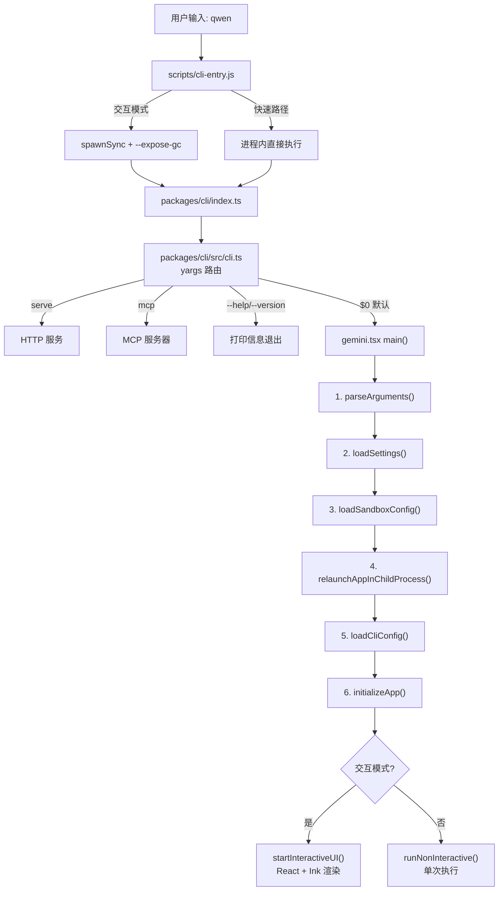

# Day 3: CLI 入口与启动流程

## 🎯 学习目标

- 掌握从 `qwen` 命令到 TUI 渲染的完整启动链路
- 理解 yargs 路由和子命令分发机制
- 理解 `main()` 函数的 7 步初始化流程
- 能够定位启动过程中的任意阶段代码

## 📖 核心概念

千问 Code 的启动分为 **4 层**，每层职责清晰：

| 层级        | 文件                          | 职责                                  |
| ----------- | ----------------------------- | ------------------------------------- |
| Bin Wrapper | `scripts/cli-entry.js`        | 进程管理：`--expose-gc`、快速路径判断 |
| 包入口      | `packages/cli/index.ts`       | 调用 `runCliEntryPoint`               |
| 路由层      | `packages/cli/src/cli.ts`     | yargs 子命令路由                      |
| 主逻辑      | `packages/cli/src/gemini.tsx` | 1330 行的 `main()` 函数               |

### 快速路径 vs 完整路径

`cli-entry.js` 对短命命令（`serve`、`mcp`、`--help`、`--version`）走进程内快速路径，避免 `spawnSync` 开销。只有交互模式才重新启动子进程并附加 `--expose-gc`。

### main() 的 7 步初始化

```
1. parseArguments()       — yargs 解析命令行参数
2. loadSettings()         — 加载 ~/.qwen/settings.json
3. loadSandboxConfig()    — 检测 docker/podman/seatbelt 沙箱
4. relaunchAppInChildProcess() — 子进程 + 内存配置
5. loadCliConfig()        — 构建 Config 对象
6. initializeApp()        — MCP/扩展/hooks 初始化
7. 分支：交互 → startInteractiveUI() | 非交互 → runNonInteractive()
```

## 🔍 源码导读

### 关键文件

| 文件                          | 行数  | 作用                          |
| ----------------------------- | ----- | ----------------------------- |
| `scripts/cli-entry.js`        | ~384  | bin wrapper，进程管理         |
| `packages/cli/index.ts`       | 短    | 包入口，调用 runCliEntryPoint |
| `packages/cli/src/cli.ts`     | 中    | yargs 路由定义                |
| `packages/cli/src/gemini.tsx` | ~1330 | 核心启动逻辑                  |

### cli-entry.js 的路由判断

```typescript
// scripts/cli-entry.js
function isInProcessFastPath() {
  const first = cliArgs[0];
  // serve 和 mcp 子命令直接进程内执行
  if (first === 'serve' || first === 'mcp') {
    return true;
  }
  // 无参数或只有 flag 时，检查是否是 help/version
  if (first === undefined || first.startsWith('-')) {
    return hasFlag('--help', '-h') || hasFlag('--version', '-v');
  }
  return false;
}
```

### cli.ts 的 yargs 路由

`packages/cli/src/cli.ts` 使用 yargs 定义子命令：

```typescript
// 简化的路由结构
yargs(hideBin(process.argv))
  .command('serve', '启动 HTTP 服务', serveHandler)
  .command('mcp', 'MCP 服务器模式', mcpHandler)
  .command('$0', '交互模式（默认）', defaultHandler)
  .help()
  .version()
  .parse();
```

默认命令（`$0`）最终调用 `gemini.tsx` 中的 `main()`。

### gemini.tsx 的 main() 骨架

```typescript
// packages/cli/src/gemini.tsx（简化骨架）
export async function main() {
  // Step 1: 解析参数
  const argv = await parseArguments();

  // Step 2: 加载用户设置
  const settings = await loadSettings();

  // Step 3: 沙箱配置
  const sandboxConfig = await loadSandboxConfig(settings);

  // Step 4: 子进程重启（内存限制）
  await relaunchAppInChildProcess(argv);

  // Step 5: 构建 Config
  const config = await loadCliConfig(argv, settings);

  // Step 6: 初始化应用（MCP、扩展、hooks）
  await initializeApp(config);

  // Step 7: 进入交互或非交互模式
  if (isInteractive) {
    await startInteractiveUI(config);
  } else {
    await runNonInteractive(config);
  }
}
```

### 交互模式的 UI 渲染

`startInteractiveUI()` 使用 React + Ink 7 渲染终端 UI：

```typescript
// 使用 Ink 的 render 函数将 React 组件树渲染到终端
import { render } from 'ink';

// 根组件包含：输入框、消息列表、状态栏、权限对话框等
render(<App config={config} />);
```

Ink 是 React 的终端渲染器，用 Flexbox 布局在终端中绘制 UI。

## 🏗️ 架构图



## 💻 动手练习

### 练习 1: 追踪启动日志

```bash
# 设置 DEBUG 环境变量，观察启动过程
DEBUG=1 npm run start -- --version
```

观察输出中打印了哪些初始化步骤。然后尝试：

```bash
DEBUG=1 npm run start
```

进入交互模式后，注意启动耗时。

### 练习 2: 阅读 cli-entry.js

打开 `scripts/cli-entry.js`，回答：

1. `QWEN_CODE_RELAUNCH_ARGS` 环境变量的作用是什么？
2. 快速路径和完整路径的区别在哪里？
3. `--expose-gc` 是在哪一行被添加到子进程参数的？

### 练习 3: 定位 main() 中的配置加载

打开 `packages/cli/src/gemini.tsx`，搜索 `loadSettings`：

1. 它从哪个路径读取配置文件？
2. 如果配置文件不存在，默认行为是什么？
3. `loadCliConfig` 接收哪些参数？

### 练习 4: 理解非交互模式

```bash
# 非交互模式：通过管道输入 prompt
echo "解释什么是闭包" | npm run start -- -p "用一句话回答"
```

在 `gemini.tsx` 中找到 `runNonInteractive` 的调用位置，理解它和交互模式的分支条件。

## ✅ 自检问题

1. 为什么 `qwen --version` 不需要 `--expose-gc`？

<details><summary>答案</summary>

`--version` 是短命命令，打印版本号后立即退出，不存在长时间运行的内存压力问题。`--expose-gc` 是为交互模式的长进程准备的，让内存压力监控器可以手动触发 GC。快速路径避免了 spawnSync 的进程创建开销。

</details>

2. `main()` 的 7 步中，哪一步失败会导致进程重启？

<details><summary>答案</summary>

Step 4 `relaunchAppInChildProcess()`。它检查当前进程是否已经带有正确的内存配置参数，如果没有，会用 spawnSync 重新启动自身并附加必要参数（如 `--max-old-space-size`），当前进程随即退出。

</details>

3. 交互模式和非交互模式的判断依据是什么？

<details><summary>答案</summary>

主要看是否有管道输入（stdin 是否是 TTY）以及是否通过 `-p` 参数直接传入了 prompt。如果 stdin 不是 TTY 或有 `-p` 参数，走非交互模式；否则进入交互模式的 React + Ink UI。

</details>

4. Ink 7 在项目中扮演什么角色？

<details><summary>答案</summary>

Ink 是 React 的终端渲染器。千问 Code 用 React 组件模型构建终端 UI：消息列表、输入框、权限确认对话框、状态栏等都是 React 组件，通过 Ink 渲染为终端 ANSI 输出。这让复杂的终端 UI 可以用声明式方式管理。

</details>

5. `initializeApp()` 初始化了哪些子系统？

<details><summary>答案</summary>

主要初始化三个子系统：

1. MCP（Model Context Protocol）服务器连接
2. 扩展（Extensions）加载
3. Hooks（生命周期钩子）注册

这些子系统必须在 UI 渲染或 prompt 执行前就绪。

</details>

## 📚 延伸阅读

- `packages/cli/src/gemini.tsx` — 完整启动逻辑（1330 行）
- `packages/cli/src/config/settings.ts` — settings 加载细节
- `packages/cli/src/interactive/` — 交互模式 UI 组件
- `packages/cli/src/non-interactive/` — 非交互模式实现
- Ink 官方文档：https://github.com/vadimdemedes/ink
