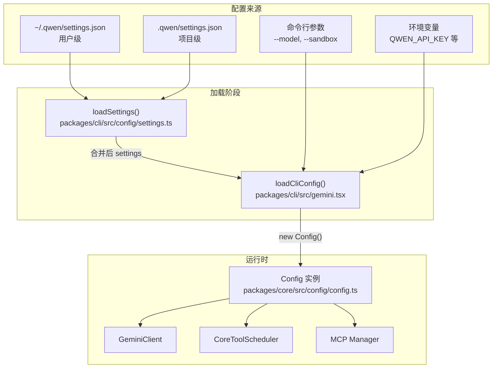

# Day 4: 配置系统

## 🎯 学习目标

- 理解 settings.json 的多层级加载机制
- 掌握 Config 类的核心职责和结构
- 了解环境变量对行为的影响
- 能够追踪一个配置项从文件到运行时的完整路径

## 📖 核心概念

### 配置层级

千问 Code 的配置来自多个层级，优先级从高到低：

```
命令行参数（--model, --sandbox 等）
  ↓ 覆盖
环境变量（QWEN_*, OPENAI_API_KEY 等）
  ↓ 覆盖
项目级 .qwen/settings.json（当前工作目录）
  ↓ 覆盖
用户级 ~/.qwen/settings.json（全局）
  ↓ 覆盖
系统默认值
```

### 两个核心配置模块

| 模块          | 文件                                  | 职责                                     |
| ------------- | ------------------------------------- | ---------------------------------------- |
| Settings 加载 | `packages/cli/src/config/settings.ts` | 读取、合并多层 settings.json             |
| Config 类     | `packages/core/src/config/config.ts`  | 运行时配置中心，所有子系统通过它获取配置 |

### Settings vs Config

- **Settings** 是静态的用户偏好（JSON 文件），在启动时加载
- **Config** 是运行时的配置对象，整合了 settings + 命令行参数 + 环境变量 + 动态状态

## 🔍 源码导读

### 关键文件

| 文件                                  | 作用                                         |
| ------------------------------------- | -------------------------------------------- |
| `packages/cli/src/config/settings.ts` | settings.json 的读取和合并                   |
| `packages/core/src/config/config.ts`  | Config 类定义（核心配置中心）                |
| `packages/cli/src/gemini.tsx`         | `loadSettings()` 和 `loadCliConfig()` 调用点 |

### settings.json 的典型结构

用户级配置位于 `~/.qwen/settings.json`：

```json
{
  "theme": "dark",
  "model": "qwen-max",
  "sandbox": false,
  "permissions": {
    "allow": ["read_file", "glob", "grep_search"],
    "deny": []
  },
  "mcpServers": {
    "my-server": {
      "command": "node",
      "args": ["./my-mcp-server.js"]
    }
  },
  "contextFiles": ["AGENTS.md", "CLAUDE.md"]
}
```

项目级配置位于项目根目录 `.qwen/settings.json`，结构相同但只影响该项目。

### settings.ts 的加载逻辑

```typescript
// packages/cli/src/config/settings.ts（简化）
export async function loadSettings(): Promise<Settings> {
  // 1. 读取用户级配置 ~/.qwen/settings.json
  const userSettings = await readJsonFile(getUserSettingsPath());

  // 2. 读取项目级配置 ./.qwen/settings.json
  const projectSettings = await readJsonFile(getProjectSettingsPath());

  // 3. 深度合并（项目级覆盖用户级）
  const merged = deepMerge(userSettings, projectSettings);

  // 4. 应用环境变量覆盖
  applyEnvOverrides(merged);

  return merged;
}
```

### Config 类的核心结构

```typescript
// packages/core/src/config/config.ts（简化）
export class Config {
  // LLM 相关
  readonly model: string;
  readonly apiKey: string;
  readonly maxTokens: number;

  // 沙箱
  readonly sandbox: SandboxConfig;

  // 工具权限
  readonly permissions: PermissionConfig;

  // MCP 服务器
  readonly mcpServers: McpServerConfig[];

  // 上下文
  readonly contextFiles: string[];
  readonly systemPrompt: string;

  // 运行时状态
  private _workingDirectory: string;
  private _debugMode: boolean;

  constructor(options: ConfigOptions) {
    // 从 options 初始化所有字段
  }

  // 供子系统查询的 getter 方法
  getModel(): string {
    return this.model;
  }
  getSandboxConfig(): SandboxConfig {
    return this.sandbox;
  }
  // ...
}
```

### loadCliConfig 的构建过程

在 `packages/cli/src/gemini.tsx` 中：

```typescript
// gemini.tsx 中的 loadCliConfig（简化）
async function loadCliConfig(
  argv: ParsedArgs,
  settings: Settings,
): Promise<Config> {
  return new Config({
    // 命令行参数优先
    model: argv.model ?? settings.model ?? DEFAULT_MODEL,
    sandbox: resolveSandbox(argv, settings),
    permissions: mergePermissions(settings.permissions),
    mcpServers: settings.mcpServers ?? {},
    workingDirectory: process.cwd(),
    debugMode: argv.debug ?? false,
    // ...更多字段
  });
}
```

### 环境变量

| 变量                      | 作用                            |
| ------------------------- | ------------------------------- |
| `QWEN_API_KEY`            | API 密钥（覆盖 settings）       |
| `OPENAI_API_KEY`          | OpenAI 兼容 API 密钥            |
| `ANTHROPIC_API_KEY`       | Anthropic API 密钥              |
| `QWEN_MODEL`              | 默认模型                        |
| `QWEN_SANDBOX`            | 沙箱模式（false/docker/podman） |
| `QWEN_CODE_RELAUNCH_ARGS` | 进程重启参数（内部使用）        |
| `DEBUG`                   | 调试模式开关                    |

## 🏗️ 架构图



## 💻 动手练习

### 练习 1: 查看当前生效配置

```bash
# 创建用户级配置（如果不存在）
mkdir -p ~/.qwen
echo '{"theme": "dark"}' > ~/.qwen/settings.json

# 启动并观察配置是否生效
npm run start
```

在交互界面中输入 `/config` 或 `/settings`（如果支持），查看当前配置。

### 练习 2: 追踪一个配置项

选择 `model` 这个配置项，追踪它的完整路径：

1. 打开 `packages/cli/src/config/settings.ts`，找到 settings 中 model 字段的读取
2. 打开 `packages/cli/src/gemini.tsx`，找到 `loadCliConfig` 中 model 的赋值
3. 打开 `packages/core/src/config/config.ts`，找到 Config 类中 model 的声明
4. 在 `packages/core/src/core/client.ts` 中搜索 `getModel` 或 `config.model`，看它如何被使用

### 练习 3: 环境变量覆盖实验

```bash
# 用环境变量指定模型
QWEN_MODEL=qwen-turbo npm run start -- --version

# 对比命令行参数覆盖
npm run start -- --model qwen-plus --version
```

### 练习 4: 项目级配置

```bash
# 在当前项目创建项目级配置
mkdir -p .qwen
echo '{"permissions": {"allow": ["read_file"]}}' > .qwen/settings.json
```

思考：如果用户级和项目级都定义了 `permissions.allow`，合并策略是覆盖还是追加？在 `settings.ts` 中找到答案。

## ✅ 自检问题

1. 如果用户级 settings 设置了 `"model": "qwen-max"`，项目级设置了 `"model": "qwen-turbo"`，命令行传了 `--model qwen-plus`，最终用哪个？

<details><summary>答案</summary>

`qwen-plus`。优先级：命令行参数 > 项目级 settings > 用户级 settings > 默认值。命令行参数具有最高优先级。

</details>

2. Config 类和 Settings 对象的本质区别是什么？

<details><summary>答案</summary>

Settings 是从 JSON 文件读取的静态用户偏好数据（纯数据对象）。Config 是运行时配置中心，它整合了 settings + 命令行参数 + 环境变量 + 运行时状态（如工作目录、调试模式），并提供 getter 方法供所有子系统查询。Config 是"最终生效的配置"。

</details>

3. 为什么 MCP 服务器配置放在 settings.json 而不是 Config 类的硬编码中？

<details><summary>答案</summary>

MCP 服务器是用户可扩展的——不同用户、不同项目需要连接不同的 MCP 服务器。放在 settings.json 中让用户可以灵活配置，支持用户级（全局可用）和项目级（仅当前项目）两种作用域。

</details>

4. `QWEN_CODE_RELAUNCH_ARGS` 环境变量的用途是什么？

<details><summary>答案</summary>

它是进程重启机制的内部通信通道。当 `relaunchAppInChildProcess()` 决定需要重启时，它将当前的命令行参数序列化到这个环境变量中，然后 spawnSync 新进程。新进程的 `cli-entry.js` 读取这个变量恢复原始参数，而不是使用可能被修改的 `process.argv`。

</details>

5. 如何在不修改源码的情况下临时切换 API 密钥？

<details><summary>答案</summary>

通过环境变量：`QWEN_API_KEY=sk-xxx npm run start`。环境变量在配置合并时覆盖 settings.json 中的值。也可以用 `OPENAI_API_KEY` 或 `ANTHROPIC_API_KEY` 对应不同的 LLM 提供商。

</details>

## 📚 延伸阅读

- `packages/cli/src/config/settings.ts` — settings 加载的完整实现
- `packages/core/src/config/config.ts` — Config 类完整定义
- `packages/cli/src/gemini.tsx` — `loadSettings()` 和 `loadCliConfig()` 的调用上下文
- `~/.qwen/settings.json` — 用户实际配置文件
- Day 3 文档中 `main()` 的 Step 2 和 Step 5
