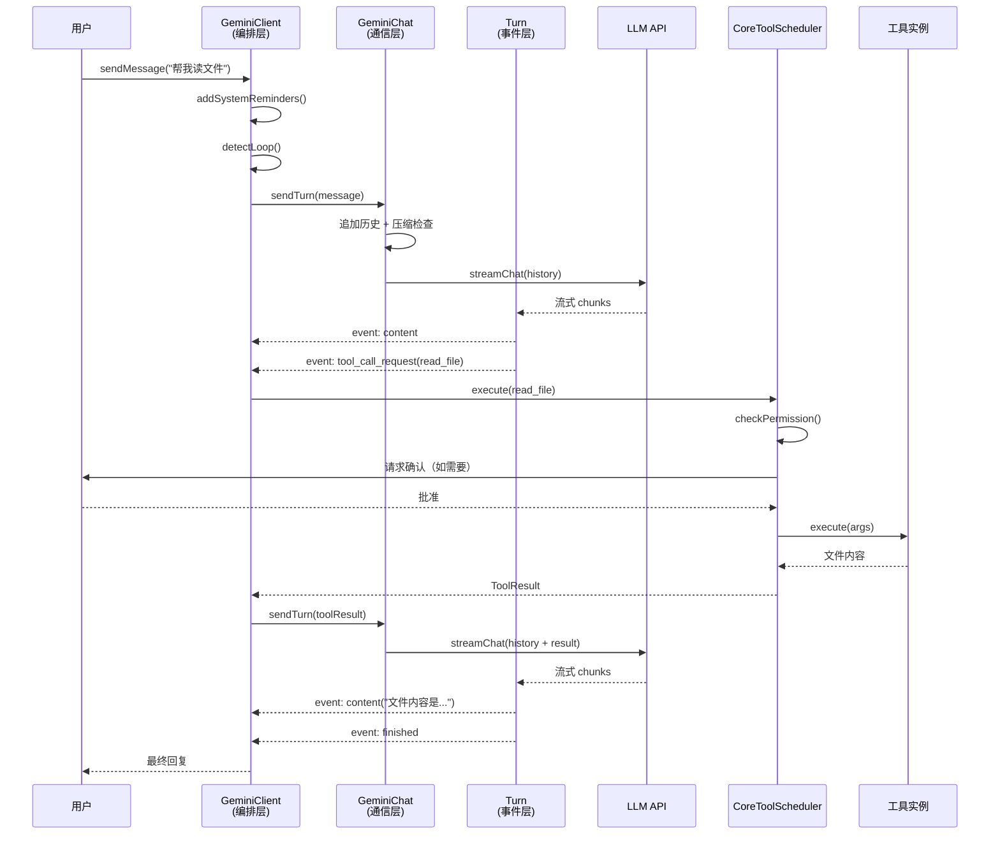

# Day 5: Agent 主循环

## 🎯 学习目标

- 理解 Agent 主循环的三层架构：GeminiClient → GeminiChat → Turn
- 掌握"turn"的概念及其在事件流中的角色
- 理解工具调用的调度流程
- 能够追踪一次完整的用户输入 → LLM 响应 → 工具执行 → 回复的链路

## 📖 核心概念

### 什么是 Agent 循环？

AI Agent 的核心是一个 **循环**：接收用户输入 → 调用 LLM → 如果 LLM 要求使用工具 → 执行工具 → 将结果反馈给 LLM → 重复直到 LLM 给出最终回复。千问 Code 将这个循环拆分为三层：

| 层级   | 文件                                   | 行数  | 职责                                                      |
| ------ | -------------------------------------- | ----- | --------------------------------------------------------- |
| 编排层 | `packages/core/src/core/client.ts`     | ~3385 | 高层编排：system reminders、循环检测、Stop hook、递归续写 |
| 通信层 | `packages/core/src/core/geminiChat.ts` | ~4421 | LLM 通信：历史管理、自动压缩、流式 API 调用、重试+退避    |
| 事件层 | `packages/core/src/core/turn.ts`       | ~672  | 单轮事件收集：Content/ToolCallRequest/Finished 等事件     |

### Turn（轮次）

一个 **Turn** 是一次 LLM 调用的完整生命周期：发送请求 → 接收流式响应 → 收集事件 → 返回结果。Turn 是 Agent 循环的最小执行单元。

### 事件类型

Turn 内部收集的事件包括：

```typescript
// 简化事件类型
type TurnEvent =
  | { type: 'content'; text: string } // LLM 文本输出
  | { type: 'tool_call_request'; tool: ToolCall } // LLM 请求调用工具
  | { type: 'finished'; reason: string } // 本轮结束
  | { type: 'error'; error: Error }; // 错误
```

## 🔍 源码导读

### 关键文件

| 文件                                          | 作用                    |
| --------------------------------------------- | ----------------------- |
| `packages/core/src/core/client.ts`            | GeminiClient — 顶层编排 |
| `packages/core/src/core/geminiChat.ts`        | GeminiChat — LLM 通信   |
| `packages/core/src/core/turn.ts`              | Turn — 单轮事件收集     |
| `packages/core/src/core/coreToolScheduler.ts` | 工具调度（~5396 行）    |
| `packages/core/src/core/permissionFlow.ts`    | 权限审批                |

### GeminiClient 的循环骨架

```typescript
// packages/core/src/core/client.ts（简化）
export class GeminiClient {
  private chat: GeminiChat;
  private toolScheduler: CoreToolScheduler;

  async *sendMessage(message: UserMessage): AsyncGenerator<AgentEvent> {
    // 1. 注入 system reminders
    const enrichedMessage = this.addSystemReminders(message);

    // 2. 循环检测（防止无限工具调用）
    if (this.detectLoop()) {
      yield { type: 'error', message: 'Loop detected' };
      return;
    }

    // 3. 调用 GeminiChat 获取 LLM 响应
    const turn = await this.chat.sendTurn(enrichedMessage);

    // 4. 处理 Turn 中的事件
    for await (const event of turn.events()) {
      if (event.type === 'tool_call_request') {
        // 5. 工具调度：权限检查 → 用户确认 → 执行
        const result = await this.toolScheduler.execute(event.tool);
        // 6. 将工具结果反馈，递归续写
        yield* this.sendMessage(result.asMessage());
      } else {
        yield event;
      }
    }

    // 7. Stop hook
    await this.runStopHook();
  }
}
```

### GeminiChat 的通信职责

```typescript
// packages/core/src/core/geminiChat.ts（简化）
export class GeminiChat {
  private history: Message[];

  async sendTurn(message: Message): Promise<Turn> {
    // 1. 追加到历史
    this.history.push(message);

    // 2. 自动压缩（历史过长时摘要）
    if (this.shouldCompress()) {
      await this.compressHistory();
    }

    // 3. 流式 API 调用（带重试 + 指数退避）
    const stream = await this.callLLMWithRetry(this.history);

    // 4. 创建 Turn 收集事件
    return new Turn(stream);
  }

  private async callLLMWithRetry(messages: Message[]): Promise<Stream> {
    let attempt = 0;
    while (true) {
      try {
        return await this.provider.streamChat(messages);
      } catch (err) {
        attempt++;
        if (attempt >= MAX_RETRIES) throw err;
        await sleep(backoff(attempt)); // 指数退避
      }
    }
  }
}
```

### Turn 的事件收集

```typescript
// packages/core/src/core/turn.ts（简化）
export class Turn {
  private stream: AsyncIterable<StreamChunk>;

  async *events(): AsyncGenerator<TurnEvent> {
    for await (const chunk of this.stream) {
      if (chunk.hasContent()) {
        yield { type: 'content', text: chunk.text };
      }
      if (chunk.hasToolCall()) {
        yield { type: 'tool_call_request', tool: chunk.toolCall };
      }
    }
    yield { type: 'finished', reason: 'stop' };
  }
}
```

### 工具调度流程

```typescript
// packages/core/src/core/coreToolScheduler.ts（简化）
export class CoreToolScheduler {
  async execute(toolCall: ToolCall): Promise<ToolResult> {
    // 1. 查找工具定义
    const tool = this.registry.get(toolCall.name);

    // 2. 权限检查
    const permission = await this.checkPermission(tool, toolCall.args);

    // 3. 如果需要用户确认
    if (permission === 'ask') {
      const approved = await this.requestUserApproval(tool, toolCall.args);
      if (!approved) return ToolResult.denied();
    }

    // 4. 执行工具
    const result = await tool.execute(toolCall.args);

    // 5. 结果处理
    return this.processResult(result);
  }
}
```

## 🏗️ 架构图



## 💻 动手练习

### 练习 1: 定位三层入口

打开以下三个文件，找到各自的类定义和核心方法：

1. `packages/core/src/core/client.ts` — 搜索 `class GeminiClient`
2. `packages/core/src/core/geminiChat.ts` — 搜索 `class GeminiChat`
3. `packages/core/src/core/turn.ts` — 搜索 `class Turn`

记录每个类的构造函数接收什么参数，核心公开方法是什么。

### 练习 2: 追踪一次工具调用

在 `packages/core/src/core/client.ts` 中搜索 `tool_call` 或 `toolCall`：

1. 找到 LLM 返回工具调用请求后的处理分支
2. 追踪它如何调用 `CoreToolScheduler`
3. 在 `coreToolScheduler.ts` 中找到权限检查的位置

### 练习 3: 理解循环检测

在 `client.ts` 中搜索 `loop` 相关代码：

1. 循环检测的触发条件是什么？（连续相同工具调用？最大轮次？）
2. 检测到循环后的行为是什么？（报错？强制停止？）

### 练习 4: 观察事件流

```bash
# 启动交互模式，执行一个需要工具调用的任务
npm run start
# 输入：读取 package.json 的前 5 行
```

观察终端输出中：

- LLM 的文本响应（content 事件）
- 工具调用提示（tool_call_request 事件）
- 权限确认对话框（permissionFlow）
- 最终回复（finished 事件）

## ✅ 自检问题

1. 为什么 Agent 循环需要"循环检测"？

<details><summary>答案</summary>

LLM 可能陷入无限循环：反复调用同一个工具但不改变参数，或者在两个工具之间来回切换而不产生进展。循环检测防止 token 无限消耗和用户体验卡死。检测到循环后，Agent 会中断并告知用户。

</details>

2. GeminiChat 的"自动压缩"解决什么问题？

<details><summary>答案</summary>

LLM 有上下文窗口限制（如 128K tokens）。长时间对话中，历史消息会不断增长。自动压缩在历史接近上限时，将早期对话摘要化（保留关键信息，丢弃细节），确保不会超出上下文窗口。

</details>

3. Turn 和"一次 LLM API 调用"是什么关系？

<details><summary>答案</summary>

一个 Turn 对应一次 LLM API 调用的完整生命周期。它封装了从发送请求到接收完所有流式 chunks 的过程，并将 chunks 转化为结构化事件（content、tool_call_request、finished）。一个 Agent 循环可能包含多个 Turn（每次工具调用后反馈给 LLM 就是新 Turn）。

</details>

4. CoreToolScheduler 在执行工具前为什么要做权限检查？

<details><summary>答案</summary>

安全考虑。LLM 可能请求执行危险操作（如删除文件、执行任意命令）。权限系统分三级：自动允许（只读操作）、需要用户确认（写操作）、禁止（危险操作）。这确保用户对 Agent 的行为有最终控制权。

</details>

5. 如果 LLM 在一次响应中请求调用 3 个工具，执行顺序是怎样的？

<details><summary>答案</summary>

取决于 CoreToolScheduler 的调度策略。通常支持并行执行无依赖的工具调用（提高速度），但每个工具仍需独立通过权限检查。如果某个工具被用户拒绝，其余工具的执行不受影响，被拒绝的结果会作为"denied"反馈给 LLM。

</details>

## 📚 延伸阅读

- `packages/core/src/core/client.ts` — GeminiClient 完整实现（3385 行）
- `packages/core/src/core/geminiChat.ts` — GeminiChat 完整实现（4421 行）
- `packages/core/src/core/turn.ts` — Turn 事件收集（672 行）
- `packages/core/src/core/coreToolScheduler.ts` — 工具调度（5396 行）
- `packages/core/src/core/permissionFlow.ts` — 权限审批逻辑
- Day 6 将深入 LLM 提供商适配和流式响应细节
