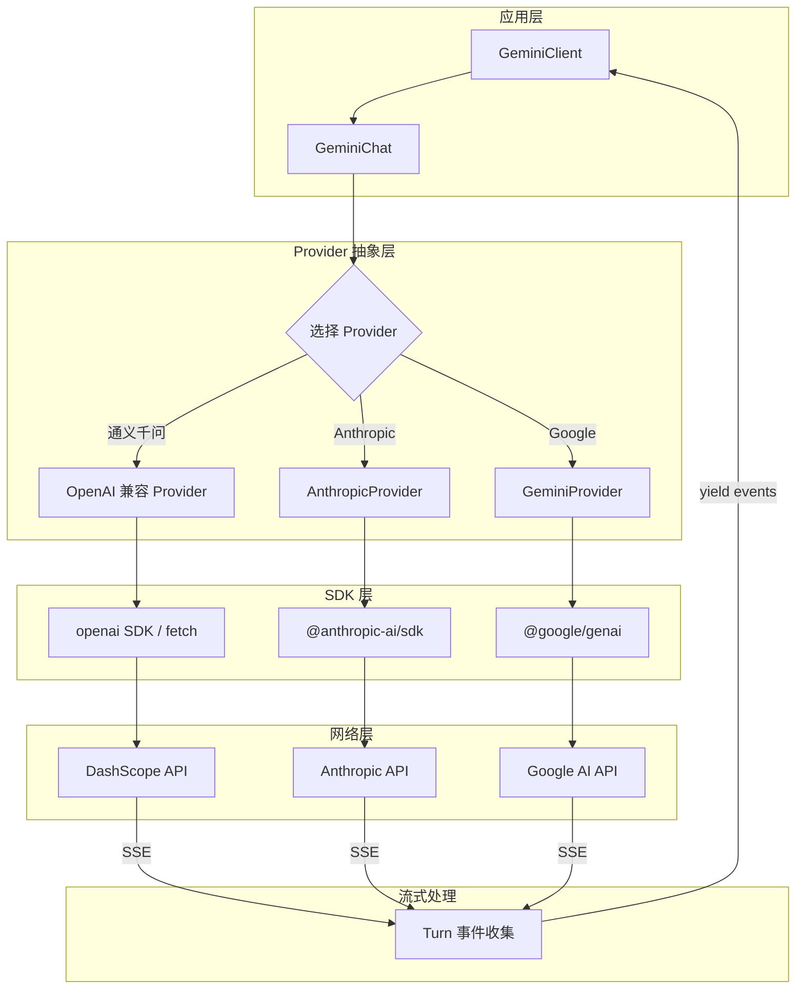
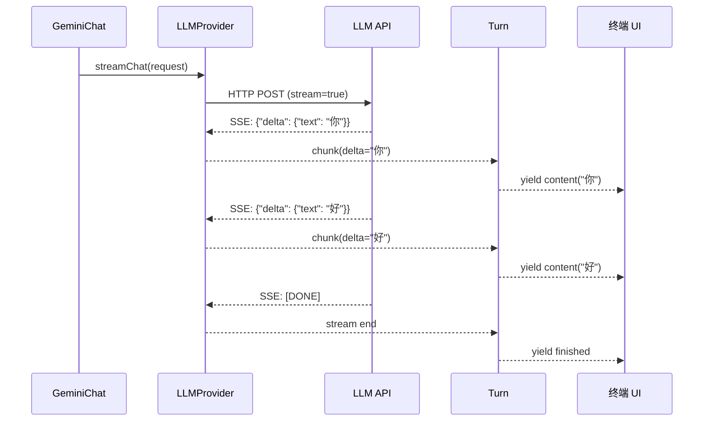

# Day 6: LLM 提供商适配与流式响应

## 🎯 学习目标

- 理解千问 Code 如何适配多个 LLM 提供商（OpenAI/Anthropic/Gemini）
- 掌握流式响应（SSE）的处理机制
- 理解重试与指数退避策略
- 了解 Token 计数和上下文窗口管理

## 📖 核心概念

### 多提供商架构

千问 Code 支持多个 LLM 后端，通过统一的抽象层屏蔽差异：

| 提供商                | SDK 依赖            | 典型模型                        |
| --------------------- | ------------------- | ------------------------------- |
| 通义千问（DashScope） | OpenAI 兼容 API     | qwen-max, qwen-plus, qwen-turbo |
| OpenAI                | `openai`            | gpt-4o, o3                      |
| Anthropic             | `@anthropic-ai/sdk` | claude-sonnet-4-20250514        |
| Google                | `@google/genai`     | gemini-2.5-pro                  |

核心设计：**上层代码（GeminiClient/GeminiChat）不直接调用任何 SDK**，而是通过 Provider 抽象接口通信。

### 流式响应

LLM 的响应是流式的（Server-Sent Events），token 逐个到达。千问 Code 的处理链路：

```
LLM API (SSE stream)
  → Provider 适配层（统一 chunk 格式）
    → Turn（收集事件）
      → GeminiClient（yield 给 UI）
        → Ink 组件（逐字渲染到终端）
```

### 重试与退避

网络抖动、速率限制（429）、服务暂时不可用（503）都需要重试。策略：

- 最大重试次数（通常 3-5 次）
- 指数退避：1s → 2s → 4s → 8s
- 对 429 响应，尊重 `Retry-After` 头
- 对流式中途断开，尝试从断点续传（如果 API 支持）

## 🔍 源码导读

### 关键文件

| 文件                                   | 作用                                              |
| -------------------------------------- | ------------------------------------------------- |
| `packages/core/src/core/geminiChat.ts` | LLM 通信层，调用 Provider                         |
| `packages/core/src/core/turn.ts`       | 流式事件收集                                      |
| `packages/core/package.json`           | 查看 SDK 依赖（@anthropic-ai/sdk, @google/genai） |
| `packages/core/src/config/config.ts`   | 提供商配置（API key, base URL）                   |

### Provider 抽象

```typescript
// 简化的 Provider 接口（概念性）
interface LLMProvider {
  // 流式聊天补全
  streamChat(request: ChatRequest): AsyncIterable<StreamChunk>;

  // 模型信息
  getModelInfo(): ModelInfo;

  // Token 计数
  countTokens(messages: Message[]): Promise<number>;
}

// 各提供商实现
class OpenAIProvider implements LLMProvider { ... }
class AnthropicProvider implements LLMProvider { ... }
class GeminiProvider implements LLMProvider { ... }
```

### GeminiChat 中的流式处理

```typescript
// packages/core/src/core/geminiChat.ts（简化）
export class GeminiChat {
  private provider: LLMProvider;

  async sendTurn(message: Message): Promise<Turn> {
    this.history.push(message);

    // 构建请求
    const request: ChatRequest = {
      model: this.config.getModel(),
      messages: this.history,
      tools: this.toolDefinitions,
      stream: true, // 始终使用流式
    };

    // 带重试的流式调用
    const stream = await this.callWithRetry(() =>
      this.provider.streamChat(request),
    );

    return new Turn(stream);
  }

  private async callWithRetry<T>(fn: () => Promise<T>): Promise<T> {
    let lastError: Error;
    for (let attempt = 0; attempt < MAX_RETRIES; attempt++) {
      try {
        return await fn();
      } catch (err) {
        lastError = err;
        if (!isRetryable(err)) throw err;

        const delay = this.getBackoffDelay(attempt, err);
        await sleep(delay);
      }
    }
    throw lastError!;
  }

  private getBackoffDelay(attempt: number, err: Error): number {
    // 尊重 Retry-After 头
    if (err instanceof RateLimitError && err.retryAfter) {
      return err.retryAfter * 1000;
    }
    // 指数退避 + 随机抖动
    const base = Math.min(1000 * 2 ** attempt, 30000);
    return base + Math.random() * 1000;
  }
}
```

### Turn 的流式事件解析

```typescript
// packages/core/src/core/turn.ts（简化）
export class Turn {
  constructor(private stream: AsyncIterable<StreamChunk>) {}

  async *events(): AsyncGenerator<TurnEvent> {
    let accumulatedText = '';

    for await (const chunk of this.stream) {
      // 文本 delta
      if (chunk.delta?.text) {
        accumulatedText += chunk.delta.text;
        yield { type: 'content', text: chunk.delta.text };
      }

      // 工具调用 delta（可能分多个 chunk 到达）
      if (chunk.delta?.toolCall) {
        yield { type: 'tool_call_request', tool: chunk.delta.toolCall };
      }

      // 使用量统计
      if (chunk.usage) {
        yield { type: 'usage', tokens: chunk.usage };
      }
    }

    yield { type: 'finished', reason: 'stop' };
  }
}
```

### 提供商 SDK 依赖

从 `packages/core/package.json` 可以看到：

```json
{
  "dependencies": {
    "@anthropic-ai/sdk": "^0.36.1",
    "@google/genai": "2.6.0",
    "@modelcontextprotocol/sdk": "^1.25.2"
  }
}
```

OpenAI 兼容 API（包括通义千问 DashScope）通常使用 `openai` SDK 或原生 fetch。

### 上下文窗口管理

```typescript
// geminiChat.ts 中的压缩逻辑（概念性）
private shouldCompress(): boolean {
  const totalTokens = this.estimateTokens(this.history);
  const maxContext = this.provider.getModelInfo().contextWindow;
  // 当历史占用超过 80% 上下文窗口时触发压缩
  return totalTokens > maxContext * 0.8;
}

private async compressHistory(): Promise<void> {
  // 保留最近 N 条消息不动
  // 将早期消息发送给 LLM 生成摘要
  // 用摘要替换原始消息
  const earlyMessages = this.history.slice(0, -KEEP_RECENT);
  const summary = await this.summarize(earlyMessages);
  this.history = [summaryMessage(summary), ...this.history.slice(-KEEP_RECENT)];
}
```

## 🏗️ 架构图



### 流式响应时序



## 💻 动手练习

### 练习 1: 确认 SDK 依赖

打开 `packages/core/package.json`，在 `dependencies` 中找到：

1. Anthropic SDK 的版本号
2. Google GenAI SDK 的版本号
3. 是否有 `openai` 包？如果没有，OpenAI 兼容 API 是如何调用的？

### 练习 2: 追踪流式处理

在 `packages/core/src/core/turn.ts` 中：

1. 找到 `for await` 循环，理解它如何消费流式 chunks
2. 找到工具调用事件的分发逻辑
3. 思考：如果一个工具调用的 JSON 被分成多个 chunk 发送，Turn 如何处理？

### 练习 3: 理解重试逻辑

在 `packages/core/src/core/geminiChat.ts` 中搜索 `retry` 或 `backoff`：

1. 最大重试次数是多少？
2. 哪些错误是可重试的（retryable）？
3. 退避延迟的计算公式是什么？

### 练习 4: 切换提供商实验

```bash
# 使用不同模型启动（需要对应 API key）
npm run start -- --model qwen-turbo
# 或
ANTHROPIC_API_KEY=sk-xxx npm run start -- --model claude-sonnet-4-20250514
```

观察启动日志中是否有 Provider 初始化的信息。

## ✅ 自检问题

1. 为什么千问 Code 始终使用流式（stream=true）而非等待完整响应？

<details><summary>答案</summary>

用户体验。LLM 生成一个完整回复可能需要 10-60 秒。流式响应让用户在第一个 token 到达时（通常 < 1 秒）就开始看到输出，大幅降低感知延迟。同时，流式处理允许在生成过程中提前检测工具调用请求。

</details>

2. 指数退避中为什么要加随机抖动（jitter）？

<details><summary>答案</summary>

防止"惊群效应"。如果多个客户端同时遇到 429 错误，纯指数退避会让它们在同一时刻重试，再次触发限流。随机抖动将重试时间分散，降低再次冲突的概率。

</details>

3. 上下文窗口压缩的触发时机和策略是什么？

<details><summary>答案</summary>

触发时机：当历史消息的估算 token 数超过上下文窗口的 80% 时。策略：保留最近 N 条消息不动（保证当前任务上下文完整），将早期消息发送给 LLM 生成摘要，用摘要替换原始消息。这是有损压缩，但保证了对话可以无限延续。

</details>

4. Provider 抽象层解决了什么问题？

<details><summary>答案</summary>

屏蔽不同 LLM API 的差异。各提供商的请求格式、认证方式、流式协议、错误码都不同。Provider 层将这些差异封装在各自的实现中，对上层（GeminiChat）暴露统一的 `streamChat()` 接口。这让切换模型只需改配置，不需改业务代码。

</details>

5. 如果流式传输中途网络断开，系统如何处理？

<details><summary>答案</summary>

Turn 的 `for await` 循环会抛出网络错误。GeminiChat 的重试逻辑捕获该错误，判断是否可重试。如果是临时网络问题，会等待退避延迟后重新发起完整请求（不是从断点续传，因为大多数 LLM API 不支持）。已接收的部分内容会被丢弃，重新开始。

</details>

## 📚 延伸阅读

- `packages/core/src/core/geminiChat.ts` — 完整的 LLM 通信实现（4421 行）
- `packages/core/src/core/turn.ts` — 流式事件收集（672 行）
- `packages/core/package.json` — SDK 依赖列表
- OpenAI SSE 协议：https://platform.openai.com/docs/api-reference/streaming
- Anthropic 流式文档：https://docs.anthropic.com/en/api/streaming
- Day 5 文档中 GeminiChat 的调用上下文
