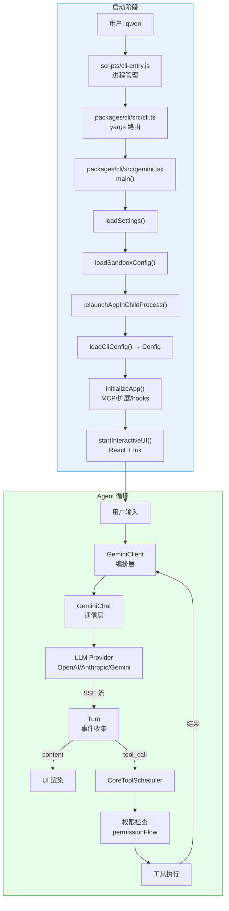
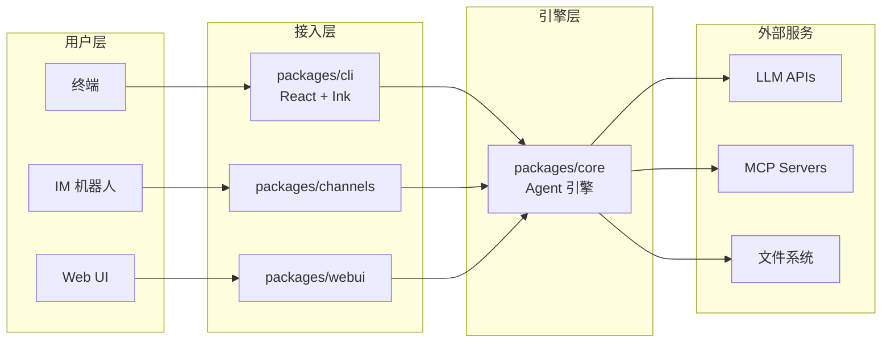

# Day 7: 第一周总结与综合演练

## 🎯 学习目标

- 绘制完整的启动流程 + Agent 循环全景图
- 通过综合练习串联 6 天所学知识
- 建立对代码库的整体心智模型
- 预习第二周（子系统深入）的主题

## 📖 核心概念

### 一周知识回顾

| 天数  | 主题            | 核心收获                                      |
| ----- | --------------- | --------------------------------------------- |
| Day 1 | 环境搭建        | Node >= 22, npm workspaces, esbuild, Vitest   |
| Day 2 | Monorepo 与构建 | 包职责划分, 依赖方向, bundle 流程             |
| Day 3 | CLI 入口与启动  | cli-entry.js → cli.ts → gemini.tsx main() 7步 |
| Day 4 | 配置系统        | settings.json 层级, Config 类, 环境变量       |
| Day 5 | Agent 主循环    | 三层架构: Client → Chat → Turn, 工具调度      |
| Day 6 | LLM 适配与流式  | Provider 抽象, SSE 流式, 重试退避, 上下文压缩 |

### 全景心智模型

千问 Code 的运行可以概括为两个阶段：

**阶段一：启动（一次性）**

```
qwen 命令 → 进程管理 → 路由 → 配置加载 → 子系统初始化 → UI 渲染
```

**阶段二：Agent 循环（持续）**

```
用户输入 → LLM 调用 → [工具执行 → 反馈]* → 最终回复
```

## 🔍 源码导读

### 完整文件地图

```
qwen-code/
├── scripts/
│   ├── cli-entry.js          ← [Day 3] bin wrapper
│   ├── start.js              ← [Day 1] 开发启动
│   └── build.js              ← [Day 2] 构建编排
├── esbuild.config.js         ← [Day 2] 打包配置
├── package.json              ← [Day 2] workspaces 根配置
├── .nvmrc                    ← [Day 1] Node 版本锁定
│
├── packages/cli/
│   ├── index.ts              ← [Day 3] 包入口
│   ├── src/
│   │   ├── cli.ts            ← [Day 3] yargs 路由
│   │   ├── gemini.tsx        ← [Day 3] main() 启动逻辑
│   │   └── config/
│   │       └── settings.ts   ← [Day 4] settings 加载
│   └── package.json          ← [Day 2] bin: qwen
│
├── packages/core/
│   ├── src/
│   │   ├── core/
│   │   │   ├── client.ts     ← [Day 5] GeminiClient 编排层
│   │   │   ├── geminiChat.ts ← [Day 5/6] 通信层 + 流式
│   │   │   ├── turn.ts       ← [Day 5/6] 事件收集
│   │   │   ├── coreToolScheduler.ts ← [Day 5] 工具调度
│   │   │   └── permissionFlow.ts    ← [Day 5] 权限审批
│   │   └── config/
│   │       └── config.ts     ← [Day 4] Config 类
│   └── package.json          ← [Day 6] SDK 依赖
│
└── packages/
    ├── sdk-typescript/       ← TS SDK
    ├── sdk-python/           ← Python SDK
    ├── channels/             ← IM 机器人
    ├── desktop/              ← 桌面应用
    ├── webui/                ← Web UI
    └── cua-driver/           ← Computer Use
```

### 关键数据流

```typescript
// 一次完整交互的数据流（伪代码）

// === 启动阶段 ===
// cli-entry.js: 判断快速路径 or 重启
// cli.ts: yargs 路由到默认命令
// gemini.tsx main():
const settings = await loadSettings();        // ~/.qwen/settings.json
const config = new Config({ settings, argv }); // 合并配置
await initializeApp(config);                   // MCP + 扩展 + hooks
render(<App config={config} />);               // Ink 渲染

// === Agent 循环 ===
// 用户输入 "帮我读取 package.json"
const client = new GeminiClient(config);
for await (const event of client.sendMessage(userMsg)) {
  switch (event.type) {
    case 'content':
      // 渲染 LLM 文本到终端
      break;
    case 'tool_call_request':
      // CoreToolScheduler: 权限 → 确认 → 执行
      // 结果反馈给 client，触发下一轮
      break;
    case 'finished':
      // 本轮结束
      break;
  }
}
```

## 🏗️ 架构图

### 完整启动 + 循环全景图



### 包依赖与数据流



## 💻 动手练习

### 练习 1: 绘制你自己的架构图

不看本文档，凭记忆在纸上或白板中画出：

1. 从 `qwen` 命令到 UI 渲染的启动链路（标注文件名）
2. Agent 循环的三层结构（标注数据流方向）
3. 配置系统的层级（标注优先级）

画完后对照本文档的 Mermaid 图检查遗漏。

### 练习 2: 端到端代码追踪

选择一个简单任务："用户输入 `qwen --model qwen-turbo`，然后问'什么是闭包'"。追踪完整路径：

1. `scripts/cli-entry.js` — 走哪条路径？（快速路径 or 重启？）
2. `packages/cli/src/cli.ts` — 匹配哪个命令？
3. `packages/cli/src/gemini.tsx` — `--model` 参数在哪一步被消费？
4. `packages/core/src/config/config.ts` — model 值存在 Config 的哪个字段？
5. `packages/core/src/core/geminiChat.ts` — 构建请求时如何读取 model？
6. `packages/core/src/core/turn.ts` — 流式响应如何变成终端输出？

在每一步写下对应的函数名和大致行号。

### 练习 3: 回答设计问题

思考并写下你的答案（没有标准答案，但要有代码依据）：

1. **为什么 GeminiClient 和 GeminiChat 要分成两个类？** 如果合并成一个 4000+ 行的类会怎样？
2. **为什么工具调度（CoreToolScheduler）有 5000+ 行？** 它处理了哪些复杂性？（提示：权限、并行、错误恢复、结果格式化）
3. **为什么配置要分 settings.json 和 Config 两层？** 直接用 Config 读文件不行吗？

### 练习 4: 运行并观察

```bash
# 1. 构建
npm run build

# 2. 带调试信息启动
DEBUG=1 npm run start

# 3. 在交互界面执行：
#    > 读取当前目录的 package.json，告诉我项目名称和版本号

# 观察：
# - 启动时打印了哪些初始化信息？
# - LLM 响应是逐字出现还是整块出现？（流式验证）
# - 工具调用时是否弹出权限确认？
# - 最终回复包含了什么内容？
```

### 练习 5: 修改实验（可选）

在 `packages/core/src/core/turn.ts` 的事件循环中，临时添加一行 `console.error` 打印每个事件的 type：

```typescript
for await (const chunk of this.stream) {
  console.error('[DEBUG Turn]', chunk.type); // 临时调试
  // ...原有逻辑
}
```

重新构建并运行，观察一次工具调用产生了多少个事件。完成后记得删除调试代码。

## ✅ 自检问题

1. 从用户输入 `qwen` 到看到交互界面，经历了哪些进程/阶段？

<details><summary>答案</summary>

1. `scripts/cli-entry.js`：判断非快速路径，spawnSync 新进程（附加 --expose-gc）
2. `packages/cli/index.ts`：包入口，调用 runCliEntryPoint
3. `packages/cli/src/cli.ts`：yargs 匹配默认命令
4. `packages/cli/src/gemini.tsx main()`：7 步初始化（参数解析 → settings → 沙箱 → 子进程 → Config → 子系统 → UI）
5. React + Ink 渲染终端 UI

共涉及至少 2 个进程（原始 + 重启的子进程）。

</details>

2. Agent 循环中，一个"turn"何时开始、何时结束？

<details><summary>答案</summary>

开始：GeminiChat 向 LLM 发起一次 streamChat 请求。结束：流式响应全部接收完毕（收到 [DONE] 或流关闭），Turn yield 出 `finished` 事件。如果 LLM 响应中包含工具调用，工具执行后的反馈会触发新的 turn。

</details>

3. 如果 LLM 连续 10 次请求调用同一个工具（相同参数），系统会怎样？

<details><summary>答案</summary>

GeminiClient 的循环检测机制会介入。它检测到重复的工具调用模式（相同工具 + 相同参数连续出现），判定为无限循环，中断执行并向用户报告错误。这防止了 token 的无限消耗。

</details>

4. 配置优先级：命令行 `--model X` vs 环境变量 `QWEN_MODEL=Y` vs settings.json `"model": "Z"`，最终用哪个？

<details><summary>答案</summary>

命令行参数 `X`。优先级从高到低：命令行参数 > 环境变量 > 项目级 settings > 用户级 settings > 默认值。

</details>

5. 为什么 core 包不直接依赖 React/Ink，而是由 cli 包依赖？

<details><summary>答案</summary>

关注点分离。core 是纯逻辑的 Agent 引擎，不关心 UI 呈现方式。cli 用 React+Ink 渲染终端，webui 用浏览器渲染，channels 用 IM 消息渲染——它们都依赖 core 但各有不同的 UI 层。如果 core 依赖了 Ink，就无法被非终端场景复用。

</details>

6. 第二周将深入哪些子系统？

<details><summary>答案</summary>

第二周（week2-subsystems）预计涵盖：

- 工具系统深入（工具注册、定义、执行沙箱）
- 权限系统（三级权限、规则匹配）
- MCP 协议（服务器连接、工具发现）
- Memory 系统（上下文管理、持久化）
- 沙箱执行（docker/podman/seatbelt）

</details>

## 📚 延伸阅读

### 本周涉及的核心文件（按重要性排序）

1. `packages/cli/src/gemini.tsx` — 启动全流程（1330 行）
2. `packages/core/src/core/client.ts` — Agent 编排（3385 行）
3. `packages/core/src/core/geminiChat.ts` — LLM 通信（4421 行）
4. `packages/core/src/core/coreToolScheduler.ts` — 工具调度（5396 行）
5. `packages/core/src/core/turn.ts` — 事件收集（672 行）
6. `packages/core/src/config/config.ts` — 配置中心
7. `packages/cli/src/config/settings.ts` — 设置加载
8. `scripts/cli-entry.js` — 进程入口（384 行）

### 预习第二周

- `docs/learning/week2-subsystems/` — 第二周学习文档
- `packages/core/src/core/permissionFlow.ts` — 权限系统
- `packages/core/src/tools/` — 工具定义目录
- `packages/core/src/mcp/` — MCP 实现

### 外部资源

- Ink 文档：https://github.com/vadimdemedes/ink
- yargs 文档：https://yargs.js.org/
- esbuild 文档：https://esbuild.github.io/
- MCP 规范：https://modelcontextprotocol.io/
