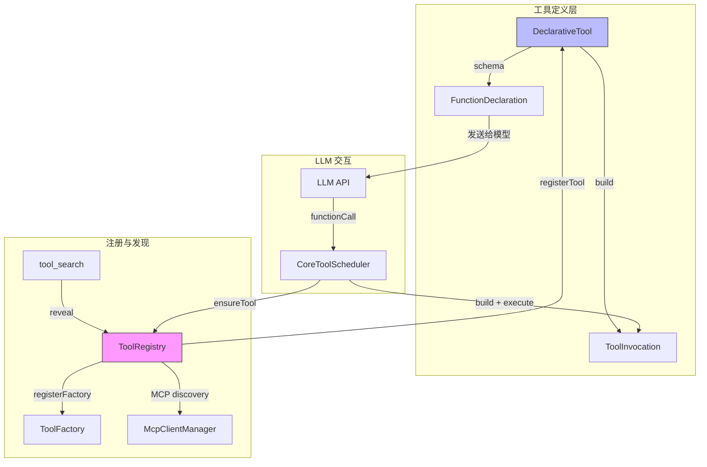

# Day 8: 工具注册与 Schema

## 🎯 学习目标

- 理解工具系统的核心抽象：`DeclarativeTool`、`ToolBuilder`、`ToolInvocation`
- 掌握 `ToolRegistry` 的注册、查找和延迟加载机制
- 了解 `tool-names.ts` 中的工具名称常量体系
- 能列举内置工具并理解其分类（Kind）

## 📖 核心概念

### 三层抽象

千问 Code 的工具系统采用 **定义 → 构建 → 调用** 三层分离设计：

| 层次   | 类型                  | 职责                                 |
| ------ | --------------------- | ------------------------------------ |
| 定义层 | `DeclarativeTool`     | 描述工具元数据（name、schema、kind） |
| 构建层 | `ToolBuilder.build()` | 验证参数，生成可执行调用             |
| 调用层 | `ToolInvocation`      | 封装单次执行的权限、确认、执行逻辑   |

### FunctionDeclaration

每个工具通过 `@google/genai` 的 `FunctionDeclaration` 向 LLM 暴露接口：

```typescript
get schema(): FunctionDeclaration {
  return {
    name: this.name,
    description: this.description,
    parametersJsonSchema: this.parameterSchema,
  };
}
```

LLM 只看到 `name + description + parametersJsonSchema`，据此决定是否调用及如何填参。

### 延迟加载（Deferred Tools）

为节省 token，部分工具标记 `shouldDefer: true`，初始不发送给 LLM。模型通过 `tool_search` 工具按需发现并注入后续请求。

## 🔍 源码导读

### 1. 工具名称常量 — `packages/core/src/tools/tool-names.ts`

```typescript
export const ToolNames = {
  EDIT: 'edit',
  WRITE_FILE: 'write_file',
  READ_FILE: 'read_file',
  GREP: 'grep_search',
  GLOB: 'glob',
  SHELL: 'run_shell_command',
  TODO_WRITE: 'todo_write',
  AGENT: 'agent',
  SKILL: 'skill',
  WEB_FETCH: 'web_fetch',
  ASK_USER_QUESTION: 'ask_user_question',
  MONITOR: 'monitor',
  TOOL_SEARCH: 'tool_search',
  // ... 共 40+ 个工具
} as const;
```

还包含：

- `ToolDisplayNames` — UI 展示名
- `ToolNamesMigration` — 旧名称兼容映射（如 `search_file_content → grep_search`）

### 2. 工具基类 — `packages/core/src/tools/tools.ts`

**`DeclarativeTool`** 是所有内置工具的基类：

```typescript
export abstract class DeclarativeTool<TParams, TResult>
  implements ToolBuilder<TParams, TResult>
{
  constructor(
    readonly name: string,
    readonly displayName: string,
    readonly description: string,
    readonly kind: Kind,
    readonly parameterSchema: unknown,
    readonly isOutputMarkdown: boolean = true,
    readonly canUpdateOutput: boolean = false,
    readonly shouldDefer: boolean = false,
    readonly alwaysLoad: boolean = false,
    readonly searchHint?: string,
  ) {}

  abstract build(params: TParams): ToolInvocation<TParams, TResult>;
}
```

**`ToolInvocation`** 接口定义了单次调用的完整生命周期：

```typescript
export interface ToolInvocation<TParams, TResult> {
  params: TParams;
  getDescription(): string;
  toolLocations(): ToolLocation[];
  getDefaultPermission(): Promise<PermissionDecision>; // 'allow' | 'ask' | 'deny'
  getConfirmationDetails(
    signal: AbortSignal,
  ): Promise<ToolCallConfirmationDetails>;
  execute(
    signal: AbortSignal,
    updateOutput?: (o: ToolResultDisplay) => void,
  ): Promise<TResult>;
}
```

### 3. 工具注册表 — `packages/core/src/tools/tool-registry.ts`

```typescript
export class ToolRegistry {
  private tools: Map<string, AnyDeclarativeTool> = new Map();
  private factories: Map<string, ToolFactory> = new Map();
  private inflight: Map<string, Promise<AnyDeclarativeTool>> = new Map();
  private revealedDeferred: Set<string> = new Set();

  registerTool(tool: AnyDeclarativeTool): void {
    /* ... */
  }
  registerFactory(name: string, factory: ToolFactory): void {
    /* ... */
  }
  getTool(name: string): AnyDeclarativeTool | undefined {
    /* ... */
  }
  async ensureTool(name: string): Promise<AnyDeclarativeTool | undefined> {
    /* ... */
  }
}
```

关键设计：

- **工厂模式**：`registerFactory` 支持惰性实例化，首次调用时才创建工具
- **去重**：`inflight` Map 确保并发 `ensureTool` 共享同一 Promise
- **禁用检查**：`isToolDisabled()` 在注册时拦截被用户禁用的工具
- **MCP 集成**：构造时创建 `McpClientManager`，MCP 发现的工具也通过 `registerTool` 注册

### 4. 内置工具分类（Kind）

工具通过 `kind` 字段分类，影响权限和并发策略：

| Kind    | 示例                      | 特点               |
| ------- | ------------------------- | ------------------ |
| `read`  | read_file, glob, grep     | 只读，默认 allow   |
| `edit`  | edit, write_file          | 修改文件，需确认   |
| `shell` | run_shell_command         | 最高风险，严格权限 |
| `mcp`   | mcp\_\_\*                 | 外部服务，默认 ask |
| `agent` | agent, create_sub_session | 子任务调度         |

## 🏗️ 架构图（Mermaid）



## 💻 动手练习

### 练习 1：追踪一个工具的完整定义

打开 `packages/core/src/tools/` 目录，选择 `read-file.ts`（或类似文件），回答：

1. 它继承自哪个基类？
2. `parameterSchema` 定义了哪些字段？
3. `getDefaultPermission()` 返回什么？
4. `kind` 是什么？

### 练习 2：统计工具数量

```bash
# 在 tool-names.ts 中统计 ToolNames 的条目数
grep -c ":" packages/core/src/tools/tool-names.ts
```

然后在 `packages/core/src/tools/` 目录下查看有多少工具实现文件。

### 练习 3：理解延迟加载

在源码中搜索 `shouldDefer: true` 或 `shouldDefer = true`，找出哪些工具被标记为延迟加载。思考：为什么这些工具适合延迟？

## ✅ 自检问题（答案折叠）

<details>
<summary>1. ToolInvocation 的 getDefaultPermission() 有哪三种返回值？</summary>

- `'allow'` — 内在安全（只读操作）
- `'ask'` — 有副作用，需用户确认
- `'deny'` — 安全违规（如 shell 命令替换）

</details>

<details>
<summary>2. ToolRegistry 如何防止并发重复创建工具？</summary>

使用 `inflight: Map<string, Promise<AnyDeclarativeTool>>` 存储进行中的工厂 Promise。多个并发 `ensureTool()` 调用同一工具名时共享同一个 Promise，避免重复实例化。

</details>

<details>
<summary>3. shouldDefer 和 alwaysLoad 分别控制什么？</summary>

- `shouldDefer: true`：工具初始不包含在发送给 LLM 的 function-declaration 列表中，需通过 `tool_search` 按需发现
- `alwaysLoad: true`：即使其他工具默认延迟，此工具也始终包含（如 `tool_search` 本身）

</details>

<details>
<summary>4. ToolNamesMigration 的作用是什么？</summary>

向后兼容旧版本配置。例如用户 settings 中可能仍引用 `search_file_content`（旧 grep 名）或 `replace`（旧 edit 名），迁移映射将其自动转换为新名称。

</details>

## 📚 延伸阅读

- `packages/core/src/tools/tools.ts` — 完整工具接口定义（~1000 行）
- `packages/core/src/tools/tool-registry.ts` — 注册表实现（~950 行）
- `packages/core/src/tools/tool-names.ts` — 名称常量与迁移
- `packages/core/src/utils/schemaValidator.ts` — 参数 JSON Schema 验证
- `@google/genai` 的 `FunctionDeclaration` 类型定义
