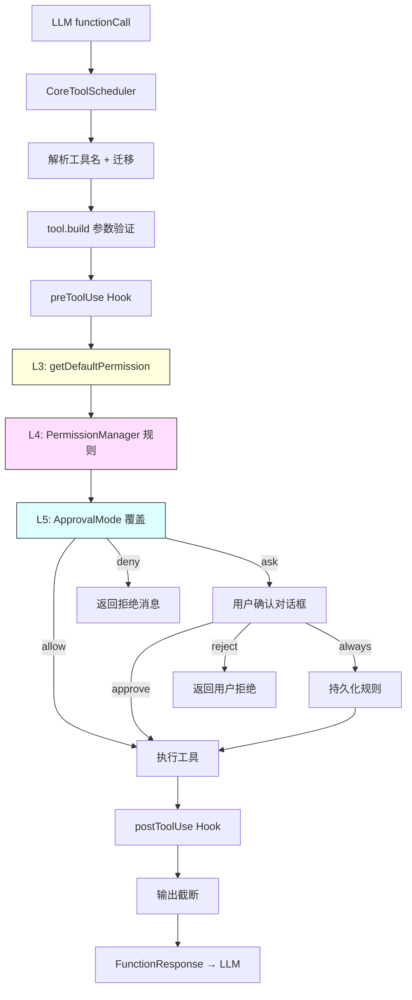

# Day 9: 工具执行与权限

## 🎯 学习目标

- 理解 `CoreToolScheduler` 的完整调度流程
- 掌握五级权限模型（L1-L5）和 `ApprovalMode` 枚举
- 了解 `permissionFlow.ts` 中 L3→L4 的评估逻辑
- 理解用户确认机制和 Plan 模式下的特殊策略

## 📖 核心概念

### ApprovalMode 枚举

```typescript
// packages/core/src/config/approval-mode.ts
export enum ApprovalMode {
  PLAN = 'plan', // 只读规划，禁止写操作
  DEFAULT = 'default', // 每次写操作需确认
  AUTO_EDIT = 'auto-edit', // 文件编辑自动批准，shell 仍需确认
  AUTO = 'auto', // AI 分类器判断安全性
  YOLO = 'yolo', // 全部自动批准
}
```

### 五级权限模型

| 层级 | 来源              | 说明                                |
| ---- | ----------------- | ----------------------------------- |
| L1   | 用户设置          | `disabledTools` 全局禁用            |
| L2   | Hook 系统         | `preToolUse` hook 可拦截            |
| L3   | 工具自身          | `invocation.getDefaultPermission()` |
| L4   | PermissionManager | 规则引擎覆盖 L3                     |
| L5   | ApprovalMode      | YOLO/AUTO_EDIT/PLAN 最终覆盖        |

### 调度流程概览

LLM 返回 `functionCall` → 调度器接收 → 权限评估 → 确认对话框 → 执行 → 结果返回 LLM

## 🔍 源码导读

### 1. CoreToolScheduler — `packages/core/src/core/coreToolScheduler.ts`

这是 5396 行的核心文件，负责工具调用的完整生命周期：

```typescript
// 简化的调度流程
class CoreToolScheduler {
  async scheduleToolCall(
    request: ToolCallRequestInfo,
  ): Promise<ToolCallResponseInfo> {
    // 1. 解析工具名（含旧名迁移）
    const toolName = resolveToolName(request.name);

    // 2. 从 ToolRegistry 获取工具
    const tool = await this.toolRegistry.ensureTool(toolName);

    // 3. 构建 ToolInvocation（参数验证）
    const invocation = tool.build(request.params);

    // 4. 触发 preToolUse hook
    await firePreToolUseHook(toolName, request.params);

    // 5. 权限评估（L3→L4→L5）
    const permResult = await evaluatePermissionFlow(
      config,
      invocation,
      toolName,
      params,
    );

    // 6. 根据权限决定：执行 / 确认 / 拒绝
    if (permResult.finalPermission === 'deny') {
      return buildDenialResponse(permResult.denyMessage);
    }
    if (needsConfirmation(permResult, approvalMode)) {
      const confirmed = await this.requestUserConfirmation(invocation);
      if (!confirmed) return buildUserDenialResponse();
    }

    // 7. 执行工具
    const result = await invocation.execute(abortSignal, updateOutput);

    // 8. 触发 postToolUse hook
    await firePostToolUseHook(toolName, request.params, result);

    // 9. 截断过大输出
    return finalizeToolResponses(result);
  }
}
```

### 2. 权限流 — `packages/core/src/core/permissionFlow.ts`

```typescript
export async function evaluatePermissionFlow(
  config: Config,
  invocation: AnyToolInvocation,
  toolName: string,
  toolParams: Record<string, unknown>,
): Promise<PermissionFlowResult> {
  // ── L3: 工具内在权限 ──
  const defaultPermission = await invocation.getDefaultPermission();

  // ── L4: PermissionManager 规则覆盖 ──
  const pm = config.getPermissionManager?.();
  const pmCtx = buildPermissionCheckContext(toolName, toolParams, targetDir);
  const { finalPermission, pmForcedAsk } = await evaluatePermissionRules(
    pm,
    defaultPermission,
    pmCtx,
  );

  // requiresUserInteraction 强制 ask（不可被自动模式跳过）
  const requiresUserInteraction =
    invocation.requiresUserInteraction?.() === true;
  const effectivePermission =
    requiresUserInteraction && finalPermission !== 'deny'
      ? 'ask'
      : finalPermission;

  return {
    defaultPermission,
    finalPermission: effectivePermission,
    pmForcedAsk,
    pmCtx,
  };
}
```

### 3. PermissionManager — `packages/core/src/permissions/permission-manager.ts`

权限规则引擎，支持：

- 基于工具名的 allow/deny 规则
- 基于路径的条件规则
- 基于 shell 命令内容的规则
- 持久化用户选择（"Always Allow"）

### 4. Plan 模式 Shell 策略 — `packages/core/src/core/plan-mode-shell-policy.ts`

Plan 模式下 shell 命令的特殊处理：

- 只读命令（`ls`, `cat`, `grep`）允许执行
- 写操作命令被阻止
- 通过 `isShellCommandReadOnly()` 判断

### 5. AUTO 模式分类器 — `packages/core/src/permissions/autoMode.ts`

AUTO 模式使用 LLM 分类器判断工具调用安全性：

- `evaluateAutoMode()` — 调用分类器
- `applyAutoModeDecision()` — 应用分类结果
- `denialTracking.ts` — 连续拒绝后的降级策略

### 6. 权限辅助 — `packages/core/src/core/permission-helpers.ts`

```typescript
// 构建权限检查上下文
buildPermissionCheckContext(toolName, toolParams, targetDir, aliases);

// 评估 PM 规则
evaluatePermissionRules(pm, defaultPermission, pmCtx);

// 持久化用户选择
persistPermissionOutcome(outcome, pmCtx);

// 注入缺失规则
injectPermissionRulesIfMissing(pm, pmCtx);
```

## 🏗️ 架构图（Mermaid）



## 💻 动手练习

### 练习 1：追踪权限决策

在 `permissionFlow.ts` 中，找到 `evaluatePermissionFlow` 函数。画出从 L3 到最终 `effectivePermission` 的决策树。

### 练习 2：理解 ApprovalMode 影响

在 `coreToolScheduler.ts` 中搜索 `ApprovalMode.YOLO` 和 `ApprovalMode.PLAN`，理解不同模式如何跳过或加强确认流程。

### 练习 3：查看权限规则格式

```bash
# 查看 permission-manager 中的规则类型定义
grep -n "interface.*Rule\|type.*Rule" packages/core/src/permissions/types.ts
```

### 练习 4：模拟权限流

假设用户执行 `run_shell_command({ command: "rm -rf /tmp/test" })`，在 DEFAULT 模式下：

1. L3 返回什么？（提示：shell 工具的 `getDefaultPermission`）
2. L4 会如何评估？
3. L5 最终决定是什么？
4. 用户会看到什么样的确认对话框？

## ✅ 自检问题（答案折叠）

<details>
<summary>1. ApprovalMode 有哪 5 个值？哪个最宽松？</summary>

`PLAN`、`DEFAULT`、`AUTO_EDIT`、`AUTO`、`YOLO`。`YOLO` 最宽松，所有工具调用自动批准无需确认。

</details>

<details>
<summary>2. L3 和 L4 的区别是什么？</summary>

- L3 是工具**内在**的权限判断，仅基于工具自身参数（如 shell 工具检测到命令替换返回 `deny`）
- L4 是 **PermissionManager 规则引擎**的覆盖，基于用户配置的 allow/deny 规则和持久化选择

</details>

<details>
<summary>3. requiresUserInteraction 的作用是什么？</summary>

当工具声明 `requiresUserInteraction() === true` 时，即使 ApprovalMode 为 YOLO 或 AUTO，也**必须**经过用户交互确认。这用于不可逆的高风险操作，自动模式不能跳过。

</details>

<details>
<summary>4. Plan 模式下 shell 命令如何处理？</summary>

通过 `plan-mode-shell-policy.ts` 中的 `evaluatePlanModeShellPolicy()` 判断：只读命令（如 `ls`、`cat`、`grep`）允许执行；有副作用的命令被阻止并提示用户退出 Plan 模式。

</details>

## 📚 延伸阅读

- `packages/core/src/core/coreToolScheduler.ts` — 完整调度器（5396 行）
- `packages/core/src/core/permissionFlow.ts` — L3→L4 权限流
- `packages/core/src/permissions/permission-manager.ts` — 规则引擎
- `packages/core/src/permissions/autoMode.ts` — AUTO 模式分类器
- `packages/core/src/permissions/dangerousRules.ts` — 危险命令检测
- `packages/core/src/core/plan-mode-shell-policy.ts` — Plan 模式策略
- `packages/core/src/hooks/types.ts` — Hook 事件类型
