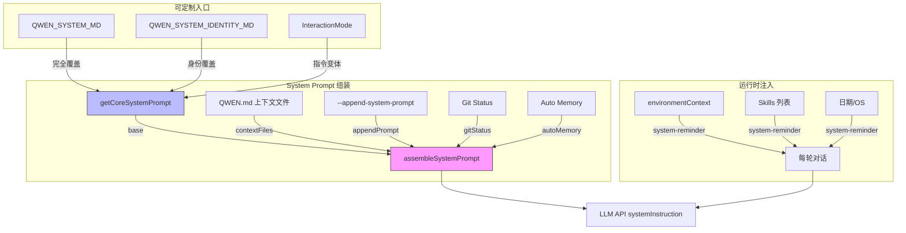

# Day 10: 上下文管理与 System Prompt 组装

## 🎯 学习目标

- 理解 system prompt 的分层组装流程（`assembleSystemPrompt`）
- 掌握 `getCoreSystemPrompt` 的核心内容和可定制性
- 了解 `environmentContext.ts` 如何注入运行时上下文
- 理解 QWEN.md 上下文文件的加载机制和 `system-reminder` 注入

## 📖 核心概念

### System Prompt 分层架构

千问 Code 的 system prompt 由多个独立层组合而成：

```typescript
// packages/core/src/core/prompts.ts
export interface SystemPromptLayers {
  base: string; // 核心指令（getCoreSystemPrompt）
  contextFiles?: string; // QWEN.md 等上下文文件
  appendPrompt?: string; // 追加指令（--append-system-prompt）
  gitStatus?: string; // Git 仓库状态
  autoMemory?: string; // 自动记忆（每次 save 后更新）
}

export function assembleSystemPrompt(layers: SystemPromptLayers): string {
  return (
    layers.base +
    buildSystemPromptSuffix(layers.contextFiles) +
    buildSystemPromptSuffix(layers.appendPrompt) +
    (layers.gitStatus ? `\n\n${layers.gitStatus}` : '') +
    buildSystemPromptSuffix(layers.autoMemory)
  );
}
```

### 交互模式

System prompt 根据运行模式调整指令：

```typescript
export type SystemPromptInteractionMode = 'interactive' | 'headless' | 'acp';
```

| 模式          | 场景               | 行为差异                   |
| ------------- | ------------------ | -------------------------- |
| `interactive` | 终端交互           | 可使用 `ask_user_question` |
| `headless`    | 非交互单次运行     | 禁止提问，自主决策         |
| `acp`         | IDE 集成（Zed 等） | 通过宿主中继问题           |

### system-reminder 机制

运行时信息通过 `<system-reminder>` 标签注入到对话中（非 system prompt），用于：

- 每轮日期更新
- 可用 skills 列表
- 延迟工具提示
- 工作目录变化

## 🔍 源码导读

### 1. 核心 Prompt — `packages/core/src/core/prompts.ts`

`getCoreSystemPrompt()` 生成基础指令，包含：

```typescript
export function getCoreSystemPrompt(
  userMemory?: string,
  model?: string,
  appendInstruction?: string,
  interactionMode: SystemPromptInteractionMode = 'interactive',
): string {
  // 1. 检查 QWEN_SYSTEM_MD 环境变量（完全覆盖）
  // 2. 解析交互模式
  // 3. 组装身份声明 + 核心规则
}
```

核心内容包括：

- **身份声明**：`"You are Qwen Code, an interactive CLI agent developed by Alibaba Group..."`
- **Core Mandates**：代码规范、库验证、风格一致性
- **Task Management**：todo_write 使用指南
- **Primary Workflows**：软件工程任务流程
- **Executing actions with care**：危险操作确认指南

### 2. 身份覆盖 — `QWEN_SYSTEM_IDENTITY_MD`

```typescript
function resolveCoreIdentityOverride(): string | null {
  const rawEnv = process.env['QWEN_SYSTEM_IDENTITY_MD'];
  // 只接受文件路径，忽略 boolean 开关
  // 文件内容替换默认身份段落
}
```

### 3. 完全覆盖 — `QWEN_SYSTEM_MD`

设置此环境变量后，整个 base prompt 被文件内容替换：

- 默认路径：`.qwen/system.md`
- 可指定自定义路径
- 文件必须存在，否则报错

### 4. 环境上下文 — `packages/core/src/utils/environmentContext.ts`

```typescript
export const SYSTEM_REMINDER_OPEN = '<system-reminder>';
export const SYSTEM_REMINDER_CLOSE = '</system-reminder>';

export function formatDateForContext(date: Date = new Date()): string {
  return date.toLocaleDateString('en-US', {
    weekday: 'long',
    year: 'numeric',
    month: 'long',
    day: 'numeric',
  });
}

export async function getDirectoryContextString(
  config: Config,
): Promise<string> {
  // 获取工作目录 + 文件夹结构树
  const workspaceDirectories = workspaceContext.getDirectories();
  const folderStructures = await Promise.all(
    workspaceDirectories.map((dir) => getFolderStructure(dir, { fileService })),
  );
  return `${workingDirPreamble}\nHere is the folder structure...\n${folderStructure}`;
}
```

环境上下文在会话启动时注入，包含：

- 当前日期
- 操作系统
- 工作目录及文件夹结构
- 可用 skills 列表
- 延迟工具摘要

### 5. 压缩 Prompt — `getCompressionPrompt()`

当上下文窗口即将溢出时，使用专门的压缩 prompt 生成对话摘要：

```typescript
export function getCompressionPrompt(): string {
  return `You are the component that summarizes a conversation...
  <state_snapshot>
    <primary_request_and_intent>...</primary_request_and_intent>
    <key_technical_concepts>...</key_technical_concepts>
    <files_and_code_sections>...</files_and_code_sections>
    <errors_and_fixes>...</errors_and_fixes>
    ...
  </state_snapshot>`;
}
```

### 6. QWEN.md 上下文文件

上下文文件通过多层查找加载：

- 项目根目录 `QWEN.md`
- `.qwen/` 目录下的配置
- 用户全局 `~/.qwen/QWEN.md`
- 通过 `contextFiles` 层注入 system prompt

## 🏗️ 架构图（Mermaid）



## 💻 动手练习

### 练习 1：查看完整 System Prompt

在交互模式下启动千问 Code，使用 `/context` 命令查看当前 system prompt 的 token 估算。

### 练习 2：追踪 assembleSystemPrompt 调用

```bash
grep -rn "assembleSystemPrompt" packages/core/src/ --include="*.ts" | grep -v test | grep -v ".d.ts"
```

找出哪些调用点使用了这个函数，理解不同场景下的层组合。

### 练习 3：创建自定义 System Prompt

1. 在项目根目录创建 `.qwen/system.md`
2. 写入简单的自定义指令
3. 设置 `QWEN_SYSTEM_MD=1` 启动千问 Code
4. 观察行为变化

### 练习 4：分析 system-reminder 注入

在 `environmentContext.ts` 中搜索 `SYSTEM_REMINDER_OPEN`，找出所有注入 system-reminder 的位置。理解它们分别在什么时机注入。

## ✅ 自检问题（答案折叠）

<details>
<summary>1. assembleSystemPrompt 的 5 个层是什么？顺序如何？</summary>

按拼接顺序：`base`（核心指令）→ `contextFiles`（QWEN.md）→ `appendPrompt`（追加指令）→ `gitStatus`（Git 状态）→ `autoMemory`（自动记忆）。autoMemory 始终最后，因为每次 memory save 都会更新它，放在末尾使缓存失效范围最小。

</details>

<details>
<summary>2. QWEN_SYSTEM_MD 和 QWEN_SYSTEM_IDENTITY_MD 的区别？</summary>

- `QWEN_SYSTEM_MD`：完全替换整个 base prompt，是"全量覆盖"
- `QWEN_SYSTEM_IDENTITY_MD`：只替换开头的身份声明段落，其余核心规则保留

两者不能同时生效——当 QWEN_SYSTEM_MD 启用时，IDENTITY_MD 被忽略。

</details>

<details>
<summary>3. system-reminder 和 system prompt 有什么区别？</summary>

- System prompt 是 API 请求中的 `systemInstruction` 字段，整个会话固定
- system-reminder 是注入到**对话消息**中的 `<system-reminder>` 标签，可以每轮更新（如日期、新发现的工具）

</details>

<details>
<summary>4. headless 模式下为什么禁止提问？</summary>

headless 是单次运行的非交互模式（如 CI/CD 管道），没有用户可以接收和回答问题。System prompt 明确指示："Never ask the user a question... Make reasonable assumptions when safe and complete the task."

</details>

## 📚 延伸阅读

- `packages/core/src/core/prompts.ts` — 完整 prompt 组装（1392 行）
- `packages/core/src/utils/environmentContext.ts` — 环境上下文（704 行）
- `packages/core/src/config/storage.ts` — QWEN_DIR 路径定义
- `packages/core/src/utils/getFolderStructure.ts` — 目录树生成
- `packages/core/src/tools/skill-utils.ts` — Skills 列表渲染
