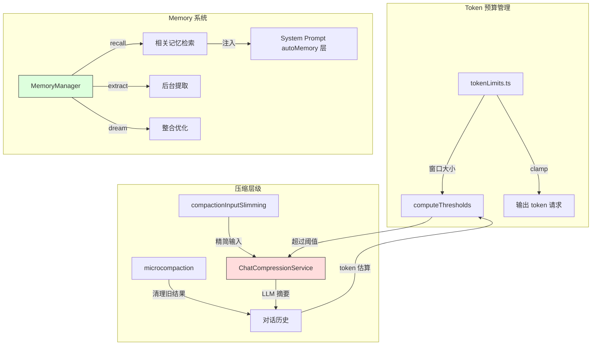

# Day 11: Memory 系统与聊天压缩

## 🎯 学习目标

- 理解 Memory 系统的三层存储（user / project / team）
- 掌握 `MemoryManager` 的核心 API（recall、extract、dream）
- 了解 `ChatCompressionService` 的自动压缩触发机制
- 理解 microcompaction 的轻量级历史清理策略
- 掌握 token 预算管理（`tokenLimits.ts`）

## 📖 核心概念

### Memory 三层架构

| 层级    | 目录                              | 作用域     | 同步方式 |
| ------- | --------------------------------- | ---------- | -------- |
| User    | `~/.qwen/memories/`               | 跨项目     | 本地     |
| Project | `~/.qwen/projects/<hash>/memory/` | 单项目私有 | 本地     |
| Team    | `<repo>/.qwen/team-memory/`       | 项目共享   | Git      |

### 压缩层级

```
┌─────────────────────────────────────────────┐
│  microcompaction（轻量）                      │
│  清理旧工具结果，释放 token                    │
├─────────────────────────────────────────────┤
│  chatCompression（重量）                      │
│  LLM 生成对话摘要，替换整段历史               │
├─────────────────────────────────────────────┤
│  tokenLimits（预算）                          │
│  窗口大小、输出上限、clamp 策略               │
└─────────────────────────────────────────────┘
```

## 🔍 源码导读

### 1. MemoryManager — `packages/core/src/memory/manager.ts`

```typescript
// 核心公共 API
config.getMemoryManager().scheduleExtract(params)   // 后台提取记忆
config.getMemoryManager().scheduleDream(params)     // 后台整合（"做梦"）
config.getMemoryManager().recall(projectRoot, query, options)  // 检索相关记忆
config.getMemoryManager().forget(projectRoot, query, options)  // 删除记忆
config.getMemoryManager().getStatus(projectRoot)    // 状态查询
config.getMemoryManager().drain(options?)           // 等待后台任务完成
config.getMemoryManager().buildAutoMemoryPrompt(projectRoot)   // 构建注入 prompt
```

设计特点：

- 所有后台任务状态由 MemoryManager 用 plain Maps 管理，无额外调度器类
- 每个操作跟踪为 `MemoryTaskRecord`，可按类型和项目查询
- 生产代码通过 `config.getMemoryManager()` 访问

### 2. Memory 路径 — `packages/core/src/memory/paths.ts`

```typescript
export const AUTO_MEMORY_DIRNAME = 'memory';
export const AUTO_MEMORY_INDEX_FILENAME = 'MEMORY.md';
export const USER_AUTO_MEMORY_DIRNAME = 'memories';
export const TEAM_AUTO_MEMORY_DIRNAME = 'team-memory';

export function getMemoryBaseDir(): string {
  if (process.env['QWEN_CODE_MEMORY_BASE_DIR']) {
    return resolvePath(undefined, process.env['QWEN_CODE_MEMORY_BASE_DIR']);
  }
  return Storage.getRuntimeBaseDir();
}
```

关键函数：

- `isAnyAutoMemPath()` — 判断路径是否属于自动记忆系统
- `isTeamAutoMemPath()` — 判断是否为团队记忆路径
- `findGitRoot()` — 向上查找 `.git` 确定团队记忆位置

### 3. ChatCompressionService — `packages/core/src/services/chatCompressionService.ts`

```typescript
// 核心常量
export const COMPACT_MAX_OUTPUT_TOKENS = 20_000; // 摘要输出上限
export const DEFAULT_PCT = 0.85; // 自动压缩阈值比例
export const SUMMARY_RESERVE = 20_000; // 为摘要预留的 token
export const AUTOCOMPACT_BUFFER = 13_000; // 自动触发缓冲
export const WARN_BUFFER = 20_000; // 警告缓冲
export const HARD_BUFFER = 3_000; // 硬限制缓冲
export const MAX_CONSECUTIVE_FAILURES = 3; // 熔断阈值
```

压缩触发条件（`computeThresholds`）：

- **warn 阈值**：`effectiveWindow - AUTOCOMPACT_BUFFER - WARN_BUFFER`
- **auto 阈值**：`effectiveWindow - AUTOCOMPACT_BUFFER`（约 85% 窗口）
- **hard 阈值**：`effectiveWindow - HARD_BUFFER`

压缩流程：

1. 估算当前历史 token 数
2. 超过 auto 阈值 → 触发压缩
3. 调用 `getCompressionPrompt()` 生成摘要
4. 摘要通过 `runSideQuery` 执行（不污染主对话）
5. 用摘要替换旧历史
6. 连续失败 3 次 → 熔断，等待手动 `/compact`

### 4. Microcompaction — `packages/core/src/services/microcompaction/microcompact.ts`

轻量级清理，不需要 LLM 调用：

```typescript
export const MICROCOMPACT_CLEARED_MESSAGE = '[Old tool result content cleared]';

const COMPACTABLE_TOOLS = new Set([
  'read_file',
  'run_shell_command',
  'grep_search',
  'glob',
  'web_fetch',
  'web_search',
  'read_mcp_resource',
  'edit',
  'write_file',
  'skill',
]);
```

策略：将**旧的**工具调用结果内容替换为占位符，保留结构但释放 token。

- 只清理 `COMPACTABLE_TOOLS` 中的工具
- 文件类工具（read_file, edit, write_file）清理时会记录路径，避免悬空引用

### 5. Token 限制 — `packages/core/src/core/tokenLimits.ts`

```typescript
export const DEFAULT_TOKEN_LIMIT = 200_000; // 默认输入窗口
export const DEFAULT_OUTPUT_TOKEN_LIMIT = 32_000; // 默认输出上限
export const ESCALATED_MAX_TOKENS = 64_000; // 截断后升级上限
export const OUTPUT_TOKEN_CEILING = 64_000; // 自动输出请求上限
export const MIN_CLAMPED_OUTPUT_TOKENS = 4_000; // 最小输出保证

export function clampOutputTokensToWindow(
  outputCeiling: number,
  contextWindowSize: number,
  promptTokens: number,
): TokenCount {
  const room =
    contextWindowSize - promptTokens - outputClampMargin(contextWindowSize);
  return Math.min(outputCeiling, Math.max(MIN_CLAMPED_OUTPUT_TOKENS, room));
}
```

`tokenLimit(model, type)` 根据模型名匹配上下文窗口：

- Gemini: 1M
- GPT-5.x: 272K
- Claude: 200K
- Qwen3: 256K ~ 1M

### 6. 压缩输入精简 — `packages/core/src/services/compactionInputSlimming.ts`

在发送给压缩 LLM 之前，先对输入做精简：

- 移除冗余的工具调用细节
- 压缩重复模式
- 保留关键决策和结果

## 🏗️ 架构图（Mermaid）



## 💻 动手练习

### 练习 1：观察压缩触发

在长对话中持续操作，观察何时出现压缩提示。也可以手动执行 `/compact` 命令触发压缩，观察摘要格式。

### 练习 2：查看 Memory 存储

```bash
# 查看用户级记忆
ls ~/.qwen/memories/

# 查看项目级记忆（路径含项目哈希）
ls ~/.qwen/projects/*/memory/

# 查看 MEMORY.md 索引格式
cat ~/.qwen/memories/MEMORY.md
```

### 练习 3：理解 token 窗口

```bash
# 查看不同模型的 token 限制
grep -A2 "qwen\|gemini\|claude\|gpt" packages/core/src/core/tokenLimits.ts | head -40
```

计算：如果模型窗口 200K，DEFAULT_PCT=0.85，AUTOCOMPACT_BUFFER=13K，auto 阈值是多少？

### 练习 4：追踪 microcompaction

在 `microcompact.ts` 中找到 `COMPACTABLE_TOOLS` 集合。思考：为什么 `agent` 工具不在其中？（提示：子 agent 结果可能包含重要决策信息）

## ✅ 自检问题（答案折叠）

<details>
<summary>1. 自动压缩在什么时候触发？</summary>

当对话历史的估算 token 数超过 `effectiveWindow - AUTOCOMPACT_BUFFER`（约 85% 窗口减去 13K 缓冲）时自动触发。还有一个 hard 阈值（窗口 - 3K）作为最后防线。连续失败 3 次后熔断，不再自动尝试。

</details>

<details>
<summary>2. microcompaction 和 chatCompression 的区别？</summary>

- **microcompaction**：无需 LLM 调用，简单地将旧工具结果替换为占位符文本，快速释放 token
- **chatCompression**：调用 LLM 生成结构化摘要（`<state_snapshot>` XML），用摘要替换整段历史，是有损但更彻底的压缩

</details>

<details>
<summary>3. Memory 的 recall 和 dream 分别做什么？</summary>

- **recall**：根据当前查询检索相关记忆条目，注入到 system prompt 的 autoMemory 层
- **dream**：后台整合任务，合并重复记忆、清理过时条目、优化索引（类似人类睡眠时的记忆整合）

</details>

<details>
<summary>4. clampOutputTokensToWindow 解决什么问题？</summary>

确保 `prompt + max_tokens ≤ window` 恒成立（issue #5950）。当 prompt 几乎填满窗口时，自动缩小输出请求，避免 API 返回 400 错误。同时保证至少 4000 token 的输出空间（MIN_CLAMPED_OUTPUT_TOKENS）。

</details>

## 📚 延伸阅读

- `packages/core/src/memory/manager.ts` — Memory 管理器（1505 行）
- `packages/core/src/memory/recall.ts` — 记忆检索逻辑
- `packages/core/src/memory/dream.ts` — 整合任务
- `packages/core/src/services/chatCompressionService.ts` — 压缩服务（886 行）
- `packages/core/src/services/microcompaction/microcompact.ts` — 微压缩（748 行）
- `packages/core/src/services/compactionInputSlimming.ts` — 输入精简
- `packages/core/src/core/tokenLimits.ts` — Token 限制与模型匹配
