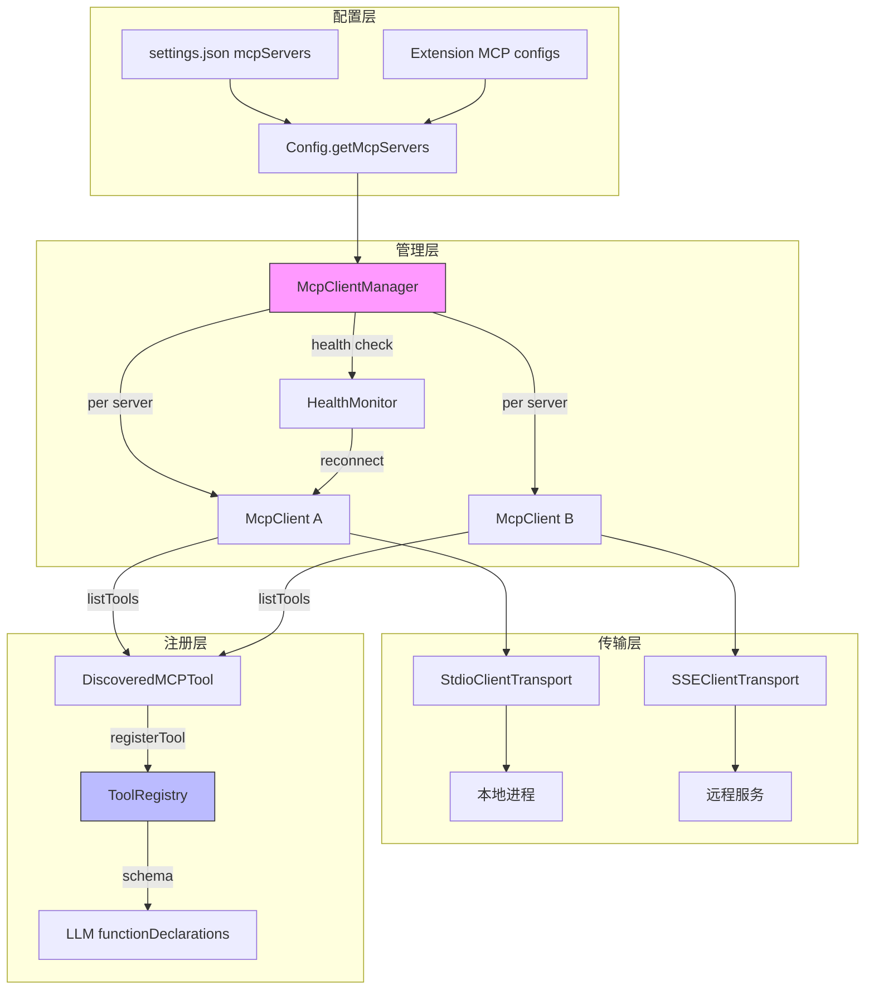

# Day 12: MCP 集成

## 🎯 学习目标

- 理解 MCP（Model Context Protocol）在千问 Code 中的集成架构
- 掌握 `McpClient` 的连接管理（stdio / SSE / StreamableHTTP）
- 了解 `McpClientManager` 的工具发现与注册流程
- 理解 MCP server 配置格式和健康监控机制

## 📖 核心概念

### MCP 是什么

MCP（Model Context Protocol）是一个开放协议，允许 AI 应用连接外部工具和数据源。千问 Code 作为 MCP **客户端**，可以连接多个 MCP **服务器**，动态发现并注册其提供的工具。

### 传输方式

| 传输           | 类                              | 场景               |
| -------------- | ------------------------------- | ------------------ |
| stdio          | `StdioClientTransport`          | 本地进程（最常用） |
| SSE            | `SSEClientTransport`            | 远程 HTTP 服务     |
| StreamableHTTP | `StreamableHTTPClientTransport` | 新版 HTTP 传输     |
| SDK Control    | `SdkControlClientTransport`     | IDE 内部控制通道   |

### 工具命名约定

MCP 工具注册时使用 `mcp__<serverName>__<toolName>` 格式，确保跨服务器唯一性。

## 🔍 源码导读

### 1. McpClient — `packages/core/src/tools/mcp-client.ts`

单个 MCP 服务器的客户端封装（2268 行）：

```typescript
import { Client } from '@modelcontextprotocol/sdk/client/index.js';
import { StdioClientTransport } from '@modelcontextprotocol/sdk/client/stdio.js';
import { SSEClientTransport } from '@modelcontextprotocol/sdk/client/sse.js';
import { StreamableHTTPClientTransport } from '@modelcontextprotocol/sdk/client/streamableHttp.js';

export class McpClient {
  // 连接管理
  async connect(): Promise<void> {
    /* 建立传输连接 */
  }
  async disconnect(): Promise<void> {
    /* 断开连接 */
  }

  // 工具发现
  async listTools(): Promise<DiscoveredMCPTool[]> {
    /* 获取服务器工具列表 */
  }

  // 资源与提示
  async listResources(): Promise<Resource[]> {
    /* ... */
  }
  async readResource(uri: string): Promise<ReadResourceResult> {
    /* ... */
  }
  async listPrompts(): Promise<Prompt[]> {
    /* ... */
  }
  async getPrompt(name: string): Promise<GetPromptResult> {
    /* ... */
  }
}
```

关键依赖：`@modelcontextprotocol/sdk` 提供协议实现。

### 2. McpClientManager — `packages/core/src/tools/mcp-client-manager.ts`

管理所有 MCP 服务器连接的生命周期（3273 行）：

```typescript
export class McpClientManager {
  constructor(
    config: Config,
    toolRegistry: ToolRegistry,
    options: {
      eventEmitter?: EventEmitter;
      sendSdkMcpMessage?: SendSdkMcpMessage;
      pool?: McpTransportPool; // daemon 模式共享传输池
    },
  ) {}

  // 发现所有配置服务器的工具
  async discoverAllMcpTools(): Promise<void> {
    /* ... */
  }

  // 热重载：配置变化时重新初始化
  async reinitialize(
    newServers: Record<string, MCPServerConfig>,
  ): Promise<void> {
    /* ... */
  }
}
```

### 3. 健康监控

```typescript
export interface MCPHealthMonitorConfig {
  checkIntervalMs: number; // 默认 30000ms
  maxConsecutiveFailures: number; // 默认 3 次
  autoReconnect: boolean; // 默认 true
  reconnectDelayMs: number; // 默认 5000ms
}
```

监控流程：

1. 每 30 秒检查连接状态
2. 连续 3 次失败 → 标记为 disconnected
3. 自动重连（5 秒延迟后尝试）

### 4. MCP 配置格式

在 `settings.json` 中配置：

```json
{
  "mcpServers": {
    "my-server": {
      "command": "npx",
      "args": ["-y", "@my/mcp-server"],
      "env": { "API_KEY": "..." }
    },
    "remote-server": {
      "url": "https://mcp.example.com/sse",
      "transport": "sse"
    }
  }
}
```

配置类型定义在 `packages/core/src/config/config.ts` 中的 `MCPServerConfig`。

### 5. OAuth 认证 — `packages/core/src/mcp/`

```
packages/core/src/mcp/
├── oauth-provider.ts          # OAuth 流程管理
├── oauth-token-storage.ts     # Token 持久化
├── oauth-utils.ts             # OAuth 工具函数
├── google-auth-provider.ts    # Google 认证
├── sa-impersonation-provider.ts  # 服务账号模拟
├── configHash.ts              # 配置哈希（变更检测）
├── constants.ts               # MCP 常量
└── token-storage/             # Token 存储抽象
```

### 6. 工具发现与注册流程

```typescript
// McpClientManager 发现工具后注册到 ToolRegistry
const tools = await mcpClient.listTools();
for (const tool of tools) {
  const discoveredTool = new DiscoveredMCPTool(
    config,
    serverName,
    tool.name,
    tool.description,
    tool.inputSchema,
  );
  toolRegistry.registerTool(discoveredTool);
}
```

`DiscoveredMCPTool` 继承自 `DeclarativeTool`，将 MCP 工具适配为内部工具接口。

### 7. 传输池（Daemon 模式）

在 daemon 模式下，多个 session 共享 MCP 传输连接：

- `McpTransportPool` — 连接池管理
- `connectionIdOf()` — 基于配置哈希标识唯一连接
- 避免 N 个 session 对同一服务器建立 N 个连接

### 8. 预算控制

MCP 工具有 slot 预算限制：

- 双阈值滞后（hysteresis）：75% 时警告，降回后重新武装
- `McpBudgetWouldExceedError` — 超预算时拒绝新工具注册

## 🏗️ 架构图（Mermaid）



## 💻 动手练习

### 练习 1：配置一个 MCP Server

在 `~/.qwen/settings.json` 中添加一个简单的 MCP server 配置：

```json
{
  "mcpServers": {
    "filesystem": {
      "command": "npx",
      "args": ["-y", "@modelcontextprotocol/server-filesystem", "/tmp"]
    }
  }
}
```

启动千问 Code，观察 MCP 工具是否出现在可用工具列表中。

### 练习 2：追踪工具发现

```bash
# 查找 DiscoveredMCPTool 的定义
grep -n "class DiscoveredMCPTool" packages/core/src/tools/mcp-tool.ts

# 查看 MCP 工具如何适配为内部接口
head -60 packages/core/src/tools/mcp-tool.ts
```

### 练习 3：理解连接生命周期

在 `mcp-client.ts` 中搜索 `connect` 和 `disconnect` 方法，理解：

1. 连接何时建立？（启动时 / 懒加载？）
2. 断连后如何重连？
3. 进程退出时如何清理？

### 练习 4：查看 MCP 状态

在千问 Code 中使用 `/mcp` 命令查看当前 MCP 服务器状态。

## ✅ 自检问题（答案折叠）

<details>
<summary>1. MCP 工具的命名格式是什么？为什么这样设计？</summary>

格式为 `mcp__<serverName>__<toolName>`（双下划线分隔）。这样设计确保：

- 跨服务器工具名唯一（不同服务器可能有同名工具）
- 与内置工具名区分（内置工具不含 `mcp__` 前缀）
- 权限规则可以按服务器或按具体工具粒度配置

</details>

<details>
<summary>2. McpClientManager 如何处理服务器配置变更？</summary>

通过 `reinitialize(newServers)` 方法：

1. 对比新旧配置，找出新增、删除、修改的服务器
2. 断开已删除服务器的连接
3. 记录 `recentlyRemovedMcpServers` 供 UI 提示
4. 为新增/修改的服务器建立连接并重新发现工具
5. 使用 `configHash.ts` 中的哈希检测配置是否真正变化

</details>

<details>
<summary>3. daemon 模式下为什么要用传输池？</summary>

daemon 模式（`qwen serve`）同时服务多个 session。如果每个 session 独立建立 MCP 连接，N 个 session × M 个服务器 = N×M 个进程/连接。传输池基于配置哈希去重，相同配置的服务器只建立一个连接，所有 session 共享，大幅减少资源消耗。

</details>

<details>
<summary>4. MCP 健康监控的默认行为是什么？</summary>

每 30 秒检查一次连接状态。连续 3 次失败后标记为 disconnected。如果 `autoReconnect: true`（默认），等待 5 秒后自动尝试重连。这确保了临时网络波动不会永久断开 MCP 连接。

</details>

## 📚 延伸阅读

- `packages/core/src/tools/mcp-client.ts` — MCP 客户端（2268 行）
- `packages/core/src/tools/mcp-client-manager.ts` — 客户端管理器（3273 行）
- `packages/core/src/tools/mcp-tool.ts` — MCP 工具适配
- `packages/core/src/tools/mcp-status.ts` — 状态管理
- `packages/core/src/mcp/oauth-provider.ts` — OAuth 认证
- `@modelcontextprotocol/sdk` — MCP SDK 文档
- `packages/core/src/tools/mcp-retry.ts` — 重试策略
