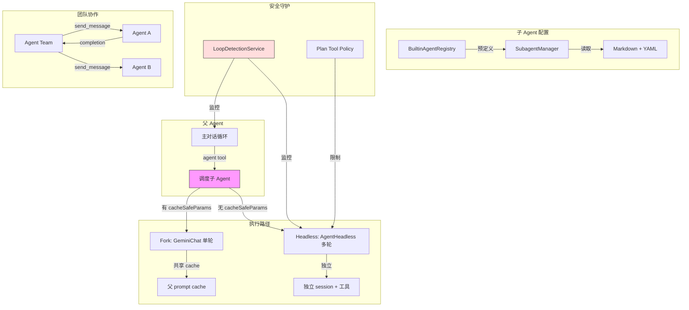

# Day 13: 子 Agent 与 Fork

## 🎯 学习目标

- 理解子 Agent 的配置格式（Markdown + YAML frontmatter）
- 掌握 `SubagentManager` 的 CRUD 和运行时调度
- 了解 Fork 的上下文继承机制（`CacheSafeParams`）
- 理解 Agent 团队（`agents/team/`）和后台任务管理
- 了解循环检测服务如何防止 Agent 失控

## 📖 核心概念

### 子 Agent 两种执行路径

| 路径              | 条件                 | 特点                                  |
| ----------------- | -------------------- | ------------------------------------- |
| CacheSafe（Fork） | 有 `cacheSafeParams` | 共享父对话 prompt cache，单轮，无工具 |
| Headless（独立）  | 无 `cacheSafeParams` | 独立 session，多轮，完整工具访问      |

### 子 Agent 配置格式

子 Agent 以 Markdown 文件定义，YAML frontmatter 描述元数据：

```markdown
---
name: code-reviewer
description: Reviews code for quality and security
model: qwen3-coder-plus
approvalMode: bubble
maxTurns: 20
tools:
  - read_file
  - grep_search
  - glob
---

You are a code review specialist. Analyze the provided code changes...
```

### ApprovalMode: bubble

子 Agent 特有的审批模式——将权限请求冒泡给父 Agent 处理，而非直接询问用户。

## 🔍 源码导读

### 1. SubagentManager — `packages/core/src/subagents/subagent-manager.ts`

管理子 Agent 配置的完整生命周期（1616 行）：

```typescript
export class SubagentManager {
  // CRUD 操作
  async create(options: CreateSubagentOptions): Promise<SubagentConfig> {
    /* ... */
  }
  async get(name: string): Promise<SubagentConfig | undefined> {
    /* ... */
  }
  async list(options?: ListSubagentsOptions): Promise<SubagentConfig[]> {
    /* ... */
  }
  async update(name: string, changes: Partial<SubagentConfig>): Promise<void> {
    /* ... */
  }
  async delete(name: string): Promise<void> {
    /* ... */
  }

  // 运行时
  async run(name: string, prompt: string, config: Config): Promise<string> {
    /* ... */
  }
}
```

配置存储位置：`~/.qwen/agents/` 或项目 `.qwen/agents/`

### 2. 子 Agent 类型 — `packages/core/src/subagents/types.ts`

```typescript
export interface SubagentConfig {
  name: string;
  description: string;
  systemPrompt: string; // Markdown body
  model?: string; // 模型覆盖
  approvalMode?: string; // 审批模式（含 'bubble'）
  maxTurns?: number; // 最大轮次
  tools?: string[]; // 可用工具白名单
  mcpServers?: Record<string, MCPServerConfig>; // 专属 MCP
  hooks?: HookDefinition[]; // 专属 hooks
}
```

### 3. 内置 Agent — `packages/core/src/subagents/builtin-agents.ts`

`BuiltinAgentRegistry` 提供预定义的子 Agent 类型（如 `general-purpose`、`Explore`）。

### 4. Forked Agent — `packages/core/src/utils/forkedAgent.ts`

统一的 Fork 执行原语（683 行）：

```typescript
export interface CacheSafeParams {
  generationConfig: GenerateContentConfig; // 含 systemInstruction + tools
  // 主对话的缓存关键参数快照
}
```

两种执行模式：

**WITH cacheSafeParams（Fork 模式）：**

- 使用 `GeminiChat` 单轮调用
- 共享父对话的 prompt cache（systemInstruction + history）
- 默认剥离工具（NO_TOOLS），防止 function call
- `preserveTools: true` 可保留工具前缀以命中 Anthropic prompt-cache
- 用途：`/btw`、建议生成、管道建议

**WITHOUT cacheSafeParams（Headless 模式）：**

- 使用 `AgentHeadless` 多轮执行
- 完整工具访问
- 独立 session（不共享历史）
- 用途：memory extract、dream consolidation

### 5. Agent 运行时 — `packages/core/src/agents/runtime/`

```
packages/core/src/agents/runtime/
├── agent-headless.ts       # 无头 Agent 执行器
├── agent-events.ts         # 事件发射器
├── agent-types.ts          # 类型定义（PromptConfig, ModelConfig, RunConfig, ToolConfig）
├── agent-context.ts        # 运行时上下文
├── agent-statistics.ts     # 统计信息
└── subagent-plan-tool-policy.ts  # 子 Agent Plan 模式策略
```

### 6. Agent 团队 — `packages/core/src/agents/team/`

支持多 Agent 协作：

- `team_create` / `team_delete` — 创建/删除团队
- `send_message` — Agent 间通信
- `team_plan_approval` — 计划审批

### 7. 后台任务 — `packages/core/src/agents/background-tasks.ts`

管理后台运行的 Agent：

- 后台 Agent 通过 completion notification 报告结果
- 支持暂停/恢复
- `background-agent-resume.ts` — 恢复逻辑

### 8. 循环检测 — `packages/core/src/services/loopDetectionService.ts`

防止 Agent 陷入无限循环（1000 行）：

```typescript
const TOOL_CALL_LOOP_THRESHOLD = 5; // 连续相同调用阈值
const CONTENT_LOOP_THRESHOLD = 10; // 内容重复阈值
const FILE_READ_THRESHOLD = 8; // 文件读取阈值
const FILE_READ_WINDOW = 15; // 读取窗口
const STAGNATION_THRESHOLD = 8; // 停滞阈值
const GLOBAL_DUPLICATE_THRESHOLD = 6; // 全局重复阈值
const ALTERNATING_PATTERN_CYCLES = 3; // 交替模式周期
```

检测维度：

- **连续相同调用**：同名 + 同参数连续 5 次
- **内容重复**：输出内容块重复 10 次
- **文件读取循环**：15 次窗口内读同一文件 8 次
- **行为停滞**：连续 8 次无实质进展
- **交替模式**：A→B→A→B→A→B（3 个完整周期）
- **全局重复**：同一 (tool, args) 对出现 6 次

### 9. 子 Agent 名称上下文 — `packages/core/src/utils/subagentNameContext.ts`

为子 Agent 提供名称解析和上下文传递，确保日志和 UI 中正确显示 Agent 身份。

## 🏗️ 架构图（Mermaid）



## 💻 动手练习

### 练习 1：查看内置 Agent 类型

```bash
# 查看内置 Agent 注册表
grep -n "register\|name:" packages/core/src/subagents/builtin-agents.ts | head -30
```

### 练习 2：创建自定义子 Agent

在项目的 `.qwen/agents/` 目录下创建一个 `test-helper.md`：

```markdown
---
name: test-helper
description: Runs and analyzes test results
approvalMode: bubble
maxTurns: 10
tools:
  - run_shell_command
  - read_file
  - grep_search
---

You are a test analysis specialist. Run the specified tests and analyze failures.
```

然后在千问 Code 中通过 `agent` 工具调用它。

### 练习 3：理解 CacheSafeParams

在 `forkedAgent.ts` 中找到 `CacheSafeParams` 接口和 `saveCacheSafeParams` 函数。理解：

1. 什么时候保存？（主对话每轮成功后）
2. 保存了什么？（generationConfig 含 systemInstruction + history）
3. Fork 如何利用它？（共享 prompt prefix 实现 cache hit）

### 练习 4：循环检测阈值实验

在 `loopDetectionService.ts` 中查看各阈值常量。思考：

- 为什么 `FILE_READ_THRESHOLD` 从 5 提高到 8？（注释中有解释）
- `hasSeenNonReadTool` 的冷启动豁免是什么意思？

## ✅ 自检问题（答案折叠）

<details>
<summary>1. Fork 和 Headless 子 Agent 的核心区别是什么？</summary>

- **Fork**：共享父对话的 prompt cache（systemInstruction + history），单轮执行，默认无工具，适合轻量查询（如 /btw、建议生成）
- **Headless**：完全独立的 session，多轮执行，完整工具访问，适合复杂自主任务（如 memory extract、代码分析）

</details>

<details>
<summary>2. approvalMode: 'bubble' 是什么意思？</summary>

`bubble` 是子 Agent 特有的审批模式（不属于全局 ApprovalMode 枚举）。当子 Agent 遇到需要权限确认的操作时，不直接询问用户，而是将请求冒泡（bubble up）给父 Agent，由父 Agent 决定如何处理。这避免了多个子 Agent 同时弹出确认对话框的混乱。

</details>

<details>
<summary>3. 循环检测有哪些维度？为什么需要多维度？</summary>

6 个维度：连续相同调用、内容重复、文件读取循环、行为停滞、交替模式（A-B-A-B）、全局重复。需要多维度是因为 Agent 的循环模式多样——简单重复容易检测，但交替模式（如反复 read_file + grep_search 却无进展）需要专门的模式匹配。冷启动豁免避免误报正常的初始探索行为。

</details>

<details>
<summary>4. 后台 Agent 如何报告结果？</summary>

后台 Agent 通过 completion notification 机制报告结果。在交互模式下，结果作为 `<task-notification>` 消息注入父对话。父 Agent 无需轮询——启动后台任务后可继续其他工作，通知到达时再处理结果。

</details>

## 📚 延伸阅读

- `packages/core/src/subagents/subagent-manager.ts` — 子 Agent 管理器（1616 行）
- `packages/core/src/subagents/types.ts` — 类型定义
- `packages/core/src/subagents/builtin-agents.ts` — 内置 Agent
- `packages/core/src/utils/forkedAgent.ts` — Fork 执行原语（683 行）
- `packages/core/src/agents/runtime/agent-headless.ts` — 无头执行器
- `packages/core/src/agents/background-tasks.ts` — 后台任务
- `packages/core/src/agents/team/` — 团队协作
- `packages/core/src/services/loopDetectionService.ts` — 循环检测（1000 行）
