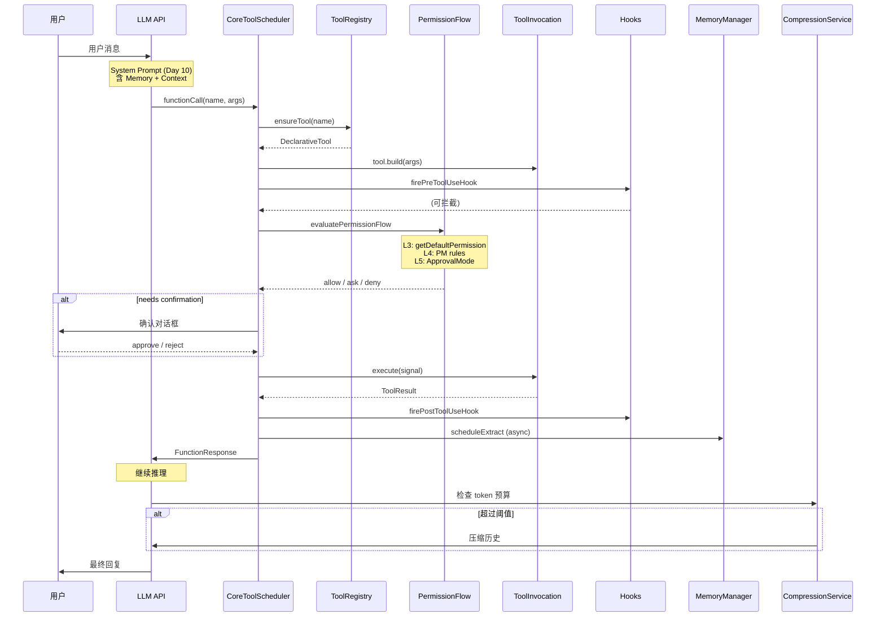
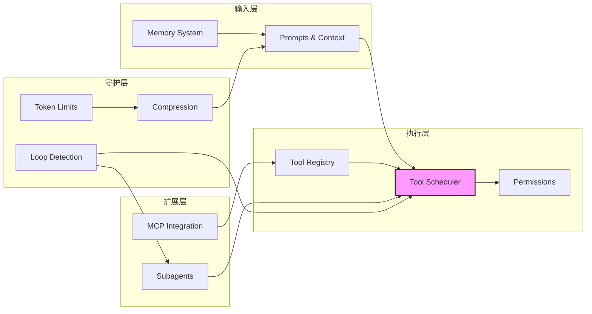

# Day 14: 第二周总结 — 完整工具调用链路

## 🎯 学习目标

- 串联 Day 8-13 的所有子系统，构建完整的工具调用链路图
- 理解各子系统间的协作关系
- 通过综合练习巩固所学
- 为第三周（高级主题）做准备

## 📖 核心概念

### 子系统全景

第二周覆盖了千问 Code 的 6 个核心子系统：

| 子系统        | 核心文件                                                  | 职责                   |
| ------------- | --------------------------------------------------------- | ---------------------- |
| 工具注册      | `tools/tool-registry.ts`                                  | 工具定义、注册、发现   |
| 工具执行      | `core/coreToolScheduler.ts`                               | 调度、权限、执行、结果 |
| 上下文管理    | `core/prompts.ts`                                         | System prompt 组装     |
| Memory & 压缩 | `memory/manager.ts`, `services/chatCompressionService.ts` | 记忆 + token 管理      |
| MCP 集成      | `tools/mcp-client-manager.ts`                             | 外部工具连接           |
| 子 Agent      | `subagents/subagent-manager.ts`                           | 任务分发与协作         |

### 一次工具调用的完整生命周期

从用户输入到工具结果返回 LLM，经过以下完整链路：

1. **上下文组装**（Day 10）：`assembleSystemPrompt` 构建 systemInstruction
2. **LLM 请求**：模型根据 functionDeclarations 决定调用
3. **工具解析**（Day 8）：`ToolRegistry.ensureTool` 获取工具定义
4. **参数验证**（Day 8）：`tool.build(params)` 创建 ToolInvocation
5. **Hook 拦截**（Day 9）：`firePreToolUseHook` 前置钩子
6. **权限评估**（Day 9）：L3→L4→L5 五级权限流
7. **用户确认**（Day 9）：需要时弹出确认对话框
8. **工具执行**：`invocation.execute()` 执行实际操作
9. **输出处理**（Day 11）：截断过大输出
10. **Hook 后置**（Day 9）：`firePostToolUseHook`
11. **Memory 提取**（Day 11）：后台异步提取有价值信息
12. **Token 预算**（Day 11）：检查是否需要压缩
13. **结果返回**：FunctionResponse 送回 LLM 继续推理

## 🔍 源码导读：关键连接点

### 连接点 1：ToolRegistry ↔ CoreToolScheduler

```typescript
// coreToolScheduler.ts 中获取工具
const tool = await this.toolRegistry.ensureTool(toolName);
const invocation = tool.build(request.params);
```

### 连接点 2：McpClientManager ↔ ToolRegistry

```typescript
// mcp-client-manager.ts 中注册发现的工具
const discoveredTool = new DiscoveredMCPTool(
  config,
  serverName,
  name,
  desc,
  schema,
);
this.toolRegistry.registerTool(discoveredTool);
```

### 连接点 3：PermissionFlow ↔ ApprovalMode

```typescript
// permissionFlow.ts 评估 L3→L4
const { finalPermission } = await evaluatePermissionRules(
  pm,
  defaultPermission,
  pmCtx,
);
// coreToolScheduler.ts 应用 L5
if (approvalMode === ApprovalMode.YOLO) {
  /* 跳过确认 */
}
```

### 连接点 4：ChatCompression ↔ TokenLimits

```typescript
// chatCompressionService.ts 使用 tokenLimits 计算阈值
const window = config.getContextWindowSize(); // 来自 tokenLimits.tokenLimit(model)
const autoThreshold = window * DEFAULT_PCT - AUTOCOMPACT_BUFFER;
```

### 连接点 5：SubagentManager ↔ AgentHeadless ↔ LoopDetection

```typescript
// subagent-manager.ts 启动子 Agent
const agent = new AgentHeadless(config, { prompt, model, tools });
// loopDetectionService.ts 在每个工具调用时检查
loopDetector.recordToolCall(toolName, args);
if (loopDetector.isLooping()) {
  /* 中断 */
}
```

### 连接点 6：Memory ↔ SystemPrompt

```typescript
// memory/manager.ts 构建注入内容
const memoryPrompt = await memoryManager.buildAutoMemoryPrompt(projectRoot);
// prompts.ts 组装到 system prompt
assembleSystemPrompt({ base, contextFiles, autoMemory: memoryPrompt });
```

## 🏗️ 架构图（Mermaid）

### 完整工具调用链路



### 子系统依赖关系



## 💻 综合练习

### 练习 1：端到端追踪（核心）

选择 `edit` 工具的一次调用，从 LLM 输出 `functionCall` 开始，追踪完整路径：

1. `ToolRegistry.getTool('edit')` — 在哪个文件注册？
2. `tool.build(params)` — 参数验证做了什么？
3. `getDefaultPermission()` — 返回什么？
4. `evaluatePermissionFlow` — DEFAULT 模式下最终权限？
5. `getConfirmationDetails()` — 确认对话框长什么样？
6. `execute()` — 实际文件修改逻辑
7. 输出如何返回给 LLM？

提示：编辑工具定义在 `packages/core/src/tools/edit.ts`（或类似文件）。

### 练习 2：绘制你的子系统地图

不看本文档，凭记忆画出 6 个子系统的依赖关系图。然后对照上面的 Mermaid 图检查遗漏。

### 练习 3：配置实验

设计一个场景，同时涉及多个子系统：

1. 配置一个 MCP server（Day 12）
2. 创建一个使用该 MCP 工具的子 Agent（Day 13）
3. 在 DEFAULT 模式下运行（Day 9）
4. 观察权限确认流程
5. 对话足够长后观察压缩触发（Day 11）

### 练习 4：源码导航挑战

不借助搜索，仅凭第二周所学，定位以下信息：

- [ ] `ApprovalMode` 枚举在哪个文件？
- [ ] MCP 工具的前缀是什么？
- [ ] 自动压缩的默认阈值比例是多少？
- [ ] 子 Agent 配置文件用什么格式？
- [ ] 循环检测的连续相同调用阈值是多少？
- [ ] `assembleSystemPrompt` 的最后一层是什么？

### 练习 5：设计思考

如果你要为千问 Code 添加一个新的内置工具（例如 `database_query`），需要修改哪些文件？列出完整清单：

1. 工具实现文件
2. 名称注册
3. 权限默认值
4. 是否需要加入 `FS_PATH_TOOL_NAMES`
5. 是否标记 `shouldDefer`
6. 测试文件

## ✅ 自检问题（答案折叠）

<details>
<summary>1. 从 LLM 返回 functionCall 到结果送回，经过哪些主要步骤？</summary>

工具名解析（含迁移）→ ToolRegistry 查找 → build 参数验证 → preToolUse Hook → 权限评估（L3→L4→L5）→ 用户确认（如需）→ execute 执行 → 输出截断 → postToolUse Hook → FunctionResponse 返回 LLM。

</details>

<details>
<summary>2. MCP 工具和内置工具在调度流程中有何不同？</summary>

调度流程基本相同（都经过权限评估和确认）。主要区别：

- MCP 工具名为 `mcp__server__tool` 格式
- MCP 工具的 `getDefaultPermission()` 默认返回 `'ask'`（外部服务需确认）
- MCP 工具的 `toAutoClassifierInput()` 默认返回空字符串（不泄露参数给分类器）
- MCP 工具通过 `DiscoveredMCPTool` 适配类桥接

</details>

<details>
<summary>3. 如果对话 token 超过窗口 85%，系统会怎么做？</summary>

1. microcompaction 先尝试清理旧工具结果（无 LLM 调用）
2. 如果仍超阈值，ChatCompressionService 触发自动压缩
3. 调用压缩 LLM 生成 `<state_snapshot>` 结构化摘要
4. 用摘要替换旧历史
5. 如果连续失败 3 次，熔断停止自动压缩
6. 用户可随时手动 `/compact`

</details>

<details>
<summary>4. 子 Agent 如何避免无限循环？</summary>

`LoopDetectionService` 多维度监控：

- 连续 5 次相同调用 → 中断
- 15 次窗口内 8 次读同文件 → 中断
- 连续 8 次无进展（停滞）→ 中断
- 3 个完整 A-B 交替周期 → 中断
- 全局 6 次相同 (tool, args) → 中断
- 还有每轮工具调用总数上限（软/硬 cap）

</details>

<details>
<summary>5. 第二周哪些子系统直接影响 LLM 看到的内容？</summary>

- **上下文管理**：system prompt 的全部内容和结构
- **Memory**：autoMemory 层注入相关记忆
- **工具注册**：functionDeclarations 列表（含延迟加载）
- **压缩**：改变对话历史内容
- **MCP**：动态增加可用工具声明
- 环境上下文（日期、目录、skills）通过 system-reminder 注入

</details>

## 📚 延伸阅读

### 本周涉及的核心文件汇总

| 文件                                       | 行数 | 主题        |
| ------------------------------------------ | ---- | ----------- |
| `core/coreToolScheduler.ts`                | 5396 | 工具调度    |
| `tools/mcp-client-manager.ts`              | 3273 | MCP 管理    |
| `tools/mcp-client.ts`                      | 2268 | MCP 客户端  |
| `subagents/subagent-manager.ts`            | 1616 | 子 Agent    |
| `memory/manager.ts`                        | 1505 | Memory      |
| `core/prompts.ts`                          | 1392 | Prompt 组装 |
| `services/loopDetectionService.ts`         | 1000 | 循环检测    |
| `tools/tool-registry.ts`                   | 950  | 工具注册    |
| `services/chatCompressionService.ts`       | 886  | 压缩        |
| `services/microcompaction/microcompact.ts` | 748  | 微压缩      |
| `utils/forkedAgent.ts`                     | 683  | Fork        |
| `utils/environmentContext.ts`              | 704  | 环境上下文  |
| `core/tokenLimits.ts`                      | ~300 | Token 限制  |
| `tools/tools.ts`                           | 1004 | 工具接口    |
| `core/permissionFlow.ts`                   | 195  | 权限流      |

### 第三周预告

第三周将深入以下高级主题：

- Provider 抽象与多模型支持
- 流式输出与 UI 渲染
- Hook 系统完整机制
- Extension 扩展体系
- 遥测与可观测性
- 配置系统深度解析
