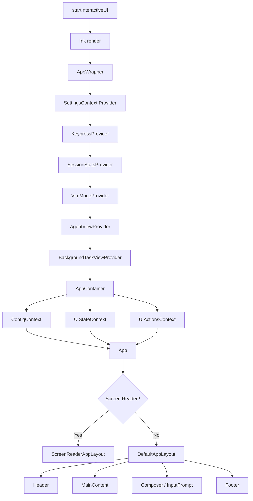
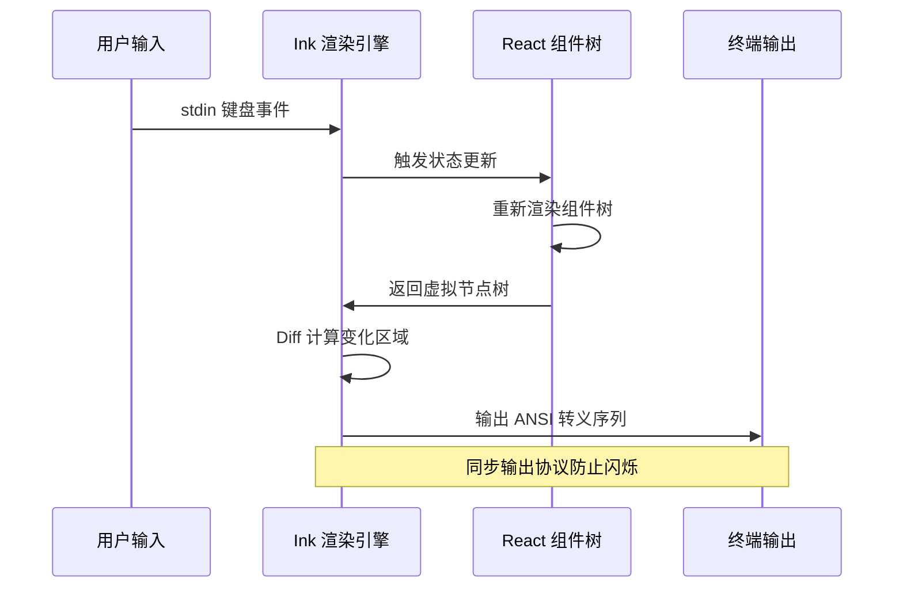

# Day 15: UI 渲染 — Ink 7 框架与终端 React

## 🎯 学习目标

- 理解 Ink 7 如何将 React 组件渲染到终端
- 掌握千问 Code 的 UI 启动流程和组件层次
- 了解 AppContainer 的状态管理架构
- 熟悉主题系统的设计与切换机制

## 📖 核心概念

### 为什么用 React 写终端 UI？

千问 Code 的 TUI（Terminal User Interface）使用 **React 19 + Ink 7** 构建。Ink 是一个将 React 渲染模型映射到终端的框架：

| Web React | Ink（终端）              |
| --------- | ------------------------ |
| `<div>`   | `<Box>`（Flexbox 布局）  |
| `<span>`  | `<Text>`（带样式的文本） |
| DOM 渲染  | ANSI 转义序列输出        |
| CSS       | Flexbox + 颜色属性       |
| 事件系统  | stdin 键盘输入           |

这种架构的优势：

- **声明式 UI**：状态变化自动触发重渲染，无需手动管理 ANSI 光标
- **组件化**：150+ 个 UI 组件可复用、可测试
- **生态复用**：React hooks、Context 等模式直接适用

### 技术栈版本

- React: `^19.2.0`
- Ink: `7.x`（要求 Node.js >= 22）
- 渲染目标：支持 Kitty 键盘协议的现代终端

## 🔍 源码导读

### UI 目录结构

```
packages/cli/src/ui/
├── App.tsx                    # 顶层 App 组件（布局切换）
├── AppContainer.tsx           # 核心状态容器（4500+ 行）
├── startInteractiveUI.tsx     # UI 启动入口
├── components/                # 150+ UI 组件
│   ├── messages/              # 消息展示组件
│   ├── shared/                # 共享组件（ErrorBoundary 等）
│   ├── skills/                # Skill 相关 UI
│   ├── mcp/                   # MCP 服务器 UI
│   └── ...
├── contexts/                  # React Context 定义
├── hooks/                     # 自定义 hooks
├── layouts/                   # 布局组件
├── themes/                    # 主题系统
├── state/                     # 状态管理
└── utils/                     # UI 工具函数
```

### 启动流程：`startInteractiveUI.tsx`

UI 的启动从 `startInteractiveUI()` 函数开始：

```typescript
// packages/cli/src/ui/startInteractiveUI.tsx
import { render } from 'ink';
import React from 'react';
import { AppContainer } from './AppContainer.js';
import { KeypressProvider } from './contexts/KeypressContext.js';
import { SessionStatsProvider } from './contexts/SessionContext.js';
import { SettingsContext } from './contexts/SettingsContext.js';
import { VimModeProvider } from './contexts/VimModeContext.js';

export async function startInteractiveUI(
  config: Config,
  settings: LoadedSettings,
  startupWarnings: string[],
  workspaceRoot: string = process.cwd(),
  initializationResult: InitializationResult,
  options: StartInteractiveUIOptions = {},
) {
  // 1. 安装终端优化（重绘优化 + 同步输出）
  const restoreTerminalRedrawOptimizer = installTerminalRedrawOptimizer(process.stdout);
  const restoreSynchronizedOutput = installSynchronizedOutput(process.stdout);

  // 2. 构建 Provider 嵌套树
  const AppWrapper = () => {
    return (
      <SettingsContext.Provider value={settings}>
        <KeypressProvider config={config}>
          <SessionStatsProvider sessionId={config.getSessionId()}>
            <VimModeProvider settings={settings}>
              <AgentViewProvider config={config}>
                <BackgroundTaskViewProvider config={config}>
                  <AppContainer config={config} settings={settings} />
                </BackgroundTaskViewProvider>
              </AgentViewProvider>
            </VimModeProvider>
          </SessionStatsProvider>
        </KeypressProvider>
      </SettingsContext.Provider>
    );
  };

  // 3. 调用 Ink 的 render() 启动渲染循环
  const { waitUntilExit } = render(<AppWrapper />);
  await waitUntilExit();
}
```

### App 组件：布局切换

`App.tsx` 是顶层组件，负责根据状态选择布局：

```typescript
// packages/cli/src/ui/App.tsx
import { Box, useIsScreenReaderEnabled } from 'ink';

export const App = () => {
  const uiState = useUIState();
  const isScreenReaderEnabled = useIsScreenReaderEnabled();

  if (uiState.quittingMessages) {
    return <QuittingDisplay />;
  }

  // 无障碍模式：使用屏幕阅读器专用布局
  if (isScreenReaderEnabled) {
    return <ScreenReaderAppLayout />;
  }

  // 默认布局
  return <DefaultAppLayout />;
};
```

### AppContainer：状态中枢

`AppContainer.tsx`（4500+ 行）是整个 UI 的状态管理核心：

```typescript
// packages/cli/src/ui/AppContainer.tsx（简化）
export const AppContainer = ({ config, settings, ... }) => {
  // 历史记录状态
  const [historyItems, setHistoryItems] = useState<HistoryItem[]>([]);
  // 流式响应状态
  const [streamingState, setStreamingState] = useState(StreamingState.Idle);
  // 工具调用状态
  const [waitingToolCalls, setWaitingToolCalls] = useState<WaitingToolCall[]>([]);

  // 通过 Context 向下分发状态和操作
  return (
    <ConfigContext.Provider value={config}>
      <UIStateContext.Provider value={uiState}>
        <UIActionsContext.Provider value={uiActions}>
          <App />
        </UIActionsContext.Provider>
      </UIStateContext.Provider>
    </ConfigContext.Provider>
  );
};
```

### 主题系统

主题管理位于 `packages/cli/src/ui/themes/`：

```typescript
// packages/cli/src/ui/themes/theme-manager.ts
class ThemeManager {
  private readonly availableThemes: Theme[];
  private activeTheme: Theme;
  private customThemes: Map<string, Theme> = new Map();

  constructor() {
    this.availableThemes = [
      AyuDark,
      AyuLight,
      AtomOneDark,
      Dracula,
      DefaultLight,
      DefaultDark,
      GitHubDark,
      GitHubLight,
      GoogleCode,
      QwenLight,
      QwenDark,
      ShadesOfPurple,
      XCode,
      ANSI,
      ANSILight,
    ];
  }
}

export const DEFAULT_THEME: Theme = QwenDark;
export const AUTO_THEME_NAME = 'auto';
```

主题支持：

- **15 个内置主题**：包括 QwenDark（默认）、Dracula、GitHub Dark 等
- **自动检测**：`detectTerminalTheme()` 检测终端亮/暗模式
- **自定义主题**：用户可创建 JSON 主题文件
- **语义化颜色**：通过 `semantic-tokens.ts` 定义语义色板

## 🏗️ 架构图（Mermaid）



### 渲染管线



## 💻 动手练习

### 练习 1：追踪一次渲染

1. 启动开发模式：`npm run start`
2. 输入一条消息，观察终端输出
3. 在 `packages/cli/src/ui/App.tsx` 中添加 `console.error` 日志：

```typescript
export const App = () => {
  const uiState = useUIState();
  console.error('[App] render, streaming:', uiState.streamingState);
  // ...
};
```

4. 重新运行，观察每次状态变化触发的渲染次数

### 练习 2：修改主题颜色

1. 打开 `packages/cli/src/ui/themes/qwen-dark.ts`
2. 修改某个语义颜色值（如将 `success` 改为蓝色）
3. 运行 `npm run start`，用 `/theme` 命令切换到 QwenDark
4. 观察颜色变化效果

### 练习 3：阅读组件层次

使用以下命令查看组件导入关系：

```bash
# 查看 AppContainer 引用了哪些 Context
grep -n "Context" packages/cli/src/ui/AppContainer.tsx | head -20

# 查看 components 目录的组件数量
ls packages/cli/src/ui/components/*.tsx | wc -l
```

## ✅ 自检问题（答案折叠）

<details>
<summary>1. Ink 中 <Box> 和 <Text> 分别对应 Web 中的什么元素？</summary>

`<Box>` 对应 `<div>`，使用 Flexbox 布局；`<Text>` 对应 `<span>`，用于渲染带样式的文本。Ink 将它们转换为 ANSI 转义序列输出到终端。

</details>

<details>
<summary>2. startInteractiveUI 中为什么要安装 terminalRedrawOptimizer 和 synchronizedOutput？</summary>

终端渲染存在闪烁问题：逐行输出 ANSI 序列时，用户可能看到中间状态。`synchronizedOutput` 使用终端的同步输出协议（BSU/ESU 序列），让终端缓冲所有输出后一次性刷新。`terminalRedrawOptimizer` 则优化重绘区域，减少不必要的 ANSI 输出。

</details>

<details>
<summary>3. AppContainer 为什么有 4500+ 行？它承担了什么职责？</summary>

AppContainer 是整个 UI 的状态中枢，管理：会话历史记录、流式响应状态、工具调用队列、IDE 集成、会话恢复、 speculation（预测执行）等。它通过多个 Context（UIStateContext、UIActionsContext、ConfigContext）向子组件分发状态和操作回调。

</details>

<details>
<summary>4. 主题系统如何支持"auto"模式？</summary>

当主题设为 `auto` 时，`detectTerminalTheme()` / `detectTerminalThemeAsync()` 会检测终端当前的背景色（亮/暗），然后自动选择对应的亮色或暗色主题。这通过查询终端的 OSC 11 转义序列或环境变量实现。

</details>

## 📚 延伸阅读

- [Ink 官方文档](https://github.com/vadimdemedes/ink) — React for CLIs
- [React 19 新特性](https://react.dev/blog/2024/12/05/react-19) — 理解并发渲染
- `packages/cli/src/ui/contexts/` — 所有 Context 定义
- `packages/cli/src/ui/hooks/` — 自定义 hooks（如 `useKittyKeyboardProtocol`）
- `packages/cli/src/ui/layouts/` — 布局组件实现
