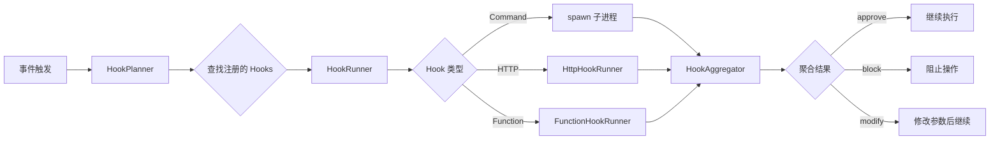
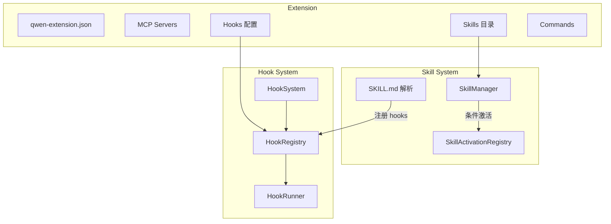

# Day 16: Hooks / Skills / Extensions — 可扩展性三驾马车

## 🎯 学习目标

- 理解 Hook 系统的事件驱动架构和执行管线
- 掌握 Skill 的加载、解析和激活机制
- 了解 Extension 的安装、配置和热重载流程
- 理解三者之间的协作关系

## 📖 核心概念

千问 Code 的可扩展性建立在三个互补的机制上：

| 机制           | 定位             | 触发方式                 | 配置位置               |
| -------------- | ---------------- | ------------------------ | ---------------------- |
| **Hooks**      | 生命周期拦截器   | 事件驱动（自动）         | `settings.json` / 扩展 |
| **Skills**     | 可复用的提示词包 | 用户 `/skill` 或模型调用 | `.qwen/skills/` 目录   |
| **Extensions** | 完整功能包       | 安装后自动加载           | `~/.qwen/extensions/`  |

### Hooks：事件驱动的生命周期钩子

Hooks 允许在关键节点注入自定义逻辑，**无需修改源码**：

```typescript
// packages/core/src/hooks/types.ts
export enum HookEventName {
  PreToolUse = 'PreToolUse', // 工具执行前
  PostToolUse = 'PostToolUse', // 工具执行后
  PostToolUseFailure = 'PostToolUseFailure', // 工具执行失败后
  PostToolBatch = 'PostToolBatch', // 一批工具调用完成后
  UserPromptSubmit = 'UserPromptSubmit', // 用户提交提示词
  UserPromptExpansion = 'UserPromptExpansion', // 斜杠命令展开
  SessionStart = 'SessionStart', // 会话开始
  Stop = 'Stop', // 模型回复结束前
  MessageDisplay = 'MessageDisplay', // 流式输出中
  SubagentStart = 'SubagentStart', // 子代理启动
  SubagentStop = 'SubagentStop', // 子代理结束
  PreCompact = 'PreCompact', // 上下文压缩前
  PostCompact = 'PostCompact', // 上下文压缩后
  SessionEnd = 'SessionEnd', // 会话结束
  PermissionRequest = 'PermissionRequest', // 权限对话框弹出
  PermissionDenied = 'PermissionDenied', // 工具调用被拒绝
  TodoCreated = 'TodoCreated', // Todo 项创建
  TodoCompleted = 'TodoCompleted', // Todo 项完成
  InstructionsLoaded = 'InstructionsLoaded', // 指令文件加载
}
```

Hook 支持三种执行类型：

```typescript
// 命令 Hook：执行 shell 命令
export interface CommandHookConfig {
  type: HookType.Command;
  command: string; // 要执行的命令
  timeout?: number; // 超时（默认 60s）
  env?: Record<string, string>;
  async?: boolean; // 是否异步执行
  shell?: 'bash' | 'powershell';
}

// HTTP Hook：发送 HTTP 请求
export interface HttpHookConfig {
  type: HookType.Http;
  url: string;
  method?: 'GET' | 'POST' | 'PUT';
  headers?: Record<string, string>;
}

// 函数 Hook：执行 JS 回调
export interface FunctionHookConfig {
  type: HookType.Function;
  callback: FunctionHookCallback;
}
```

### Skills：结构化的提示词包

Skill 是一个包含 `SKILL.md` 的目录，用 YAML frontmatter 定义元数据：

```markdown
## <!-- .qwen/skills/my-skill/SKILL.md -->

name: my-skill
description: 一个示例 Skill
allowedTools:

- Bash(git \*)
- Edit
  model: qwen-coder-plus
  argument-hint: <文件路径>
  when_to_use: 当用户需要处理 Markdown 文件时
  paths:
- "\*_/_.md"

---

这里是 Skill 的提示词内容...
当用户调用此 Skill 时，这段文本会注入到系统提示中。
```

Skill 的存储层级：

```typescript
// packages/core/src/skills/types.ts
export type SkillLevel = 'project' | 'user' | 'extension' | 'bundled';
// project:  .qwen/skills/       — 项目级
// user:     ~/.qwen/skills/     — 用户级
// extension: 由扩展提供
// bundled:  内置 Skill
```

### Extensions：完整功能包

Extension 是最重量级的扩展机制，可以包含：

- MCP 服务器配置
- Skills
- Hooks
- 自定义命令
- 子代理配置
- 设置项

## 🔍 源码导读

### Hook 系统架构

```
packages/core/src/hooks/
├── types.ts              # 类型定义（HookEventName, HookConfig 等）
├── hookSystem.ts         # 主协调器（HookSystem 类）
├── hookRegistry.ts       # Hook 注册表
├── hookRunner.ts         # Hook 执行器（Command/HTTP/Function）
├── hookAggregator.ts     # 结果聚合器
├── hookPlanner.ts        # 执行计划生成
├── hookEventHandler.ts   # 事件分发处理
├── sessionHooksManager.ts # 会话级 Hook 管理
├── asyncHookRegistry.ts  # 异步 Hook 注册
├── httpHookRunner.ts     # HTTP Hook 执行
├── functionHookRunner.ts # 函数 Hook 执行
├── promptHookRunner.ts   # 提示词 Hook 执行
├── registerSkillHooks.ts # Skill Hook 注册
├── ssrfGuard.ts          # SSRF 防护
└── urlValidator.ts       # URL 校验
```

`HookSystem` 是核心协调器：

```typescript
// packages/core/src/hooks/hookSystem.ts
export class HookSystem {
  private readonly hookRegistry: HookRegistry;
  private readonly hookRunner: HookRunner;
  private readonly hookAggregator: HookAggregator;
  private readonly hookPlanner: HookPlanner;
  private readonly hookEventHandler: HookEventHandler;
  private readonly sessionHooksManager: SessionHooksManager;

  constructor(config: Config) {
    const allowedHttpUrls = config.getAllowedHttpHookUrls();
    this.hookRegistry = new HookRegistry(config);
    this.hookRunner = new HookRunner(allowedHttpUrls, config);
    this.hookAggregator = new HookAggregator();
    this.hookPlanner = new HookPlanner(this.hookRegistry);
    this.sessionHooksManager = new SessionHooksManager();
    this.hookEventHandler = new HookEventHandler(
      config,
      this.hookPlanner,
      this.hookRunner,
      this.hookAggregator,
    );
  }
}
```

### Skill 管理器

```typescript
// packages/core/src/skills/skill-manager.ts
export class SkillManager {
  private skillsCache: Map<SkillLevel, SkillConfig[]> | null = null;

  // 从目录加载所有 Skill
  // 使用 chokidar 监听文件变化（maxDepth: 2）
  // 支持符号链接（需通过 symlinkScope 验证）
}

// Skill 加载流程（skill-load.ts）：
// 1. 扫描目录下的子目录
// 2. 读取每个子目录的 SKILL.md
// 3. 解析 YAML frontmatter
// 4. 验证 name、paths 等字段
// 5. 构建 SkillConfig 对象
```

### Extension 管理器

```typescript
// packages/core/src/extension/extensionManager.ts
// ExtensionManager 处理：
// - 从 Git/NPM/Archive 安装扩展
// - 解析 qwen-extension.json 配置
// - 变量替换和环境变量注入
// - 启用/禁用扩展
// - 与 Marketplace 交互
```

### 热重载机制

```typescript
// packages/cli/src/config/extension-file-watcher.ts
export class ExtensionFileWatcher {
  // 监听 ~/.qwen/extensions/ 目录变化
  // AUTO_REFRESH_DIRS: commands, skills, agents → 自动刷新
  // STALE_DIRS: hooks → 标记为过期，需重启
}

// packages/cli/src/config/hot-reload.ts
// MCP 热重载：
// - 监听 settings.json 中 mcpServers 配置变化
// - 使用 fast-deep-equal 比较配置差异
// - 自动重连变化的 MCP 服务器
```

## 🏗️ 架构图（Mermaid）

### Hook 执行管线



### 三者协作关系



## 💻 动手练习

### 练习 1：创建一个 PreToolUse Hook

在项目 `.qwen/settings.json` 中添加：

```json
{
  "hooks": {
    "PreToolUse": [
      {
        "type": "command",
        "command": "echo \"Tool: $QWEN_TOOL_NAME\" >> /tmp/hook-log.txt",
        "name": "tool-logger"
      }
    ]
  }
}
```

运行 `npm run start`，执行几个操作后查看 `/tmp/hook-log.txt`。

### 练习 2：创建一个自定义 Skill

```bash
mkdir -p .qwen/skills/hello
cat > .qwen/skills/hello/SKILL.md << 'EOF'
---
name: hello
description: 一个打招呼的示例 Skill
---

当用户调用此 Skill 时，请用中文热情地打招呼，
并介绍你能提供的帮助。
EOF
```

运行 CLI，输入 `/hello` 测试效果。

### 练习 3：观察 Skill 加载过程

```bash
# 启用调试日志
QWEN_DEBUG_LOG_FILE=1 npm run start

# 在另一个终端查看日志
tail -f ~/.qwen/debug/latest
# 搜索 SKILL_MANAGER 标签
```

## ✅ 自检问题（答案折叠）

<details>
<summary>1. Hook 的 PreToolUse 事件可以返回哪些结果？各有什么效果？</summary>

Hook 聚合结果有三种：`approve`（允许工具执行）、`block`（阻止工具执行，向模型返回拒绝信息）、`modify`（修改工具参数后继续执行）。多个 Hook 的结果由 HookAggregator 按优先级聚合。

</details>

<details>
<summary>2. Skill 的 `paths` 字段有什么作用？</summary>

`paths` 定义条件激活的 glob 模式。当 Skill 设置了 `paths` 后，它不会立即出现在模型的可用 Skill 列表中。只有当某次工具调用触及了匹配 `paths` 的文件路径时，该 Skill 才会被激活并加入当前会话的可用列表。这避免了大量条件 Skill 污染系统提示。

</details>

<details>
<summary>3. Extension 中哪些目录支持热重载，哪些需要重启？</summary>

`commands`、`skills`、`agents` 目录支持自动热重载（AUTO_REFRESH_DIRS）——文件变化后立即生效。`hooks` 目录标记为 STALE_DIRS——变化后仅标记为过期状态，需要重启会话才能生效，因为 Hook 注册涉及安全验证。

</details>

<details>
<summary>4. HookRunner 执行命令 Hook 时的默认超时是多少？输出长度限制呢？</summary>

默认超时 60 秒（`DEFAULT_HOOK_TIMEOUT = 60000`）。stdout/stderr 输出最大 1MB（`MAX_OUTPUT_LENGTH = 1024 * 1024`），超出部分被截断，防止内存问题。

</details>

## 📚 延伸阅读

- `packages/core/src/hooks/hookSystem.ts` — Hook 系统主入口
- `packages/core/src/skills/skill-manager.ts` — Skill 管理器
- `packages/core/src/extension/extensionManager.ts` — Extension 管理器
- `packages/cli/src/config/extension-file-watcher.ts` — 文件监听
- `packages/cli/src/config/hot-reload.ts` — MCP 热重载
- 使用 `/extension-creator` 命令可以快速创建扩展脚手架
