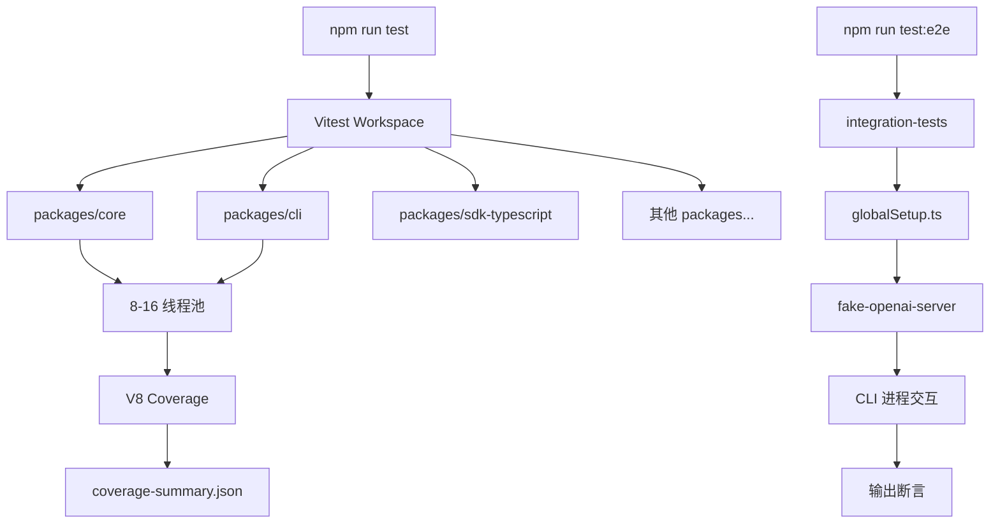
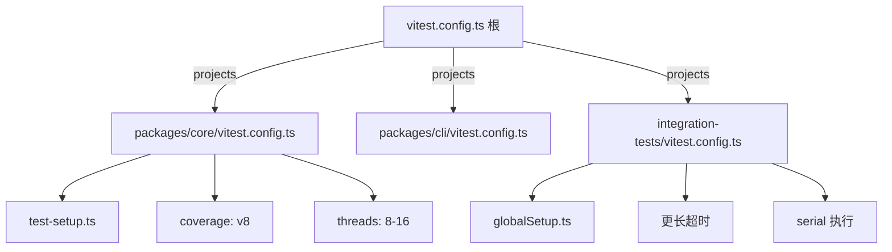

# Day 17: 测试体系 — Vitest 实战

## 🎯 学习目标

- 理解项目的多层测试配置（根 / 包 / 集成）
- 掌握 Vitest 的 mock 策略和常用模式
- 学会为新功能编写单元测试和集成测试
- 了解测试覆盖率要求和 CI 中的测试流程

## 📖 核心概念

### 测试金字塔

千问 Code 的测试分为三层：

| 层级     | 命令                | 位置                          | 用途            |
| -------- | ------------------- | ----------------------------- | --------------- |
| 单元测试 | `npm run test`      | `packages/*/src/**/*.test.ts` | 验证单个函数/类 |
| 集成测试 | `npm run test:e2e`  | `integration-tests/`          | 端到端功能验证  |
| 预检     | `npm run preflight` | 全局                          | 提交前完整检查  |

### Vitest 配置层次

项目使用 Vitest 的 **workspace projects** 模式，根配置声明所有子项目：

```typescript
// vitest.config.ts（根目录）
import { defineConfig } from 'vitest/config';

export default defineConfig({
  test: {
    projects: [
      'packages/cli',
      'packages/core',
      'packages/vscode-ide-companion',
      'packages/sdk-typescript',
      'packages/channels/base',
      'packages/channels/dingtalk',
      'packages/channels/telegram',
      'packages/channels/weixin',
      'packages/channels/qqbot',
      'integration-tests',
      'scripts',
    ],
  },
});
```

每个包有自己的 Vitest 配置：

```typescript
// packages/core/vitest.config.ts
import { defineConfig } from 'vitest/config';

export default defineConfig({
  test: {
    testTimeout: 15000, // CI 环境需要更长超时
    reporters: ['default', 'junit'],
    silent: true,
    setupFiles: ['./test-setup.ts'],
    outputFile: { junit: 'junit.xml' },
    coverage: {
      enabled: true,
      provider: 'v8',
      reportsDirectory: './coverage',
      include: ['src/**/*'],
      reporter: [
        ['text', { file: 'full-text-summary.txt' }],
        'html',
        'json',
        'lcov',
        'cobertura',
        ['json-summary', { outputFile: 'coverage-summary.json' }],
      ],
    },
    poolOptions: {
      threads: {
        minThreads: 8,
        maxThreads: 16,
      },
    },
  },
});
```

## 🔍 源码导读

### 测试文件命名约定

```
packages/core/src/hooks/hookSystem.ts       # 源码
packages/core/src/hooks/hookSystem.test.ts  # 对应测试

packages/cli/src/ui/App.tsx                 # React 组件
packages/cli/src/ui/App.test.tsx            # 组件测试
```

### 集成测试目录结构

```
integration-tests/
├── baselines/              # 基线快照
├── cli/                    # CLI 命令集成测试
├── concurrent-runner/      # 并发运行器
├── fixtures/               # 测试固件
├── hook-integration/       # Hook 集成测试
├── interactive/            # 交互式测试
├── sdk-typescript/         # SDK 测试
├── terminal-bench/         # 终端基准测试
├── terminal-capture/       # 终端捕获
├── fake-openai-server.ts   # 模拟 API 服务器
├── test-helper.ts          # 测试辅助工具
├── test-mcp-server.ts      # 测试 MCP 服务器
├── globalSetup.ts          # 全局 setup
└── vitest.config.ts        # 集成测试配置
```

### Mock 策略

千问 Code 中常用的 mock 模式：

```typescript
// 模式 1：vi.mock 模块级 mock
import { vi, describe, it, expect } from 'vitest';

vi.mock('node:fs', () => ({
  readFileSync: vi.fn().mockReturnValue('mock content'),
  writeFileSync: vi.fn(),
}));

// 模式 2：vi.fn 函数 mock
const mockCallback = vi.fn();
hookSystem.on('PreToolUse', mockCallback);
// ... 触发事件
expect(mockCallback).toHaveBeenCalledWith(expectedArgs);

// 模式 3：vi.spyOn 部分 mock
import * as storage from '../config/storage.js';
const spy = vi.spyOn(storage.Storage, 'getDebugLogPath')
  .mockReturnValue('/tmp/test-debug.log');

// 模式 4：React 组件测试（Ink）
import { render } from 'ink-testing-library';
import { App } from './App.js';

const { lastFrame } = render(<App />);
expect(lastFrame()).toContain('Expected text');
```

### 测试辅助工具

```typescript
// integration-tests/test-helper.ts
// 提供：
// - 临时目录创建/清理
// - 模拟配置生成
// - CLI 进程启动和交互
// - 输出断言辅助
```

### 模拟 API 服务器

```typescript
// integration-tests/fake-openai-server.ts
// 一个轻量级的 OpenAI 兼容 API 模拟器
// 用于集成测试中模拟 LLM 响应
// 支持流式和非流式响应
```

## 🏗️ 架构图（Mermaid）

### 测试执行流程



### 测试配置继承



## 💻 动手练习

### 练习 1：运行单个测试文件

```bash
# 运行 hook 系统的测试
npx vitest run packages/core/src/hooks/hookSystem.test.ts

# 运行带覆盖率
npx vitest run packages/core/src/hooks/hookSystem.test.ts --coverage

# watch 模式（开发时）
npx vitest packages/core/src/hooks/hookSystem.test.ts
```

### 练习 2：为一个工具函数写测试

在 `packages/core/src/utils/` 中找一个简单的工具函数，为它写测试：

```typescript
// packages/core/src/utils/myUtil.test.ts
import { describe, it, expect } from 'vitest';
import { myFunction } from './myUtil.js';

describe('myFunction', () => {
  it('should handle normal input', () => {
    expect(myFunction('input')).toBe('expected');
  });

  it('should handle edge case', () => {
    expect(myFunction('')).toBe('');
  });

  it('should throw on invalid input', () => {
    expect(() => myFunction(null)).toThrow();
  });
});
```

### 练习 3：使用 mock 隔离依赖

```typescript
import { vi, describe, it, expect, beforeEach } from 'vitest';

// mock 文件系统
vi.mock('node:fs/promises', () => ({
  readFile: vi.fn(),
  writeFile: vi.fn(),
  mkdir: vi.fn(),
}));

import { readFile } from 'node:fs/promises';
import { loadConfig } from './config.js';

describe('loadConfig', () => {
  beforeEach(() => {
    vi.clearAllMocks();
  });

  it('should parse JSON config', async () => {
    vi.mocked(readFile).mockResolvedValue('{"key": "value"}');
    const config = await loadConfig('/path/to/config.json');
    expect(config).toEqual({ key: 'value' });
  });

  it('should handle missing file gracefully', async () => {
    vi.mocked(readFile).mockRejectedValue(new Error('ENOENT'));
    const config = await loadConfig('/nonexistent');
    expect(config).toEqual({});
  });
});
```

### 练习 4：运行完整预检

```bash
# 提交前必须通过的完整检查
npm run preflight
# 等价于：clean + ci + format + lint + build + typecheck + test
```

## ✅ 自检问题（答案折叠）

<details>
<summary>1. 为什么 packages/core 的 testTimeout 设为 15000ms 而不是 Vitest 默认的 5000ms？</summary>

CI 使用自托管 runner，线程池配置为 8-16 线程（`maxThreads: 16`），高并发下 I/O 密集型测试（如 WASM 加载、tar 解压）可能因资源竞争超过 5s。这不是逻辑错误，而是环境压力，所以提高超时上限。断言失败仍然立即报错。

</details>

<details>
<summary>2. vi.mock 和 vi.spyOn 的区别是什么？什么时候用哪个？</summary>

`vi.mock` 替换整个模块——适合隔离外部依赖（fs、网络）。它在模块加载前生效，所有导入该模块的代码都拿到 mock 版本。`vi.spyOn` 只替换对象上的单个方法——适合部分 mock（保留其他方法的真实行为）。spyOn 可以在测试后通过 `mockRestore()` 恢复原始实现。

</details>

<details>
<summary>3. 集成测试中的 fake-openai-server 起什么作用？</summary>

它模拟 OpenAI 兼容的 API 端点，让集成测试无需真实 API key 和网络请求。测试可以预设固定的 LLM 响应（包括流式 SSE），验证 CLI 的完整交互流程：输入 → API 调用 → 响应解析 → UI 渲染 → 工具执行。

</details>

<details>
<summary>4. npm run preflight 包含哪些步骤？为什么提交前必须运行？</summary>

preflight 依次执行：clean（清理产物）→ ci（安装依赖）→ format（Prettier 格式化）→ lint（ESLint 检查）→ build（编译）→ typecheck（tsc 类型检查）→ test（单元测试）。它确保代码在 CI 中不会因为格式、类型或测试问题而失败，避免浪费 CI 资源和 review 时间。

</details>

## 📚 延伸阅读

- [Vitest 官方文档](https://vitest.dev/) — API 参考
- `integration-tests/test-helper.ts` — 集成测试辅助工具
- `docs/developers/development/integration-tests.md` — 集成测试详细文档
- `packages/core/test-setup.ts` — 全局测试 setup
- `packages/cli/vitest.config.ts` — CLI 包测试配置
