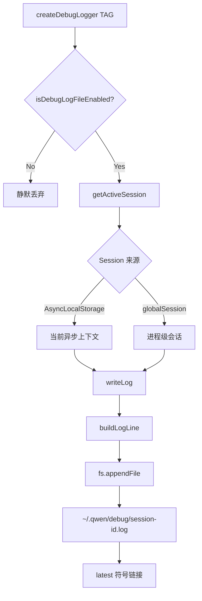
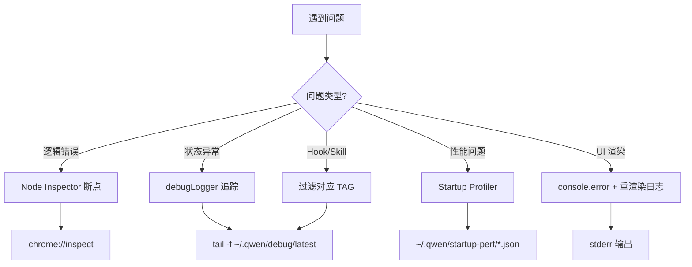

# Day 18: 调试技巧 — Debug 模式与性能分析

## 🎯 学习目标

- 掌握 debugLogger 的使用方法和日志查看
- 学会使用 Node.js inspector 进行断点调试
- 了解 startup profiler 的性能分析能力
- 建立系统化的调试思路

## 📖 核心概念

### 调试工具全景

千问 Code 提供了多层次的调试手段：

| 工具             | 激活方式                      | 用途                      |
| ---------------- | ----------------------------- | ------------------------- |
| debugLogger      | `QWEN_DEBUG_LOG_FILE=1`       | 结构化日志（最常用）      |
| Node Inspector   | `npm run debug`               | 断点调试（--inspect-brk） |
| Startup Profiler | `QWEN_CODE_PROFILE_STARTUP=1` | 启动性能分析              |
| Debug Mode UI    | 设置中开启                    | UI 层调试信息             |
| stderr 输出      | `console.error()`             | 不干扰 TUI 的快速日志     |

### 为什么不能用 console.log？

千问 Code 是终端 TUI 应用，stdout 被 Ink 用于渲染。如果使用 `console.log()`，输出会**破坏 UI 渲染**。正确的做法：

- **结构化日志** → `createDebugLogger('TAG')`
- **快速调试** → `console.error()`（输出到 stderr，不影响 TUI）
- **断点** → Node Inspector

## 🔍 源码导读

### debugLogger 系统

```typescript
// packages/core/src/utils/debugLogger.ts

// 日志格式：
// 2026-01-23T06:58:02.011Z [DEBUG] [TAG] [trace_id=xxx span_id=yyy] message

export interface DebugLogger {
  isEnabled: () => boolean;
  debug: (...args: unknown[]) => void;
  info: (...args: unknown[]) => void;
  warn: (...args: unknown[]) => void;
  error: (...args: unknown[]) => void;
}

export function createDebugLogger(tag?: string): DebugLogger {
  return {
    isEnabled: () => getActiveSession() !== null,
    debug: (...args: unknown[]) => {
      const session = getActiveSession();
      if (!session) return;
      writeLog(session, 'DEBUG', tag, args);
    },
    // ... info, warn, error 类似
  };
}
```

关键设计：

- **按会话隔离**：每个会话有独立的日志文件
- **AsyncLocalStorage**：支持异步上下文中的会话绑定
- **Best-effort 写入**：日志写入失败不会阻塞主流程
- **latest 符号链接**：`~/.qwen/debug/latest` 始终指向最新日志

### 日志激活与查看

```typescript
// 激活条件
export function isDebugLogFileEnabled(): boolean {
  const value = process.env['QWEN_DEBUG_LOG_FILE'];
  if (!value) return false;
  const normalized = value.trim().toLowerCase();
  return !['', '0', 'false', 'off', 'no'].includes(normalized);
}
```

```bash
# 激活调试日志
QWEN_DEBUG_LOG_FILE=1 npm run start

# 实时查看日志（另一个终端）
tail -f ~/.qwen/debug/latest

# 按标签过滤
tail -f ~/.qwen/debug/latest | grep '\[SKILL_MANAGER\]'
tail -f ~/.qwen/debug/latest | grep '\[TRUSTED_HOOKS\]'

# 查看特定会话的日志
ls ~/.qwen/debug/
cat ~/.qwen/debug/<session-id>.log
```

### 在源码中使用 debugLogger

```typescript
// 任何模块中都可以创建 logger
import { createDebugLogger } from '../utils/debugLogger.js';

const debugLogger = createDebugLogger('MY_MODULE');

export function myFunction(input: string) {
  debugLogger.debug('Processing input:', input);

  try {
    const result = doWork(input);
    debugLogger.info('Success, result length:', result.length);
    return result;
  } catch (err) {
    debugLogger.error('Failed:', err);
    throw err;
  }
}
```

### Startup Profiler

```typescript
// packages/cli/src/utils/startupProfiler.ts

// 激活：QWEN_CODE_PROFILE_STARTUP=1
// 输出：~/.qwen/startup-perf/ 目录下的 JSON 报告

// API：
initStartupProfiler(); // 记录 T0
profileCheckpoint('name'); // 阶段边界（顺序）
recordStartupEvent('name', attrs); // 离散事件（可多次）
finalizeStartupProfile(id); // 写入报告

// 报告结构：
export interface StartupPhase {
  name: string;
  startMs: number; // 相对 T0 的开始时间
  durationMs: number; // 持续时间
  heapUsedMb?: number; // 堆内存使用
}
```

### Node Inspector 调试

```bash
# 方式 1：使用内置 debug 脚本
npm run debug
# 等价于 node --inspect-brk ...

# 方式 2：手动启动
node --inspect-brk ./scripts/start.js

# 然后在 Chrome 打开 chrome://inspect
# 或 VS Code 的 "Attach to Node Process"
```

VS Code 调试配置（`.vscode/launch.json`）：

```json
{
  "version": "0.2.0",
  "configurations": [
    {
      "name": "Debug Qwen Code",
      "type": "node",
      "request": "launch",
      "runtimeExecutable": "node",
      "runtimeArgs": ["--inspect-brk", "./scripts/start.js"],
      "console": "integratedTerminal",
      "skipFiles": ["<node_internals>/**"]
    },
    {
      "name": "Attach to Process",
      "type": "node",
      "request": "attach",
      "port": 9229
    }
  ]
}
```

### 常用调试标签

源码中已定义的 debugLogger 标签：

| 标签                     | 模块                   | 用途       |
| ------------------------ | ---------------------- | ---------- |
| `STARTUP`                | startInteractiveUI     | 启动流程   |
| `THEME_MANAGER`          | theme-manager          | 主题切换   |
| `TRUSTED_HOOKS`          | hookSystem/hookRunner  | Hook 执行  |
| `SKILL_MANAGER`          | skill-manager          | Skill 加载 |
| `SKILL_LOAD`             | skill-load             | Skill 解析 |
| `EXTENSION_FILE_WATCHER` | extension-file-watcher | 扩展监听   |
| `MCP_HOT_RELOAD`         | hot-reload             | MCP 热重载 |

## 🏗️ 架构图（Mermaid）

### 调试日志系统



### 调试决策流程



## 💻 动手练习

### 练习 1：追踪 Skill 加载

```bash
# 终端 1：启动带日志的 CLI
QWEN_DEBUG_LOG_FILE=1 npm run start

# 终端 2：实时查看 Skill 相关日志
tail -f ~/.qwen/debug/latest | grep -E '\[SKILL'
```

在 CLI 中执行 `/skills` 命令，观察日志输出。

### 练习 2：使用 Inspector 断点

1. 在 `packages/core/src/skills/skill-load.ts` 的 `loadSkillsFromDir` 函数中设置断点
2. 启动：`node --inspect-brk ./scripts/start.js`
3. 打开 `chrome://inspect`，点击 "inspect"
4. 在 Sources 面板找到对应文件，设置断点
5. 在 CLI 中触发 Skill 加载，观察变量状态

### 练习 3：分析启动性能

```bash
# 生成启动性能报告
QWEN_CODE_PROFILE_STARTUP=1 npm run start

# 退出后查看报告
ls ~/.qwen/startup-perf/
cat ~/.qwen/startup-perf/*.json | python3 -m json.tool

# 关注：
# - 哪个阶段耗时最长？
# - 堆内存使用是否合理？
```

### 练习 4：添加自定义调试日志

在任意模块中添加：

```typescript
import { createDebugLogger } from '@qwen-code/qwen-code-core';
const debugLogger = createDebugLogger('MY_DEBUG');

// 在关键路径添加
debugLogger.debug('State transition:', { from, to, reason });
```

然后：

```bash
QWEN_DEBUG_LOG_FILE=1 npm run start
# 另一终端
tail -f ~/.qwen/debug/latest | grep '\[MY_DEBUG\]'
```

## ✅ 自检问题（答案折叠）

<details>
<summary>1. 为什么 debugLogger 使用 "best-effort" 写入策略？</summary>

debugLogger 有 1050+ 个调用点，默认启用，是 fire-and-forget 的诊断输出。如果每次写入都 fsync，会造成持续的 I/O 压力和 SSD 磨损。丢失崩溃前最后几百毫秒的调试输出是可接受的。模块通过 `hasWriteFailure` 标志追踪写入失败，UI 可在启动时显示降级通知。

</details>

<details>
<summary>2. AsyncLocalStorage 在 debugLogger 中解决什么问题？</summary>

千问 Code 支持多会话（如子代理）。AsyncLocalStorage 让每个异步执行上下文可以绑定独立的 session，这样不同会话的日志写入各自的文件，不会混淆。没有绑定上下文时，回退到进程级的 globalSession。

</details>

<details>
<summary>3. QWEN_CODE_PROFILE_STARTUP 和 QWEN_CODE_PROFILE_STARTUP_OUTER 的区别？</summary>

默认情况下 profiler 在沙箱子进程中运行（避免重复报告）。`qwen serve` 没有沙箱子进程，所以直接 profile。设置 `QWEN_CODE_PROFILE_STARTUP_OUTER=1` 可以额外 profile 外层（沙箱前）进程，报告文件名带 `outer-` 前缀以区分。

</details>

<details>
<summary>4. 调试 TUI 应用时为什么不能用 console.log？应该用什么替代？</summary>

Ink 使用 stdout 渲染 UI 帧。`console.log()` 的输出会混入 ANSI 渲染序列中，破坏显示。替代方案：`console.error()`（stderr 不被 Ink 占用）、`createDebugLogger()`（写入文件）、或 Node Inspector（完全不影响输出流）。

</details>

## 📚 延伸阅读

- `packages/core/src/utils/debugLogger.ts` — 日志系统完整实现
- `packages/cli/src/utils/startupProfiler.ts` — 启动性能分析器
- [Node.js Inspector 文档](https://nodejs.org/api/debugger.html)
- [Chrome DevTools 远程调试](https://developer.chrome.com/docs/devtools/)
- `packages/cli/src/ui/components/DebugProfiler.tsx` — UI 层调试组件
- `packages/cli/src/ui/components/DebugModeNotification.tsx` — 调试模式通知
