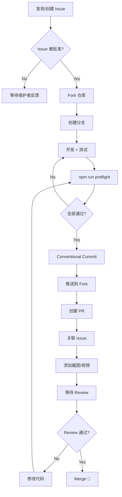
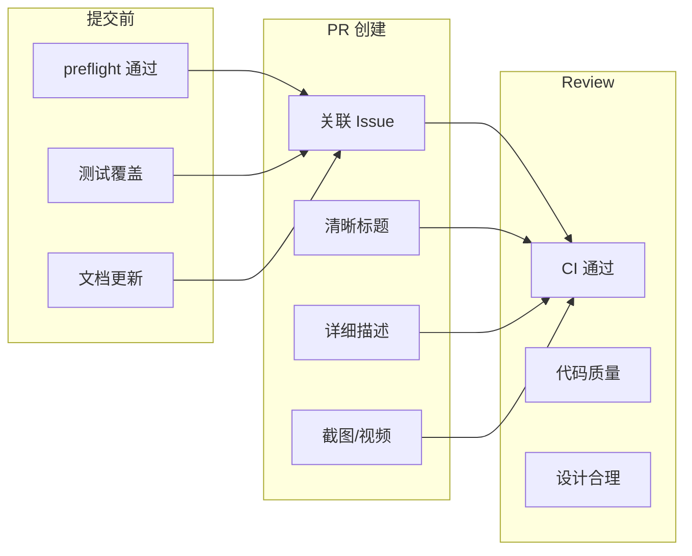

# Day 19: 贡献流程 — 从 Fork 到 Merge

## 🎯 学习目标

- 掌握完整的贡献流程（Issue → Branch → PR → Review → Merge）
- 理解 Conventional Commits 规范
- 学会使用 preflight 确保代码质量
- 了解 Code Review 的要点和最佳实践

## 📖 核心概念

### 贡献流程概览

```
1. 找到/创建 Issue → 2. Fork & Branch → 3. 开发 → 4. 自检
→ 5. 提交（Conventional Commits）→ 6. 推送 & 创建 PR
→ 7. Code Review → 8. 修改 → 9. Merge
```

### PR 指南核心规则

来自 `CONTRIBUTING.md` 的关键要求：

| 规则                 | 说明                                 |
| -------------------- | ------------------------------------ |
| 关联 Issue           | 每个 PR 必须关联已有 Issue           |
| 小而聚焦             | < 1200 行变更；> 2000 行需拆分或解释 |
| Draft PR             | WIP 使用 Draft 状态                  |
| 通过检查             | `npm run preflight` 全部通过         |
| 更新文档             | 用户可见变更需更新 `/docs`           |
| 截图/视频            | 附带 demo 加速 review                |
| Conventional Commits | 规范的提交消息                       |

### Conventional Commits 格式

```
<type>(<scope>): <description>

[optional body]

[optional footer(s)]
```

常用 type：

| Type       | 用途     | 示例                                                   |
| ---------- | -------- | ------------------------------------------------------ |
| `feat`     | 新功能   | `feat(cli): add --json flag to config get`             |
| `fix`      | Bug 修复 | `fix(core): resolve race condition in hook runner`     |
| `refactor` | 重构     | `refactor(ui): extract theme logic to separate module` |
| `docs`     | 文档     | `docs: update contribution guide`                      |
| `test`     | 测试     | `test(hooks): add edge case for async hooks`           |
| `chore`    | 杂务     | `chore: bump dependencies`                             |
| `perf`     | 性能     | `perf(core): cache skill loading results`              |

## 🔍 源码导读

### 开发环境搭建

```bash
# 1. Fork 并克隆
git clone https://github.com/<your-name>/qwen-code.git
cd qwen-code

# 2. 安装依赖（Node.js >= 22）
npm install

# 3. 构建
npm run build

# 4. 运行
npm run start

# 5. 链接到全局（可选）
npm link ./packages/cli
```

### Preflight 检查

```bash
npm run preflight
```

这个命令依次执行：

```
clean → ci → format → lint → build → typecheck → test
```

各步骤对应的命令：

| 步骤      | 命令             | 作用                           |
| --------- | ---------------- | ------------------------------ |
| format    | `npm run format` | Prettier 格式化                |
| lint      | `npm run lint`   | ESLint 检查                    |
| build     | `npm run build`  | TypeScript 编译 + esbuild 打包 |
| typecheck | `tsc --noEmit`   | 类型检查                       |
| test      | `npm run test`   | Vitest 单元测试                |

### 推荐的 Git Pre-commit Hook

```bash
# 创建 .git/hooks/pre-commit
echo '
if ! npm run preflight; then
  echo "npm build failed. Commit aborted."
  exit 1
fi
' > .git/hooks/pre-commit && chmod +x .git/hooks/pre-commit
```

### 代码规范

**格式化**（`.prettierrc.json`）：

- 使用 Prettier 统一格式
- 提交前自动检查

**Lint**（`eslint.config.js`）：

- ESLint 9 flat config
- 包间导入限制（不能跨包相对导入）
- TypeScript 严格模式

**导入规范**：

```typescript
// ✅ 正确：使用包名导入
import { Config } from '@qwen-code/qwen-code-core';

// ❌ 错误：跨包相对导入
import { Config } from '../../core/src/config/config.js';
```

### 项目结构约定

```
packages/
├── cli/          # CLI 界面层
├── core/         # 核心逻辑层
docs/             # 文档
scripts/          # 构建/工具脚本
integration-tests/ # 集成测试
```

## 🏗️ 架构图（Mermaid）

### 贡献流程



### PR 检查清单



## 💻 动手练习

### 练习 1：模拟完整贡献流程

```bash
# 1. 创建功能分支（从 main）
git checkout main && git pull
git checkout -b feat/my-awesome-feature

# 2. 做一个小改动（如修复一个 typo）
# 编辑文件...

# 3. 运行预检
npm run preflight

# 4. 提交（Conventional Commits）
git add -A
git commit -m "fix(docs): correct typo in learning guide"

# 5. 查看提交历史
git log --oneline -5
```

### 练习 2：练习 Conventional Commits

为以下场景写出规范的 commit message：

1. 给 CLI 添加了一个 `--verbose` 标志
2. 修复了 Hook 超时后进程未清理的 bug
3. 重构了主题管理器的初始化逻辑
4. 为 Skill 加载器添加了边界测试

<details>
<summary>参考答案</summary>

```
feat(cli): add --verbose flag for detailed output

fix(hooks): clean up child process on hook timeout

refactor(themes): restructure theme manager initialization

test(skills): add boundary cases for skill loader
```

</details>

### 练习 3：配置自动格式化

确保编辑器集成 Prettier：

```json
// .vscode/settings.json
{
  "editor.formatOnSave": true,
  "editor.defaultFormatter": "esbenp.prettier-vscode",
  "[typescript]": {
    "editor.defaultFormatter": "esbenp.prettier-vscode"
  }
}
```

### 练习 4：阅读一个真实 PR

1. 访问项目的 GitHub PR 列表
2. 找一个已合并的 `feat` 或 `fix` PR
3. 观察：
   - PR 标题格式
   - 描述中如何关联 Issue
   - Review 评论的关注点
   - CI 检查项

## ✅ 自检问题（答案折叠）

<details>
<summary>1. 为什么要求 PR 关联已有 Issue？</summary>

确保每个变更都经过讨论且与项目目标一致。避免：(1) 重复工作（别人已在做同样的事）；(2) 方向偏差（维护者不会接受未经讨论的设计）；(3) 缺乏上下文（reviewer 需要理解 "为什么" 而不仅是 "做了什么"）。

</details>

<details>
<summary>2. PR 超过 1200 行应该怎么办？</summary>

优先拆分为多个逻辑独立的小 PR，每个可以独立 review 和 merge。如果变更确实需要一起落地（如接口变更影响多个文件），在 PR 描述中解释为什么不能拆分，并按逻辑分 commit 方便逐 commit review。

</details>

<details>
<summary>3. npm run preflight 失败了怎么定位问题？</summary>

逐步运行各子命令定位：`npm run format`（格式问题）→ `npm run lint`（lint 错误）→ `npm run build`（编译错误）→ `npx tsc --noEmit`（类型错误）→ `npm run test`（测试失败）。通常格式和 lint 问题可以自动修复：`npm run format -- --write`。

</details>

<details>
<summary>4. Draft PR 和正式 PR 的区别？什么时候用 Draft？</summary>

Draft PR 不会触发 review 请求，表示 "还在做，但想让人看到进展"。适用场景：(1) 大功能需要分多天完成；(2) 想尽早获得方向性反馈；(3) 需要 CI 验证但不想占用 reviewer 时间。准备好后点击 "Ready for review" 转为正式 PR。

</details>

## 📚 延伸阅读

- `CONTRIBUTING.md` — 完整贡献指南
- [Conventional Commits 规范](https://www.conventionalcommits.org/)
- [GitHub PR 文档](https://docs.github.com/articles/about-pull-requests)
- `.prettierrc.json` — 格式化配置
- `eslint.config.js` — Lint 规则
- `AGENTS.md` — AI Agent 协作规范
