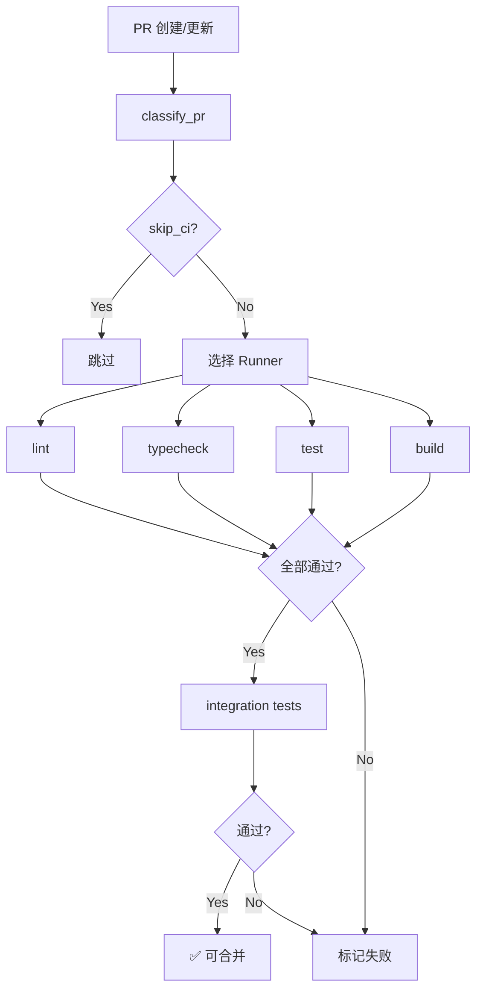
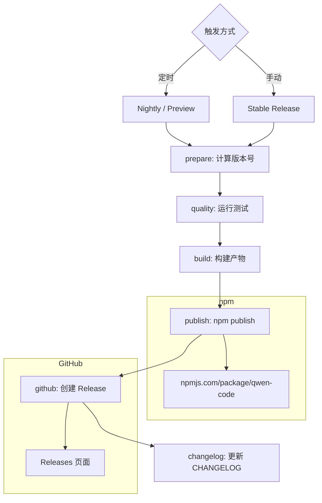
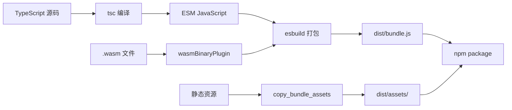

# Day 20: CI/CD — GitHub Actions 与发布管线

## 🎯 学习目标

- 理解 CI 工作流的触发条件和 Job 结构
- 掌握构建管线（esbuild 打包）的工作方式
- 了解发布流程（nightly / preview / stable）
- 熟悉版本管理和 Changelog 生成

## 📖 核心概念

### CI/CD 全景

千问 Code 使用 GitHub Actions 管理完整的 CI/CD 管线：

| 工作流          | 文件                  | 触发条件         |
| --------------- | --------------------- | ---------------- |
| CI              | `ci.yml`              | PR / merge_group |
| Release         | `release.yml`         | 定时 / 手动      |
| E2E             | `e2e.yml`             | PR（部分）       |
| CodeQL          | `codeql.yml`          | 定时安全扫描     |
| Desktop Release | `desktop-release.yml` | 桌面版发布       |
| SDK Release     | `release-sdk.yml`     | SDK 发布         |

### CI 触发策略

```yaml
# .github/workflows/ci.yml
on:
  pull_request:
    branches: ['main', 'release/**']
  merge_group: # Merge Queue 验证
  workflow_dispatch: # 手动触发
```

关键设计：

- **无 push 触发**：所有 Job 都绑定 PR / merge_group，避免重复运行
- **Merge Queue**：合并前验证合并后的树，确保 main 始终绿色
- **并发控制**：同一 PR 的新推送自动取消旧的运行

### 构建系统

项目使用 **esbuild** 进行打包：

```javascript
// esbuild.config.js（关键配置）
import { wasmLoader } from 'esbuild-plugin-wasm';

// 特殊插件：
// 1. wasmBinaryPlugin — 将 .wasm?binary 导入内联为 Uint8Array
// 2. sdkNodeExporterStub — 替换 OTEL exporter 避免打包膨胀

// 构建产物：dist/ 目录
```

构建脚本层次：

| 脚本                                | 用途                     |
| ----------------------------------- | ------------------------ |
| `scripts/build.js`                  | 构建编排（调用各包构建） |
| `scripts/build_package.js`          | 单包构建                 |
| `scripts/copy_bundle_assets.js`     | 复制静态资源到 dist      |
| `scripts/build_sandbox.js`          | 沙箱容器构建             |
| `scripts/build_vscode_companion.js` | VS Code 扩展构建         |

## 🔍 源码导读

### CI 工作流结构

```yaml
# .github/workflows/ci.yml（简化）
jobs:
  classify_pr:
    # 分类 PR：判断是否跳过 CI、选择 runner
    outputs:
      skip_ci: ...
      ubuntu_runner: ...

  # 核心检查 Job（并行运行）
  lint:
    # ESLint + Prettier 检查

  typecheck:
    # tsc --noEmit

  test:
    # Vitest 单元测试 + 覆盖率

  build:
    # esbuild 打包验证

  integration:
    # 集成测试（需要 API key）
```

Runner 策略：

- **自托管 ECS**：仓库内 PR 和 merge queue 使用自托管 runner（更快）
- **GitHub Hosted**：外部贡献者 PR 使用 `ubuntu-latest`
- **Kill Switch**：`MAINTAINER_ECS_RUNNER_DISABLED` 变量可回退到 hosted

### Release 工作流

```yaml
# .github/workflows/release.yml
on:
  schedule:
    - cron: '0 0 * * *' # 每天 UTC 0:00 → nightly
    - cron: '59 23 * * 2' # 每周二 UTC 23:59 → preview
  workflow_dispatch:
    inputs:
      version: ... # 手动指定版本
      dry_run: ... # 干跑模式
      create_nightly_release: ...
      create_preview_release: ...
```

发布类型：

| 类型    | 频率   | npm tag   | 示例版本                 |
| ------- | ------ | --------- | ------------------------ |
| Nightly | 每天   | `nightly` | `0.5.0-nightly.20260727` |
| Preview | 每周二 | `preview` | `0.5.0-preview.0`        |
| Stable  | 手动   | `latest`  | `0.5.0`                  |

### 版本管理

```javascript
// scripts/version.js
// 用法：npm run version <version>
// 例如：npm run version patch | minor | major | 1.2.3

// 流程：
// 1. 解析版本参数
// 2. npm version <type> --no-git-tag-version
// 3. 同步所有 workspace 包的版本
//    （排除 @qwen-code/sdk 和 @qwen-code/mobile-mcp）
// 4. 生成原子提交
```

### Changelog 生成

```javascript
// scripts/generate-changelog.js
// 基于 Conventional Commits 自动生成 CHANGELOG.md
// 按 type 分组：Features / Bug Fixes / Performance / ...
```

### 构建命令对照

```bash
# 开发构建（不含沙箱和 VS Code）
npm run build

# 全量构建（含沙箱 + VS Code 扩展）
npm run build:all

# esbuild 打包
npm run bundle

# 清理构建产物
npm run clean
```

## 🏗️ 架构图（Mermaid）

### CI 管线



### 发布管线



### 构建产物



## 💻 动手练习

### 练习 1：本地模拟 CI 检查

```bash
# 运行与 CI 相同的检查序列
npm run lint
npm run format -- --check
npx tsc --noEmit
npm run build
npm run test

# 或者一步到位
npm run preflight
```

### 练习 2：观察构建产物

```bash
# 执行构建
npm run build

# 查看产物
ls -la packages/cli/dist/
ls -la packages/core/dist/

# 查看 bundle 大小
du -sh packages/cli/dist/

# 查看 esbuild 配置
cat esbuild.config.js
```

### 练习 3：理解版本管理

```bash
# 查看当前版本
node -e "console.log(require('./package.json').version)"

# 查看所有 workspace 版本
npm ls --workspaces --depth=0

# 模拟版本升级（不实际执行）
npm version patch --no-git-tag-version --dry-run
```

### 练习 4：阅读 CI 工作流

```bash
# 列出所有工作流
ls .github/workflows/

# 查看 CI 工作流的 Job 列表
grep -E '^\s+\w+:' .github/workflows/ci.yml | head -20

# 查看 Release 工作流的触发条件
head -30 .github/workflows/release.yml
```

## ✅ 自检问题（答案折叠）

<details>
<summary>1. 为什么 CI 不设置 push 触发？</summary>

所有 Job 都绑定到 `pull_request` 和 `merge_group`。push 到 main 的事件不再需要运行 CI，因为 Merge Queue 已经在合并前验证了合并后的树。这避免了同一变更被 CI 运行两次（一次 PR，一次 push），节省计算资源。

</details>

<details>
<summary>2. esbuild 相比 webpack/tsc 有什么优势？为什么选择它？</summary>

esbuild 用 Go 编写，打包速度比 webpack 快 10-100x。对于 CLI 工具：(1) 启动快——开发者 `npm run build` 几秒完成；(2) 单文件输出——减少 node_modules 依赖；(3) 支持 tree-shaking——减小发布包体积。tsc 仍用于类型检查（`--noEmit`），但不承担打包职责。

</details>

<details>
<summary>3. Nightly、Preview、Stable 三种发布有什么区别？</summary>

Nightly 每天自动从 main 发布，npm tag 为 `nightly`，用于内部测试和早期用户。Preview 每周二发布，tag 为 `preview`，经过一周 nightly 验证后更稳定。Stable 手动触发，tag 为 `latest`，是面向所有用户的正式版本。三者共享同一套构建和测试流程，区别在于频率和稳定性保证。

</details>

<details>
<summary>4. scripts/version.js 为什么排除 @qwen-code/sdk 和 @qwen-code/mobile-mcp？</summary>

这两个包有独立的版本管理策略。SDK 可能遵循自己的语义化版本节奏（与 CLI 不同步），mobile-mcp 也是独立维护的。将它们排除避免 CLI 的版本升级意外覆盖这些包的版本号。

</details>

## 📚 延伸阅读

- `.github/workflows/ci.yml` — CI 工作流完整定义
- `.github/workflows/release.yml` — 发布工作流
- `esbuild.config.js` — 打包配置
- `scripts/version.js` — 版本管理脚本
- `scripts/generate-changelog.js` — Changelog 生成
- `scripts/build.js` — 构建编排
- [GitHub Actions 文档](https://docs.github.com/actions)
- [esbuild 官方文档](https://esbuild.github.io/)
