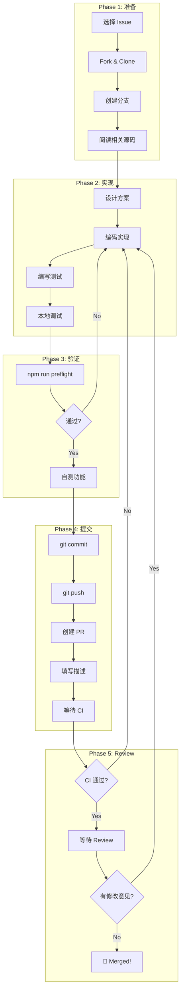

# Day 21: 毕业项目 — 从 Issue 到 PR 的完整实战

## 🎯 学习目标

- 独立完成一个小型 feature 的全流程开发
- 将前 20 天所学串联为完整的工程实践
- 产出一个可提交的高质量 PR
- 建立独立贡献开源项目的信心

## 📖 核心概念

### 毕业项目要求

你需要完成以下完整流程：

```
选择/创建 Issue → 设计方案 → 编码实现 → 编写测试
→ 本地验证 → 提交 PR → 响应 Review
```

### 推荐的 Feature 方向

选择一个 **小而完整** 的改进（100-400 行变更）：

| 方向      | 示例                         | 涉及模块                          |
| --------- | ---------------------------- | --------------------------------- |
| 新 Skill  | 添加一个代码审查 Skill       | `packages/core/src/skills/`       |
| Hook 增强 | 为 PostToolUse 添加通知 Hook | `packages/core/src/hooks/`        |
| UI 改进   | 优化某个组件的显示           | `packages/cli/src/ui/components/` |
| 工具函数  | 添加/改进一个 utility        | `packages/core/src/utils/`        |
| 文档工具  | 添加一个文档生成脚本         | `scripts/`                        |
| 测试补充  | 为缺少覆盖的模块补测试       | 各包 `*.test.ts`                  |

### 评估标准

| 维度     | 要求                  |
| -------- | --------------------- |
| 功能正确 | 实现符合 Issue 描述   |
| 测试覆盖 | 新功能有对应测试      |
| 代码质量 | 通过 lint + typecheck |
| 提交规范 | Conventional Commits  |
| PR 质量  | 清晰描述 + 关联 Issue |

## 🔍 源码导读

### 关键路径回顾

根据你选择的方向，需要熟悉的代码路径：

**如果做 Skill：**

```
packages/core/src/skills/types.ts        → SkillConfig 接口
packages/core/src/skills/skill-load.ts   → 加载和解析逻辑
packages/core/src/skills/skill-manager.ts → 管理器（缓存、监听）
packages/core/src/skills/bundled/        → 内置 Skill 示例
```

**如果做 Hook：**

```
packages/core/src/hooks/types.ts         → HookEventName 枚举
packages/core/src/hooks/hookSystem.ts    → 主协调器
packages/core/src/hooks/hookRunner.ts    → 执行器
packages/core/src/hooks/hookRegistry.ts  → 注册表
```

**如果做 UI：**

```
packages/cli/src/ui/components/          → 组件目录
packages/cli/src/ui/contexts/            → Context 定义
packages/cli/src/ui/themes/              → 主题颜色
packages/cli/src/ui/App.tsx              → 顶层组件
```

## 🏗️ 架构图（Mermaid）

### 完整开发流程



## 💻 完整 Step-by-Step Checklist

### Phase 1：准备（Day 21 上午）

- [ ] **Step 1.1** — 选择或创建 Issue

```bash
# 浏览项目 Issue 列表，找一个好的 first issue
# 或者自己发现一个改进点，创建新 Issue
# Issue 应该：
# - 范围明确（< 400 行变更）
# - 有清晰的验收标准
# - 不涉及架构级讨论
```

- [ ] **Step 1.2** — Fork 并克隆仓库

```bash
# 在 GitHub 上 Fork，然后：
git clone https://github.com/<your-name>/qwen-code.git
cd qwen-code
npm install
npm run build
```

- [ ] **Step 1.3** — 创建功能分支

```bash
git checkout main
git pull upstream main  # 确保最新
git checkout -b feat/<short-description>
# 例如：feat/add-code-review-skill
# 例如：fix/hook-timeout-cleanup
```

- [ ] **Step 1.4** — 阅读相关源码

```bash
# 使用 debugLogger 追踪相关模块
QWEN_DEBUG_LOG_FILE=1 npm run start

# 另一终端
tail -f ~/.qwen/debug/latest | grep '\[相关TAG\]'
```

### Phase 2：实现（Day 21 下午）

- [ ] **Step 2.1** — 设计方案（写在 PR 描述草稿中）

```markdown
## 设计思路

- 修改哪些文件
- 核心逻辑是什么
- 为什么选择这种方案
- 有哪些替代方案被排除
```

- [ ] **Step 2.2** — 编码实现

```bash
# 开发时频繁运行测试
npx vitest run <相关测试文件> --watch

# 使用 console.error 或 debugLogger 调试
# 记住：不要用 console.log（会破坏 TUI）
```

- [ ] **Step 2.3** — 编写测试

```typescript
// 为新功能编写测试
// 文件命名：xxx.test.ts（与源码同目录）
import { describe, it, expect, vi } from 'vitest';

describe('MyNewFeature', () => {
  it('should handle the happy path', () => {
    // Arrange → Act → Assert
  });

  it('should handle edge cases', () => {
    // 边界条件
  });

  it('should handle errors gracefully', () => {
    // 错误处理
  });
});
```

- [ ] **Step 2.4** — 本地功能验证

```bash
# 构建并运行
npm run build
npm run start

# 手动测试你的功能
# 如果是 UI 变更，截图保存
```

### Phase 3：验证（提交前）

- [ ] **Step 3.1** — 运行完整预检

```bash
npm run preflight
```

- [ ] **Step 3.2** — 修复所有问题

```bash
# 格式问题
npm run format -- --write

# Lint 问题
npm run lint -- --fix

# 类型错误：手动修复
# 测试失败：手动修复
```

- [ ] **Step 3.3** — 再次确认

```bash
npm run preflight  # 必须全部通过
```

### Phase 4：提交

- [ ] **Step 4.1** — 提交代码

```bash
git add -A
git status  # 确认没有多余文件

# Conventional Commit
git commit -m "feat(<scope>): <description>

<详细说明为什么做这个改动>

Fixes #<issue-number>"
```

- [ ] **Step 4.2** — 推送到 Fork

```bash
git push origin feat/<short-description>
```

- [ ] **Step 4.3** — 创建 Pull Request

在 GitHub 上创建 PR，填写：

```markdown
## 标题

feat(<scope>): <description>

## 描述

### What

<做了什么>

### Why

<为什么做>

### How

<怎么实现的>

Fixes #<issue-number>

## 测试

- [x] 单元测试通过
- [x] `npm run preflight` 通过
- [x] 手动功能验证

## Demo

<截图或录屏>
```

- [ ] **Step 4.4** — 等待 CI 通过

```bash
# 在 PR 页面观察 CI 状态
# 如果失败，查看日志定位问题
# 修复后 push 更新
```

### Phase 5：Review

- [ ] **Step 5.1** — 响应 Review 意见

```bash
# 修改代码
git add -A
git commit -m "fix: address review comments"
git push
```

- [ ] **Step 5.2** — 最终合并

```
等待维护者 Approve → Merge 🎉
```

## ✅ 自检问题（答案折叠）

<details>
<summary>1. 如果 preflight 中测试失败但不是你的代码导致的（flaky test），怎么办？</summary>

首先确认不是你的变更引起的：`git stash` 后在 main 上运行同一测试。如果确认是 flaky：(1) 在 PR 描述中说明；(2) 可以 re-run 失败的 CI job；(3) 如果持续失败，在 Issue 中报告。不要修改不相关的测试来 "修复" 它。

</details>

<details>
<summary>2. PR 提交后发现 commit message 写错了怎么办？</summary>

如果只有一个 commit：`git commit --amend -m "correct message"` 然后 `git push --force-with-lease`。如果有多个 commit：`git rebase -i HEAD~N` 修改对应的 message。注意：force push 会触发 CI 重新运行。

</details>

<details>
<summary>3. 如何处理 Review 中的分歧意见？</summary>

(1) 先理解 reviewer 的出发点（通常是项目一致性或可维护性）；(2) 如果不同意，用代码/数据说明理由，而不是纯观点；(3) 可以提出折中方案；(4) 最终尊重维护者的决定——他们需要对项目的长期健康负责。

</details>

<details>
<summary>4. 毕业项目的最低完成标准是什么？</summary>

(1) 有一个明确的 Issue（可以是自己创建的）；(2) 代码实现完整且通过 preflight；(3) 有对应的测试；(4) PR 描述清晰、关联 Issue、有 Conventional Commit；(5) 即使最终没有被合并，完成整个流程本身就是成功。

</details>

## 📚 延伸阅读

### 回顾整个学习旅程

| 周     | 主题     | 核心收获                             |
| ------ | -------- | ------------------------------------ |
| Week 1 | 架构基础 | Monorepo 结构、启动流程、配置系统    |
| Week 2 | 子系统   | 工具系统、MCP、Agent、权限、上下文   |
| Week 3 | 实战贡献 | UI、扩展、测试、调试、CI/CD、完整 PR |

### 持续贡献的建议

1. **从小处开始**：修 typo、补测试、改文档都是有效贡献
2. **关注 Issue 标签**：`good first issue`、`help wanted`
3. **参与讨论**：在 Issue 中提供思路比直接写代码更有价值
4. **保持频率**：每周一个小贡献比每月一个大 PR 更好
5. **帮助他人**：Review 别人的 PR 也是贡献

### 项目资源

- GitHub 仓库：Issue 列表和 Discussion
- `CONTRIBUTING.md`：贡献指南
- `docs/`：项目文档
- `AGENTS.md`：AI 协作规范

---

**🎓 恭喜你完成了 21 天的千问 Code 源码学习之旅！**

从环境搭建到独立贡献 PR，你已经掌握了一个大型开源项目的完整工程实践。接下来，选择一个你真正感兴趣的 Issue，开始你的第一次贡献吧。
