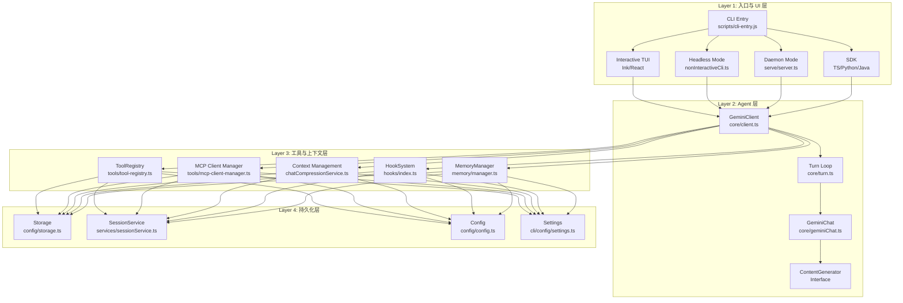
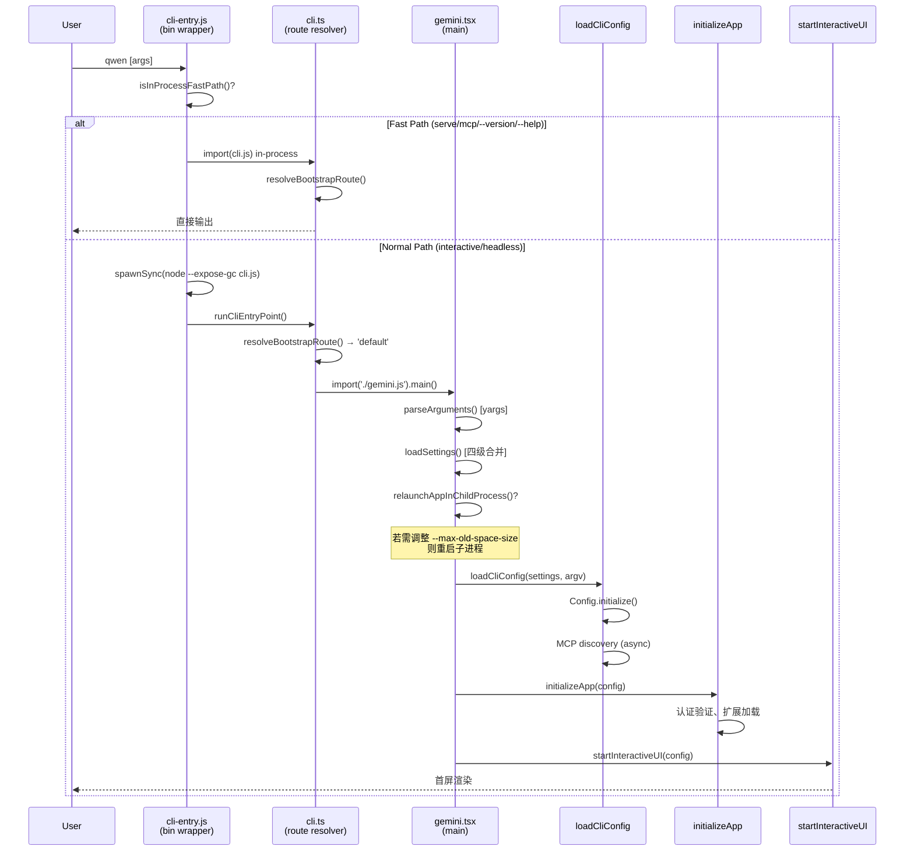

# Qwen Code：终端原生 AI 编码代理的系统设计与实现

## 摘要

随着大语言模型（LLM）能力的快速演进，AI 辅助编程已从早期的代码补全范式发展为具备自主规划、工具调用与多轮推理能力的编码代理（Coding Agent）范式。本文提出 Qwen Code——一个由阿里巴巴通义千问团队开发的开源终端原生 AI 编码代理系统。该系统以 Node.js 22 为运行时，采用 npm workspaces monorepo 架构组织 21 个子包，通过四层分离设计（入口与 UI 层、Agent 层、工具与上下文层、持久化层）实现了高度模块化的复合 AI 系统。

本文的核心技术贡献包括：（1）**复合 AI 系统架构**——将编码代理建模为多组件协作系统而非单一 LLM 调用，涵盖模型路由、工具调度、上下文管理与权限控制的完整闭环；（2）**多协议模型路由**——统一抽象 OpenAI、Anthropic、Gemini 及 Qwen 四类 API 协议，支持运行时动态切换与容量降级；（3）**惰性工具发现与注册机制**——通过 ToolRegistry 的延迟加载策略将启动时间从 O(n) 工具数降至 O(1)；（4）**自适应上下文压缩**——基于 token 预算的多级压缩策略（微压缩、全量压缩、截图触发压缩）确保长会话的模型注意力质量；（5）**事件驱动的系统提醒与自动化记忆**——通过 Hook 系统与 MemoryManager 实现跨会话知识的自动积累与按需注入。

与现有系统相比，Qwen Code 是首个同时满足以下三个条件的编码代理：完全开源（Apache-2.0）、终端原生（支持 SSH/无头环境/CI 流水线）、且提供完整技术报告。系统当前版本为 v0.21.0，支持交互模式（Ink/React TUI）、非交互模式（headless）、守护进程模式（HTTP SSE）及多语言 SDK（TypeScript/Python/Java）四种前端接入方式。

**关键词**：AI 编码代理；终端原生；复合 AI 系统；大语言模型；工具调用；上下文管理；开源

---

## 第1章 引言

### 1.1 AI 编码辅助的范式转变

软件开发领域正经历一场由大语言模型驱动的深刻变革。这一变革可划分为三个清晰的演进阶段：

**第一阶段：代码补全（2021-2023）。** 以 GitHub Copilot 为代表，将 LLM 作为智能自动补全引擎嵌入 IDE 编辑器。其交互模式为"键入-补全"，模型仅感知当前光标附近的有限上下文，不具备跨文件推理或工具调用能力。

**第二阶段：对话式助手（2023-2024）。** 以 ChatGPT、通义千问对话界面为代表，开发者通过自然语言描述需求，模型生成代码片段供人工复制粘贴。虽然上下文窗口扩大，但模型仍无法直接操作文件系统、执行命令或验证结果。

**第三阶段：自主编码代理（2024-至今）。** 以 Claude Code、OpenHands、Aider 及本文的 Qwen Code 为代表，LLM 被赋予完整的工具调用能力——读写文件、执行 Shell 命令、搜索代码库、管理版本控制——并在一个闭环的"感知-规划-执行-验证"循环中自主完成复杂编程任务。

这一范式转变的核心洞察在于：**编程本质上是一个与计算环境持续交互的过程**，而非一次性文本生成。编码代理必须能够观察环境状态（读取文件、查看错误输出）、制定计划（分解任务、选择策略）、执行操作（编辑代码、运行测试）并根据反馈调整行为。

### 1.2 终端原生代理的优势

在编码代理的载体选择上，终端（Terminal）相较于 IDE 插件和 Web 界面具有独特的结构性优势：

**（1）环境无关性。** 终端是所有计算环境的最大公约数——本地开发机、远程服务器（SSH）、容器（Docker/Kubernetes）、CI/CD 流水线（GitHub Actions、Jenkins）均提供终端访问。终端原生代理无需安装 IDE 插件或浏览器扩展即可工作。

**（2）版本控制与构建系统的天然集成。** Git、Make、npm、cargo 等开发工具链本身即以命令行接口为主。终端代理可直接调用这些工具，无需通过 IDE 的间接抽象层。

**（3）无头（Headless）运行能力。** 在自动化场景中（如 CI 中的代码审查、批量重构），代理无需渲染任何图形界面。Qwen Code 的 `-p/--prompt` 模式与 `--output-format json` 选项使其可作为 Unix 管道中的一个组件。

**（4）资源效率。** 相比运行完整的 IDE 进程（如 VS Code 的 Electron 运行时），终端代理的内存占用和启动时间均显著更低。Qwen Code 的快速路径（fast path）机制确保 `qwen --version` 等简单命令在 50ms 内完成。

**（5）可组合性。** 终端代理遵循 Unix 哲学，可通过 stdin/stdout 与其他工具组合。例如：`git diff | qwen -p "review this change"` 将 diff 输出直接作为代理的输入上下文。

### 1.3 现有系统的不足

尽管编码代理领域已涌现多个系统，但截至本文撰写时（2026年7月），仍存在以下结构性缺陷：

**（1）闭源系统的可审计性缺失。** Claude Code（Anthropic）是目前功能最完善的编码代理之一，但其核心代码不公开。研究者和企业用户无法审计其数据处理逻辑、安全边界或模型调用行为。这在合规敏感的企业环境中构成根本性障碍。

**（2）非终端系统的环境限制。** OpenHands（原 OpenDevin）采用 Web 界面 + Docker 沙箱架构，需要浏览器访问和容器运行时。这排除了 SSH-only 环境、资源受限设备及纯 CLI 工作流。

**（3）技术报告的缺乏。** 多数编码代理项目仅提供用户文档和 API 参考，缺少对系统设计决策、架构权衡和实现细节的学术级描述。这使得研究者难以复现、比较和改进。

**（4）模型锁定。** 部分系统与特定模型提供商深度绑定（如 Claude Code 仅支持 Anthropic 模型），限制了用户根据任务特性选择最优模型的能力。

### 1.4 Qwen Code 的设计原则

针对上述不足，Qwen Code 确立了以下设计原则：

**原则一：责任分离（Separation of Concerns）。** 系统将 UI 渲染、Agent 推理、工具执行、配置管理、持久化存储分离到独立的模块和包中。核心引擎（`@qwen-code/qwen-code-core`）不依赖任何 UI 框架，可被 CLI、SDK、Daemon、IDE 插件等多种前端复用。

**原则二：逐步降级（Graceful Degradation）。** 系统在组件不可用时不应崩溃，而应降级到有限但可用的状态。例如：MCP 服务器连接失败时继续使用内置工具；ripgrep 不可用时回退到 glob 搜索；模型主提供商容量不足时自动切换备用模型。

**原则三：操作透明（Operational Transparency）。** 代理的每一个工具调用、每一次文件修改、每一个 Shell 命令都对用户可见且可审计。权限系统（ApprovalMode）提供从完全手动确认（Default）到完全自动执行（YOLO）的五级控制。

**原则四：开源优先（Open Source First）。** 系统全部代码以 Apache-2.0 许可证发布，包括核心引擎、UI 层、SDK 和构建工具链。通义千问模型本身亦为开源，形成"开源模型 + 开源框架"的完整生态。

### 1.5 论文结构概述

本文其余部分组织如下：第2章阐述设计原则与核心贡献；第3章描述系统架构总览，包括四层架构、monorepo 结构、启动流程、配置系统和多前端架构；第4章深入 Agent 引擎的 Turn 循环与模型路由；第5章详述工具系统与 MCP 协议集成；第6章讨论上下文管理与压缩策略；第7章描述记忆系统与技能发现；第8章给出实验评估；第9章总结全文。

---

## 第2章 设计原则与核心贡献

### 2.1 复合 AI 系统视角

传统 AI 编码研究倾向于将编码代理建模为"LLM + 提示工程"的简单组合。Qwen Code 的设计拒绝这一简化视角，转而采用**复合 AI 系统（Compound AI System）** 的架构理念：将编码代理视为由多个专门化组件协作构成的分布式系统，LLM 仅是其中的推理引擎，而非系统的全部。

这一视角的具体体现为：

- **模型层**仅负责自然语言理解与生成、代码推理、工具调用决策；
- **工具层**负责文件系统操作、Shell 执行、代码搜索、网络请求等环境交互；
- **上下文层**负责 token 预算管理、历史压缩、相关代码检索、记忆注入；
- **控制层**负责权限验证、循环检测、会话管理、错误恢复。

各层通过明确定义的接口通信，任何一层的实现可独立替换而不影响其他层。例如，`ContentGenerator` 接口（定义于 `packages/core/src/core/contentGenerator.ts`，第39-56行）抽象了模型调用：

```typescript
export interface ContentGenerator {
  generateContent(
    request: GenerateContentParameters,
    userPromptId: string,
  ): Promise<GenerateContentResponse>;

  generateContentStream(
    request: GenerateContentParameters,
    userPromptId: string,
  ): Promise<AsyncGenerator<GenerateContentResponse>>;

  countTokens(request: CountTokensParameters): Promise<CountTokensResponse>;

  embedContent(request: EmbedContentParameters): Promise<EmbedContentResponse>;

  useSummarizedThinking(): boolean;
}
```

任何兼容此接口的模型提供商（OpenAI、Anthropic、Gemini、本地 Ollama/vLLM）均可作为推理引擎接入，而上层的工具调度、上下文管理和权限控制逻辑完全不变。

### 2.2 五大核心贡献

#### 贡献一：多协议统一模型路由

Qwen Code 的 `AuthType` 枚举（`packages/core/src/core/contentGenerator.ts`，第58-63行）定义了系统支持的认证协议：

```typescript
export enum AuthType {
  USE_OPENAI = 'openai',
  QWEN_OAUTH = 'qwen-oauth',
  USE_GEMINI = 'gemini',
  USE_VERTEX_AI = 'vertex-ai',
  USE_ANTHROPIC = 'anthropic',
}
```

`ModelsConfig` 类（`packages/core/src/models/index.ts`）管理模型注册表、运行时切换和容量降级。系统支持最多3个备用模型（`--fallback-model`），当主模型返回容量错误（HTTP 429/503）时自动切换，并通过 `GeminiEventType.ModelFallback` 事件通知 UI 层。

**设计决策的 Why：** 不同模型在不同任务上有比较优势（如 Qwen 在中文代码注释生成上优于 GPT-4，Claude 在长上下文推理上表现突出）。运行时切换能力使用户可根据任务特性选择最优模型，而无需重启会话。

#### 贡献二：惰性工具发现与注册

`ToolRegistry`（`packages/core/src/tools/tool-registry.ts`）实现了工具的延迟加载机制。核心数据结构为：

```typescript
export type ToolFactory = () => Promise<AnyDeclarativeTool>;

export interface DeferredToolSummary {
  name: string;
  description: string;
  serverName?: string;
}
```

系统启动时仅注册工具的名称和描述（`DeferredToolSummary`），实际的类实例化通过 `ToolFactory` 的动态 `import()` 延迟到首次调用时。这解决了编码代理的一个关键性能瓶颈：随着 MCP 服务器注册的工具数量增长（生产环境中可达 100+ 个工具），急切加载所有工具类会导致启动时间线性增长。

**设计决策的 Why：** 在典型会话中，用户实际使用的工具不超过 10-15 个。延迟加载将启动成本从 O(全部工具) 降至 O(内置核心工具)，MCP 工具的发现与注册在后台异步完成（`config.initialize()` 返回后通过 `waitForMcpReady()` 等待）。

#### 贡献三：自适应上下文压缩

长会话中的上下文管理是编码代理的核心挑战。Qwen Code 实现了三级压缩策略：

1. **微压缩（Microcompaction）**：对历史中的工具输出进行就地裁剪，移除冗余的中间状态（`packages/core/src/services/microcompaction/microcompact.ts`）；
2. **全量压缩（Chat Compression）**：当 token 使用量超过阈值时，调用模型生成历史摘要并替换原始内容（`packages/core/src/services/chatCompressionService.ts`）；
3. **截图触发压缩**：当累积的工具截图数量超过阈值（默认20张）时触发压缩，防止计算机使用（Computer Use）场景中图片稀释模型注意力。

压缩参数通过 `ChatCompressionSettings` 接口配置（`packages/core/src/config/config.ts`），包括 `maxRecentFilesToRetain`（默认5）、`maxRecentImagesToRetain`（默认3）、`screenshotTriggerThreshold`（默认20）等。

#### 贡献四：事件驱动的 Hook 系统

`HookSystem`（`packages/core/src/hooks/index.ts`）实现了细粒度的生命周期拦截：

- `PreToolUse`：工具执行前触发，可修改参数或拒绝执行；
- `PostToolUse`：工具执行后触发，可审计结果；
- `PostToolBatch`：一批工具调用完成后触发；
- `Notification`：系统通知事件；
- `PermissionRequest`：权限请求事件。

Hook 通过 `MessageBus`（`packages/core/src/confirmation-bus/message-bus.ts`）进行进程间通信，支持用户自定义的外部脚本拦截代理行为。

#### 贡献五：自动化记忆系统

`MemoryManager`（`packages/core/src/memory/manager.ts`）实现了跨会话的知识积累：

- **用户记忆**（User Memory）：跨项目的用户偏好和背景知识；
- **项目记忆**（Project Memory）：特定项目的架构决策、进行中的工作；
- **自动技能**（Auto-Skills）：从重复操作模式中自动提取的可复用工作流。

记忆的存储采用文件系统（Markdown + YAML frontmatter），索引文件为 `MEMORY.md`。每次会话启动时，相关记忆通过 `loadServerHierarchicalMemory`（`packages/core/src/utils/memoryDiscovery.ts`）按层级加载并注入系统提示。

### 2.3 系统定位对比

| 维度         | Qwen Code          | Claude Code        | OpenHands  | Aider |
| ------------ | ------------------ | ------------------ | ---------- | ----- |
| 开源         | ✓ (Apache-2.0)     | ✗                  | ✓          | ✓     |
| 终端原生     | ✓                  | ✓                  | ✗ (Web)    | ✓     |
| 多模型支持   | ✓ (5协议)          | ✗ (Anthropic only) | ✓          | ✓     |
| 守护进程模式 | ✓ (HTTP SSE)       | ✗                  | ✗          | ✗     |
| SDK          | ✓ (TS/Python/Java) | ✗                  | ✓ (Python) | ✗     |
| IM 集成      | ✓ (6平台)          | ✗                  | ✗          | ✗     |
| 技术报告     | ✓ (本文)           | ✗                  | ✓          | ✗     |
| 记忆系统     | ✓ (自动)           | ✓ (自动)           | ✗          | ✗     |
| 子代理/团队  | ✓                  | ✓                  | ✓          | ✗     |

---

## 第3章 系统架构总览

### 3.1 四层架构

Qwen Code 采用严格的四层分离架构，各层职责明确、接口清晰：



**Layer 1（入口与 UI 层）** 负责用户交互的呈现：解析命令行参数、渲染 TUI 界面、管理 HTTP 路由。该层不包含任何 AI 推理逻辑。

**Layer 2（Agent 层）** 是系统的推理核心：管理对话历史、组装系统提示、驱动 Turn 循环（发送请求→解析响应→执行工具→回传结果）、处理模型降级。

**Layer 3（工具与上下文层）** 提供环境交互能力：文件读写、Shell 执行、代码搜索、MCP 协议通信、上下文压缩、权限拦截、记忆检索。

**Layer 4（持久化层）** 管理所有状态的持久化：会话记录、用户配置、项目设置、token 使用统计。

**设计决策的 Why：** 四层分离的核心收益是**前端无关性**。同一个 Agent 引擎（Layer 2-4）可被 TUI、headless、daemon、SDK、IDE 插件、IM Bot 等任意前端复用，无需修改核心逻辑。这避免了"每个前端一个 Agent 实现"的代码膨胀。

### 3.2 Monorepo 结构

Qwen Code 采用 npm workspaces 管理的 monorepo 结构（根 `package.json`，`workspaces` 字段），包含 21 个子包：

| 子包                        | 路径                               | 职责                                                   |
| --------------------------- | ---------------------------------- | ------------------------------------------------------ |
| **core**                    | `packages/core`                    | Agent 引擎：模型调用、工具注册、上下文管理、记忆、Hook |
| **cli**                     | `packages/cli`                     | 终端 UI（Ink/React）、命令行解析、非交互模式、Daemon   |
| **sdk-typescript**          | `packages/sdk-typescript`          | TypeScript SDK：程序化调用 Agent                       |
| **acp-bridge**              | `packages/acp-bridge`              | Agent Client Protocol 桥接层                           |
| **audio-capture**           | `packages/audio-capture`           | 音频输入捕获（实验性）                                 |
| **chrome-extension**        | `packages/chrome-extension`        | 浏览器扩展                                             |
| **mobile-mcp**              | `packages/mobile-mcp`              | 移动端 MCP                                             |
| **vscode-ide-companion**    | `packages/vscode-ide-companion`    | VS Code 伴侣扩展                                       |
| **webui**                   | `packages/webui`                   | Web UI                                                 |
| **channels/base**           | `packages/channels/base`           | IM 通道基础框架                                        |
| **channels/telegram**       | `packages/channels/telegram`       | Telegram Bot 集成                                      |
| **channels/weixin**         | `packages/channels/weixin`         | 微信集成                                               |
| **channels/dingtalk**       | `packages/channels/dingtalk`       | 钉钉集成                                               |
| **channels/wecom**          | `packages/channels/wecom`          | 企业微信集成                                           |
| **channels/feishu**         | `packages/channels/feishu`         | 飞书集成                                               |
| **channels/qqbot**          | `packages/channels/qqbot`          | QQ Bot 集成                                            |
| **channels/github**         | `packages/channels/github`         | GitHub 集成                                            |
| **channels/plugin-example** | `packages/channels/plugin-example` | 渠道插件示例                                           |
| **web-shell**               | `packages/web-shell`               | Web 终端 UI 组件库                                     |
| **web-templates**           | `packages/web-templates`           | Web 模板资源                                           |
| **external-context**        | `integrations/external-context`    | 外部上下文集成                                         |

此外还有非 workspace 成员但存在于仓库中的包：`desktop`（Electron 桌面应用，通过 `!packages/desktop` 排除）、`cua-driver`（Computer Use 驱动，Rust 实现）、`sdk-python`（Python SDK，pyproject.toml 构建）、`sdk-java`（Java SDK，Gradle 构建）、`zed-extension`（Zed 编辑器扩展）。

#### 包间依赖关系

核心依赖链为单向的：

```
cli → core (file:../core)
cli → sdk-typescript (file:../sdk-typescript)
cli → acp-bridge (file:../acp-bridge)
cli → channels/* (file:../channels/*)
sdk-typescript → core
channels/* → channels/base
```

`core` 包不依赖 `cli` 或任何 UI 包——这是架构的核心不变量。`core` 的 `package.json` 依赖列表（`packages/core/package.json`）仅包含模型 SDK（`@google/genai`、`openai`、`@anthropic-ai/sdk`）、协议库（`@modelcontextprotocol/sdk`）和基础工具库（`glob`、`diff`、`chokidar`、`web-tree-sitter`），不包含任何 UI 框架。

#### 构建工具链

构建流程分为两个阶段：

**阶段一：TypeScript 编译（`npm run build`）。** 各包独立编译 TypeScript 到 `dist/` 目录，生成 `.js` + `.d.ts` 文件。使用 `cross-env NODE_OPTIONS="--max-old-space-size=3072"` 防止大型项目的 OOM。

**阶段二：esbuild 打包（`npm run bundle`）。** 将编译产物打包为单一 `dist/cli.js` 文件（`esbuild.config.js`）。打包过程包含：

- WASM 二进制内联（`wasmBinaryPlugin`）：将 tree-sitter 的 `.wasm` 文件以 base64 嵌入 JS；
- OpenTelemetry 导出器存根（`sdkNodeExporterStubPlugin`）：避免将 gRPC + HTTP 两套 OTLP 导出器（~2 MiB）同时打入 bundle；
- 资产复制（`scripts/copy_bundle_assets.js`）：复制非 JS 资源。

**测试框架：** Vitest（各包独立配置），测试文件与源码共置（`file.test.ts` 紧邻 `file.ts`）。

**设计决策的 Why：** 两阶段构建平衡了开发体验与分发效率。开发时使用 `npm run dev`（tsx 直接执行 TypeScript，无需编译）；分发时使用 bundle 产生单文件，用户通过 `npm install -g` 安装后无需 `node_modules` 解析。

### 3.3 启动流程

从用户键入 `qwen` 命令到 TUI 渲染完成，系统经历以下启动链路：



#### 3.3.1 快速路径 vs 完整路径

启动入口 `scripts/cli-entry.js`（bin wrapper）实现了**快速路径分叉**：

```javascript
function isInProcessFastPath() {
  const first = cliArgs[0];
  if (first === 'serve' || first === 'mcp') return true;
  if (first === undefined || first.startsWith('-')) {
    return hasFlag('--help', '-h') || hasFlag('--version', '-v');
  }
  return false;
}
```

- **快速路径**（`serve`、`mcp`、`--version`、`--help`）：在当前进程内直接 `import(cli.js)` 执行，跳过子进程 spawn 的开销。这些路径不需要 `global.gc()`，也不需要完整的 Config 初始化。
- **完整路径**（交互模式、headless 模式）：通过 `spawnSync(process.execPath, ['--expose-gc', cliPath, ...cliArgs])` 启动子进程。

**设计决策的 Why：** `--expose-gc` 标志使 `global.gc()` 可用，供内存压力监控器（`MemoryPressureMonitor`，`packages/core/src/services/memoryPressureMonitor.ts`）在临界状态下主动触发垃圾回收。但 `--expose-gc` 有约 5-10% 的性能开销，且 `spawnSync` 本身有进程创建成本。对于 `--version` 这类 1ms 级操作，这些开销不可接受，因此走快速路径。

#### 3.3.2 子进程重启机制

`gemini.tsx` 的 `main()` 函数（第271行起）在进入完整路径后，首先检查是否需要调整 V8 堆内存上限：

```typescript
function getNodeMemoryArgs(isDebugMode: boolean): string[] {
  const totalMemoryMB = os.totalmem() / (1024 * 1024);
  const targetMaxOldSpaceSizeInMB = Math.floor(totalMemoryMB * 0.5);
  if (targetMaxOldSpaceSizeInMB > currentMaxOldSpaceSizeMb) {
    return [`--max-old-space-size=${targetMaxOldSpaceSizeInMB}`];
  }
  return [];
}
```

当目标堆大小（物理内存的 50%）超过当前 V8 默认限制时，系统通过 `relaunchAppInChildProcess(memoryArgs)` 以新参数重启自身。这确保了处理大型代码库时不会因默认堆大小不足而 OOM。

重启机制还支持**更新后重启**：当 `onUpdateRelaunch` 回调返回 `UPDATE_COMPLETE_EXIT_CODE`（44）时，`cli-entry.js` 会定位 PATH 上的 `qwen` 启动器并以新参数重新执行，实现无缝自更新。

#### 3.3.3 沙箱配置

Qwen Code 支持三种沙箱模式（`packages/cli/src/config/sandboxConfig.ts`）：

- **Docker**：在 `ghcr.io/qwenlm/qwen-code:0.21.0` 容器中运行；
- **Podman**：与 Docker 兼容的替代方案；
- **sandbox-exec**（macOS）：使用 Apple 的 `sandbox-exec` 工具进行轻量级沙箱化。

沙箱检测逻辑：若 `process.env['SANDBOX']` 未设置且配置启用了沙箱，则当前进程为"宿主"，负责认证验证（OAuth 重定向在容器内不可用）、stdin 数据预读取，然后通过 `start_sandbox()` 在容器内重启自身。

### 3.4 配置系统

#### 3.4.1 四级层级结构

Qwen Code 的配置通过 `LoadedSettings` 类（`packages/cli/src/config/settings.ts`，第416行）管理，采用四级合并策略：

```typescript
function mergeSettings(
  system: Settings,
  systemDefaults: Settings,
  user: Settings,
  workspace: Settings,
  isTrusted: boolean,
): Settings {
  const safeWorkspace = isTrusted
    ? tagMcpServerScope(workspace, 'workspace')
    : ({} as Settings);

  return customDeepMerge(
    getMergeStrategyForPath,
    {},
    systemDefaults, // 优先级 1（最低）
    user, // 优先级 2
    safeWorkspace, // 优先级 3
    tagMcpServerScope(system, 'system'), // 优先级 4（最高）
  ) as Settings;
}
```

四级配置的来源与语义：

| 层级            | 路径                            | 语义                                  |
| --------------- | ------------------------------- | ------------------------------------- |
| System Defaults | `/etc/qwen-code/defaults.json`  | 组织级默认值（IT 管理员部署）         |
| User            | `~/.qwen/settings.json`         | 用户个人偏好                          |
| Workspace       | `<project>/.qwen/settings.json` | 项目级配置（需信任验证）              |
| System          | `/etc/qwen-code/settings.json`  | 组织级强制覆盖（不可被用户/项目覆盖） |

**信任门控：** Workspace 级配置受 `isWorkspaceTrusted` 检查保护。未受信任的工作区（首次打开的项目）其 workspace 设置被忽略（合并时传入空对象），防止恶意仓库通过 `.qwen/settings.json` 注入配置。

**MCP 服务器作用域标记：** `tagMcpServerScope` 函数在合并前为每个 MCP 服务器配置注入 `scope` 字段（`'workspace'`/`'system'`），驱动审批门控——workspace 级 MCP 服务器需要用户显式批准才能连接。

#### 3.4.2 Config 类的核心结构

`Config` 类（`packages/core/src/config/config.ts`，7488行）是系统的中枢状态容器，其核心字段涵盖：

- **模型配置**：`ModelsConfig`（当前模型、备用模型、认证类型、提供商协议）；
- **工具注册**：`ToolRegistry`（内置工具 + MCP 发现工具 + 延迟加载工厂）；
- **权限管理**：`PermissionManager`（allow/ask/deny 规则）+ `ApprovalMode`（Plan/Default/AutoEdit/Auto/YOLO）；
- **会话状态**：`sessionId`、`projectRoot`、对话历史、token 计数；
- **服务实例**：`FileDiscoveryService`、`FileHistoryService`、`CronScheduler`、`MemoryPressureMonitor`、`ChatRecordingService`；
- **扩展系统**：`ExtensionManager`、`SkillManager`、`SubagentManager`；
- **Hook 系统**：`HookSystem`、`MessageBus`；
- **记忆系统**：`MemoryManager`。

`Config.initialize()` 方法是异步初始化的入口，执行 MCP 服务器发现、工具注册、LSP 连接、扩展加载等耗时操作。其设计为**渐进式可用**：`initialize()` 返回后核心工具已就绪，MCP 工具在后台异步注册（通过 `waitForMcpReady()` 可等待全部完成）。

#### 3.4.3 Settings 热重载

`SettingsWatcher`（`packages/cli/src/config/settingsWatcher.ts`）基于 `chokidar` 监控 settings 文件变更。当检测到修改时：

1. 重新加载并合并四级配置；
2. 通过 `registerMcpHotReload`（`packages/cli/src/config/hot-reload.ts`）对比 MCP 服务器配置差异，执行增量连接/断开/重启；
3. 通过 `LspConfigWatcher` 对 LSP 服务器执行 reconcile（add/remove/restart）；
4. 通过 `ExtensionFileWatcher` 重新加载扩展。

**设计决策的 Why：** 编码代理的会话通常持续数十分钟到数小时。用户在此期间可能需要添加新的 MCP 服务器或修改权限规则。热重载避免了"修改配置→重启会话→丢失上下文"的工作流断裂。

### 3.5 多前端架构

Qwen Code 的 Agent 引擎（Layer 2-4）通过四种前端暴露给用户：

#### 3.5.1 交互模式（Ink/React TUI）

当 `process.stdin.isTTY` 为 true 且无 `-p/--prompt` 参数时进入交互模式。UI 基于 Ink 7（React 19.2 的终端渲染器），入口为 `startInteractiveUI`（`packages/cli/src/ui/startInteractiveUI.tsx`）。

启动序列中的关键优化：

- **早期输入捕获**（`startEarlyInputCapture`）：在 TUI 渲染前捕获用户键入，防止丢失；
- **Kitty 键盘协议检测**（`detectAndEnableKittyProtocol`）：探测终端是否支持 Kitty 协议以启用增强键盘输入；
- **OSC 11 主题探测**（`themeManager.resolveAutoThemeAsync`）：异步查询终端背景色以选择明/暗主题，与启动工作并行执行。

信号处理（`installInteractiveSignalHandlers`，第214行）实现了"双击 Ctrl+C 退出"的安全机制：

```typescript
const SIGINT_EXIT_CONFIRM_WINDOW_MS = 1000;
const SIGINT_RERAISE_IGNORE_MS = 50;
```

第一次 Ctrl+C 显示确认提示，1秒内再次按下才真正退出。50ms 内的重复信号被视为同一次按键的回声（某些终端模拟器会因 raw mode 切换产生伪 SIGINT）。

#### 3.5.2 非交互模式（Headless）

通过 `-p/--prompt` 参数或 stdin 管道触发。入口为 `runNonInteractive`（`packages/cli/src/nonInteractiveCli.ts`）。

输出格式支持三种（`--output-format`）：

- `text`：纯文本输出；
- `json`：完整 JSON 结果；
- `stream-json`：JSONL 流式输出（每个事件一行 JSON）。

非交互模式的安全警告：当 ApprovalMode 为 YOLO 且未启用沙箱时，系统向 stderr 输出安全警告（`getHeadlessYoloSafetyWarning`），因为此组合允许模型在无确认的情况下执行任意 Shell 命令。

#### 3.5.3 Daemon 模式（HTTP SSE）

`qwen serve` 启动一个 HTTP 守护进程（`packages/cli/src/serve/server.ts`），基于 Express 5 提供 RESTful API + Server-Sent Events（SSE）流。

核心架构：

- **多工作区支持**：`workspace-registry.ts` 管理多个项目工作区，每个工作区有独立的 Config 实例；
- **会话管理**：`create-sub-session.ts` 支持创建子会话，`virtual-subagent-sessions.ts` 管理虚拟子代理会话；
- **SSE 流**：`generation-sse.ts` 实现模型生成的 SSE 推送，支持 `Last-Event-ID` 断线重连（`sse-last-event-id.ts`）；
- **速率限制**：`rate-limit.ts` 防止 API 滥用；
- **准入控制**：`total-session-admission.ts` 限制并发会话数。

快速路径优化：`qwen serve` 命令在 `cli-entry.js` 中走 in-process fast path（避免 spawnSync），并启用 Node.js 的 `module.enableCompileCache()` 加速后续模块加载。

#### 3.5.4 SDK 模式

三种语言 SDK 提供程序化接入：

**TypeScript SDK**（`packages/sdk-typescript`）：

```typescript
import { query, isSdkResultMessage } from '@qwen-code/sdk';
const result = query('Summarize the repo', { cwd: '/path' });
for await (const msg of result) {
  if (isSdkResultMessage(msg)) console.log(msg.result);
}
```

**Python SDK**（`packages/sdk-python`）：

```python
from qwen_code_sdk import query, is_sdk_result_message
result = query("Summarize the repo", {"cwd": "/path"})
async for msg in result:
    if is_sdk_result_message(msg):
        print(msg["result"])
```

**Java SDK**（`packages/sdk-java`）：提供同步/异步 API，通过子进程调用 CLI 的 stream-json 模式。

SDK 的底层通信协议为 `--input-format stream-json`：SDK 向 CLI 子进程的 stdin 写入 JSON 控制消息（包含 MCP 服务器注册、用户提示等），从 stdout 读取 JSONL 事件流。

### 3.6 关键设计决策总结

| 决策     | 选择                       | 替代方案              | 选择理由                                            |
| -------- | -------------------------- | --------------------- | --------------------------------------------------- |
| 运行时   | Node.js 22                 | Python/Go/Rust        | Ink 7 TUI 生态、npm 分发便利性、TypeScript 类型安全 |
| UI 框架  | Ink 7 (React 19)           | blessed/ncurses       | 声明式 UI、组件化、React 生态复用                   |
| 模块系统 | ESM (`"type": "module"`)   | CommonJS              | 顶层 await、tree-shaking、现代标准                  |
| 打包     | esbuild 单文件             | webpack/ncc/tsc only  | 速度（100x faster than webpack）、WASM 内联支持     |
| 配置格式 | JSONC (JSON + Comments)    | YAML/TOML             | 用户熟悉度、VS Code 一致性、注释支持                |
| 进程模型 | 主进程 + 子进程重启        | 单进程/worker_threads | --expose-gc 需要进程级标志、OOM 隔离                |
| MCP 发现 | 异步渐进式                 | 同步阻塞              | 首屏时间优化（不等待慢速 MCP 服务器）               |
| 沙箱     | Docker/Podman/sandbox-exec | gVisor/Firecracker    | 用户环境兼容性、无需额外基础设施                    |

---

## 参考文献格式说明

本文引用的源码文件基于 Qwen Code v0.21.0（commit 对应 2026年7月）。关键文件路径：

- 根 `package.json`：版本、workspaces、scripts 定义
- `scripts/cli-entry.js`：bin 入口 wrapper（快速路径分叉、--expose-gc 重启）
- `packages/cli/src/cli.ts`：CLI 路由解析（`resolveBootstrapRoute`）
- `packages/cli/src/gemini.tsx`：`main()` 启动序列（1330行）
- `packages/cli/src/config/settings.ts`：四级配置合并（`LoadedSettings`、`mergeSettings`）
- `packages/core/src/config/config.ts`：Config 类（7488行，系统中枢）
- `packages/core/src/core/contentGenerator.ts`：`ContentGenerator` 接口、`AuthType` 枚举
- `packages/core/src/core/client.ts`：`GeminiClient`（3385行，Agent 循环）
- `packages/core/src/core/turn.ts`：`Turn` 类、`GeminiEventType` 枚举
- `packages/core/src/tools/tool-registry.ts`：`ToolRegistry`、`ToolFactory`、`DeferredToolSummary`
- `packages/core/src/index.ts`：核心包公开 API 导出
- `esbuild.config.js`：bundle 配置（WASM 内联、OTel 存根）
