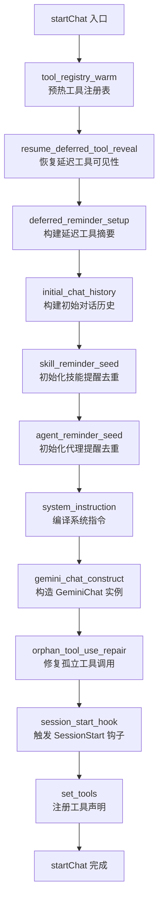
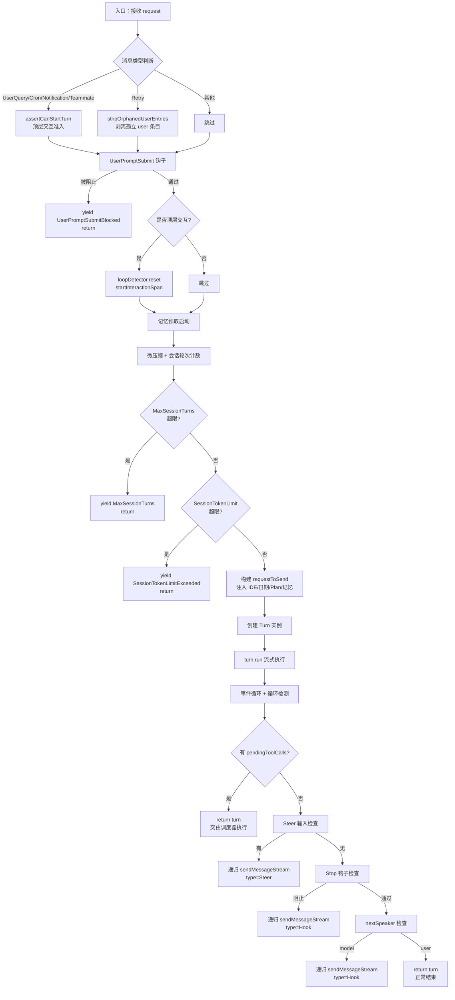
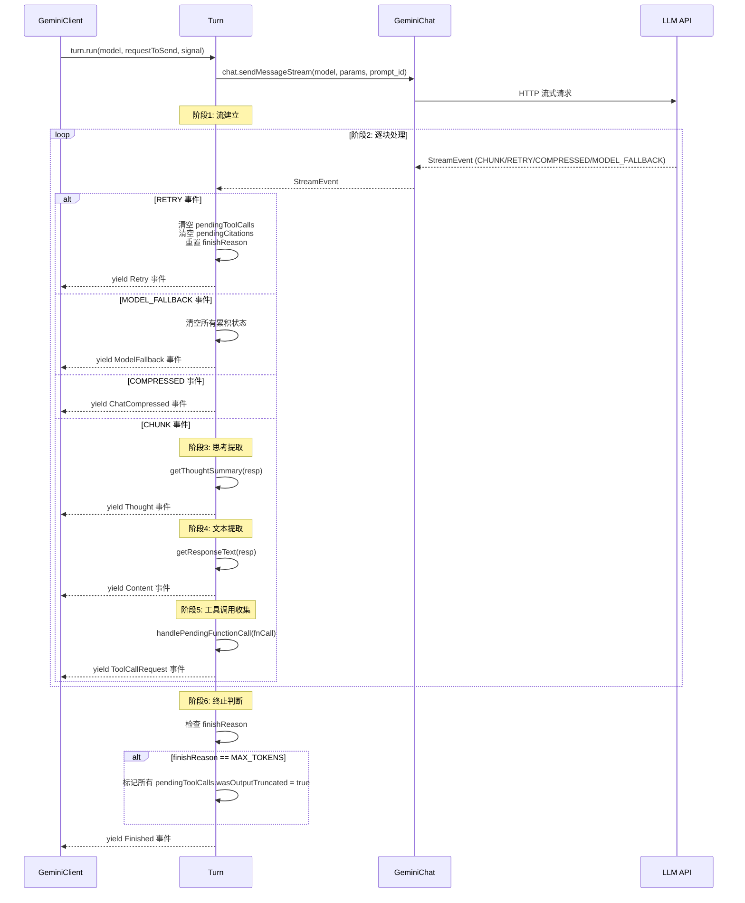
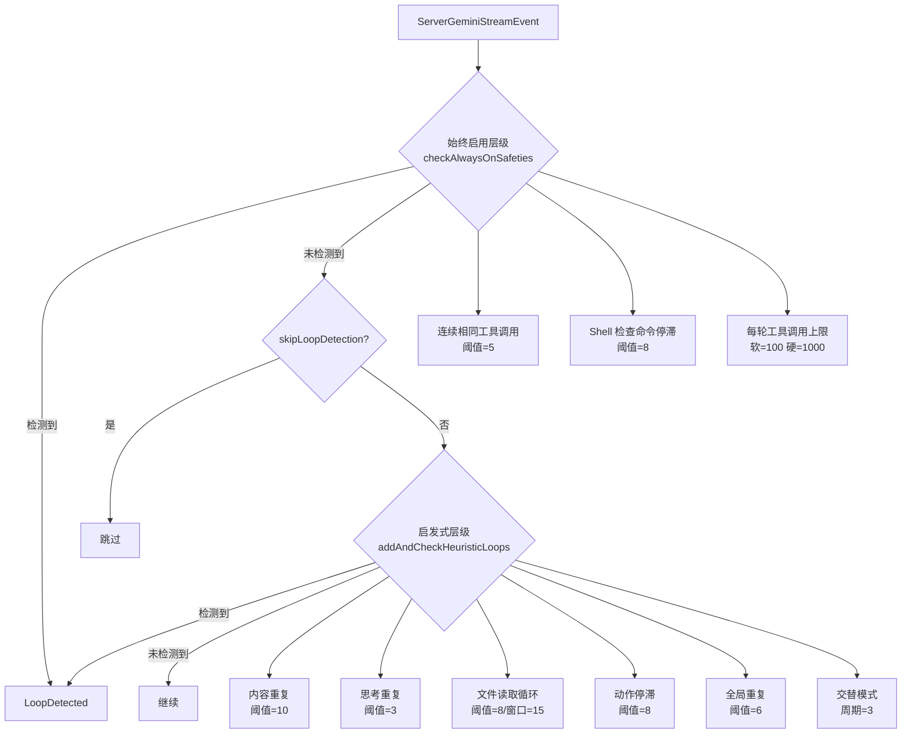
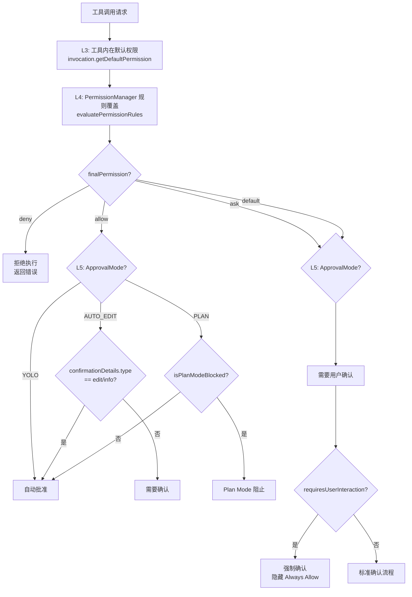

# 第4章 Agent 核心层

Agent 核心层是 Qwen Code 系统中最关键的子系统，负责将大语言模型的推理能力与工具执行能力融合为一个自主循环的智能代理。本章将从搭建阶段（Scaffolding）、运行时架构（Harness）、执行循环（ReAct Loop）、LLM 通信层、事件类型系统、循环检测与安全终止、双模式运行以及子代理编排八个维度，对核心层的实现进行详尽的形式化描述。

核心层的代码主要分布在 `packages/core/src/core/` 目录下，关键文件包括：

| 文件                   | 核心类/函数                               | 职责                                   |
| ---------------------- | ----------------------------------------- | -------------------------------------- |
| `client.ts`            | `GeminiClient`                            | 顶层编排器，管理会话生命周期与递归续写 |
| `geminiChat.ts`        | `GeminiChat`                              | LLM 通信层，流式调用、重试、压缩       |
| `turn.ts`              | `Turn`                                    | 单轮事件收集器，流式响应解析           |
| `coreToolScheduler.ts` | `CoreToolScheduler`                       | 工具调度器，权限检查与并发执行         |
| `prompts.ts`           | `assembleSystemPrompt`                    | System prompt 编译                     |
| `tokenLimits.ts`       | `tokenLimit`, `clampOutputTokensToWindow` | Token 预算计算                         |
| `permissionFlow.ts`    | `evaluatePermissionFlow`                  | 权限流评估                             |
| `turn-interruption.ts` | `detectTurnInterruption`                  | 轮次中断检测                           |
| `session-recovery.ts`  | `buildSessionRecoveryPlan`                | 会话恢复计划                           |

## 4.1 Agent 搭建阶段（Scaffolding）

Agent 的搭建阶段是从用户启动 CLI 到第一次 LLM 调用之间的初始化过程。该阶段完成配置解析、工具注册、System prompt 编译、子代理发现和扩展加载等工作。

### 4.1.1 Config 初始化与工具注册

`GeminiClient` 的构造函数接收一个 `Config` 对象，该对象是整个系统的依赖注入容器。构造函数仅执行一项关键操作——实例化循环检测服务：

```typescript
// packages/core/src/core/client.ts, L339
constructor(private readonly config: Config) {
  this.loopDetector = new LoopDetectionService(config);
}
```

真正的初始化发生在 `initialize()` 方法中。该方法首先检查是否已初始化且会话 ID 未变化（幂等性保证），然后分两条路径执行：

**路径一：恢复会话（Resume）。** 当 `config.getResumedSessionData()` 返回非空时，系统从持久化的 JSONL 转录文件重建对话历史。具体步骤为：

1. 调用 `replayUiTelemetryFromConversation()` 从转录中恢复 token 计数统计；
2. 调用 `buildApiHistoryFromConversation()` 将 `ChatRecord[]` 转换为 API 格式的 `Content[]`；
3. 调用 `seedRecentCompletedToolNamesFromHistory()` 从历史中提取最近完成的工具名称（用于自动记忆召回的上下文）；
4. 调用 `startChat(resumedHistory, SessionStartSource.Resume)` 创建 `GeminiChat` 实例；
5. 调用 `chat.seedResumeTokenCounts()` 恢复 prompt/output token 计数，使压缩阈值判断在恢复后的第一次发送即可生效。

**路径二：全新会话（Startup）。** 直接调用 `startChat()` 进入标准初始化流程。

### 4.1.2 startChat：会话构建的完整流程

`startChat()` 是搭建阶段的核心方法（`client.ts`, L1280–L1460），其执行流程可通过性能剖析器（`createSessionStartProfiler`）追踪每个子阶段的耗时。完整流程如下：



**阶段 1：工具注册表预热（`tool_registry_warm`）。** 调用 `toolRegistry.warmAll()` 异步初始化所有工厂注册的延迟工具。延迟工具（Deferred Tools）是 Qwen Code 的一项优化：MCP 服务器提供的工具在启动时仅注册名称和摘要，不加载完整的 schema，直到模型通过 `tool_search` 工具按需加载。

**阶段 2：恢复延迟工具可见性（`resume_deferred_tool_reveal`）。** 在会话恢复场景下，转录历史中可能包含对延迟工具的调用记录。若这些工具未被重新揭示（reveal），则 API 会因 schema 缺失而拒绝后续调用。此阶段遍历 `extraHistory` 中的所有 `functionCall` part，对匹配延迟工具名称的条目调用 `toolRegistry.revealDeferredTool(callName)`。

**阶段 3：延迟工具摘要构建（`deferred_reminder_setup`）。** 调用 `resolveDeferredToolsForReminder()` 生成尚未被模型"看见"的延迟工具列表。该列表将通过 user 角色的 `<system-reminder>` 注入对话历史，告知模型有哪些工具可按需加载。若 `tool_search` 工具本身不可用（如被 `--exclude-tools` 排除），则所有延迟工具会被立即揭示。

**阶段 4：初始对话历史构建（`initial_chat_history`）。** 调用 `getInitialChatHistory(config, extraHistory)` 生成启动上下文。该函数组装一个包含工作目录结构、可用技能列表、延迟工具摘要等信息的 user 消息，作为对话历史的第一条记录。

**阶段 5–6：提醒去重初始化。** 分别调用 `seedSkillReminderDedupFromSnapshot()` 和 `seedAgentReminderDedupFromCurrent()` 初始化技能和代理的增量提醒去重集合。后续每轮对话中，只有新出现的技能/代理才会被注入提醒。

**阶段 7：系统指令编译。** 调用 `getMainSessionSystemInstruction()` 编译完整的系统提示词（详见 4.1.3）。

**阶段 8：GeminiChat 构造。** 以系统指令、对话历史、配置对象和录制服务为参数构造 `GeminiChat` 实例。构造后立即调用 `chat.enableManualPlanExitNotices()` 启用计划模式退出通知。

**阶段 9：孤立工具调用修复（`orphan_tool_use_repair`）。** 调用 `repairOrphanedToolUseTurnsInHistory()` 修复转录中可能存在的悬空 `functionCall`（即没有对应 `functionResponse` 的工具调用）。修复策略包括三类操作：

- **合成（SYNTHESIZE）**：为无匹配的 `functionCall.id` 生成一个错误类型的 `functionResponse`；
- **提升（HOIST）**：将位于非相邻 user 轮次中的真实 `functionResponse` 移动到紧邻的 user 轮次头部；
- **去重（DROP）**：删除同一 `callId` 的重复 `functionResponse` 副本。

**阶段 10：SessionStart 钩子。** 若用户配置了 `SessionStart` 事件钩子，通过 `hookSystem.fireSessionStartEvent()` 触发，钩子可返回附加上下文字符串，该字符串被追加到系统指令末尾。

**阶段 11：工具声明注册（`set_tools`）。** 调用 `setTools()` 方法，从工具注册表获取所有 `FunctionDeclaration`，封装为 `Tool[]` 数组并绑定到 `GeminiChat`。

### 4.1.3 System Prompt 编译

System prompt 的编译由 `prompts.ts` 中的 `assembleSystemPrompt()` 函数完成。该函数接收一个分层结构的参数对象：

```typescript
// packages/core/src/core/prompts.ts
assembleSystemPrompt({
  base, // 核心提示词（身份 + 规则 + 工具指导）
  contextFiles, // 用户记忆文件（QWEN.md 等）
  appendPrompt, // 追加提示词（--append-system-prompt）
  gitStatus, // Git 仓库状态（分支 + 最近提交）
  autoMemory, // 自动记忆提示词
});
```

**核心提示词的生成（`getCoreSystemPrompt`）。** 该函数首先检查环境变量 `QWEN_SYSTEM_MD` 是否指定了自定义系统提示词文件。若指定，则直接读取文件内容作为基础提示词（完全替换默认内容）；否则，生成默认提示词，其结构为：

1. **身份声明**：由 `getDefaultCoreIdentitySentence()` 或 `QWEN_SYSTEM_IDENTITY_MD` 环境变量指定的自定义身份文件生成。默认身份为 "You are Qwen Code, an interactive CLI agent developed by Alibaba Group"。
2. **交互模式指令**：由 `resolveInteractionMode()` 根据运行环境决定，支持三种模式：
   - `interactive`：交互式 CLI，允许使用 `ask_user_question` 工具；
   - `headless`：非交互式单轮运行，禁止向用户提问；
   - `acp`：通过 ACP 宿主运行，允许提问但由宿主中继。
3. **核心规则（Core Mandates）**：安全、权限、工具使用等基础规则。

**上下文文件注入。** `contextFiles` 参数携带从 `QWEN.md`、`AGENTS.md` 等配置文件聚合的用户记忆内容，以 `<system-reminder>` 标签包裹注入。

**Git 状态注入。** 当工作目录是 Git 仓库时，`getRecentGitStatus()` 获取当前分支和最近提交记录，追加到系统提示词中，使模型将版本历史视为权威上下文。

### 4.1.4 MCP 服务器发现与工具注入

MCP（Model Context Protocol）工具的注入采用延迟加载策略。启动时，MCP 服务器连接建立后，其工具以 `DeferredToolSummary` 的形式注册到工具注册表，包含名称、描述和服务器名称，但不包含完整的 `FunctionDeclaration`。

模型在对话中看到的是一个延迟工具摘要列表（通过 `<system-reminder>` 注入），当模型判断需要某个延迟工具时，调用 `tool_search` 工具按名称或关键词检索，系统随即揭示（reveal）该工具的完整 schema 并将其加入后续 API 调用的工具声明列表。

MCP 工具的增量变更（服务器连接/断开）通过 `drainPendingAddedMcpToolsReminder()` 方法在每轮 UserQuery 开始时注入增量提醒，告知模型有哪些新工具可用、哪些工具已移除。

### 4.1.5 子代理注册与技能加载

子代理（Subagent）通过 `SubagentManager` 管理。启动时，`seedAgentReminderDedupFromCurrent()` 从管理器获取当前已注册的子代理列表，初始化去重集合。后续每轮对话中，`drainAgentReminders()` 检测新增或移除的子代理，并通过 `buildChangedAgentsReminder()` 生成增量提醒注入对话历史。

技能（Skill）的加载遵循类似模式。`collectAvailableSkillEntries()` 收集所有可用技能（包括内置技能和扩展技能），`drainSkillAndCommandReminders()` 在每轮 UserQuery 时检测变更并注入增量提醒。条件激活的技能（由 `coreToolScheduler` 在工具执行结果中内联宣布）通过 `config.consumeInlineAnnouncedSkillKeys()` 消费，避免重复宣布。

## 4.2 Agent 运行时架构（Harness）

### 4.2.1 GeminiClient.sendMessageStream 的完整算法

`GeminiClient.sendMessageStream()` 是整个 Agent 的核心入口（`client.ts`, L1916–L3385），它是一个 `AsyncGenerator<ServerGeminiStreamEvent, Turn>`，接收用户请求并产出事件流。该方法的签名如下：

```typescript
async *sendMessageStream(
  request: PartListUnion,       // 用户请求（文本/Part 数组）
  signal: AbortSignal,          // 取消信号
  prompt_id: string,            // 提示词唯一标识
  options?: SendMessageOptions, // 消息类型与选项
  turns: number = MAX_TURNS,   // 剩余轮次预算（默认 100）
): AsyncGenerator<ServerGeminiStreamEvent, Turn>
```

`SendMessageOptions.type` 字段定义了七种消息类型（`SendMessageType` 枚举）：

| 类型           | 语义             | 触发场景                     |
| -------------- | ---------------- | ---------------------------- |
| `UserQuery`    | 用户输入的新查询 | 用户在 CLI 输入提示词        |
| `ToolResult`   | 工具执行结果     | 工具调度器提交执行结果       |
| `Steer`        | 转向输入         | 用户在模型边界追加输入       |
| `Retry`        | 重试             | 用户按 Ctrl+Y 重试上一次请求 |
| `Hook`         | 钩子续写         | Stop hook 强制继续           |
| `Cron`         | 定时触发         | 循环任务触发                 |
| `Notification` | 后台通知         | 后台代理完成通知             |
| `Teammate`     | 队友消息         | 多代理协作中的队友通信       |

算法的顶层控制流如下：



### 4.2.2 递归续写机制

`sendMessageStream` 的递归续写是 Qwen Code 实现"自主代理"行为的核心机制。当模型的自然回复结束后（无待执行工具调用），系统通过三个层次的检查决定是否继续：

**层次一：Steer 输入。** 若调用方提供了 `getSteerInput` 回调（交互式 CLI 中由 React 层实现），系统在模型回复结束后轮询是否有用户排队等待的输入。若有，以 `SendMessageType.Steer` 类型递归调用 `sendMessageStream`，将用户输入作为新的请求发送。Steer 输入通过 `SteerInput` 接口管理其生命周期：

```typescript
interface SteerInput {
  parts: Part[]; // 用户输入的 Part 数组
  accept: () => void; // 确认输入已被接受
  restore: () => void; // 输入未被接受时恢复
}
```

`settleSteerInput()` 函数通过比较 `userContentPushCount`（GeminiChat 维护的单调计数器）判断输入是否已成功推入历史，据此调用 `accept()` 或 `restore()`。

**层次二：Stop 钩子。** 若用户配置了 `Stop` 事件钩子（如 `/goal` 命令），系统在模型回复结束后触发钩子。钩子可返回 `blocking` 决策，强制模型继续执行。此时系统以 `SendMessageType.Hook` 类型递归调用 `sendMessageStream`，将钩子的 `continueReason` 作为续写提示。

Stop 钩子的迭代次数受 `stopHookBlockingCap` 限制（通过 `config.getStopHookBlockingCap()` 获取）。每次阻止决策递增 `iterationCount`，当计数达到上限时，系统发出 `StopHookLoop` 事件并终止续写，防止无限循环。

**层次三：nextSpeaker 检查。** 若前两层均未触发续写，系统调用 `checkNextSpeaker()` 函数（一个轻量级 LLM 侧查询）判断下一个发言者应该是模型还是用户。若判断为 `model`，则以 "Please continue." 为提示递归调用 `sendMessageStream`。

### 4.2.3 turns 预算与 MAX_TURNS

每次递归调用 `sendMessageStream` 时，`turns` 参数递减 1。系统硬编码 `MAX_TURNS = 100`（`client.ts`, L139），任何调用方传入的值都会被 `Math.min(turns, MAX_TURNS)` 截断。当 `boundedTurns` 降至 0 时，方法立即返回空 Turn，不再发起 LLM 调用。

除 `MAX_TURNS` 外，系统还维护两个全局安全阀：

- **`MaxSessionTurns`**：由 `config.getMaxSessionTurns()` 配置，限制整个会话的总轮次数。每次非 Retry 消息递增 `sessionTurnCount`，超限时发出 `MaxSessionTurns` 事件。
- **`SessionTokenLimit`**：由 `config.getSessionTokenLimit()` 配置，当 `uiTelemetryService.getLastPromptTokenCount()` 超过限制时发出 `SessionTokenLimitExceeded` 事件。

### 4.2.4 AsyncGenerator 事件流模型

`sendMessageStream` 采用 `AsyncGenerator` 模式实现事件流，这一设计选择具有深刻的架构意义：

1. **背压控制**：消费者（React UI 或 headless runner）通过 `for await...of` 循环拉取事件，自然形成背压——若 UI 渲染慢，生成器自动暂停。
2. **资源清理**：`finally` 块保证无论消费者如何退出（正常完成、提前 `return`、异常抛出），都能执行清理逻辑（释放 Steer 输入、恢复剥离的历史条目、关闭 MessageDisplay 调度器、取消记忆预取）。
3. **递归组合**：`yield*` 语法使递归调用透明——内层生成器的所有事件自动传播到外层消费者，而内层的返回值（`Turn` 对象）成为外层 `yield*` 表达式的值。

## 4.3 扩展的 ReAct 执行循环

### 4.3.1 Turn.run() 的六阶段流程

`Turn` 类（`turn.ts`, L464–L672）封装了单轮 LLM 交互的事件收集逻辑。其 `run()` 方法是一个 `AsyncGenerator<ServerGeminiStreamEvent>`，执行以下六个阶段：



**阶段 1：流建立。** 调用 `chat.sendMessageStream()` 获取 `AsyncGenerator<StreamEvent>`。此调用内部完成自动压缩检查、用户内容推送、孤立工具调用修复和输出 token 窗口钳制等预处理（详见 4.4 节）。

**阶段 2：逐块处理。** 通过 `for await...of` 遍历流事件。每次迭代首先检查 `signal.aborted`，若已取消则发出 `UserCancelled` 事件并返回。然后按事件类型分派：

- `retry`：清空 `pendingToolCalls` 数组（`length = 0`）、`pendingCitations` 集合和 `finishReason`，避免重试时累积来自失败尝试的陈旧数据。
- `model_fallback`：除上述清空外，还重置 `currentResponseId`，因为新模型的响应 ID 空间不同。
- `compressed`：直接桥接为顶层 `ChatCompressed` 事件。
- `chunk`：进入内容解析流程。

**阶段 3：思考提取。** 调用 `getThoughtSummary(resp)` 从响应中提取思考摘要（`ThoughtSummary`），若存在则发出 `Thought` 事件。思考部分（`part.thought === true`）是推理模型（如 QwQ、o-series）特有的输出，与正式回复文本分离。

**阶段 4：文本提取。** 调用 `getResponseText(resp)` 提取非思考文本，若存在则发出 `Content` 事件。

**阶段 5：工具调用收集。** 遍历 `resp.functionCalls` 数组，对每个 `FunctionCall` 调用 `handlePendingFunctionCall()`。该方法生成唯一的 `callId`（优先使用提供者分配的 ID，否则生成 `name-timestamp-random` 格式的 ID），构建 `ToolCallRequestInfo` 对象并推入 `pendingToolCalls` 数组，然后发出 `ToolCallRequest` 事件。

**阶段 6：终止判断。** 当响应包含 `finishReason` 时，执行终止处理：若 `finishReason === MAX_TOKENS`，标记所有 `pendingToolCalls` 的 `wasOutputTruncated = true`，使下游工具调度器能区分参数截断与真正的参数错误；发出 `Citation` 事件（若有引用）；发出 `Finished` 事件，携带 `finishReason` 和 `usageMetadata`。

### 4.3.2 预检查与压缩

在 `Turn.run()` 调用 `chat.sendMessageStream()` 之前，`GeminiClient.sendMessageStream()` 已执行了多项预检查：

1. **微压缩（Microcompaction）**：对 UserQuery 和 Cron 消息，调用 `microcompactHistoryBeforeSend()` 执行基于时间和大小的微压缩。微压缩清除旧的工具结果和媒体内容，保留最近 N 条，是一种无 LLM 侧查询的轻量压缩。
2. **IDE 上下文注入**：若启用了 IDE 模式且无待处理工具调用，通过 `getIdeContextParts()` 获取编辑器上下文（活动文件、光标位置、选中文本等），以 `<system-reminder>` 包裹注入请求。
3. **系统提醒注入**：对 UserQuery/Cron 消息，按顺序注入日期提醒、Plan Mode 提醒、Arena 提醒和自动记忆召回结果。

### 4.3.3 工具调用执行与结果提交

当 `Turn.run()` 完成后，若 `turn.pendingToolCalls` 非空，`sendMessageStream` 返回该 Turn 对象。消费者（React 层的 `useGeminiStream` 或 headless runner）从事件流中收集所有 `ToolCallRequest` 事件，将其提交给 `CoreToolScheduler` 执行。

工具执行完成后，消费者将结果封装为 `functionResponse` Part 数组，以 `SendMessageType.ToolResult` 类型再次调用 `sendMessageStream`，形成 ReAct 循环的闭环。

## 4.4 GeminiChat：LLM 通信层

### 4.4.1 对话历史管理

`GeminiChat`（`geminiChat.ts`, L1580–L4421）维护一个 `Content[]` 数组作为对话历史。`Content` 是 Google GenAI SDK 定义的标准结构：

```typescript
interface Content {
  role: 'user' | 'model';
  parts: Part[];
}
```

`Part` 是一个联合类型，可承载文本（`text`）、函数调用（`functionCall`）、函数响应（`functionResponse`）、内联数据（`inlineData`，如图片）和思考签名（`thoughtSignature`）等内容。

历史管理的关键方法包括：

- **`getHistory(curated)`**：返回历史的深拷贝（`structuredClone`）。`curated=true` 时通过 `extractCuratedHistory()` 过滤无效的 model 输出（如安全过滤器产生的空内容）。
- **`getHistoryShallow(curated)`**：返回浅拷贝，避免长会话中 `structuredClone` 的性能开销。
- **`setHistory(history)`**：整体替换历史，同时清除 `FileReadCache` 和重置 IDE 上下文标志。
- **`truncateHistory(keepCount)`**：截断历史至指定长度。
- **`stripOrphanedUserEntriesFromHistory()`**：弹出尾部孤立的 user 条目（用于 Retry 路径）。

**历史验证。** 构造函数调用 `validateHistory()` 确保所有条目的 `role` 为 `user` 或 `model`。`extractCuratedHistory()` 进一步执行内容有效性检查：跳过包含空文本 part（非 thought、非 functionCall）的 model 输出，合并相邻的同角色条目。

### 4.4.2 流式 API 调用

`GeminiChat.sendMessageStream()` 方法（`geminiChat.ts`, L2060–L2400）是 LLM 通信的核心。其执行流程为：

**步骤 1：发送锁。** 通过 `sendPromise` 实现串行化——每次调用等待前一次完成后再执行。新的 `streamDonePromise` 在生成器的 `finally` 中 resolve，保证即使异常也不会死锁。

**步骤 2：自动压缩。** 在推送用户内容之前，调用 `tryCompress()` 检查是否需要自动压缩。压缩阈值由 `computeThresholds()` 计算（详见 4.4.5）。若触发硬阈值（`effectiveTokens >= hard`），强制执行压缩（`force=true`）。

**步骤 3：用户内容推送。** 调用 `createUserContent(params.message)` 创建 user 条目并推入历史。推送后立即执行 `repairOrphanedToolUseTurns()` 修复悬空的工具调用对。

**步骤 4：输出 token 窗口钳制。** 调用 `clampOutputTokensToWindow()` 计算 `maxOutputTokens`：

```
maxOutputTokens = min(outputCeiling, max(MIN_CLAMPED_OUTPUT_TOKENS, window - promptTokens - margin))
```

其中 `margin = max(10000, 0.05 * window)`。这确保 `prompt + max_tokens ≤ window` 成为结构性不变量，从根本上消除了 issue #5950 中描述的 400 错误。

**步骤 5：流式请求与重试循环。** 进入一个 `for(;;)` 无限循环，每次迭代调用 `makeApiCallAndProcessStream()` 发起实际的 HTTP 流式请求。循环内部实现了五类重试：

### 4.4.3 重试与指数退避

重试机制按错误类型分为五个独立预算：

| 重试类型     | 最大次数     | 初始延迟 | 触发条件                               |
| ------------ | ------------ | -------- | -------------------------------------- |
| 速率限制     | 10（可配置） | 60s      | HTTP 429 / 提供者限流                  |
| 传输层       | 2            | 1s       | ECONNRESET / ETIMEDOUT 等              |
| 瞬态无效流   | 4            | 2s       | 空流 / 无可用文本 / 缺失 finishReason  |
| 协议标签泄漏 | 2            | 2s       | 模型输出以 `<analysis`/`<summary` 开头 |
| 上下文溢出   | 1            | —        | 上下文长度超限（触发反应式压缩）       |

**速率限制重试。** 当 `isRateLimitError()` 返回 true 时，通过 `getRateLimitRetryDelayMs()` 计算延迟（支持 `Retry-After` 头解析和指数退避），发出 `RETRY` 事件（携带 `RetryInfo`，包含 `skipDelay` 回调允许用户跳过等待），然后 `await delay(delayMs, abortSignal)`。

**传输层重试。** 仅在任何响应块到达消费者之前（`!streamYieldedChunk`）才允许重放，避免重复输出。可重试的传输错误码定义在 `stream-transport-retry.ts` 中：

```typescript
const RETRYABLE_STREAM_TRANSPORT_CODES = new Set([
  'ECONNRESET',
  'ETIMEDOUT',
  'UND_ERR_BODY_TIMEOUT',
  'UND_ERR_CONNECT_TIMEOUT',
  'UND_ERR_HEADERS_TIMEOUT',
  'UND_ERR_SOCKET',
]);
```

**上下文溢出反应式压缩。** 当 `getContextLengthExceededInfo(error).isExceeded` 为 true 且尚未尝试过反应式压缩时，调用 `tryCompress(prompt_id, model, true)` 强制压缩。若压缩成功，重建 `requestContents` 并发出 `COMPRESSED` + `RETRY` 事件继续循环。

### 4.4.4 模型降级（ModelFallback）

当主模型（或前一个降级模型）耗尽重试预算后，系统检查 `isFallbackEligible()` 判断错误是否属于容量/可用性问题（如 429、503、529）。若符合条件且配置了降级链（`config.getModelFallbacks()`），系统切换到下一个降级模型，发出 `MODEL_FALLBACK` 事件：

```typescript
interface ModelFallbackInfo {
  fromModel: string; // 耗尽重试的模型
  toModel: string; // 切换到的模型
  statusCode?: number; // 触发降级的 HTTP 状态码
  fallbackIndex: number; // 降级链中的 1-based 索引
}
```

`Turn.run()` 在接收到 `model_fallback` 事件时清空所有累积状态（`pendingToolCalls`、`pendingCitations`、`finishReason`、`currentResponseId`），确保新模型的响应从干净状态开始。

### 4.4.5 自动压缩触发（tryCompress）

自动压缩的触发由 `ChatCompressionService`（`chatCompressionService.ts`）管理。压缩阈值通过 `computeThresholds()` 函数计算，该函数接受上下文窗口大小和可选的百分比参数：

```typescript
function computeThresholds(window: number, pct?: number): CompactionThresholds {
  const effectivePct = min(1, max(0, pct ?? 0.85));
  const effectiveWindow = max(0, window - SUMMARY_RESERVE); // SUMMARY_RESERVE = 20000
  const proportional = effectivePct * window;
  const absoluteCeiling = effectiveWindow - AUTOCOMPACT_BUFFER; // AUTOCOMPACT_BUFFER = 13000
  const auto =
    absoluteCeiling > 0 ? min(proportional, absoluteCeiling) : proportional;
  const warn = max(0, auto - WARN_BUFFER); // WARN_BUFFER = 20000
  const hard = min(
    window,
    max(effectiveWindow - HARD_BUFFER, auto + HARD_BUFFER),
  );
  return { warn, auto, hard, effectiveWindow };
}
```

以 200K 窗口为例：`auto ≈ 167K`，`warn ≈ 147K`，`hard ≈ 177K`。

压缩执行通过 `tryCompress()` 方法完成，内部调用 `ChatCompressionService.compress()`。该服务使用一个 LLM 侧查询（`runSideQuery`）生成对话摘要，最大输出 token 为 `COMPACT_MAX_OUTPUT_TOKENS = 20000`。压缩结果通过 `CompressionStatus` 枚举报告：

| 状态                                      | 含义                    |
| ----------------------------------------- | ----------------------- |
| `COMPRESSED`                              | 压缩成功                |
| `COMPRESSION_FAILED_INFLATED_TOKEN_COUNT` | 压缩后 token 数反而增加 |
| `COMPRESSION_FAILED_TOKEN_COUNT_ERROR`    | token 计数失败          |
| `COMPRESSION_FAILED_EMPTY_SUMMARY`        | 摘要为空                |
| `COMPRESSION_FAILED_OUTPUT_TRUNCATED`     | 摘要输出被截断          |
| `NOOP`                                    | 无需压缩                |

**断路器机制。** 连续失败计数器 `consecutiveFailures` 在每次非强制压缩失败时递增，成功时重置为 0。当计数达到 `MAX_CONSECUTIVE_FAILURES = 3` 时，自动压缩在廉价门控（cheap-gate）层面 NOOP，直到一次成功的强制压缩重置计数器。硬阈值救援有独立的失败计数器 `hardRescueFailureCount`。

### 4.4.6 Token 预算计算

Token 限制由 `tokenLimits.ts` 管理。该文件定义了一个模型名称规范化函数 `normalize()` 和两组有序正则模式（`PATTERNS` 和 `OUTPUT_PATTERNS`），按优先级匹配模型名称并返回对应的上下文窗口和输出限制。

**规范化算法。** `normalize()` 执行以下步骤：

1. 转小写、去首尾空白；
2. 去除提供者前缀（`provider/model` → `model`）；
3. 处理管道和冒号分隔（取最后一段）；
4. 折叠空白为连字符；
5. 去除日期/版本/量化后缀（如 `-20250219`、`-v1.2`、`-q4`），但保留 Qwen 和 Kimi 的特殊后缀。

**输出 token 窗口钳制。** `clampOutputTokensToWindow()` 确保每次请求的 `max_tokens` 不超过窗口剩余空间：

```typescript
function clampOutputTokensToWindow(
  outputCeiling: number,
  contextWindowSize: number,
  promptTokens: number,
): TokenCount {
  const room =
    contextWindowSize - promptTokens - outputClampMargin(contextWindowSize);
  return Math.min(outputCeiling, Math.max(MIN_CLAMPED_OUTPUT_TOKENS, room));
}
```

其中 `MIN_CLAMPED_OUTPUT_TOKENS = 4000` 是输出下限，`outputClampMargin = max(10000, 0.05 * window)` 是安全余量。

**MAX_TOKENS 升级。** 当模型输出因 `MAX_TOKENS` 被截断时，系统尝试将输出限制从初始值升级到 `OUTPUT_TOKEN_CEILING = 64000`（`ESCALATED_MAX_TOKENS`）。升级后的请求通过 `getRecoveryContinuationSuffix()` 执行去重——该函数检测续写文本与前一次截断输出之间的重叠，避免重复内容进入历史。去重算法支持后缀锚定匹配和包含前缀匹配两种模式，对 CJK 文本有专门的码点下限（`RECOVERY_OVERLAP_MIN_CHARS = 4`）。

## 4.5 事件类型系统

### 4.5.1 GeminiEventType 完整枚举

`GeminiEventType` 枚举（`turn.ts`, L56–L80）定义了 Agent 事件流中所有可能的事件类型。每种事件类型对应一个 TypeScript 类型化的载荷结构，共同组成 `ServerGeminiStreamEvent` 联合类型：

```typescript
export enum GeminiEventType {
  Content = 'content',
  ToolCallRequest = 'tool_call_request',
  ToolCallResponse = 'tool_call_response',
  ToolCallConfirmation = 'tool_call_confirmation',
  UserCancelled = 'user_cancelled',
  Error = 'error',
  ChatCompressed = 'chat_compressed',
  Thought = 'thought',
  MaxSessionTurns = 'max_session_turns',
  SessionTokenLimitExceeded = 'session_token_limit_exceeded',
  Finished = 'finished',
  LoopDetected = 'loop_detected',
  Citation = 'citation',
  Retry = 'retry',
  HookSystemMessage = 'hook_system_message',
  UserPromptSubmitBlocked = 'user_prompt_submit_blocked',
  StopHookLoop = 'stop_hook_loop',
  ActiveGoal = 'active_goal',
  ModelFallback = 'model_fallback',
}
```

### 4.5.2 每种事件的触发条件和数据载荷

**`Content`** — 模型输出的文本片段。载荷为 `string`，在流式响应中逐块发出。由 `Turn.run()` 在 `getResponseText(resp)` 返回非空时发出。

**`Thought`** — 模型的思考摘要。载荷为 `ThoughtSummary`（包含 `subject` 和 `description`），仅推理模型产生。由 `getThoughtSummary(resp)` 提取。

**`ToolCallRequest`** — 模型请求执行工具。载荷为 `ToolCallRequestInfo`：

```typescript
interface ToolCallRequestInfo {
  callId: string; // 唯一标识
  providerCallId?: string; // 提供者原始 ID（用于去重）
  name: string; // 工具名称
  args: Record<string, unknown>; // 工具参数
  isClientInitiated: boolean; // 是否客户端发起
  prompt_id: string; // 关联的提示词 ID
  response_id?: string; // 关联的响应 ID
  wasOutputTruncated?: boolean; // 输出是否被截断
}
```

**`ToolCallResponse`** — 工具执行结果。载荷为 `ToolCallResponseInfo`，包含 `callId`、`responseParts`（`functionResponse` Part 数组）、`resultDisplay`（UI 展示内容）、`error`（错误对象）和 `errorType`。

**`ToolCallConfirmation`** — 工具执行需要用户确认。载荷包含 `ToolCallRequestInfo` 和 `ToolCallConfirmationDetails`（确认类型、消息、差异等）。

**`Finished`** — 模型回复完成。载荷为 `GeminiFinishedEventValue`，包含 `reason`（`FinishReason` 枚举，如 `STOP`、`MAX_TOKENS`、`SAFETY`）和 `usageMetadata`（token 使用统计）。

**`Error`** — API 调用错误。载荷为 `GeminiErrorEventValue`，包含 `StructuredError`（`message` + 可选 `status`）。

**`Retry`** — 重试通知。载荷为 `ServerGeminiRetryEvent`，包含可选的 `RetryInfo`（消息、尝试次数、最大次数、延迟、跳过回调）和 `isContinuation` 标志（区分续写恢复与全新重启）。

**`ChatCompressed`** — 对话压缩完成。载荷为 `ChatCompressionInfo`，包含压缩前后 token 数、压缩状态和触发原因。

**`LoopDetected`** — 循环检测触发。载荷可选，包含 `loopType`（`LoopType` 枚举）。

**`ModelFallback`** — 模型降级。载荷为 `ServerGeminiModelFallbackEvent`，包含 `fromModel`、`toModel`、`statusCode` 和 `fallbackIndex`。

**`MaxSessionTurns`** — 会话轮次上限。无载荷。

**`SessionTokenLimitExceeded`** — 会话 token 上限。载荷包含 `currentTokens`、`limit` 和 `message`。

**`StopHookLoop`** — Stop 钩子循环信息。载荷包含 `iterationCount`、`reasons` 数组和 `stopHookCount`。

**`UserPromptSubmitBlocked`** — 用户提示被钩子阻止。载荷包含 `reason` 和 `originalPrompt`。

**`HookSystemMessage`** — 钩子系统消息。载荷为 `string`。

**`ActiveGoal`** — 活动目标变更。载荷为 `ActiveGoal | null`。

**`Citation`** — 引用信息。载荷为格式化的引用字符串。

**`UserCancelled`** — 用户取消。无载荷。

### 4.5.3 GeminiChat 内部流事件

`GeminiChat.sendMessageStream()` 产出的 `StreamEvent` 是内部事件，由 `Turn.run()` 桥接为顶层 `ServerGeminiStreamEvent`：

```typescript
type StreamEvent =
  | { type: StreamEventType.CHUNK; value: GenerateContentResponse }
  | {
      type: StreamEventType.RETRY;
      retryInfo?: RetryInfo;
      isContinuation?: boolean;
    }
  | { type: StreamEventType.COMPRESSED; info: ChatCompressionInfo }
  | { type: StreamEventType.MODEL_FALLBACK; info: ModelFallbackInfo };
```

## 4.6 循环检测与安全终止

### 4.6.1 LoopDetectionService 的检测模式

`LoopDetectionService`（`loopDetectionService.ts`）实现了一个多层级的循环检测系统，分为"始终启用"（always-on）和"启发式"（heuristic）两个层级。



### 4.6.2 始终启用的安全守卫

**连续相同工具调用检测（`CONSECUTIVE_IDENTICAL_TOOL_CALLS`）。** 对每个 `ToolCallRequest` 事件，计算 `(toolName, canonicalizedArgs)` 的 SHA-256 哈希。参数通过 `canonicalizeForHash()` 递归规范化（对象键排序，数组顺序保留），确保仅字段顺序不同的参数产生相同哈希。当连续 5 次（`TOOL_CALL_LOOP_THRESHOLD`）相同哈希出现时触发。该阈值刻意低于 DashScope 服务端的重复检测阈值，使客户端先于服务端中断循环。

**Shell 检查命令停滞（`SHELL_COMMAND_STAGNATION`）。** 专门检测模型反复执行 `git status`/`git diff`/`git ls-files` 等概览式仓库检查命令的停滞模式。通过 `isGitOverviewInspectionCommand()` 判断命令是否为纯检查命令（排除包含文件路径的 diff、stage/commit 操作等），连续 8 次（`SHELL_COMMAND_STAGNATION_THRESHOLD`）相同类别时触发。

**每轮工具调用上限（`TURN_TOOL_CALL_CAP`）。** 默认软上限 `DEFAULT_MAX_TOOL_CALLS_PER_TURN = 100`，硬上限为软上限 × 10 = 1000。软上限采用自适应策略：当超过软上限时，仅在检测到"卡住重复"信号（同一 `(tool,args)` 键的最大重复次数 `capMaxKeyRepeat > 1`）时才中断；若工具调用多样化（无重复），允许继续直到硬上限。用户可通过 `model.maxToolCallsPerTurn` 设置显式上限，此时作为硬上限执行。

### 4.6.3 启发式检测器

**内容重复检测（`CHANTING_IDENTICAL_SENTENCES`）。** 使用滑动窗口和哈希的方式检测模型"念经"行为。算法将流式文本追加到 `streamContentHistory`（最大 1000 字符），以 `CONTENT_CHUNK_SIZE = 50` 字符为窗口提取块，计算 SHA-256 哈希并记录出现位置。当同一哈希出现 `CONTENT_LOOP_THRESHOLD = 10` 次且平均距离 ≤ 75 字符（1.5 × 块大小）时触发。代码块内的内容被排除（通过 ``` 围栏检测），表格、列表、标题等结构元素会重置追踪状态。

**思考重复检测（`REPETITIVE_THOUGHTS`）。** 追踪思考摘要的 `(subject, description)` 对，当同一对出现 `THOUGHT_REPEAT_THRESHOLD = 3` 次时触发。工具调用会清空思考历史（因为工具调用代表可观察的进展）。

**文件读取循环（`READ_FILE_LOOP`）。** 在滑动窗口（`FILE_READ_WINDOW = 15`）内，若读取类工具（`read_file`、`list_directory` 等）的调用次数达到 `FILE_READ_THRESHOLD = 8` 且期间无非读取类工具调用，则触发。冷启动豁免：在第一次非读取类工具调用之前（`hasSeenNonReadTool === false`），窗口内的读取被视为合法探索。

**动作停滞（`ACTION_STAGNATION`）。** 检测连续调用同一工具名称（不要求参数相同）的停滞模式，阈值 `STAGNATION_THRESHOLD = 8`。与连续相同工具调用检测互补——后者要求参数完全相同，前者捕获参数变化但无实质进展的循环。

**全局重复（`GLOBAL_DUPLICATE`）。** 统计整个轮次中每个 `(tool,args)` 对的出现次数（不要求连续），当任一对达到 `GLOBAL_DUPLICATE_THRESHOLD = 6` 时触发。

**交替模式（`ALTERNATING_PATTERN`）。** 检测 ABABAB 形式的工具调用交替模式。维护一个 `2 × ALTERNATING_PATTERN_CYCLES = 6` 大小的滑动窗口，当检测到 3 个完整 AB 周期时触发。

### 4.6.4 重试对循环检测的影响

重试事件（`Retry`）会重置多个检测器的状态，避免失败尝试的工具调用被重复计数：

- 始终启用层：`turnToolCallTotal` 回滚到 `turnToolCallTotalCommitted`（上次成功完成轮次的值），连续相同计数器和自适应上限的重复追踪器被清空。
- 启发式层：`globalToolCallCounts` 和 `recentToolCallKeys` 被清空。

## 4.7 双模式运行

### 4.7.1 Plan Mode vs Default Mode

Qwen Code 支持两种运行模式，由 `ApprovalMode` 枚举控制：

| 模式      | 枚举值                   | 行为                                       |
| --------- | ------------------------ | ------------------------------------------ |
| Default   | `ApprovalMode.DEFAULT`   | 标准模式，工具执行需按权限级别确认         |
| Plan      | `ApprovalMode.PLAN`      | 计划模式，仅允许只读工具                   |
| Auto Edit | `ApprovalMode.AUTO_EDIT` | 自动批准编辑类工具                         |
| Auto      | `ApprovalMode.AUTO`      | 使用分类器自动判断                         |
| YOLO      | `ApprovalMode.YOLO`      | 自动批准所有工具（除 `ask_user_question`） |

### 4.7.2 模式切换机制

模式切换通过 `enter_plan_mode` 和 `exit_plan_mode` 工具实现。当模型调用 `exit_plan_mode` 并提交计划后，用户批准则切换回 Default 模式。批准的计划文本会被编辑（redact）——`approvedPlanRedactionText()` 将 `functionCall.args.plan` 替换为指向计划文件路径的简短引用，避免计划全文占用对话历史空间。

### 4.7.3 Plan Mode 下的工具限制

Plan Mode 的工具过滤由 `permissionFlow.ts` 中的 `isPlanModeBlocked()` 函数实现：

```typescript
function isPlanModeBlocked(
  isPlanMode: boolean,
  isExitPlanModeTool: boolean,
  isAskUserQuestionTool: boolean,
  confirmationDetails?: ToolCallConfirmationDetails,
  isEnterPlanModeTool?: boolean,
): boolean {
  return (
    isPlanMode &&
    !isExitPlanModeTool &&
    !isAskUserQuestionTool &&
    !isEnterPlanModeTool &&
    confirmationDetails?.type !== 'info'
  );
}
```

在 Plan Mode 下，仅以下工具被允许：

1. `exit_plan_mode`：退出计划模式；
2. `ask_user_question`：向用户提问；
3. `enter_plan_mode`：重新进入计划模式（嵌套场景）；
4. 确认类型为 `info` 的只读工具（如 `read_file`、`grep_search`、`list_directory`）。

当 Plan Mode 阻止工具执行时，`CoreToolScheduler` 发出一个包含阻止原因的 `ToolCallResponse`，`failureKind` 为 `plan_mode_blocked`。

Plan Mode 还通过系统提醒（`getPlanModeSystemReminder()`）在每轮 UserQuery 时注入提示，告知模型当前处于计划模式以及可用的工具限制。

## 4.8 子代理编排

### 4.8.1 agent 工具的调度逻辑

子代理通过 `agent` 工具（`ToolNames.AGENT`）启动。`CoreToolScheduler` 在执行 `agent` 工具时，创建一个独立的 `GeminiClient` 实例（或复用 `RuntimeContentGeneratorView`），在隔离的上下文中运行子任务。

子代理的工具调用遵循与主代理相同的 `CoreToolScheduler` 流程，但具有以下隔离特性：

1. **工具过滤**：子代理的工具集由其 `subagent_type` 决定。例如，`Explore` 类型的子代理仅获得搜索和读取工具，不包含写入工具。
2. **遥测隔离**：子代理的 `GeminiChat` 不连接 `UiTelemetryService`（传入 `undefined`），避免覆盖主代理的上下文使用统计。
3. **压缩独立**：子代理维护自己的 `lastPromptTokenCount` 和 `consecutiveFailures` 计数器，压缩决策独立于主代理。

### 4.8.2 Fork 上下文继承

Fork 子代理（`subagent_type: "fork"`）继承父对话的上下文。继承范围通过 `fork_turns` 参数控制：

- 省略或 `"all"`：继承完整父对话历史；
- 正整数字符串（如 `"3"`）：仅继承最近 N 个用户轮次。

Fork 通过 `getHistoryForForkWindow()` 获取历史窗口，然后调用 `setLastPromptTokenCount(parentChat.getLastPromptTokenCount())` 继承 token 计数，使压缩阈值在子代理的第一次发送即可生效。

`saveCacheSafeParams()` 在每轮主代理回复结束后保存当前生成配置和历史尾部（最多 40 条），供后台记忆任务（extract/dream）使用。`clearCacheSafeParams()` 在 `startChat()` 时清除，防止跨会话泄漏。

### 4.8.3 后台任务管理

子代理可以前台（foreground）或后台（background）模式运行。后台子代理通过 `run_in_background: true` 启动，其结果通过完成通知（completion notification）异步传递给父代理。

后台任务的工具执行受到额外限制：`TOOL_FAILURE_KIND_BACKGROUND_AGENT_DENIED` 标识后台代理因无法提示用户确认而被拒绝的工具调用。`needsConfirmation()` 函数在后台代理上下文中对需要确认的工具返回拒绝。

### 4.8.4 子代理的工具过滤与隔离

`CoreToolScheduler` 通过 `CONCURRENCY_SAFE_KINDS` 集合控制工具的并发安全性。该集合包含可安全并发执行的工具类型（如 `read_file`、`grep_search`、`glob`），不在此集合中的工具（如 `run_shell_command`、`write_file`）被串行化执行。

工具执行的并发控制还考虑了 Shell 命令的只读性：`isShellCommandReadOnly()` 检查命令是否为纯读取操作（如 `cat`、`ls`、`grep`），只读 Shell 命令可与其他只读工具并发执行。

**工具执行超时。** 每个工具调用受执行超时保护。超时时，`createToolTimeoutResult()` 生成一个包含超时信息的 `ToolResult`，`errorType` 为 `ToolErrorType.EXECUTION_TIMEOUT`，使模型能自适应地缩小范围或重试。

**工具输出截断与持久化。** 当工具输出超过阈值时，`persistAndTruncateToolResult()` 将完整输出持久化到临时文件，并在对话历史中替换为截断摘要（包含文件路径引用）。`GATE_EXEMPT_TOOLS` 集合中的工具（`read_file`、`read_mcp_resource`、`enter_plan_mode`）豁免此门控，因为它们有自己的分页或大小限制机制。

### 4.8.5 权限流的多层评估

工具执行的权限评估遵循 L3→L4→L5 的三层模型：



`evaluatePermissionFlow()` 函数（`permissionFlow.ts`）执行 L3→L4 评估，返回 `PermissionFlowResult`。L5 的 ApprovalMode 覆盖由 `CoreToolScheduler` 在获取 `confirmationDetails` 后执行，因为 Plan Mode 和 AUTO_EDIT 的判断依赖于确认类型（`confirmationDetails.type`）。

权限规则的持久化通过 `persistPermissionOutcome()` 完成——当用户选择 "Always Allow" 时，对应的允许规则被写入 PermissionManager 的持久存储。`injectPermissionRulesIfMissing()` 在工具执行结果中注入权限规则提示，帮助模型理解权限决策。

### 4.8.6 会话恢复与轮次中断

`turn-interruption.ts` 中的 `detectTurnInterruption()` 函数从持久化的对话历史中检测上一次会话的中断类型：

| 中断类型             | 历史尾部特征                        | 恢复策略                  |
| -------------------- | ----------------------------------- | ------------------------- |
| `interrupted_prompt` | 尾部为孤立 user 条目                | 以 Retry 语义重新提交     |
| `interrupted_turn`   | 尾部为含 functionCall 的 model 条目 | 合成错误 functionResponse |
| `none`               | 尾部为 model 文本或空               | 无需恢复                  |

`session-recovery.ts` 中的 `buildSessionRecoveryPlan()` 将中断检测与孤立工具调用修复组合为一个完整的恢复计划（`SessionRecoveryPlan`），包含修复操作列表、是否可自动继续、是否需要用户确认等元数据。

恢复计划的历史间隙（`HistoryGap`）检测通过 `conversation-chain.ts` 中的 UUID 链验证实现——若转录中存在子记录指向不存在的父记录，则标记为 `degraded_history`，禁用自动继续。

## 4.9 本章小结

本章详尽描述了 Qwen Code Agent 核心层的架构与实现。核心层的设计体现了以下工程原则：

1. **分层解耦**：`GeminiClient`（编排）→ `Turn`（事件收集）→ `GeminiChat`（通信）的三层分离，使每层可独立演化。
2. **防御性编程**：从孤立工具调用修复、输出 token 窗口钳制到五类独立重试预算，系统在每一层都设置了安全网。
3. **自适应安全**：循环检测的始终启用/启发式双层设计，在保护所有用户的同时避免对高级用户的误报。
4. **递归组合**：`AsyncGenerator` + `yield*` 的递归续写模式，以统一的抽象覆盖了工具续写、Stop 钩子、nextSpeaker 和 Steer 输入四种续写场景。
5. **资源感知**：从微压缩到自动压缩再到硬阈值救援的三级上下文管理，确保长会话在有限的上下文窗口内持续运行。
