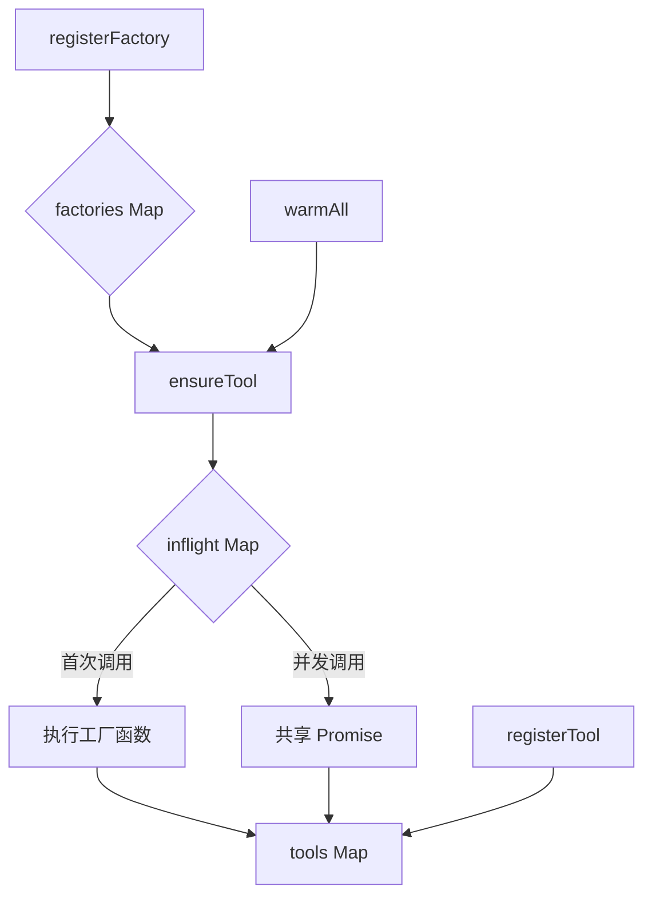
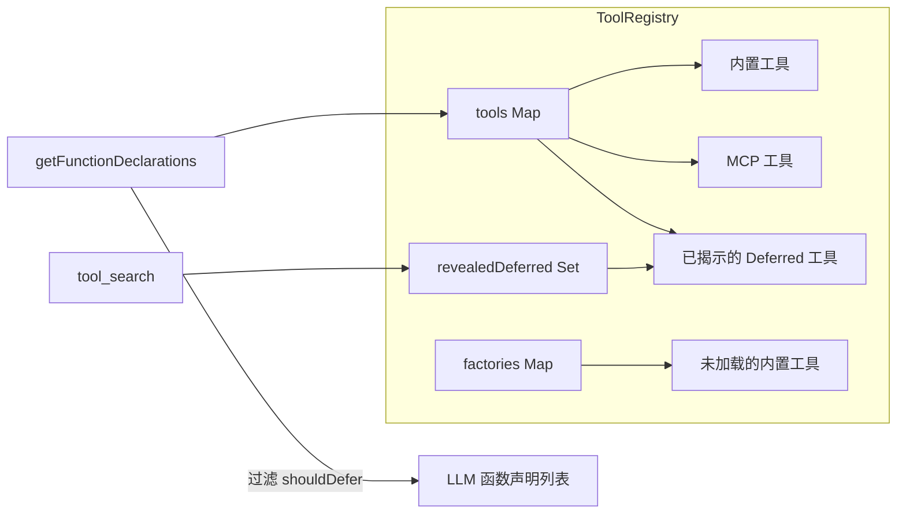
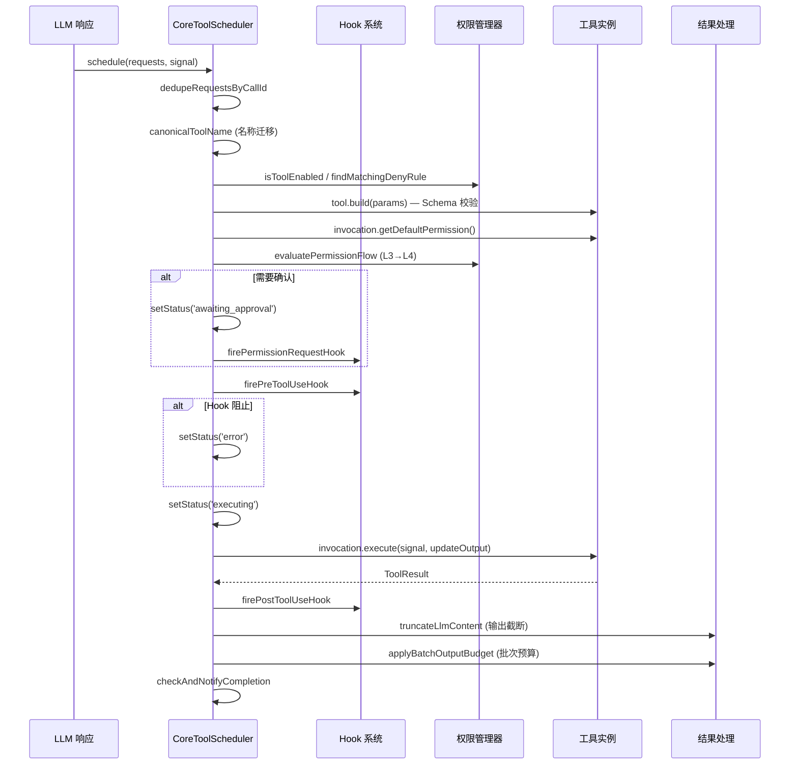
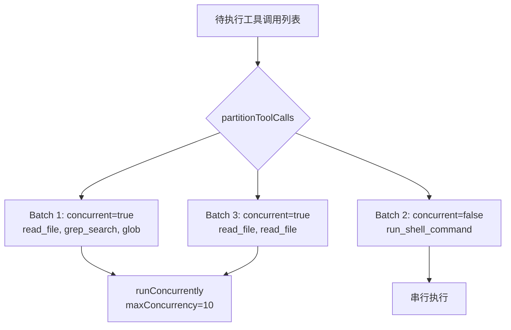
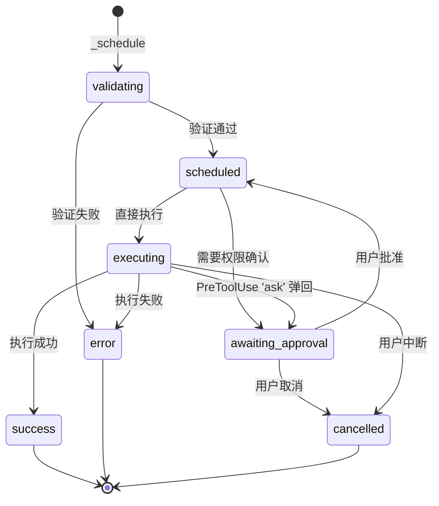
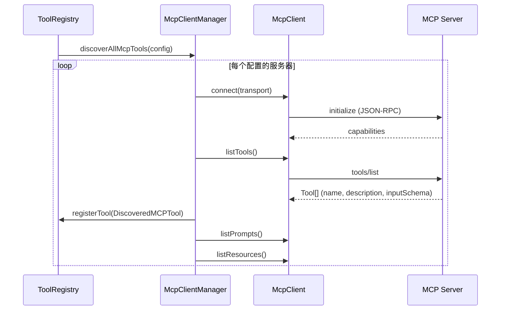
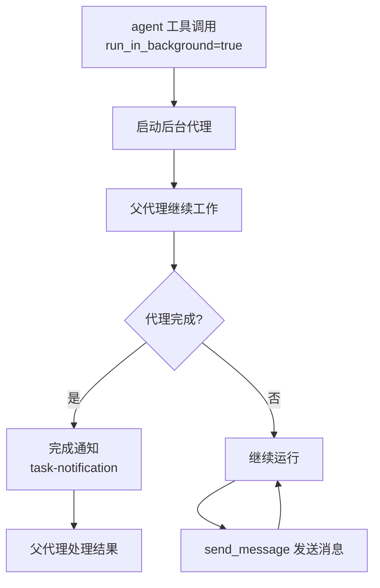
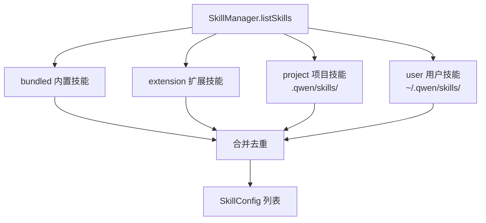
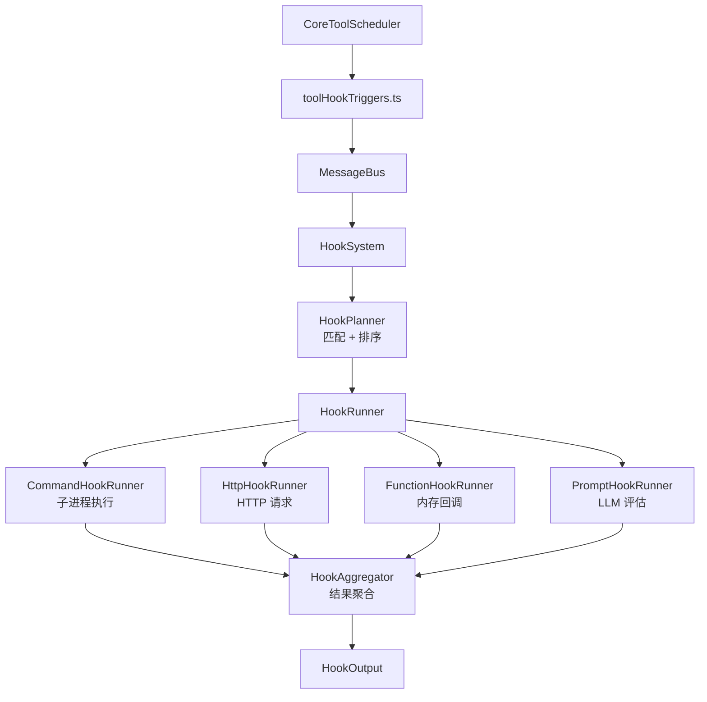
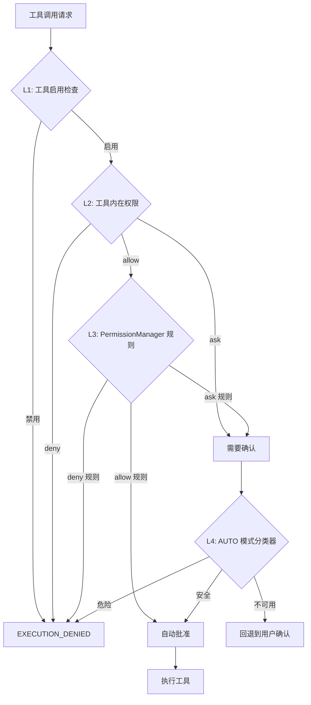

# 第6章 工具系统

## 6.1 工具注册表架构

### 6.1.1 设计概述

工具系统是 Qwen Code Agent 与外部开发环境交互的核心桥梁。该系统采用**声明式工具（Declarative Tool）** 架构，将工具的定义、验证与执行分离为独立的关注点。工具注册表（`ToolRegistry`）作为工具系统的中枢，管理所有内置工具、MCP 工具和延迟加载工具的完整生命周期。

> 源码路径：`packages/core/src/tools/tool-registry.ts`

### 6.1.2 ToolRegistry 类结构

`ToolRegistry` 类是工具系统的核心容器，维护三个关键数据结构：

```typescript
export class ToolRegistry {
  // 已实例化的工具，以 LLM 可见的工具名为键
  private tools: Map<string, AnyDeclarativeTool> = new Map();
  // 惰性工具工厂，以工具名为键——首次使用时解析
  private factories: Map<string, ToolFactory> = new Map();
  // 进行中的工厂 Promise——确保并发 ensureTool() 调用共享同一 Promise
  private inflight: Map<string, Promise<AnyDeclarativeTool>> = new Map();
  // 本会话中 ToolSearch 已加载的延迟工具集合
  private revealedDeferred: Set<string> = new Set();
  private config: Config;
  private mcpClientManager: McpClientManager;
}
```

该设计体现了**三阶段加载策略**：

1. **工厂注册阶段**：通过 `registerFactory(name, factory)` 注册惰性工厂函数，工具模块不被导入、工具不被实例化；
2. **按需解析阶段**：通过 `ensureTool(name)` 触发工厂执行，并发调用共享同一 in-flight Promise；
3. **批量预热阶段**：通过 `warmAll()` 并行加载所有待解析工厂，用于批量访问前的预热。



### 6.1.3 工具定义格式

每个工具通过 `DeclarativeTool` 抽象基类定义，其核心接口为 `ToolBuilder`：

```typescript
export interface ToolBuilder<
  TParams extends object,
  TResult extends ToolResult,
> {
  name: string; // 内部名称（用于 API 调用）
  displayName: string; // 用户友好的显示名称
  description: string; // 工具功能描述
  kind: Kind; // 工具分类（用于权限和并发控制）
  schema: FunctionDeclaration; // LLM 函数声明 schema
  isOutputMarkdown: boolean; // 输出是否为 Markdown 格式
  canUpdateOutput: boolean; // 是否支持流式输出
  build(params: TParams): ToolInvocation<TParams, TResult>;
}
```

`FunctionDeclaration` 遵循 Google GenAI SDK 的规范：

```typescript
get schema(): FunctionDeclaration {
  return {
    name: this.name,
    description: this.description,
    parametersJsonSchema: this.parameterSchema,
  };
}
```

### 6.1.4 工具分类体系（Kind 枚举）

工具按行为特征分为以下类别，该分类直接决定并发策略和权限模型：

```typescript
export enum Kind {
  Read = 'read', // 纯读取操作
  Edit = 'edit', // 编辑操作
  Delete = 'delete', // 删除操作
  Move = 'move', // 移动操作
  Search = 'search', // 搜索操作
  Execute = 'execute', // 执行操作（如 Shell 命令）
  Think = 'think', // 思考/规划操作
  Fetch = 'fetch', // 网络获取操作
  Agent = 'agent', // 子代理操作
  Other = 'other', // 其他
}
```

其中，**可变操作类型**（`MUTATOR_KINDS`）包括 `Edit`、`Delete`、`Move`、`Execute`，这些工具在执行前需要权限确认。**并发安全类型**（`CONCURRENCY_SAFE_KINDS`）包括 `Read`、`Search`、`Fetch`，这些工具可以安全地并行执行。

### 6.1.5 ToolNames 完整枚举

> 源码路径：`packages/core/src/tools/tool-names.ts`

系统定义了完整的工具名称常量表，避免循环依赖：

| 常量名             | 工具名               | 显示名           | 说明           |
| ------------------ | -------------------- | ---------------- | -------------- |
| EDIT               | `edit`               | Edit             | 文件编辑       |
| WRITE_FILE         | `write_file`         | WriteFile        | 文件写入       |
| READ_FILE          | `read_file`          | ReadFile         | 文件读取       |
| GREP               | `grep_search`        | Grep             | 内容搜索       |
| GLOB               | `glob`               | Glob             | 文件模式匹配   |
| SHELL              | `run_shell_command`  | Shell            | Shell 命令执行 |
| TODO_WRITE         | `todo_write`         | TodoList         | 任务列表管理   |
| MEMORY             | `save_memory`        | SaveMemory       | 记忆保存       |
| AGENT              | `agent`              | Agent            | 子代理启动     |
| SKILL              | `skill`              | Skill            | 技能调用       |
| EXIT_PLAN_MODE     | `exit_plan_mode`     | ExitPlanMode     | 退出规划模式   |
| ENTER_PLAN_MODE    | `enter_plan_mode`    | EnterPlanMode    | 进入规划模式   |
| WEB_FETCH          | `web_fetch`          | WebFetch         | 网页获取       |
| WEB_SEARCH         | `web_search`         | WebSearch        | 网络搜索       |
| IMAGE_GEN          | `image_gen`          | ImageGen         | 图像生成       |
| LS                 | `list_directory`     | ListFiles        | 目录列表       |
| LSP                | `lsp`                | Lsp              | 语言服务协议   |
| ASK_USER_QUESTION  | `ask_user_question`  | AskUserQuestion  | 用户交互       |
| CRON_CREATE        | `cron_create`        | CronCreate       | 定时任务创建   |
| CRON_LIST          | `cron_list`          | CronList         | 定时任务列表   |
| CRON_DELETE        | `cron_delete`        | CronDelete       | 定时任务删除   |
| LOOP_WAKEUP        | `loop_wakeup`        | LoopWakeup       | 循环唤醒       |
| CREATE_SUB_SESSION | `create_sub_session` | CreateSubSession | 子会话创建     |
| LIST_AGENTS        | `list_agents`        | ListAgents       | 代理列表       |
| TASK_STOP          | `task_stop`          | TaskStop         | 任务停止       |
| TASK_CREATE        | `task_create`        | TaskCreate       | 任务创建       |
| TASK_UPDATE        | `task_update`        | TaskUpdate       | 任务更新       |
| TASK_LIST          | `task_list`          | TaskList         | 任务列表       |
| TEAM_CREATE        | `team_create`        | TeamCreate       | 团队创建       |
| TEAM_DELETE        | `team_delete`        | TeamDelete       | 团队删除       |
| TEAM_PLAN_APPROVAL | `team_plan_approval` | TeamPlanApproval | 团队计划审批   |
| SEND_MESSAGE       | `send_message`       | SendMessage      | 消息发送       |
| STRUCTURED_OUTPUT  | `structured_output`  | StructuredOutput | 结构化输出     |
| MONITOR            | `monitor`            | Monitor          | 进程监控       |
| NOTEBOOK_EDIT      | `notebook_edit`      | NotebookEdit     | Notebook 编辑  |
| TOOL_SEARCH        | `tool_search`        | ToolSearch       | 工具搜索       |
| READ_MCP_RESOURCE  | `read_mcp_resource`  | ReadMcpResource  | MCP 资源读取   |
| ENTER_WORKTREE     | `enter_worktree`     | EnterWorktree    | 进入工作树     |
| EXIT_WORKTREE      | `exit_worktree`      | ExitWorktree     | 退出工作树     |
| WORKFLOW           | `workflow`           | Workflow         | 工作流         |
| ARTIFACT           | `artifact`           | Artifact         | 制品           |
| RECORD_ARTIFACT    | `record_artifact`    | RecordArtifact   | 制品记录       |

此外，系统维护了**工具名称迁移映射**以支持向后兼容：

```typescript
export const ToolNamesMigration = {
  search_file_content: ToolNames.GREP, // 旧版 grep 工具名
  replace: ToolNames.EDIT, // 旧版 edit 工具名
  task: ToolNames.AGENT, // 旧版 agent 工具名
} as const;
```

### 6.1.6 内置工具 vs MCP 工具 vs Deferred 工具

工具注册表管理三类工具：

**内置工具（Built-in Tools）**：通过 `registerFactory` 注册的惰性工厂或直接通过 `registerTool` 注册的实例。这些工具由系统核心提供，包括文件操作、搜索、Shell 执行等基础能力。

**MCP 工具（MCP Tools）**：通过 `McpClientManager` 从外部 MCP 服务器发现的工具，以 `DiscoveredMCPTool` 类表示。工具名以 `mcp__<serverName>__<toolName>` 格式命名，避免与内置工具冲突。

**延迟工具（Deferred Tools）**：标记 `shouldDefer=true` 的工具不出现在初始函数声明列表中，以节省 token 开销。模型通过 `tool_search` 工具按需发现并加载这些工具。一旦通过 `revealDeferredTool(name)` 揭示，工具的 schema 将被包含在后续的函数声明列表中。



### 6.1.7 工具描述加载机制

工具描述的加载遵循以下优先级：

1. **静态描述**：工具类构造函数中定义的 `description` 字段；
2. **动态发现描述**：`DiscoveredTool` 在描述中追加发现命令和调用命令的信息；
3. **MCP 工具描述**：从 MCP 服务器的 `listTools` 响应中获取；
4. **搜索提示词**：`searchHint` 字段提供额外的关键词匹配信息，供 `ToolSearch` 评分使用。

---

## 6.2 工具执行管线

### 6.2.1 CoreToolScheduler 概述

`CoreToolScheduler`（约 5400 行）是工具执行的核心调度器，负责从 LLM 响应中解析工具调用请求，经过验证、权限检查、并发调度、执行、结果处理的完整管线。

> 源码路径：`packages/core/src/core/coreToolScheduler.ts`



### 6.2.2 调度入口与请求队列

`schedule()` 方法是工具执行的唯一入口。当调度器正在运行时，新请求被推入 `requestQueue` 等待：

```typescript
schedule(
  request: ToolCallRequestInfo | ToolCallRequestInfo[],
  signal: AbortSignal,
  runtimeView?: RuntimeContentGeneratorView,
): Promise<void> {
  if (this.isRunning() || this.isScheduling) {
    return new Promise((resolve, reject) => {
      // 注册 abort 处理器以支持队列中取消
      signal.addEventListener('abort', abortHandler, { once: true });
      this.requestQueue.push({ request, signal, runtimeView, resolve, reject });
    });
  }
  return this._schedule(request, signal, runtimeView);
}
```

`_schedule` 方法执行以下关键步骤：

1. **去重**：`dedupeRequestsByCallId` 移除重复的 callId；
2. **名称规范化**：`canonicalToolName` 处理旧版工具名迁移；
3. **权限预检**：检查工具是否被 `disabledTools` 或 `permissionsDeny` 排除；
4. **Plan Mode 边界检测**：`findPlanModeEntryBatchBoundaryIndex` 确保 `enter_plan_mode` 不与兄弟工具调用混合；
5. **工具解析与验证**：通过 `ensureTool` 加载工具，调用 `build(params)` 进行 Schema 校验；
6. **验证重试循环检测**：`recordRetryableToolError` 追踪同一工具的重复验证失败，防止无限重试。

### 6.2.3 Schema 校验

工具参数校验通过 `BaseDeclarativeTool.build()` 方法实现两层验证：

```typescript
build(params: TParams): ToolInvocation<TParams, TResult> {
  const validationError = this.validateToolParams(params);
  if (validationError) {
    throw new Error(validationError);
  }
  return this.createInvocation(params);
}

override validateToolParams(params: TParams): string | null {
  // 第一层：JSON Schema 结构校验
  const errors = SchemaValidator.validate(
    this.schema.parametersJsonSchema, params
  );
  if (errors) return errors;
  // 第二层：语义值校验（子类覆写）
  return this.validateToolParamValues(params);
}
```

### 6.2.4 并发控制模型

并发控制是工具调度器的核心设计之一。系统通过 `partitionToolCalls` 函数将待执行的工具调用划分为**并发批次**和**串行批次**：

```typescript
// 并发安全的工具类型
export const CONCURRENCY_SAFE_KINDS: ReadonlySet<Kind> = new Set([
  Kind.Read, // 纯读取
  Kind.Search, // 搜索
  Kind.Fetch, // 网络获取
]);
```

**分区算法**：连续的安全工具被分组为并行批次；非安全工具各自形成独立的串行批次。对于 `Execute` 类型（Shell 命令），仅当 `isShellCommandReadOnly()` 返回 `true` 时才视为并发安全。



并发执行通过 `runConcurrently` 方法实现，使用信号量模式控制最大并发度：

```typescript
private async runConcurrently(calls: ScheduledToolCall[], signal: AbortSignal): Promise<void> {
  const maxConcurrency = parsePositiveIntegerEnv(
    process.env['QWEN_CODE_MAX_TOOL_CONCURRENCY'], 10
  );
  const executing = new Set<Promise<void>>();
  for (const call of calls) {
    const p = this.executeSingleToolCall(call, signal).finally(() => {
      executing.delete(p);
    });
    executing.add(p);
    if (executing.size >= maxConcurrency) {
      await Promise.race(executing);  // 等待任一完成
    }
  }
  await Promise.all(executing);
}
```

### 6.2.5 输出截断与持久化

工具输出经过多层截断策略以控制上下文窗口消耗：

**第一层：per-tool 预算**。每个工具可通过 `maxOutputChars` 属性声明自己的输出上限：

- `undefined`：使用全局截断阈值；
- `Infinity`：自管理（如 `ReadFile` 的行级分页），豁免调度器截断。

**第二层：全局截断**。`truncateLlmContent` 根据配置的阈值和行数限制进行截断，支持三种保留方向：

- `'head'`：保留开头（如 Shell 输出）；
- `'tail'`：保留结尾（如后台代理输出）；
- `'both'`：保留首尾（默认）。

**第三层：批次预算**。`applyBatchOutputBudget` 在所有工具调用完成后，对整批输出进行聚合预算控制：

```typescript
private async applyBatchOutputBudget(completedCalls: CompletedToolCall[]): Promise<CompletedToolCall[]> {
  const budget = this.config.getToolOutputBatchBudget?.() ?? Number.POSITIVE_INFINITY;
  if (!Number.isFinite(budget) || budget <= 0) return completedCalls;
  const finalized = await finalizeToolResponses(this.config, completedCalls.map(...));
  return completedCalls.map((call, index) => ({
    ...call,
    response: { ...call.response, responseParts: finalized[index].responseParts },
  }));
}
```

**持久化机制**：超出阈值的输出被写入磁盘文件，模型上下文中仅保留截断摘要和文件路径引用。`GATE_EXEMPT_TOOLS`（`read_file`、`read_mcp_resource`、`enter_plan_mode`）豁免持久化门控。

### 6.2.6 AbortSignal 传播

取消信号贯穿工具执行的完整生命周期：

1. **队列阶段**：`schedule()` 中注册 abort 监听器，支持从等待队列中移除请求；
2. **执行阶段**：`invocation.execute(signal, ...)` 将信号传递给工具实现；
3. **超时控制**：`QWEN_CODE_TOOL_EXECUTION_TIMEOUT_MS` 环境变量启用 per-tool 执行超时，通过派生 AbortSignal 实现；
4. **父信号转发**：`removeParentAbortForward` 确保父级取消正确传播到子执行。

### 6.2.7 工具调用状态机

每个工具调用经历以下状态转换：



---

## 6.3 内置工具完整目录

### 6.3.1 文件操作工具

#### read_file

- **名称**：`read_file`
- **类型**：`Kind.Read`
- **参数 Schema**：
  - `file_path`（string，必需）：文件的绝对路径
  - `offset`（integer，可选）：起始行号（0-based）
  - `limit`（integer，可选）：最大读取行数
  - `pages`（string，可选）：PDF 页码范围（如 `'1-5'`）
- **执行逻辑**：支持文本文件、图片（PNG/JPG/GIF/WEBP/SVG/BMP）、PDF 和 Jupyter Notebook 的读取。文本文件支持行范围分页；PDF 支持按页提取；大文件自动截断并提供分页指引。
- **安全考量**：`maxOutputChars` 设为 `Infinity`（自管理分页），豁免调度器截断。路径参数经过 `unescapePath` 规范化。

#### write_file

- **名称**：`write_file`
- **类型**：`Kind.Edit`
- **参数 Schema**：
  - `file_path`（string，必需）：绝对路径
  - `content`（string，必需）：写入内容
- **执行逻辑**：创建或覆盖文件。执行前生成 diff 供用户确认。支持用户通过 `payload.newContent` 修改提议内容。
- **安全考量**：需要权限确认（`getDefaultPermission()` 返回 `'ask'`）。确认对话框展示完整 diff。

#### edit

- **名称**：`edit`
- **类型**：`Kind.Edit`
- **参数 Schema**：
  - `file_path`（string，必需）：绝对路径
  - `old_string`（string，必需）：要替换的精确文本（需包含 3 行以上上下文）
  - `new_string`（string，必需）：替换后的文本
  - `replace_all`（boolean，可选）：是否替换所有匹配
- **执行逻辑**：精确匹配 `old_string` 并替换为 `new_string`。默认仅替换首次出现。要求 `old_string` 包含足够上下文以唯一标识目标位置。
- **安全考量**：验证 `old_string` 唯一性；截断响应检测（防止模型因 max_tokens 限制产生不完整内容）；`TRUNCATION_EDIT_REJECTION` 机制拒绝可疑的截断编辑。

#### notebook_edit

- **名称**：`notebook_edit`
- **类型**：`Kind.Edit`
- **参数 Schema**：
  - `notebook_path`（string，必需）：`.ipynb` 文件绝对路径
  - `cell_id`（string，可选）：目标 cell ID
  - `new_source`（string，可选）：新的 cell 内容
  - `cell_type`（enum，可选）：`code` | `markdown`
  - `edit_mode`（enum，可选）：`replace` | `insert` | `delete`
- **执行逻辑**：在 cell 级别安全编辑 Jupyter Notebook，支持替换、插入和删除操作。

### 6.3.2 搜索与浏览工具

#### glob

- **名称**：`glob`
- **类型**：`Kind.Search`
- **参数 Schema**：
  - `pattern`（string，必需）：glob 模式（如 `**/*.ts`）
  - `path`（string，可选）：搜索目录
- **执行逻辑**：基于文件系统模式匹配，返回按修改时间排序的匹配文件路径列表。
- **安全考量**：并发安全（`Kind.Search`），可并行执行。

#### grep_search

- **名称**：`grep_search`
- **类型**：`Kind.Search`
- **参数 Schema**：
  - `pattern`（string，必需）：正则表达式模式
  - `path`（string，可选）：搜索路径
  - `glob`（string，可选）：文件过滤 glob
  - `limit`（integer，可选）：结果行数限制
- **执行逻辑**：基于 ripgrep 实现高性能内容搜索。支持完整正则语法、文件类型过滤和结果限制。
- **安全考量**：并发安全；输出受 per-tool 字符预算控制。

#### list_directory

- **名称**：`list_directory`
- **类型**：`Kind.Read`
- **参数 Schema**：
  - `path`（string，必需）：绝对目录路径
  - `ignore`（array，可选）：忽略的 glob 模式列表
  - `file_filtering_options`（object，可选）：是否尊重 .gitignore/.qwenignore
- **执行逻辑**：列出目录直接子项（文件和子目录），支持忽略模式过滤。

### 6.3.3 执行工具

#### run_shell_command

- **名称**：`run_shell_command`
- **类型**：`Kind.Execute`
- **参数 Schema**：
  - `command`（string，必需）：bash 命令
  - `description`（string，可选）：命令描述
  - `directory`（string，可选）：执行目录
  - `timeout`（number，可选）：超时毫秒数（最大 600000）
  - `is_background`（boolean，可选）：是否后台运行
- **执行逻辑**：通过 PTY（伪终端）执行 bash 命令，支持前台/后台模式。前台命令捕获完整输出；后台命令返回进程组 ID 用于后续管理。支持实时输出流（`canUpdateOutput=true`）和心跳机制（`ShellProgressData`）。
- **安全考量**：
  - `getDefaultPermission()` 根据命令内容判断：只读命令（`cat`、`ls`、`git status`）返回 `'allow'`，其他返回 `'ask'`；
  - `isShellCommandReadOnly()` 检查决定并发安全性；
  - 命令替换检测（`$()`、反引号）可能触发 `'deny'`；
  - 子进程环境经过 `sanitizeChildEnv` 清洗，移除内部守护进程密钥；
  - 支持 `QWEN_CODE_TOOL_EXECUTION_TIMEOUT_MS` 超时保护。

#### monitor

- **名称**：`monitor`
- **类型**：`Kind.Execute`
- **参数 Schema**：
  - `command`（string，必需）：要监控的命令
  - `description`（string，可选）：描述
  - `directory`（string，可选）：执行目录
  - `max_events`（integer，可选）：最大事件数（默认 1000，最大 10000）
  - `idle_timeout_ms`（integer，可选）：空闲超时（默认 300000ms）
- **执行逻辑**：启动长时间运行的命令并将 stdout/stderr 作为事件通知流式传回。适用于日志监控（`tail -f`）、构建监视（`--watch`）和状态轮询。达到 max_events 或 idle_timeout 后自动停止并终止进程。

### 6.3.4 代理与交互工具

#### agent

- **名称**：`agent`
- **类型**：`Kind.Agent`
- **参数 Schema**：
  - `prompt`（string，必需）：子代理任务描述
  - `description`（string，必需）：3-5 词简短描述
  - `subagent_type`（string，可选）：代理类型或 `"fork"`
  - `run_in_background`（boolean，可选）：是否后台运行
  - `isolation`（enum，可选）：`"worktree"` 隔离模式
  - `fork_turns`（string，可选）：Fork 继承的最近轮次数
  - `name`（string，可选）：代理显示名
  - `model`（string，可选）：模型选择器
  - `working_dir`（string，可选）：工作目录固定
- **执行逻辑**：启动独立子代理进程处理复杂多步骤任务。支持前台（结果内联返回）和后台（通过完成通知报告）两种模式。Fork 模式继承父对话上下文。
- **安全考量**：子代理的工具集可通过 `SubagentConfig.tools` 和 `disallowedTools` 过滤；后台代理不能提示用户确认。

#### ask_user_question

- **名称**：`ask_user_question`
- **类型**：`Kind.Think`
- **参数 Schema**：
  - `questions`（array，必需）：1-4 个问题对象
    - `question`（string）：完整问题
    - `header`（string）：短标签（最大 12 字符）
    - `options`（array）：2-4 个选项（label + description）
    - `multiSelect`（boolean）：是否多选
- **执行逻辑**：在执行过程中向用户展示结构化问题，收集偏好、澄清歧义或获取决策。用户始终可选择 "Other" 输入自定义文本。
- **安全考量**：`requiresUserInteraction()` 返回 `true`，权限规则和自动批准模式不能满足此要求。

#### send_message

- **名称**：`send_message`
- **类型**：`Kind.Agent`
- **参数 Schema**：
  - `task_id`（string，必需）：目标代理任务 ID
  - `message`（string，必需）：消息内容
- **执行逻辑**：向正在运行的后台代理发送消息。运行中的代理在下一个工具轮次边界接收消息；暂停的代理以此作为恢复指令。

#### list_agents

- **名称**：`list_agents`
- **类型**：`Kind.Read`
- **执行逻辑**：列出当前会话中所有活跃的子代理及其状态。

### 6.3.5 规划与任务管理工具

#### enter_plan_mode

- **名称**：`enter_plan_mode`
- **类型**：`Kind.Think`
- **执行逻辑**：将会话切换到规划模式，此后仅允许只读工具调用，直到用户批准计划并退出。

#### exit_plan_mode

- **名称**：`exit_plan_mode`
- **类型**：`Kind.Think`
- **参数 Schema**：
  - `plan`（string，必需）：计划内容
- **执行逻辑**：提交计划供用户审批。批准后恢复之前的审批模式。批准后，大型 `plan` 参数从模型历史中替换为文件指针（`approvedPlanRedactionText`），避免注意力窗口浪费。

#### todo_write

- **名称**：`todo_write`
- **类型**：`Kind.Think`
- **参数 Schema**：
  - `todos`（array，必需）：任务项列表
    - `id`（string）：唯一标识
    - `content`（string）：任务描述
    - `status`（enum）：`pending` | `in_progress` | `completed`
- **执行逻辑**：创建或更新用户可见的任务列表。保持最多一个 `in_progress` 任务。触发 `TodoCreated`/`TodoCompleted` 钩子事件。

#### task_create / task_update / task_list / task_stop

- **类型**：任务管理系列工具
- **执行逻辑**：管理后台任务的生命周期——创建、状态更新、列表查询和停止。

### 6.3.6 技能与工具发现

#### skill

- **名称**：`skill`
- **类型**：`Kind.Think`
- **参数 Schema**：
  - `skill`（string，必需）：技能名称
  - `args`（string，可选）：命令参数
- **执行逻辑**：在主对话中执行指定技能。技能提供专门化的领域知识和工作流程。支持 `modelOverride` 传播，允许技能指定后续轮次使用的模型。

#### tool_search

- **名称**：`tool_search`
- **类型**：`Kind.Read`
- **参数 Schema**：
  - `query`（string，必需）：搜索查询
  - `max_results`（integer，可选）：最大结果数（默认 5）
- **执行逻辑**：按名称或关键词搜索延迟加载的工具，返回匹配的函数声明并注册到会话中。查询格式：
  - `"select:ToolA,ToolB"`：按名称精确选择
  - `"keyword phrase"`：关键词搜索
  - `"+must-word other"`：必选词加权
- **安全考量**：标记 `alwaysLoad=true`，始终包含在函数声明列表中。揭示的工具通过 `revealDeferredTool` 加入后续声明。

### 6.3.7 网络与外部资源工具

#### web_fetch

- **名称**：`web_fetch`
- **类型**：`Kind.Fetch`
- **参数 Schema**：
  - `url`（string，必需）：目标 URL
  - `prompt`（string，必需）：内容处理提示
  - `format`（enum，可选）：`auto` | `markdown` | `html` | `text`
- **执行逻辑**：获取 URL 内容，将 HTML 转换为 Markdown，然后使用 AI 模型根据 prompt 处理内容。支持内容协商、重定向检测、二进制内容本地保存。15 分钟内重复获取同一 URL 使用本地缓存。
- **安全考量**：并发安全（`Kind.Fetch`）；不能访问需认证的私有 URL。

#### web_search

- **名称**：`web_search`
- **类型**：`Kind.Fetch`
- **执行逻辑**：执行网络搜索并返回结果。

#### read_mcp_resource

- **名称**：`read_mcp_resource`
- **类型**：`Kind.Read`
- **参数 Schema**：
  - `server_name`（string，必需）：MCP 服务器名称
  - `uri`（string，必需）：资源 URI
- **执行逻辑**：从配置的 MCP 服务器读取资源。仅在受信任文件夹中可用。
- **安全考量**：豁免持久化门控（`GATE_EXEMPT_TOOLS`）；输出在 `formatMcpResourceContents` 中自行限制大小。

### 6.3.8 其他工具

#### create_sub_session

- **名称**：`create_sub_session`
- **类型**：`Kind.Agent`
- **参数 Schema**：
  - `prompt`（string，必需）：自包含的执行提示
  - `completion`（enum，可选）：`first-turn`（等待结果）| `sent`（即发即忘）
  - `model`（string，可选）：模型服务 ID
  - `name`（string，可选）：子会话显示名
- **执行逻辑**：生成独立的子会话（拥有自己的清洁上下文和转录），在其中运行提示。仅在 `qwen serve` 守护进程模式下可用。

#### loop_wakeup

- **名称**：`loop_wakeup`
- **类型**：`Kind.Think`
- **参数 Schema**：
  - `delaySeconds`（number，必需）：唤醒延迟（60-3600 秒）
  - `prompt`（string，必需）：续行提示（最大 10000 字符）
  - `reason`（string，可选）：延迟原因
- **执行逻辑**：调度自定步循环的下一次迭代。仅会话有效，不持久化。自定步唤醒链最长运行 24 小时。

#### cron_create / cron_list / cron_delete

- **类型**：定时任务管理系列
- **执行逻辑**：创建、列出和删除基于 cron 表达式的定时任务。

#### lsp

- **名称**：`lsp`
- **类型**：`Kind.Read`
- **执行逻辑**：与语言服务器协议交互，获取代码智能信息（定义跳转、引用查找、诊断等）。

#### image_gen

- **名称**：`image_gen`
- **类型**：`Kind.Other`
- **执行逻辑**：调用图像生成模型创建图像。

#### structured_output

- **名称**：`structured_output`
- **类型**：`Kind.Other`
- **执行逻辑**：当通过 `--json-schema` 配置时，强制模型输出符合指定 JSON Schema 的结构化数据。

#### enter_worktree / exit_worktree

- **类型**：Git 工作树管理
- **执行逻辑**：进入或退出隔离的 git worktree，用于并行开发或子代理隔离。

#### workflow

- **名称**：`workflow`
- **类型**：`Kind.Other`
- **执行逻辑**：执行预定义的多步骤工作流。

#### artifact / record_artifact

- **类型**：制品管理
- **执行逻辑**：创建和记录结构化制品（文件、链接、HTML、图像等），供守护进程/会话表面消费。

#### save_memory

- **名称**：`save_memory`
- **类型**：`Kind.Think`
- **执行逻辑**：将信息持久化到基于文件的记忆系统中。

---

## 6.4 MCP 集成

### 6.4.1 协议概述

Qwen Code 实现了完整的 **Model Context Protocol (MCP)** 客户端，支持通过标准化协议与外部工具服务器交互。MCP 基于 JSON-RPC 2.0，支持多种传输层。

> 源码路径：`packages/core/src/tools/mcp-client.ts`、`packages/core/src/tools/mcp-client-manager.ts`

### 6.4.2 传输层支持

系统支持以下传输类型：

```typescript
export type McpTransportKind =
  | 'stdio' // 标准输入/输出（子进程）
  | 'sse' // Server-Sent Events
  | 'http' // Streamable HTTP
  | 'websocket' // WebSocket
  | 'sdk' // SDK 控制平面
  | 'unknown'; // 配置错误
```

**Stdio 传输**：通过 `StdioClientTransport` 启动子进程，使用 stdin/stdout 进行 JSON-RPC 通信。子进程环境经过 `sanitizeChildEnv` 清洗。

**SSE 传输**：通过 `SSEClientTransport` 连接远程服务器，支持 OAuth 认证。401 错误触发重新认证流程。

**Streamable HTTP 传输**：通过 `StreamableHTTPClientTransport` 实现，支持 GET SSE 回退（状态码 400 时降级）。

**SDK 传输**：通过 `SdkControlClientTransport` 实现，用于 SDK 模式下的控制平面通信。

### 6.4.3 MCP 服务器配置

服务器配置通过 `MCPServerConfig` 定义，支持以下字段：

```typescript
interface MCPServerConfig {
  command?: string; // stdio 命令
  args?: string[]; // 命令参数
  env?: Record<string, string>; // 环境变量
  url?: string; // SSE/HTTP URL
  headers?: Record<string, string>; // HTTP 头
  authProvider?: AuthProviderType; // 认证提供者
  // ... 更多配置
}
```

### 6.4.4 工具发现（listTools）

`McpClientManager.discoverAllMcpTools()` 执行工具发现流程：



每个发现的工具被包装为 `DiscoveredMCPTool` 实例：

```typescript
export class DiscoveredMCPTool extends BaseDeclarativeTool<
  ToolParams,
  ToolResult
> {
  readonly serverName: string;
  readonly serverToolName: string;
  readonly permissionAliases: readonly string[];
  readonly trust?: boolean;
  // MCP 工具注解
  readonly annotations?: McpToolAnnotations;
}
```

**MCP 工具注解**（`McpToolAnnotations`）提供行为提示：

```typescript
export interface McpToolAnnotations {
  readOnlyHint?: boolean; // 只读提示
  destructiveHint?: boolean; // 破坏性提示
  idempotentHint?: boolean; // 幂等性提示
  openWorldHint?: boolean; // 开放世界提示
}
```

### 6.4.5 惰性加载机制（Deferred Tools）

MCP 工具默认标记为 `shouldDefer=true`，不出现在初始函数声明列表中。这通过以下机制实现：

1. **初始排除**：`getFunctionDeclarations()` 过滤 `shouldDefer && !alwaysLoad && !revealed` 的工具；
2. **按需发现**：模型通过 `tool_search` 工具搜索并加载延迟工具；
3. **揭示持久化**：`revealDeferredTool(name)` 将工具加入 `revealedDeferred` 集合，后续声明列表包含该工具；
4. **会话重置**：`clearRevealedDeferredTools()` 在 `/clear` 时重置揭示状态。

```typescript
getFunctionDeclarations(options?: { includeDeferred?: boolean }): FunctionDeclaration[] {
  return Array.from(this.tools.values())
    .filter(tool =>
      includeDeferred ||
      !tool.shouldDefer ||
      tool.alwaysLoad ||
      !this.isDeferredAndHidden(tool.name)
    )
    .sort(ToolRegistry.compareToolsByDeclarationName)
    .map(tool => tool.schema);
}
```

### 6.4.6 连接管理与健康检查

`McpClientManager` 实现了完整的连接生命周期管理：

**健康监控配置**：

```typescript
export interface MCPHealthMonitorConfig {
  checkIntervalMs: number; // 健康检查间隔（默认 30s）
  maxConsecutiveFailures: number; // 连续失败阈值（默认 3）
  autoReconnect: boolean; // 自动重连（默认 true）
  reconnectDelayMs: number; // 重连延迟（默认 5s）
}
```

**服务器状态枚举**（`MCPServerStatus`）：

- `CONNECTED`：已连接
- `DISCONNECTED`：已断开
- `CONNECTING`：连接中
- `ERROR`：错误

**预算控制**：`McpBudgetConfig` 实现 per-session 的 MCP 客户端数量上限：

```typescript
export interface McpBudgetConfig {
  clientBudget?: number; // 客户端数量上限
  budgetMode: McpBudgetMode; // 'enforce' | 'warn' | 'off'
  onBudgetEvent?: (event: McpBudgetEvent) => void;
}
```

预算事件通过双阈值迟滞机制避免告警风暴：

- 上阈值 `MCP_BUDGET_WARN_FRACTION = 0.75`：触发 `budget_warning`
- 下阈值 `MCP_BUDGET_REARM_FRACTION = 0.375`：重新武装

### 6.4.7 热重载

工具发现支持增量更新：

- `discoverToolsForServer(serverName)`：重新发现单个服务器的工具，先移除旧工具再重新注册；
- `restartMcpServers()`：重启所有 MCP 服务器并重新发现；
- 移除工具时同步清除 `revealedDeferred` 状态，防止跨会话状态泄漏。

### 6.4.8 MCP 工具执行

`DiscoveredMCPToolInvocation.execute()` 通过 MCP SDK 的 `callTool` 方法执行远程工具：

```typescript
async execute(signal: AbortSignal, updateOutput?): Promise<ToolResult> {
  const result = await this.mcpTool.callTool({
    name: this.serverToolName,
    arguments: this.params,
    _meta: { [INVOCATION_CONTEXT_META_KEY]: getInvocationContext() },
  }, undefined, {
    onprogress: (progress) => { /* 进度通知 */ },
    signal,
  });
  // 处理 McpContentBlock[] 响应
}
```

支持自动重连（最多 3 次重试）和连接错误模式检测：

```typescript
const MCP_CONNECTION_ERROR_PATTERNS = [
  /ECONNREFUSED/i,
  /ENOTFOUND/i,
  /ECONNRESET/i,
  /ETIMEDOUT/i,
  /connection (closed|lost)/i,
  /not connected/i,
  /disconnected/i,
  /transport closed/i,
];
```

---

## 6.5 子代理与 Fork 系统

### 6.5.1 Agent 工具实现

> 源码路径：`packages/core/src/tools/agent/`、`packages/core/src/subagents/`

`agent` 工具是 Qwen Code 多代理架构的入口。它支持多种代理类型和运行模式：

**代理类型**（`subagent_type`）：

- `general-purpose`：通用代理，继承所有工具；
- `Explore`：快速代码探索代理，仅只读工具；
- `fork`：继承父对话上下文的 Fork 代理；
- 自定义代理：通过 `.qwen/agents/` 目录定义。

**运行模式**：

- 前台（默认）：结果内联返回给父代理；
- 后台（`run_in_background: true`）：通过完成通知异步报告。

### 6.5.2 SubagentConfig 配置格式

子代理通过 Markdown 文件（带 YAML frontmatter）定义：

```typescript
export interface SubagentConfig {
  name: string; // 唯一标识
  description: string; // 使用场景描述
  tools?: string[]; // 允许的工具白名单
  disallowedTools?: string[]; // 禁止的工具黑名单
  approvalMode?: string; // 权限模式
  systemPrompt: string; // 系统提示
  level: SubagentLevel; // 存储层级
  model?: string; // 模型选择器
  runConfig?: Partial<RunConfig>; // 运行时配置
  background?: boolean; // 默认后台运行
  maxTurns?: number; // 最大轮次
  mcpServers?: Record<string, unknown>; // per-agent MCP 服务器
  hooks?: Record<string, unknown>; // per-agent 钩子
}
```

**存储层级优先级**（从高到低）：

1. `session`：运行时提供的会话级代理（只读）
2. `project`：`.qwen/agents/` 项目目录
3. `user`：`~/.qwen/agents/` 用户目录
4. `extension`：扩展提供
5. `builtin`：内置代理（最低优先级）

### 6.5.3 内置代理

系统提供两个内置代理：

**general-purpose**：通用代理，继承所有可用工具，适用于复杂多步骤任务。系统提示强调：

- 仅完成分配的任务，不扩展范围
- 使用绝对路径
- 返回简洁报告

**Explore**：快速代码探索代理，严格只读。工具白名单：

```typescript
tools: [
  ToolNames.READ_FILE,
  ToolNames.GREP,
  ToolNames.GLOB,
  ToolNames.SHELL,
  ToolNames.LS,
  ToolNames.WEB_FETCH,
  ToolNames.SKILL,
  ToolNames.LSP,
];
```

系统提示明确禁止任何文件修改操作，Shell 仅限只读命令。

### 6.5.4 Fork 上下文继承

Fork 代理（`subagent_type: "fork"`）继承父对话的完整上下文或指定窗口：

- `fork_turns` 省略或 `"all"`：继承完整父对话
- `fork_turns: "3"`：仅继承最近 3 个用户轮次

Fork 共享父代的 prompt cache，因此不应设置不同的 `model`（不同模型无法复用缓存）。

### 6.5.5 后台任务管理

后台代理的生命周期管理：



**关键约束**：

- 后台代理不能提示用户确认（`getShouldAvoidPermissionPrompts()` 返回 `true`）
- `bubble` 审批模式允许后台代理将确认请求"冒泡"到父会话 UI
- 后台代理的 `truncateKeep` 设为 `'tail'`，保留最新输出

### 6.5.6 子代理工具过滤

工具过滤通过 `ToolConfig` 实现：

```typescript
interface ToolConfig {
  allowedTools?: string[]; // 白名单
  disallowedTools?: string[]; // 黑名单（在白名单之后应用）
}
```

过滤规则：

1. 如果指定 `tools` 白名单，仅保留白名单中的工具；
2. `disallowedTools` 黑名单在白名单之后应用；
3. 支持 MCP 服务器级模式（如 `"mcp__server"` 阻止该服务器所有工具）；
4. MCP 工具始终绕过白名单（除非被黑名单显式排除）。

### 6.5.7 Agent 团队（Teammates）

> 源码路径：`packages/core/src/agents/team/`

团队系统允许创建命名的代理组，支持：

- `team_create`：创建团队
- `team_delete`：删除团队
- `team_plan_approval`：团队计划审批
- `task_create`/`task_update`/`task_list`：任务分配与追踪

---

## 6.6 技能系统（Skills）

### 6.6.1 设计概述

技能系统为 Qwen Code 提供可扩展的领域知识和工作流程。每个技能是一个包含 `SKILL.md` 文件的目录，通过 YAML frontmatter 定义元数据，Markdown 正文描述技能内容。

> 源码路径：`packages/core/src/skills/`

### 6.6.2 Skill 定义格式

```typescript
export interface SkillConfig {
  name: string; // 唯一名称标识
  description: string; // 功能描述
  allowedTools?: string[]; // 技能激活时自动批准的工具
  hooks?: SkillHooksSettings; // 技能关联的钩子
  model?: string; // 模型覆盖
  level: SkillLevel; // 存储层级
  filePath: string; // SKILL.md 绝对路径
  skillRoot?: string; // 技能根目录
  body: string; // Markdown 正文
  argumentHint?: string; // 参数提示
  whenToUse?: string; // 使用场景描述
  disableModelInvocation?: boolean; // 禁止模型调用
  userInvocable?: boolean; // 用户可直接调用
  paths?: string[]; // 条件激活的 glob 模式
  priority?: number; // 显示优先级
}
```

**SKILL.md 示例结构**：

```markdown
---
name: review
description: Review changed code for correctness and security
when_to_use: When the user asks to review code changes
allowedTools:
  - 'Bash(git *)'
  - 'Read'
model: fast
paths:
  - 'src/**/*.ts'
priority: 10
---

# Code Review Skill

[技能正文内容...]
```

### 6.6.3 三层加载机制

技能从三个层级加载，按优先级排序：



**内置技能目录**：`packages/core/src/skills/bundled/`，随分发包一起发布。

**加载流程**：

1. 扫描各层级目录下的 `<skill-name>/SKILL.md` 文件；
2. 解析 YAML frontmatter（使用自定义 `parseYaml`）；
3. 验证名称安全性（`SKILL_NAME_PATTERN = /^[\p{L}\p{N}_:.-]+$/u`）；
4. 验证 `paths` 字段（拒绝绝对路径和 `..` 逃逸）；
5. 缓存到 `skillsCache`。

### 6.6.4 触发条件与执行

技能有两种触发方式：

**模型触发**：模型通过 `skill` 工具调用技能。`whenToUse` 字段帮助模型判断何时使用。`disableModelInvocation=true` 的技能对模型不可见。

**用户触发**：用户通过 `/<skill-name>` 斜杠命令直接调用。`userInvocable=false` 的技能不可用户调用。

**条件激活**：当 `paths` 字段非空时，技能为"条件技能"——初始不出现在 SkillTool 列表中，直到工具调用触及匹配的文件路径：

```typescript
// SkillActivationRegistry 负责路径匹配激活
matchAndActivateByPaths(paths: string[]): ActivatedSkillEntry[]
```

激活后，系统通过 `<system-reminder>` 通知模型新可用的技能。

### 6.6.5 文件监听与热重载

`SkillManager` 使用 chokidar 监听技能目录变化：

```typescript
export const WATCHER_MAX_DEPTH = 2; // 固定布局，depth 2 足够

export function watcherIgnored(
  filePath: string,
  stats?: fsSync.Stats,
): boolean {
  if (stats && !stats.isFile() && !stats.isDirectory()) return true;
  return filePath.split(path.sep).includes('.git');
}
```

变化检测后：

1. `refreshCache()` 重新扫描并解析技能；
2. `notifyChangeListeners()` 通知所有注册的监听器（如 `SkillTool.refreshSkills()`）；
3. 监听器并行执行（`Promise.allSettled`），每个有 30 秒超时保护。

### 6.6.6 技能执行副作用

技能激活时可产生以下副作用：

- **工具自动批准**：`allowedTools` 中的每个条目作为会话级 allow 规则添加；
- **钩子注册**：`hooks` 中定义的钩子注册为会话级钩子；
- **模型覆盖**：`model` 字段通过 `ToolResult.modelOverride` 传播，影响后续轮次。

---

## 6.7 生命周期钩子（Hooks）

### 6.7.1 设计概述

钩子系统为 Qwen Code 的工具执行和会话生命周期提供可扩展的拦截点。钩子可在工具执行前后注入自定义逻辑，实现审计、安全策略、外部集成等功能。

> 源码路径：`packages/core/src/hooks/`

### 6.7.2 钩子事件类型

系统定义了完整的生命周期事件枚举：

```typescript
export enum HookEventName {
  // 工具生命周期
  PreToolUse = 'PreToolUse', // 工具执行前
  PostToolUse = 'PostToolUse', // 工具执行后（成功）
  PostToolUseFailure = 'PostToolUseFailure', // 工具执行失败后
  PostToolBatch = 'PostToolBatch', // 一批工具调用全部解析后

  // 会话生命周期
  SessionStart = 'SessionStart', // 会话开始
  SessionEnd = 'SessionEnd', // 会话结束
  Stop = 'Stop', // 助手响应结束前
  StopFailure = 'StopFailure', // API 错误导致轮次结束
  MessageDisplay = 'MessageDisplay', // 助手回复流式输出中

  // 用户交互
  UserPromptSubmit = 'UserPromptSubmit', // 用户提交提示
  UserPromptExpansion = 'UserPromptExpansion', // 斜杠命令展开

  // 子代理
  SubagentStart = 'SubagentStart', // 子代理启动
  SubagentStop = 'SubagentStop', // 子代理结束前

  // 上下文管理
  PreCompact = 'PreCompact', // 对话压缩前
  PostCompact = 'PostCompact', // 对话压缩后

  // 权限
  PermissionRequest = 'PermissionRequest', // 权限对话框显示时
  PermissionDenied = 'PermissionDenied', // 工具调用被拒绝时

  // 通知
  Notification = 'Notification', // 通知发送时

  // Qwen Code 特有
  TodoCreated = 'TodoCreated', // 新 todo 项添加
  TodoCompleted = 'TodoCompleted', // todo 项完成
  InstructionsLoaded = 'InstructionsLoaded', // 指令文件加载
}
```

### 6.7.3 钩子配置格式

钩子通过 `HookDefinition` 定义，支持匹配器和顺序执行控制：

```typescript
export interface HookDefinition {
  matcher?: string; // 工具名匹配模式
  sequential?: boolean; // 是否顺序执行（默认并行）
  hooks: HookConfig[]; // 钩子配置列表
}
```

**四种钩子实现类型**：

```typescript
export enum HookType {
  Command = 'command', // 外部命令
  Http = 'http', // HTTP 请求
  Function = 'function', // 内存函数
  Prompt = 'prompt', // LLM 评估
}
```

#### Command Hook

```typescript
export interface CommandHookConfig {
  type: HookType.Command;
  command: string; // 要执行的命令
  name?: string; // 钩子名称
  timeout?: number; // 超时（默认 60s）
  env?: Record<string, string>; // 环境变量
  async?: boolean; // 异步执行
  shell?: 'bash' | 'powershell';
  statusMessage?: string; // 执行时显示的状态
}
```

#### HTTP Hook

```typescript
export interface HttpHookConfig {
  type: HookType.Http;
  url: string; // 目标 URL
  headers?: Record<string, string>;
  allowedEnvVars?: string[];
  timeout?: number;
  if?: string; // 条件表达式
  once?: boolean; // 仅执行一次
}
```

#### Function Hook

```typescript
export interface FunctionHookConfig {
  type: HookType.Function;
  callback: FunctionHookCallback; // 回调函数
  errorMessage: string;
  onHookSuccess?: (result: HookExecutionResult) => void;
}
```

#### Prompt Hook

```typescript
export interface PromptHookConfig {
  type: HookType.Prompt;
  prompt: string; // 提示模板（$ARGUMENTS 占位符）
  model?: string; // 模型覆盖
  timeout?: number; // 默认 30s
}
```

### 6.7.4 阻塞 vs 非阻塞语义

钩子输出通过 `HookOutput` 接口控制执行流：

```typescript
export interface HookOutput {
  continue?: boolean; // false = 停止执行
  stopReason?: string; // 停止原因
  decision?: HookDecision; // 'ask' | 'block' | 'deny' | 'approve' | 'allow'
  reason?: string; // 决策原因
  hookSpecificOutput?: Record<string, unknown>;
}
```

**PreToolUse 钩子的三种决策**：

- `'allow'`：允许工具执行（默认）
- `'deny'`：拒绝执行，返回错误给模型
- `'ask'`：要求用户在 TUI 中确认

**阻塞行为**：

- `decision: 'block'` 或 `'deny'`：工具执行被阻止，错误响应返回给模型
- `continue: false`：停止当前批次后续处理
- 钩子执行失败（传输错误）：**不阻塞**工具执行（fail-open），但记录 `hookError`

**PostToolBatch 特殊语义**：

- `shouldStopExecution()` 返回 `true` 时，替换最后一个响应为停止消息
- 支持 `additionalContext` 追加到批次结果

### 6.7.5 参数修改能力

**PreToolUse 钩子**可以：

- 通过 `permissionDecision` 控制执行权限
- 通过 `additionalContext` 向工具响应追加上下文

**PermissionRequest 钩子**可以：

- 返回 `updatedInput` 修改工具输入参数
- 返回 `updatedPermissions` 修改权限建议
- 设置 `interrupt: true` 在拒绝后中断执行

**PostToolUse 钩子**可以：

- 通过 `additionalContext` 追加工具响应
- 通过 `artifacts` 返回结构化制品

### 6.7.6 全局/项目级配置

钩子配置来源通过 `HooksConfigSource` 枚举区分：

```typescript
export enum HooksConfigSource {
  Project = 'project', // .qwen/settings.json
  User = 'user', // ~/.qwen/settings.json
  System = 'system', // 系统级
  Extensions = 'extensions', // 扩展提供
  Session = 'session', // 会话级（运行时注册）
}
```

`HookRegistry` 在初始化时从所有配置源加载钩子定义，`SessionHooksManager` 管理运行时注册的会话级钩子（如技能关联的钩子）。

### 6.7.7 JSON stdin/stdout 协议

Command Hook 通过 JSON 协议与外部进程通信：

**输入（stdin）**：

```json
{
  "session_id": "abc123",
  "transcript_path": "/path/to/transcript",
  "cwd": "/project/root",
  "hook_event_name": "PreToolUse",
  "timestamp": "2026-07-27T10:00:00Z",
  "permission_mode": "default",
  "tool_name": "run_shell_command",
  "tool_input": { "command": "rm -rf /tmp/test" },
  "tool_use_id": "toolu_1234_abc"
}
```

**输出（stdout）**：

```json
{
  "continue": true,
  "hookSpecificOutput": {
    "hookEventName": "PreToolUse",
    "permissionDecision": "allow",
    "permissionDecisionReason": "Command is safe"
  }
}
```

**退出码语义**：

- `0`：成功（解析 stdout JSON）
- `1`：非阻塞错误（记录但不阻止执行）
- 其他：阻塞错误（阻止工具执行）

**输出限制**：stdout/stderr 最大 1MB（`MAX_OUTPUT_LENGTH = 1024 * 1024`），防止内存问题。

### 6.7.8 钩子执行架构



**HookSystem 组件**：

- `HookRegistry`：管理所有钩子定义的注册和查询
- `HookPlanner`：根据事件名和匹配器选择适用的钩子
- `HookRunner`：执行单个钩子（支持四种类型）
- `HookAggregator`：聚合多个钩子的执行结果
- `HookEventHandler`：协调事件分发和结果处理
- `SessionHooksManager`：管理会话级动态钩子

### 6.7.9 异步钩子

`async: true` 的 Command Hook 在后台执行，不阻塞工具调用：

```typescript
export interface PendingAsyncHook {
  id: string;
  hookConfig: CommandHookConfig;
  eventName: HookEventName;
  input: HookInput;
  process: ChildProcess;
}
```

`AsyncHookRegistry` 追踪所有进行中的异步钩子，支持：

- 等待所有异步钩子完成
- 取消特定或全部异步钩子
- 收集异步钩子的输出

### 6.7.10 Todo 事件钩子

Qwen Code 特有的 `TodoCreated`/`TodoCompleted` 事件支持两阶段执行：

```typescript
export enum HookPhase {
  Validation = 'validation', // 验证阶段：仅检查，无副作用
  PostWrite = 'postWrite', // 写入后阶段：可执行副作用
}
```

这种分离确保原子更新：验证阶段的钩子可以阻止 todo 写入，而 PostWrite 阶段的钩子在数据持久化后执行（如日志记录、HTTP 同步）。

---

## 6.8 工具结果类型系统

### 6.8.1 ToolResult 结构

所有工具执行返回统一的 `ToolResult` 结构：

```typescript
export interface ToolResult {
  llmContent: PartListUnion; // LLM 历史内容
  returnDisplay: ToolResultDisplay; // 用户显示内容
  persistedOutputFiles?: string[]; // 持久化输出文件
  resultFilePaths?: string[]; // 触及的文件路径
  artifacts?: ToolArtifact[]; // 结构化制品
  error?: {
    // 错误信息
    message: string;
    type?: ToolErrorType;
  };
  modelOverride?: string; // 模型覆盖（技能传播）
}
```

### 6.8.2 显示类型多态

`ToolResultDisplay` 是联合类型，支持丰富的 UI 渲染：

```typescript
export type ToolResultDisplay =
  | string // 纯文本
  | FileDiff // 文件差异
  | TodoResultDisplay // 任务列表
  | PlanResultDisplay // 计划摘要
  | AgentResultDisplay // 代理执行状态
  | TeamResultDisplay // 团队操作结果
  | TaskListResultDisplay // 任务列表
  | AnsiOutputDisplay // 终端输出
  | McpToolProgressData // MCP 进度
  | VisionBridgeNoticeDisplay // 视觉桥接通知
  | ShellProgressData; // Shell 心跳
```

### 6.8.3 工具确认对话框

需要用户确认的工具通过 `ToolCallConfirmationDetails` 提供丰富的确认 UI：

- **edit 类型**：显示文件 diff，支持用户修改提议内容
- **info 类型**：通用信息确认
- **mcp 类型**：MCP 工具专用确认

确认结果通过 `ToolConfirmationOutcome` 枚举：

- `ProceedOnce`：本次允许
- `ProceedAlwaysProject`：项目级永久允许
- `ProceedAlwaysUser`：用户级永久允许
- `Cancel`：取消执行

---

## 6.9 安全模型

### 6.9.1 多层权限评估

工具执行的权限评估经过多层检查：



### 6.9.2 AUTO 模式分类器

AUTO 审批模式使用 LLM 分类器评估工具调用的安全性：

- `toAutoClassifierInput()`：工具投影安全相关参数（默认返回空字符串——fail-closed，第三方 MCP 工具不泄漏原始参数）
- `denialTracking`：累积拒绝追踪，连续拒绝触发回退
- 分类器不可用时回退到用户确认

### 6.9.3 工具禁用机制

`ToolRegistry.isToolDisabled()` 是工具禁用的统一入口：

```typescript
private isToolDisabled(name: string, aliases: readonly string[] = []): boolean {
  const disabledTools = this.config.getDisabledTools();
  // 精确匹配
  const hasExactMatch = disabledTools.has(name) ||
    aliases.some(alias => disabledTools.has(alias));
  if (hasExactMatch || !name.startsWith('mcp__')) return hasExactMatch;
  // MCP 工具规范化匹配
  for (const disabledName of disabledTools) {
    if (normalizeMcpToolName(disabledName) === name) return true;
  }
  return false;
}
```

该检查在 `registerTool` 和 `registerFactory` 中执行，覆盖所有注册路径。

---

## 6.10 本章小结

Qwen Code 的工具系统是一个高度模块化、可扩展的架构，其核心设计原则包括：

1. **声明式分离**：工具定义（schema）、验证（build）和执行（execute）严格分离，通过 `DeclarativeTool` → `ToolInvocation` 的两阶段模式实现；

2. **惰性加载**：工厂模式和 Deferred 机制最小化启动开销和 token 消耗，按需加载工具模块；

3. **安全纵深**：从工具内在权限、PermissionManager 规则、AUTO 分类器到用户确认的多层防护；

4. **并发安全**：基于工具 Kind 的并发分区策略，确保只读操作并行、写操作串行；

5. **可扩展性**：MCP 协议支持外部工具服务器、技能系统提供领域知识扩展、钩子系统实现生命周期拦截；

6. **弹性输出管理**：per-tool 预算、全局截断、批次预算的三层输出控制，平衡信息完整性与上下文窗口效率。

该架构使 Qwen Code 能够在保持核心精简的同时，通过 MCP、技能和钩子机制无限扩展其能力边界。
