# 第七章 安全架构

## 7.1 纵深防御概述

Qwen Code 作为一个能够直接操作文件系统、执行 Shell 命令、访问网络的 AI 编程代理，其安全架构是整个系统设计的核心关切。系统采用经典的**纵深防御（Defense in Depth）** 策略，构建了五层相互独立又彼此协作的安全防线。每一层均遵循"失败安全（fail-safe）"原则——任何单一层的失效不会导致整体安全性的丧失。

### 7.1.1 五层安全模型

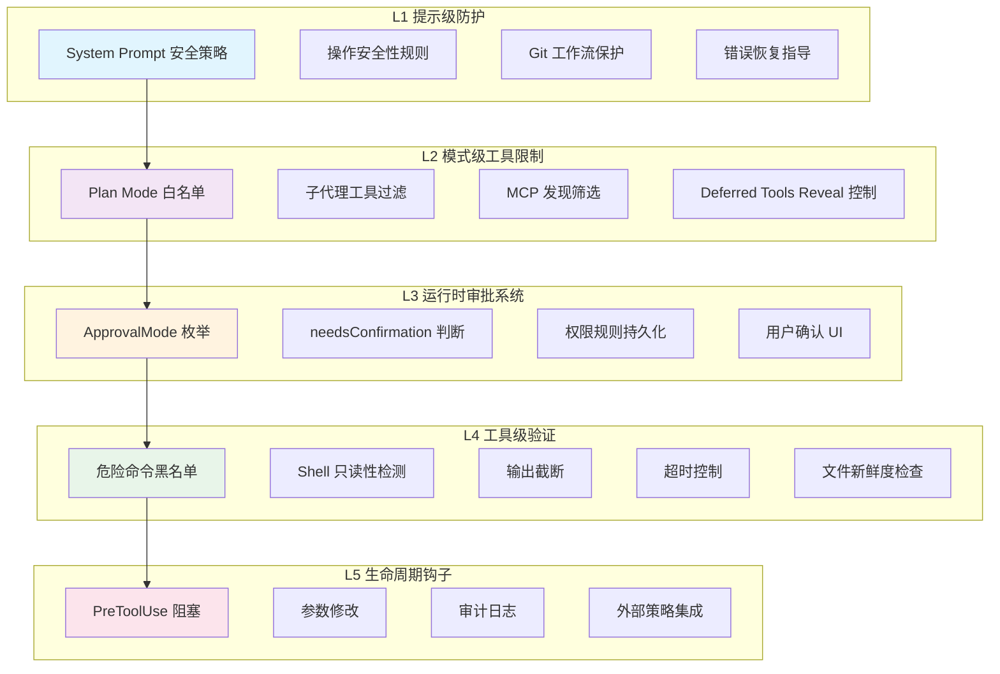

五层安全模型的设计哲学如下：

| 层级 | 名称           | 防御目标       | 失效后果                                  |
| ---- | -------------- | -------------- | ----------------------------------------- |
| L1   | 提示级防护     | 引导模型行为   | 模型可能尝试危险操作，但被后续层拦截      |
| L2   | 模式级工具限制 | 缩小攻击面     | 工具不可见/不可调用，从注册表层面消除风险 |
| L3   | 运行时审批系统 | 用户知情同意   | 未经确认的操作不会执行                    |
| L4   | 工具级验证     | 运行时安全约束 | 危险命令被阻止或降级                      |
| L5   | 生命周期钩子   | 外部策略执行   | 企业级合规与审计                          |

### 7.1.2 层间独立性保证

每一层的安全判断独立于其他层。具体而言：

1. **L1 不依赖 L3-L5**：即使所有运行时防护被绕过（如 YOLO 模式），System Prompt 中的安全指导仍然约束模型的行为倾向。
2. **L2 不依赖 L1**：Plan Mode 的工具白名单是硬编码的，不受模型输出影响。
3. **L3 不依赖 L1/L2**：PermissionManager 的规则评估是确定性的，不受模型"说服"。
4. **L4 不依赖 L3**：即使用户批准了操作，工具内部的超时和截断机制仍然生效。
5. **L5 不依赖任何内层**：外部钩子可以独立阻止任何操作。

源码路径：`packages/core/src/permissions/`、`packages/core/src/core/permissionFlow.ts`

---

## 7.2 第一层：提示级防护

### 7.2.1 System Prompt 中的安全策略

System Prompt 是模型行为的"宪法"。Qwen Code 在每次会话开始时注入一套完整的安全策略指令，从源头上约束模型的操作倾向。这些策略通过 `packages/core/src/core/prompts.ts` 中的 `getSystemPrompt()` 函数动态组装。

核心安全指令包括：

**操作安全性规则：**

- 禁止在未确认的情况下删除文件或目录
- 修改配置文件前必须备份
- 网络请求仅限于用户明确指定的目标
- 不得执行可能影响系统全局状态的命令

**Git 工作流保护：**

- 禁止 `git push --force` 到主分支
- 修改 Git 历史（rebase、amend）前需明确用户意图
- 不得修改 `.git/` 目录下的内部文件

**错误恢复指导：**

- 操作失败后不得无限重试
- 遇到权限错误应报告而非绕过
- 文件冲突时优先保留用户修改

### 7.2.2 安全策略的动态注入

安全策略并非静态文本。系统根据当前上下文动态调整安全指令的强度：

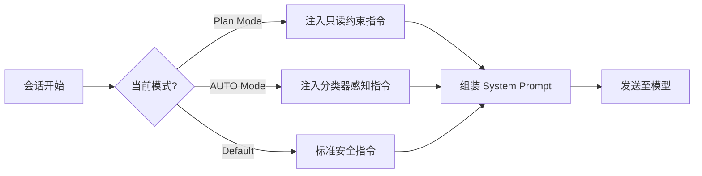

在 Plan Mode 下，System Prompt 额外注入 `getPlanModeSystemReminder()` 的内容，明确告知模型当前处于规划模式，所有写操作将被阻止。在 AUTO Mode 下，注入 `AUTO_MODE_DENIAL_GUIDANCE` 指令，告知模型被分类器阻止后不得通过间接手段绕过。

源码路径：`packages/core/src/core/prompts.ts`、`packages/core/src/permissions/autoMode.ts`

---

## 7.3 第二层：模式级工具限制

### 7.3.1 Plan Mode 白名单

Plan Mode 是最严格的运行模式，其核心安全机制是**工具白名单**。在该模式下，只有明确标记为只读的工具可以执行，所有写操作在注册表层面即被阻止。

Plan Mode 的工具过滤逻辑通过 `isPlanModeBlocked()` 函数实现：

```typescript
// packages/core/src/core/permissionFlow.ts
export function isPlanModeBlocked(
  isPlanMode: boolean,
  isExitPlanModeTool: boolean,
  isAskUserQuestionTool: boolean,
  confirmationDetails?: ToolCallConfirmationDetails,
  isEnterPlanModeTool?: boolean,
): boolean {
  return (
    isPlanMode &&
    !isExitPlanModeTool &&
    !isAskUserQuestionTool &&
    !isEnterPlanModeTool &&
    confirmationDetails?.type !== 'info'
  );
}
```

该函数体现了一个关键设计决策：Plan Mode 并非简单地阻止所有工具，而是通过 `confirmationDetails.type` 进行语义级判断。`type === 'info'` 的工具（如 `read_file`、`grep_search`）被允许执行，而 `type === 'edit'` 或 `type === 'exec'` 的工具被阻止。

### 7.3.2 Plan Mode 入口策略

Plan Mode 的进入和退出受到严格控制。`plan-mode-entry-policy.ts` 定义了入口边界策略：

```typescript
// packages/core/src/core/plan-mode-entry-policy.ts
export const PLAN_MODE_ENTRY_SIBLING_SKIP_MESSAGE =
  'Tool call skipped because enter_plan_mode is an execution boundary. ' +
  'Retry it in the next model turn after observing the resulting approval mode.';
```

当模型在一个批次中同时调用 `enter_plan_mode` 和其他工具时，系统会将 `enter_plan_mode` 视为**执行边界（execution boundary）**——同一批次中的后续工具调用被跳过，防止模型在模式切换的"间隙"执行写操作。

`findPlanModeEntryBatchBoundaryIndex()` 函数定位批次中的 `enter_plan_mode` 调用位置，该位置之后的所有工具调用被截断：

```typescript
export function findPlanModeEntryBatchBoundaryIndex(
  toolNames: ReadonlyArray<string | undefined>,
): number | undefined {
  if (toolNames.length <= 1) return undefined;
  const index = toolNames.indexOf(ToolNames.ENTER_PLAN_MODE);
  return index === -1 ? undefined : index;
}
```

### 7.3.3 子代理工具过滤

子代理（Subagent）的工具集受到独立过滤。子代理继承父代理的工具注册表，但以下工具被排除：

- `ask_user_question`：子代理不得直接与用户交互
- `exit_plan_mode` / `enter_plan_mode`：子代理不得改变全局审批模式
- `create_sub_session`：防止无限嵌套

### 7.3.4 MCP 发现筛选

MCP（Model Context Protocol）服务器的工具发现受到多重筛选：

1. **排除列表（excluded）**：`mcp.excluded` 配置中的服务器完全不连接
2. **允许列表（allowed）**：当 `mcp.allowed` 存在时，仅列表中的服务器可连接
3. **待审批列表（pending）**：工作区级别的 MCP 服务器需要用户明确批准

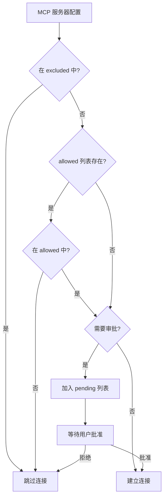

### 7.3.5 Deferred Tools 的 Reveal 控制

延迟工具（Deferred Tools）机制允许系统控制工具的可见性。工具名称在启动时注册到延迟列表中，模型仅知道工具名称存在，但无法获取其参数 schema，因此无法调用。只有当模型通过 `tool_search` 明确请求时，工具的完整定义才被"揭示（reveal）"到当前会话。

这一机制的安全意义在于：敏感工具（如 `computer_use` 系列）默认不可见，减少了模型"偶然"调用它们的可能性。

源码路径：`packages/core/src/core/plan-mode-entry-policy.ts`、`packages/cli/src/config/mcpServers.ts`、`packages/cli/src/config/mcpApprovals.ts`

---

## 7.4 第三层：运行时审批系统

### 7.4.1 ApprovalMode 枚举

Qwen Code 定义了五种审批模式，构成一个从最严格到最宽松的连续谱：

```typescript
// packages/core/src/config/approval-mode.ts
export enum ApprovalMode {
  PLAN = 'plan', // 最严格：仅允许只读操作
  DEFAULT = 'default', // 默认：写操作需要用户确认
  AUTO_EDIT = 'auto-edit', // 自动批准编辑操作，Shell 仍需确认
  AUTO = 'auto', // LLM 分类器自动判断
  YOLO = 'yolo', // 最宽松：自动批准所有操作
}
```

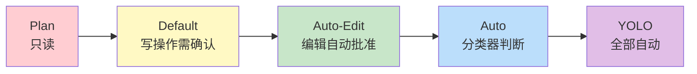

### 7.4.2 needsConfirmation 判断逻辑

`needsConfirmation()` 函数是审批系统的核心判断入口，它综合 L3（工具默认权限）、L4（PermissionManager 规则）和 L5（审批模式覆盖）三层信息做出最终决策：

```typescript
// packages/core/src/core/permissionFlow.ts
export function needsConfirmation(
  finalPermission: PermissionFlowPermission,
  approvalMode: ApprovalMode,
  toolName: string,
  requiresUserInteraction = false,
): boolean {
  // 被拒绝的操作不需要确认（直接阻止）
  if (finalPermission === 'deny') return false;
  // 需要用户交互的工具始终需要确认
  if (requiresUserInteraction) return true;

  const isAskUserQuestionTool = toolName === ToolNames.ASK_USER_QUESTION;
  // YOLO 模式自动批准除 ask_user_question 外的所有操作
  if (approvalMode === ApprovalMode.YOLO && !isAskUserQuestionTool) {
    return false;
  }
  // 'ask' 或 'default' 权限需要确认
  return finalPermission === 'ask' || finalPermission === 'default';
}
```

### 7.4.3 权限评估流水线（L3→L4→L5）

完整的权限评估通过 `evaluatePermissionFlow()` 函数编排：

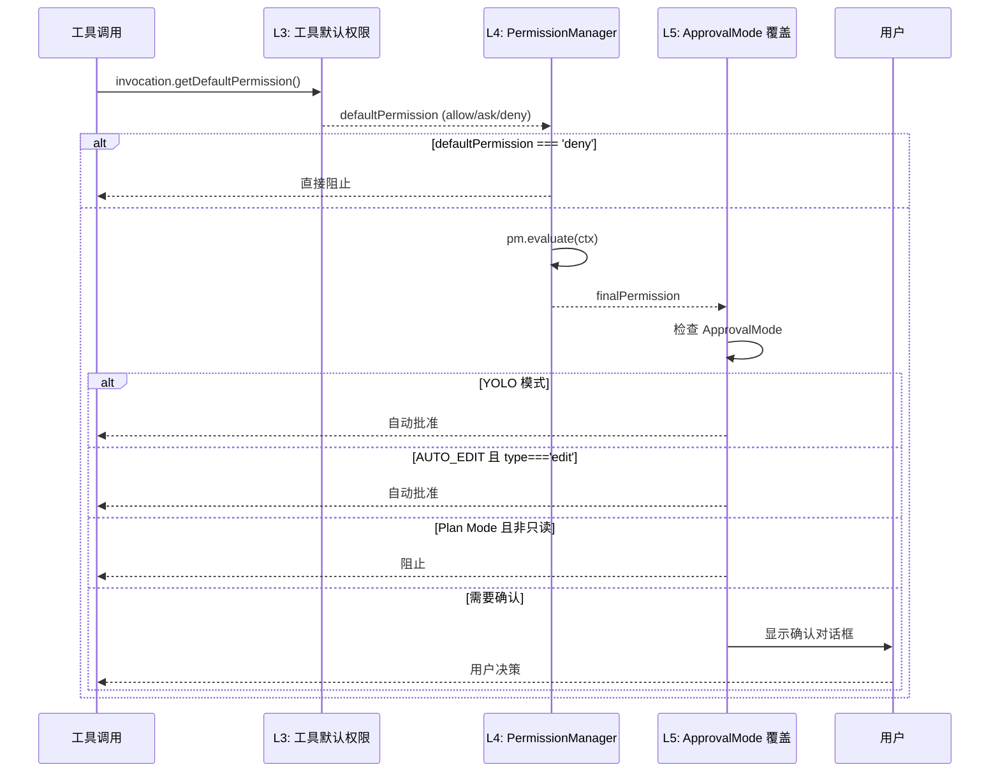

### 7.4.4 PermissionManager 规则评估

`PermissionManager` 是权限系统的核心引擎，管理三类规则（deny > ask > allow）的优先级评估：

```typescript
// packages/core/src/permissions/permission-manager.ts
// 规则评估优先级：
//   1. deny rules  → PermissionDecision.deny（最高优先级）
//   2. ask rules   → PermissionDecision.ask
//   3. allow rules → PermissionDecision.allow
//   4. (no match)  → PermissionDecision.default（回退到 ApprovalMode）
```

规则来源分为两个层级：

1. **持久规则（Persistent Rules）**：从 `settings.json` 加载，跨会话生效
2. **会话规则（Session Rules）**：运行时动态添加，仅当前会话有效

每类规则内部，会话规则优先于持久规则检查。

### 7.4.5 权限规则格式

权限规则采用 `ToolName(specifier)` 格式，支持四种匹配算法：

| SpecifierKind | 适用工具                 | 匹配方式           | 示例                     |
| ------------- | ------------------------ | ------------------ | ------------------------ |
| `command`     | Bash / run_shell_command | Shell 命令 glob    | `Bash(git *)`            |
| `path`        | Read / Edit / Write      | gitignore 风格路径 | `Edit(./secrets/**)`     |
| `domain`      | WebFetch                 | 域名匹配           | `WebFetch(domain:x.com)` |
| `literal`     | 其他工具                 | 字面量相等         | `Skill(pdf)`             |

此外，规则支持参数匹配器（`toolParamMatchers`），允许对工具参数进行精细控制：

```
Agent(model:opus)  → 仅匹配 model 参数为 "opus" 的 Agent 调用
```

### 7.4.6 Shell 命令的虚拟操作分析

PermissionManager 的一个关键安全特性是**虚拟操作分析（Virtual Operation Analysis）**。Shell 命令通过 `extractShellOperationsAcrossCommand()` 被解析为等价的虚拟工具操作，使得文件/网络权限规则能够匹配 Shell 命令的等效操作：

```typescript
// packages/core/src/permissions/shell-semantics.ts
// 示例：
// 'cat /etc/passwd'       → [{ virtualTool: 'read_file', filePath: '/etc/passwd' }]
// 'curl https://x.com/api' → [{ virtualTool: 'web_fetch', domain: 'x.com' }]
// 'echo hi > /etc/motd'   → [{ virtualTool: 'write_file', filePath: '/etc/motd' }]
```

这意味着即使用户配置了 `deny: ["Write(.qwen/settings.json)"]`，通过 Shell 命令 `echo '{}' > .qwen/settings.json` 的绕过尝试也会被拦截。

虚拟操作分析还支持**复合命令追踪**：对于 `cd .qwen && echo > settings.json` 这样的命令，系统追踪 `cd` 引起的工作目录变化，正确解析相对路径。

### 7.4.7 权限规则持久化

当用户在确认对话框中选择"始终允许（Always Allow）"时，权限规则通过 `persistPermissionOutcome()` 函数持久化：

```typescript
// packages/core/src/core/permission-helpers.ts
export async function persistPermissionOutcome(
  outcome: ToolConfirmationOutcome,
  confirmationDetails: ToolCallConfirmationDetails,
  persistFn: ((scope, ruleType, rule) => Promise<void>) | undefined,
  pm: PermissionManager | null | undefined,
): Promise<void> {
  // 1. 持久化到磁盘（settings.json）
  if (persistFn) await persistFn(scope, 'allow', rule);
  // 2. 立即更新内存中的 PermissionManager
  pm?.addPersistentRule(rule, 'allow');
}
```

持久化支持两个作用域：

- **ProceedAlwaysProject**：写入项目级 `.qwen/settings.json`
- **ProceedAlwaysUser**：写入用户级 `~/.qwen/settings.json`

### 7.4.8 用户确认 UI 流程

确认对话框通过 `MessageBus` 发布-订阅模式实现解耦：

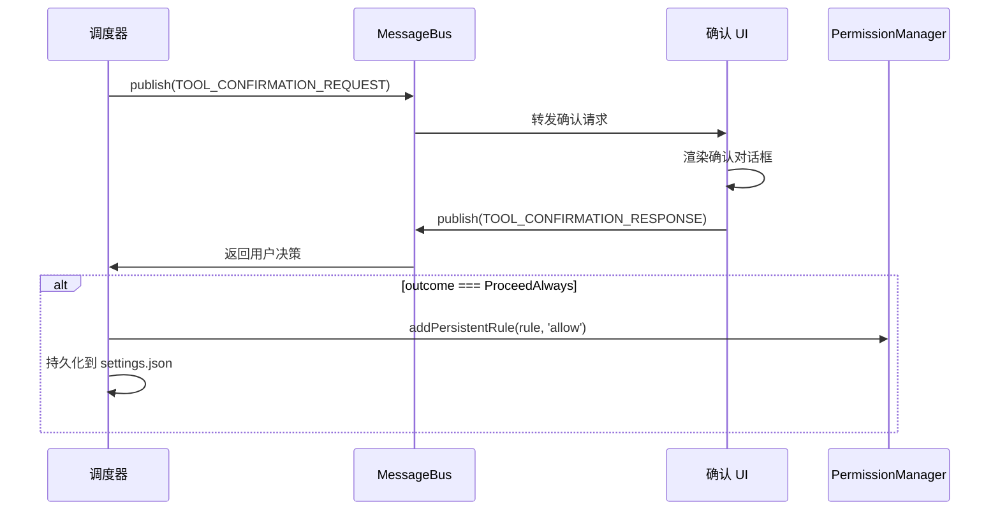

`MessageBus` 支持请求-响应模式，通过 `correlationId` 关联请求和响应，并内置 60 秒超时机制。

源码路径：`packages/core/src/core/permissionFlow.ts`、`packages/core/src/core/permission-helpers.ts`、`packages/core/src/permissions/permission-manager.ts`、`packages/core/src/confirmation-bus/`

---

## 7.5 第四层：工具级验证

### 7.5.1 危险命令模式黑名单

`destructive-commands.ts` 实现了一个确定性的预过滤器，在 LLM 分类器之前运行，提供不可绕过的硬阻止：

```typescript
// packages/core/src/permissions/destructive-commands.ts
const DESTRUCTIVE_GIT_PATTERNS: readonly RegExp[] = Object.freeze([
  /\bgit\s+reset\s+--hard\b/,
  /\bgit\s+checkout\s+--\s+\./,
  /\bgit\s+clean\s+-[a-zA-Z]*f/,
  /\bgit\s+stash\s+drop\b/,
]);

const IAC_DESTROY_PATTERNS: readonly RegExp[] = Object.freeze([
  /\bterraform\s+destroy\b/,
  /\bpulumi\s+destroy\b/,
  /\bcdk\s+destroy\b/,
]);
```

该模块的设计原则是**确定性优先**：与 LLM 分类器不同，正则匹配不会因 API 故障、超时或判断失误而放行危险命令。

**用户意图感知：** 系统检查用户最近的提示中是否包含明确的"丢弃"意图关键词（支持中英文），如 `discard`、`wipe`、`丢弃`、`清除` 等。只有当用户明确表达了丢弃意图时，破坏性 Git 命令才被放行。

**Git Amend 保护：** `git commit --amend` 受到特殊保护——仅当目标提交是当前会话中由代理创建的时才允许。系统通过 `registerSessionCommit()` 追踪会话内的提交 SHA，`isAmendOfSessionCommit()` 验证 HEAD 是否属于当前会话。

### 7.5.2 Shell 命令只读性检测

`isShellCommandReadOnlyAST()` 函数通过 AST（抽象语法树）分析判断 Shell 命令是否为只读操作：

```typescript
// packages/core/src/permissions/permission-manager.ts
private async resolveDefaultPermission(
  command: string,
): Promise<'allow' | 'ask'> {
  try {
    const isReadOnly = await isShellCommandReadOnlyAST(command);
    if (isReadOnly) return 'allow';
  } catch (e) {
    debugLogger.warn('AST read-only check failed, falling back to ask:', e);
  }
  return 'ask';
}
```

只读命令（如 `ls`、`cat`、`git status`、`cd`）被自动允许，无需用户确认。非只读命令（包括命令替换 `$()`、反引号等）回退到 `'ask'`。

### 7.5.3 AUTO Mode 危险规则剥离

当用户切换到 AUTO 模式时，系统自动剥离可能绕过分类器的"危险允许规则"：

```typescript
// packages/core/src/permissions/dangerousRules.ts
const DANGEROUS_BASH_INTERPRETERS: readonly string[] = Object.freeze([
  // Unix shells
  'bash',
  'sh',
  'zsh',
  'fish',
  'csh',
  'tcsh',
  'dash',
  'ksh',
  // Scripting-language interpreters
  'python',
  'python3',
  'node',
  'deno',
  'tsx',
  'bun',
  'ruby',
  'perl',
  // Build/package tools
  'cargo',
  'npm',
  'pnpm',
  'yarn',
  'make',
  'gradle',
  'mvn',
  // Package runners
  'npx',
  'bunx',
  'pnpx',
  'uvx',
  'pipx',
  // Remote shells
  'ssh',
  // Generic eval
  'eval',
  'exec',
  'source',
  // 完整列表还包含：cmd, pwsh, powershell, python2, php, lua, julia, r, rscript, groovy, awk, gawk, gmake, rake, task, just, go, dlx 等
]);
```

> **注**：上表为部分列表（约 30 条），完整 `DANGEROUS_BASH_INTERPRETERS` 包含约 48 个条目。

`isDangerousBashRule()` 判断一个允许规则是否"过于宽泛"——例如 `Bash(python *)` 或 `Bash(npx *)` 会让模型在分类器不知情的情况下执行任意代码。这些规则在 AUTO 模式期间被临时移除（`stripDangerousRulesForAutoMode()`），退出 AUTO 模式时恢复（`restoreDangerousRules()`）。

同样，`Agent` 和 `Skill` 工具的任何允许规则都被视为危险的，因为子代理和技能一旦启动，其内部操作不受分类器审查。

### 7.5.4 输出截断与超时控制

工具执行层面实施多重资源限制：

- **输出截断**：工具输出超过阈值（`DEFAULT_TRUNCATE_TOOL_OUTPUT_THRESHOLD`）时被截断，防止上下文窗口被耗尽
- **超时控制**：Shell 命令有默认超时限制，分类器有独立的阶段超时（Stage 1: 10秒，Stage 2: 30秒）
- **批次预算**：每轮工具调用的总输出受 `DEFAULT_TOOL_OUTPUT_BATCH_BUDGET` 限制

### 7.5.5 文件新鲜度检查

文件编辑工具实施新鲜度检查（freshness check），确保编辑基于文件的最新版本。如果文件在模型读取后被外部修改，编辑操作将被拒绝，防止覆盖用户的并行修改。

源码路径：`packages/core/src/permissions/destructive-commands.ts`、`packages/core/src/permissions/dangerousRules.ts`、`packages/core/src/utils/shellAstParser.ts`

---

## 7.6 第五层：生命周期钩子

### 7.6.1 钩子系统架构

Qwen Code 的钩子系统（Hook System）允许外部代码在工具生命周期的关键节点介入。钩子通过 `HookSystem` 类管理，支持四种实现类型：

```typescript
// packages/core/src/hooks/types.ts
export enum HookType {
  Command = 'command', // 执行外部命令
  Http = 'http', // 发送 HTTP 请求
  Function = 'function', // 调用内部函数
  Prompt = 'prompt', // LLM 单轮评估
}
```

### 7.6.2 钩子事件类型

系统定义了 21 种钩子事件（`HookEventName` 枚举），覆盖工具执行、会话管理、压缩、通知等完整生命周期。下表列出 12 种主要事件：

| 事件名               | 触发时机           | 阻塞能力       |
| -------------------- | ------------------ | -------------- |
| `PreToolUse`         | 工具执行前         | ✅ 可阻止执行  |
| `PostToolUse`        | 工具执行后         | ❌ 仅观察      |
| `PostToolUseFailure` | 工具执行失败后     | ❌ 仅观察      |
| `PostToolBatch`      | 一批工具调用完成后 | ❌ 仅观察      |
| `UserPromptSubmit`   | 用户提交提示时     | ✅ 可修改/阻止 |
| `Stop`               | 模型完成回复前     | ✅ 可要求继续  |
| `SessionStart`       | 会话开始时         | ❌ 仅观察      |
| `SessionEnd`         | 会话结束时         | ❌ 仅观察      |
| `PermissionRequest`  | 权限对话框显示时   | ❌ 仅观察      |
| `PermissionDenied`   | 工具被拒绝时       | ❌ 仅观察      |
| `SubagentStart`      | 子代理启动时       | ❌ 仅观察      |
| `SubagentStop`       | 子代理完成前       | ✅ 可要求继续  |

### 7.6.3 PreToolUse 阻塞能力

`PreToolUse` 钩子是最强大的安全扩展点。它接收完整的工具调用信息（工具名、参数、工作目录），并可以：

1. **阻止执行**：返回 `{ decision: 'block', reason: '...' }`
2. **要求确认**：返回 `{ decision: 'ask' }`
3. **自动批准**：返回 `{ decision: 'approve' }`
4. **修改参数**：通过 `updatedInput` 字段修改工具参数

钩子输出通过 `HookOutput` 结构传递：

```typescript
export type HookDecision = 'ask' | 'block' | 'deny' | 'approve' | 'allow';
```

### 7.6.4 钩子配置来源

钩子配置支持五个来源，按优先级排列：

```typescript
export enum HooksConfigSource {
  Project = 'project', // .qwen/settings.json 中的 hooks
  User = 'user', // ~/.qwen/settings.json 中的 hooks
  System = 'system', // 系统级配置
  Extensions = 'extensions', // 扩展注册的钩子
  Session = 'session', // 运行时动态注册
}
```

安全约束：项目级钩子仅在工作区被信任时加载（`getProjectHooks()` 检查 `isTrusted`），防止恶意仓库通过 `.qwen/settings.json` 注入钩子。

### 7.6.5 审计日志与外部策略集成

钩子系统通过 `MessageBus` 的 `HOOK_EXECUTION_REQUEST` / `HOOK_EXECUTION_RESPONSE` 消息对实现异步执行。每个钩子执行都有独立的超时控制，失败不会阻塞主流程（除非是 `blocking` 类型的失败）。

企业可以通过 HTTP 钩子将工具调用审计日志发送到外部 SIEM 系统，或通过 Command 钩子集成 OPA（Open Policy Agent）等策略引擎。

源码路径：`packages/core/src/hooks/types.ts`、`packages/core/src/hooks/index.ts`、`packages/core/src/confirmation-bus/`

---

## 7.7 Plan Mode 安全模型

### 7.7.1 进入与退出条件

Plan Mode 的进入和退出通过专用工具 `enter_plan_mode` 和 `exit_plan_mode` 控制。模式切换触发 `Config.setApprovalMode()` 并递增 `approvalModeRevision` 计数器，该计数器用于检测过期的审批上下文。

### 7.7.2 Shell 命令路由策略

Plan Mode 下的 Shell 命令处理通过 `plan-mode-shell-policy.ts` 实现了一套精密的路由策略：

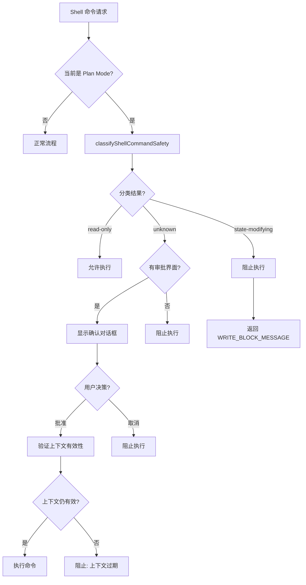

### 7.7.3 写操作阻止机制

被分类为 `state-modifying` 的命令收到明确的阻止消息：

```typescript
const WRITE_BLOCK_MESSAGE =
  'Plan mode blocked this shell command because it was classified as ' +
  'state-modifying. Do not retry it through wrappers or obfuscation; ' +
  'continue read-only investigation and include the action in the plan.';
```

该消息不仅阻止操作，还明确告知模型不得通过包装器或混淆手段重试——这是对提示注入攻击的防御。

### 7.7.4 审批上下文验证

Plan Mode 的 Shell 审批具有**上下文绑定（context binding）** 特性。每次审批创建一个 `PlanModeShellContextSnapshot`，记录：

- 原始请求参数（`requestArgs`）
- 调用参数（`invocationParams`）
- 审批模式修订号（`approvalModeRevision`）
- 权限上下文（`permissionContext`）
- 环境工作目录（`ambientWorkingDirectory`）

在用户批准后、实际执行前，`validatePlanModeShellContext()` 验证快照是否仍然有效。如果模式已切换、参数已修改、或权限规则已变更，审批被视为过期（stale），命令被取消：

```typescript
const STALE_APPROVAL_MESSAGE =
  'Plan-mode shell approval is no longer valid because the mode, ' +
  'permission policy, or exact invocation changed. Submit a new tool call.';
```

### 7.7.5 AUTO Mode 三层过滤器

AUTO 模式是安全性与自动化之间的平衡点，其核心是一个三层过滤器：

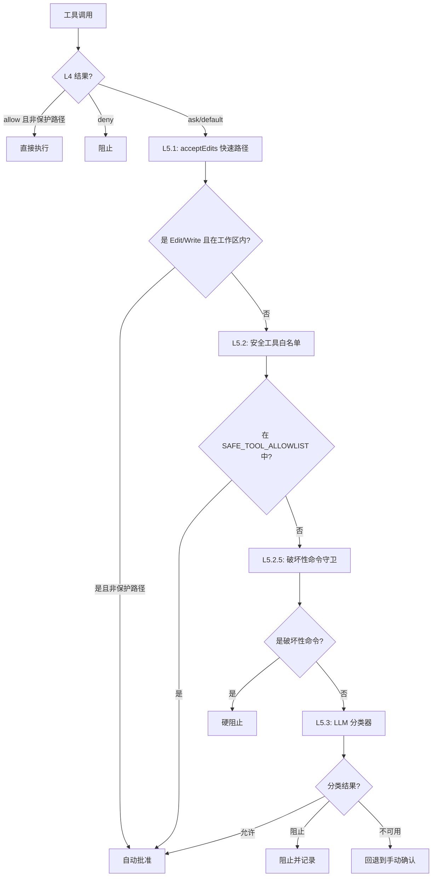

**L5.1 acceptEdits 快速路径：** 工作区内的编辑操作（非保护路径）自动批准，无需调用分类器。保护路径包括：

- `.git/` 目录（Git 配置和钩子）
- `package.json`（npm scripts 可执行任意代码）
- `.github/workflows/`（CI 定义）
- `.qwen/settings*.json`（自身权限配置）
- `QWEN.md`、`AGENTS.md`（指令文件）
- `.mcp.json`（MCP 服务器配置）

**L5.2 安全工具白名单：** 内置的只读工具（`read_file`、`grep_search`、`glob`、`list_directory` 等）自动批准。MCP 工具被明确排除——第三方代码无法被静态信任。

**L5.3 LLM 分类器：** 两阶段分类器设计：

- **Stage 1（快速）**：仅输出 `shouldBlock: boolean`，max_tokens=256，超时 10 秒。允许路径立即返回（约 300ms）。
- **Stage 2（审查）**：完整输出 `{ thinking, shouldBlock, reason }`，max_tokens=4096，超时 30 秒。审查 Stage 1 的阻止决策以减少误报。

分类器采用**失败关闭（fail-closed）** 策略：任何非中止故障（API 错误、超时、schema 验证失败、上下文溢出）返回 `shouldBlock=true, unavailable=true`。

### 7.7.6 拒绝追踪与熔断

`denialTracking.ts` 实现了一个状态机，防止分类器持续阻止或持续不可用时的无限循环：

```typescript
export const AUTO_MODE_DENIAL_LIMITS = {
  maxConsecutiveBlock: 3, // 连续阻止阈值
  maxConsecutiveUnavailable: 2, // 连续不可用阈值
  maxTotalDenials: 20, // 会话总拒绝上限
} as const;
```

当阈值被触发时，系统回退到 DEFAULT 模式的手动确认流程（仅针对当前调用，会话仍保持 AUTO 模式）。用户手动批准后，计数器重置，分类器重新参与决策。

源码路径：`packages/core/src/core/plan-mode-shell-policy.ts`、`packages/core/src/permissions/autoMode.ts`、`packages/core/src/permissions/classifier.ts`、`packages/core/src/permissions/denialTracking.ts`

---

# 第八章 持久化与配置

## 8.1 配置层级结构

### 8.1.1 四层配置模型

Qwen Code 的配置系统采用四层合并模型，每一层具有不同的作用域和优先级：

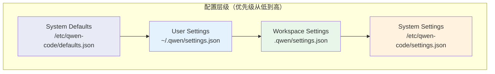

合并策略在 `mergeSettings()` 函数中实现：

```typescript
// packages/cli/src/config/settings.ts
function mergeSettings(
  system: Settings,
  systemDefaults: Settings,
  user: Settings,
  workspace: Settings,
  isTrusted: boolean,
): Settings {
  const safeWorkspace = isTrusted
    ? tagMcpServerScope(workspace, 'workspace')
    : ({} as Settings);

  // 优先级（后者覆盖前者）：
  // 1. System Defaults
  // 2. User Settings
  // 3. Workspace Settings（仅受信任时）
  // 4. System Settings（作为强制覆盖）
  return customDeepMerge(
    getMergeStrategyForPath,
    {},
    systemDefaults,
    user,
    safeWorkspace,
    tagMcpServerScope(system, 'system'),
  ) as Settings;
}
```

### 8.1.2 合并策略

配置合并支持四种策略，通过 schema 中的 `mergeStrategy` 字段声明：

```typescript
// packages/cli/src/config/settingsSchema.ts
export enum MergeStrategy {
  REPLACE = 'replace', // 新值替换旧值（默认）
  CONCAT = 'concat', // 数组拼接
  UNION = 'union', // 数组合并去重
  SHALLOW_MERGE = 'shallow_merge', // 对象浅合并
}
```

关键设计决策：

- **permissions.allow / ask / deny** 使用 `UNION` 策略——多层配置的权限规则合并而非覆盖
- **mcpServers** 使用 `SHALLOW_MERGE` 策略——按服务器名称合并，同名服务器高优先级覆盖低优先级
- **model.name** 等标量值使用 `REPLACE` 策略

### 8.1.3 工作区信任机制

工作区设置的安全性通过信任机制保障：

```typescript
const safeWorkspace = isTrusted
  ? tagMcpServerScope(workspace, 'workspace')
  : ({} as Settings);
```

当工作区未被信任时（`isTrusted === false`），整个工作区配置被忽略（传入空对象）。这防止了恶意仓库通过 `.qwen/settings.json` 修改用户的安全配置。

信任状态通过 `isWorkspaceTrusted()` 函数检查，存储在 `~/.qwen/trustedFolders.json` 中。

### 8.1.4 环境变量解析

配置文件支持环境变量插值，通过 `resolveEnvVarsInObject()` 在加载时解析：

```json
{
  "env": {
    "API_KEY": "${OPENAI_API_KEY}",
    "PROXY_URL": "${HTTP_PROXY:-http://localhost:8080}"
  }
}
```

环境变量的加载顺序：

1. 系统环境变量
2. `~/.env`（用户级）
3. `~/.qwen/.env`（Qwen 专用）
4. `.qwen/.env`（项目级，仅受信任时）

`preResolveHomeEnvOverrides()` 在配置加载前执行，确保 `QWEN_HOME` 和 `QWEN_RUNTIME_DIR` 等关键路径变量在任何路径计算之前生效。

### 8.1.5 Settings Schema 完整结构

`settingsSchema.ts` 定义了完整的配置 schema，主要顶层键包括：

| 配置键           | 类型   | 说明                             |
| ---------------- | ------ | -------------------------------- |
| `model`          | object | 模型选择与配置                   |
| `permissions`    | object | 权限规则（allow/ask/deny）       |
| `tools`          | object | 工具配置（approvalMode 等）      |
| `mcpServers`     | object | MCP 服务器定义                   |
| `mcp`            | object | MCP 全局配置（allowed/excluded） |
| `hooks`          | object | 生命周期钩子定义                 |
| `env`            | object | 环境变量注入                     |
| `telemetry`      | object | 遥测配置                         |
| `ui`             | object | 界面配置（主题、语言等）         |
| `memory`         | object | 记忆系统配置                     |
| `context`        | object | 上下文管理配置                   |
| `skills`         | object | 技能配置                         |
| `agents`         | object | 子代理配置                       |
| `modelProviders` | object | 自定义模型提供者                 |

### 8.1.6 配置版本迁移

系统维护配置版本号（当前 `SETTINGS_VERSION = 4`），支持自动迁移：

```typescript
// V1 → V2 迁移映射（部分）
export const V1_TO_V2_MIGRATION_MAP = {
  modelName: 'model.name',
  theme: 'ui.theme',
  autoCompact: 'context.autoCompact',
  // ...
};
```

遗留的工具权限配置（`tools.core` / `tools.allowed` / `tools.exclude`）通过 `migrateLegacyPermissions()` 自动转换为新的 `permissions.allow` / `permissions.deny` 格式。

### 8.1.7 配置损坏恢复

配置加载内置了损坏恢复机制：

1. JSON 解析失败时，将损坏文件复制为 `settings.json.corrupted`
2. 重置为空配置（`{}`）
3. 通过环境变量 `ENV_CORRUPTED_PATH` 和 `ENV_WAS_RECOVERED` 通知 UI 层
4. UI 显示恢复对话框，允许用户查看损坏内容

源码路径：`packages/cli/src/config/settings.ts`、`packages/cli/src/config/settingsSchema.ts`、`packages/cli/src/config/trustedFolders.ts`

---

## 8.2 Settings 热重载

### 8.2.1 文件监听机制

`SettingsWatcher` 类使用 chokidar 库监听配置文件变化：

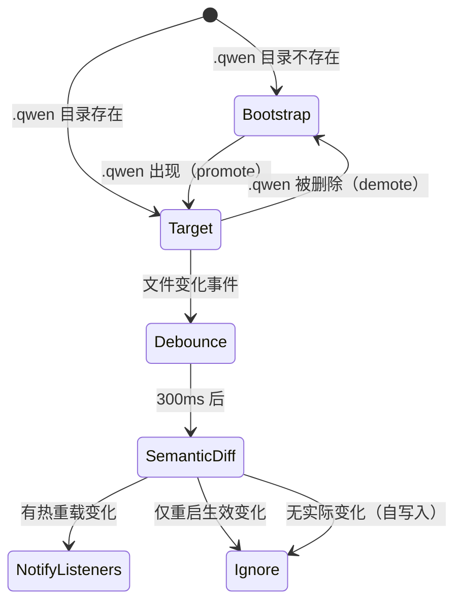

关键设计特性：

**两阶段监听：** 当 `.qwen` 目录不存在时，监听器处于"引导（bootstrap）"阶段，监视父目录中 `.qwen` 的出现。一旦 `.qwen` 被创建，提升（promote）为直接监听。如果 `.qwen` 被删除，降级（demote）回引导阶段。

**自写入抑制：** `LoadedSettings.setValue()` 先修改内存再写入磁盘，因此 `reloadScopeFromDisk()` 产生的语义差异为空——自然抑制了自写入触发的重载事件。

**重启过滤：** 每个变化的配置键通过 `isRestartRequiredKey()` 检查其 schema 定义中的 `requiresRestart` 标志。如果所有变化键都需要重启才能生效（如凭证、`env`、providers），则不发出事件。

### 8.2.2 语义差异计算

变化检测使用递归的 `collectChangedKeys()` 函数：

```typescript
function collectChangedKeys(
  before: Record<string, unknown>,
  after: Record<string, unknown>,
  prefix = '',
): string[] {
  // 纯对象递归比较
  // 数组和原始类型通过 JSON.stringify 整体比较
  // 新增/删除的键也作为变化叶节点上报
}
```

### 8.2.3 MCP 服务器重连

`registerMcpHotReload()` 函数将 MCP 服务器管理与设置监听器连接：

```typescript
// packages/cli/src/config/hot-reload.ts
export function registerMcpHotReload(
  watcher: SettingsWatcher,
  settings: LoadedSettings,
  config: Config,
  topTierMcpServers: Record<string, MCPServerConfig> | undefined,
): () => void {
  return watcher.addChangeListener(async (events) => {
    // 1. 重建 MCP 服务器映射
    const next = assembleMcpServers(
      settings.merged.mcpServers,
      cwd,
      topTierMcpServers,
    );
    // 2. 重算准入列表
    const nextGating = recomputeMcpGating(
      settings,
      next,
      cwd,
      bootAllowed,
      isYolo,
    );
    // 3. 仅在服务器或准入列表实际变化时重连
    if (!serversChanged && !gatingChanged) return;
    // 4. 更新准入列表 → 重连 → 触发审批
    config.setExcludedMcpServers(nextGating.excluded ?? []);
    await config.reinitializeMcpServers(next);
  });
}
```

MCP 热重载的准入列表计算有两条重要规则：

1. **`allowed` 空 vs 缺省**：缺省的 `mcp.allowed` 意味着"允许所有"（`undefined`）；显式的 `mcp.allowed: []` 意味着"拒绝所有"
2. **CLI 允许列表是上界**：如果通过 `--allowed-mcp-server-names` 启动，设置中的允许列表只能在该范围内缩窄，不能扩大

### 8.2.4 扩展重新加载

扩展文件的变化通过独立的 `ExtensionFileWatcher` 监听。扩展重载触发：

- MCP 服务器重新发现
- 技能（Skills）重新注册
- 钩子（Hooks）重新加载
- 自定义命令重新注册

源码路径：`packages/cli/src/config/settingsWatcher.ts`、`packages/cli/src/config/hot-reload.ts`、`packages/cli/src/config/extension-file-watcher.ts`

---

## 8.3 会话持久化

### 8.3.1 会话存储格式

会话数据以 JSONL（JSON Lines）格式存储在 `~/.qwen/projects/<project-hash>/chats/` 目录下。每个会话一个文件，文件名为 `<session-id>.jsonl`。

每条记录是一个 `ChatRecord` 对象，包含：

```typescript
interface ChatRecord {
  type: 'message' | 'file_history_snapshot' | 'chat_compression' |
        'ui_telemetry' | 'session_source' | 'parent_session' | ...;
  timestamp: string;
  // 类型特定字段...
}
```

消息记录包含完整的 `Content` 对象（角色 + 部分），保留模型交互的完整上下文。

### 8.3.2 会话列表与索引

`SessionService` 提供会话列表功能，支持分页和排序：

```typescript
// packages/core/src/services/sessionService.ts
export interface SessionListItem {
  sessionId: string;
  cwd: string;
  startTime: string;
  mtime: number; // 用于排序和分页
  prompt: string; // 首条用户提示（截断）
  gitBranch?: string;
  filePath: string;
  customTitle?: string;
  titleSource?: TitleSource;
  parentSessionId?: string;
  sourceType?: string;
  isArchived?: boolean;
}
```

列表操作通过读取每个 JSONL 文件的首条记录获取元数据，使用 `mtime` 作为分页游标，避免全量扫描。

### 8.3.3 恢复机制

会话恢复通过 `--continue`（继续最近会话）和 `--resume <session-id>`（恢复指定会话）实现。恢复过程：

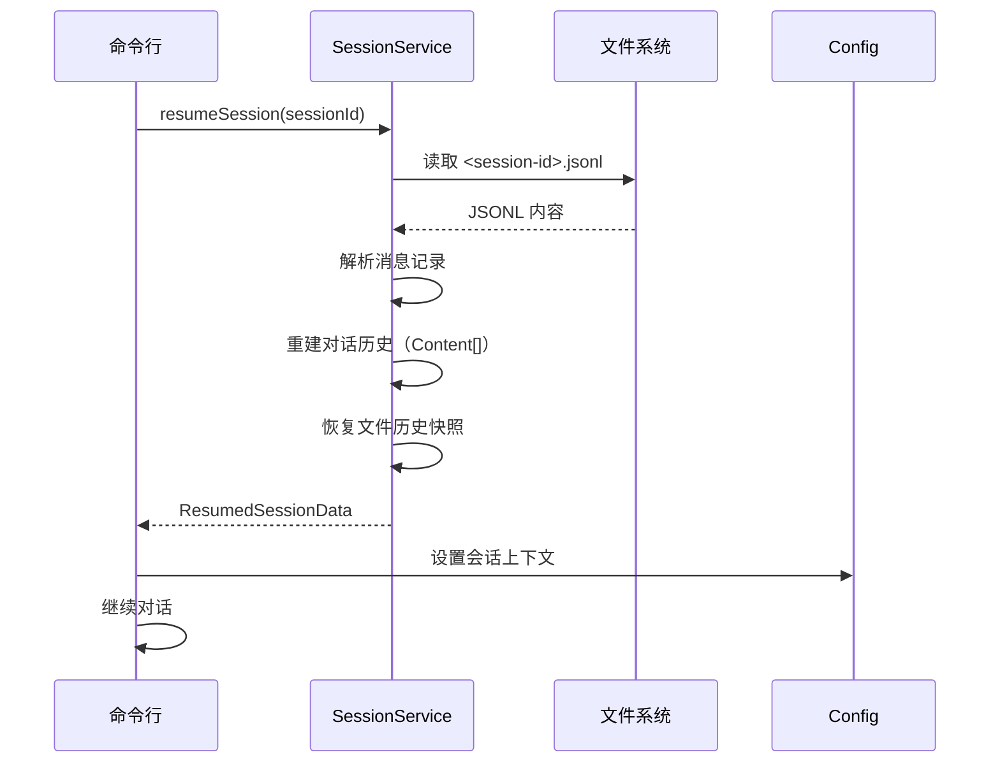

### 8.3.4 会话写入租约

`SessionWriterLease` 机制确保同一时刻只有一个写入者操作会话文件，防止并发写入导致数据损坏。租约通过文件锁实现，支持以下错误类型：

- `SessionWriterUnavailableError`：无法获取租约
- `SessionWriterLostError`：租约被其他进程抢占
- `SessionTranscriptChangedError`：转录在写入间被修改

### 8.3.5 会话组织

`SessionOrganizationService` 管理会话的归档和清理：

- 支持会话归档（`active` → `archived`）
- 自动标题生成（通过 `sessionTitle.ts`）
- 会话分支追踪（Git branch 关联）

源码路径：`packages/core/src/services/sessionService.ts`、`packages/core/src/services/session-writer-lease.ts`、`packages/cli/src/commands/sessions/`

---

## 8.4 Memory 持久化

### 8.4.1 三层记忆架构

Qwen Code 的记忆系统分为三个层级，各有不同的作用域和存储位置：

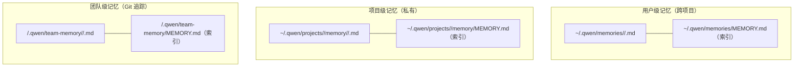

| 层级   | 存储位置                          | 作用域         | 同步方式 |
| ------ | --------------------------------- | -------------- | -------- |
| 用户级 | `~/.qwen/memories/`               | 跨所有项目     | 本地     |
| 项目级 | `~/.qwen/projects/<hash>/memory/` | 当前项目       | 本地     |
| 团队级 | `<repo>/.qwen/team-memory/`       | 项目所有协作者 | Git      |

### 8.4.2 文件存储结构

每条记忆是一个独立的 Markdown 文件，带有 YAML frontmatter：

```markdown
---
name: 记忆名称
description: 一行描述（用于相关性判断）
type: user | feedback | project | reference
---

记忆内容...
```

记忆按类型组织在子目录中：

- `user/`：用户角色、偏好、知识背景
- `feedback/`：用户对工作方式的指导
- `project/`：项目状态、决策、截止日期
- `reference/`：外部资源指针

### 8.4.3 MEMORY.md 索引

每个记忆目录包含一个 `MEMORY.md` 索引文件，在每次会话开始时加载到上下文中：

```markdown
- [Title](file.md) — one-line hook
```

索引有 200 行的硬限制，超出部分被截断。这确保了记忆系统的上下文开销可控。

### 8.4.4 路径解析与安全

记忆路径的解析通过 `packages/core/src/memory/paths.ts` 管理，具有多重安全保障：

**路径锚定：** 项目级记忆锚定到最近的 Git 根目录（非解析链接工作树），确保每个工作树有独立的记忆空间：

```typescript
export function getAutoMemoryRoot(projectRoot: string): string {
  const gitRoot = findGitRoot(projectRoot) ?? path.resolve(projectRoot);
  return path.join(
    memoryBaseDir,
    'projects',
    sanitizeCwd(gitRoot),
    AUTO_MEMORY_DIRNAME,
  );
}
```

**符号链接防护：** `resolveLeafSymlink()` 函数追踪符号链接链（最多 40 跳），防止通过悬挂符号链接绕过路径检查：

```typescript
// 安全关键：fs.existsSync 跟随链接并报告悬挂链接为"不存在"。
// 依赖它会让攻击者预置 decoy.md -> .qwen/team-memory/leak.md（目标不存在），
// 使路径分类为团队记忆之外，跳过秘密扫描器——而实际写入跟随链接进入团队记忆。
```

**写入边界：** `isAnyAutoMemPath()` 仅包含用户级和项目级记忆，**明确排除团队记忆**——团队记忆提交到 Git 并与协作者共享，其写入必须保持 `'ask'` 权限，不得自动批准。

### 8.4.5 跨会话知识积累

记忆系统通过 `MemoryManager` 管理，支持：

- 自动提取：从对话中提取值得记忆的信息
- 整合（Consolidation）：合并重复或过时的记忆
- 提取游标（Extract Cursor）：追踪已处理的对话位置
- 整合锁（Consolidation Lock）：防止并发整合

源码路径：`packages/core/src/memory/paths.ts`、`packages/core/src/memory/store.ts`、`packages/core/src/memory/manager.ts`

---

## 8.5 遥测与使用统计

### 8.5.1 OpenTelemetry 集成

Qwen Code 通过 OpenTelemetry SDK 实现可观测性，在 `packages/core/src/telemetry/` 中管理：

```typescript
// packages/core/src/telemetry/sdk.ts
export function initializeTelemetry(): void {
// 配置参数...
  // 初始化 TracerProvider、MeterProvider
  // 配置 OTLP 导出器
}
```

遥测配置通过 `settings.json` 的 `telemetry` 键控制：

| 配置项                            | 说明             | 默认值                                        |
| --------------------------------- | ---------------- | --------------------------------------------- |
| `enabled`                         | 是否启用遥测     | `false`                                       |
| `target`                          | 导出目标         | `DEFAULT_TELEMETRY_TARGET`                    |
| `otlpEndpoint`                    | OTLP 端点        | `DEFAULT_OTLP_ENDPOINT`                       |
| `sensitiveSpanAttributeMaxLength` | 敏感属性最大长度 | `DEFAULT_SENSITIVE_SPAN_ATTRIBUTE_MAX_LENGTH` |

### 8.5.2 会话级指标

`tokenUsageService.ts` 追踪每个会话的 Token 使用情况：

- 输入 Token 数（按模型）
- 输出 Token 数（按模型）
- 缓存命中率
- 分类器 Token 消耗（AUTO 模式）

`usageHistoryService.ts` 将使用数据持久化到 `~/.qwen/projects/<hash>/usage/`，支持跨会话的成本分析。

### 8.5.3 成本追踪

`usage-dashboard-service.ts` 提供使用统计的聚合视图，`tokenEstimation.ts` 通过 `CHARS_PER_TOKEN` 常量提供快速的 Token 估算。

### 8.5.4 启动事件记录

`recordStartupEvent()` 记录会话启动事件，包括：

- 模型选择
- 审批模式
- 启用的工具集
- 环境信息（是否使用 ripgrep、是否在沙箱中）

源码路径：`packages/core/src/telemetry/`、`packages/core/src/services/tokenUsageService.ts`、`packages/core/src/services/usageHistoryService.ts`

---

## 8.6 操作日志与撤销

### 8.6.1 文件变更追踪

`FileHistoryService` 实现了细粒度的文件变更追踪：

```typescript
// packages/core/src/services/fileHistoryService.ts
export interface FileHistorySnapshot {
  promptId: string; // 关联的用户提示
  trackedFileBackups: Record<string, FileHistoryBackup>;
  timestamp: Date;
}

export interface FileHistoryBackup {
  backupFileName: BackupFileName;
  version: number;
  backupTime: Date;
  failed?: boolean; // 备份失败标记
}
```

每次工具调用前，系统对所有被追踪的文件创建快照。快照存储在 `~/.qwen/projects/<hash>/file-history/` 目录下，以内容哈希命名，实现去重。

### 8.6.2 撤销机制

撤销（Rewind）操作通过 `FileHistoryService` 的快照恢复实现：

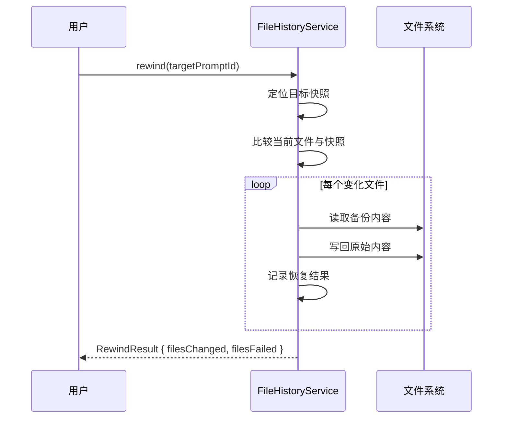

`RewindResult` 区分成功恢复的文件（`filesChanged`）和恢复失败的文件（`filesFailed`），失败可能由于文件被外部锁定或备份损坏。

### 8.6.3 差异计算

`FileHistoryService` 使用 `diff` 库计算文件差异：

```typescript
export interface TurnFileDiff {
  filePath: string;
  hunks: Hunk[];
  isNewFile: boolean;
  isDeleted: boolean;
  linesAdded: number;
  linesRemoved: number;
  oversized: boolean; // 超过 MAX_DIFF_SIZE_BYTES
  isBinary: boolean; // 包含 NUL 字节
}
```

差异计算有大小限制（`MAX_DIFF_SIZE_BYTES`），超大文件的差异被标记为 `oversized`，仅保留行数统计。二进制文件（通过 NUL 字节检测）跳过 hunk 生成，防止终端渲染损坏。

### 8.6.4 提交归因

`CommitAttributionService` 和 `attributionTrailer.ts` 确保代理创建的 Git 提交包含归因信息。提交消息尾部添加 `Co-authored-by` 或自定义 trailer，标识该提交由 AI 代理生成。

`registerSessionCommit()` 在每次成功提交后记录 SHA，用于：

1. `git commit --amend` 的安全检查（仅允许修改本会话的提交）
2. 提交归因追踪

源码路径：`packages/core/src/services/fileHistoryService.ts`、`packages/core/src/services/commitAttribution.ts`、`packages/core/src/services/attributionTrailer.ts`

---

## 本章小结

Qwen Code 的安全架构和持久化系统体现了"安全优先、用户可控"的设计理念。五层纵深防御确保了即使单一层失效，系统整体仍然安全。配置系统的四层合并模型在灵活性和安全性之间取得平衡——工作区信任机制防止了恶意仓库的攻击，而热重载机制提供了无需重启的配置更新能力。记忆系统的三层架构和符号链接防护确保了跨会话知识积累的安全性。文件历史服务提供了完整的操作可逆性，使用户能够放心地让 AI 代理执行复杂的代码修改操作。
