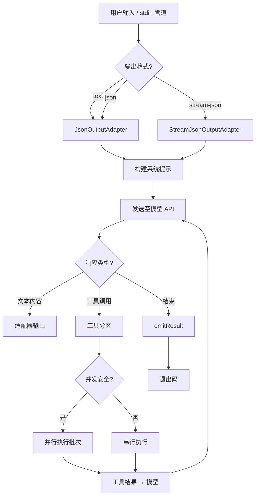
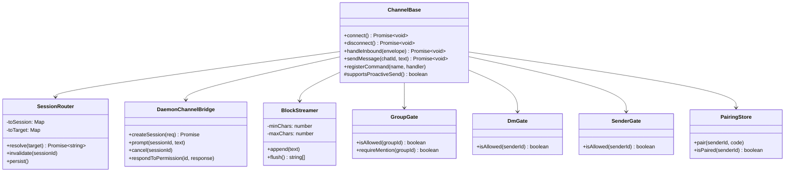

# 第9–12章：UI 层、讨论、相关工作与结论

---

## 第9章 UI 层与多前端架构

### 9.1 终端 TUI（Ink/React）

#### 9.1.1 Ink 7 + React 19 渲染模型

Qwen Code 的交互式终端界面构建于 Ink 7 与 React 19 之上。Ink 是一个将 React 组件模型映射到终端 ANSI 输出的渲染引擎——它复用了 React 的虚拟 DOM 协调（reconciliation）算法，但将"DOM 节点"替换为终端行缓冲区中的文本片段。这一选型使 Qwen Code 得以在纯文本终端中实现声明式 UI 开发，同时继承 React 生态中成熟的状态管理、组件组合与 Hooks 机制。

渲染入口位于 `packages/cli/src/ui/startInteractiveUI.tsx`。该模块导出 `startInteractiveUI()` 异步函数，其核心职责包括：

1. **终端优化安装**：调用 `installTerminalRedrawOptimizer(process.stdout)` 和 `installSynchronizedOutput(process.stdout)` 安装终端重绘优化器和同步输出协议。前者通过拦截 `stdout.write` 合并冗余重绘，后者利用 DEC 私有模式序列（BSU/ESU）实现原子帧更新，消除闪烁。两者均在非 TTY 环境或屏幕阅读器模式下自动跳过。

2. **Kitty 键盘协议**：通过 `useKittyKeyboardProtocol()` Hook 检测并启用 Kitty 键盘协议。该协议将修饰键（Shift、Ctrl、Alt）信息编码到按键序列中，使 TUI 能够区分 `Shift+Enter`（插入换行）与 `Enter`（提交），以及 `Ctrl+C`（复制/中断）与纯 `c` 键。在备用屏幕（alternate screen）模式下，协议标志需要重新推入（`pushKittyProtocolFlags()`），因为 Kitty 规范按屏幕追踪键盘标志栈。

3. **React 树渲染**：通过 Ink 的 `render()` 函数挂载组件树。渲染选项包括 `exitOnCtrlC: false`（由应用层自行处理 Ctrl+C）、`isScreenReaderEnabled`（屏幕阅读器适配）和 `alternateScreen`（虚拟视口模式）。在 `DEBUG` 环境变量启用时，组件树被包裹在 `React.StrictMode` 中以检测副作用问题。

```
// packages/cli/src/ui/startInteractiveUI.tsx（简化）
const instance = render(
  process.env['DEBUG'] ? (
    <React.StrictMode>{appTree}</React.StrictMode>
  ) : (
    appTree
  ),
  {
    exitOnCtrlC: false,
    isScreenReaderEnabled: config.getScreenReader(),
    alternateScreen: useVP,
  },
);
```

4. **内存压力监控**：启动一个 30 秒间隔的定时器（`PRESSURE_CHECK_INTERVAL_MS = 30_000`），周期性调用 `pressureMonitor.performCheck()` 执行 V8 堆内存压力检查。该定时器通过 `unref()` 标记为不阻止事件循环退出，并在清理回调中清除。这弥补了工具调度器仅在工具调用后执行压力检查的盲区——长时间无工具调用的纯对话会话可能使堆内存持续增长至 V8 限制。

5. **清理注册**：通过 `registerCleanup()` 注册退出清理回调，按序执行：清除压力监控定时器、执行最终内存回收、关闭远程输入监视器、关闭双输出桥、卸载 Ink 实例、禁用 Kitty 协议、恢复终端重绘优化器。清理顺序经过精心设计——例如 Kitty 协议必须在 Ink 卸载之后禁用，因为 Ink 在卸载时会离开备用屏幕，而 Kitty 规范按屏幕追踪标志栈。

#### 9.1.2 AppContainer 组件架构

`AppContainer`（`packages/cli/src/ui/AppContainer.tsx`，约 4578 行）是 TUI 的核心状态容器组件。它不直接渲染 UI 元素，而是作为"状态中枢"协调数十个 Hooks 和子组件。其架构可从以下维度理解：

**Provider 嵌套层次**

`startInteractiveUI.tsx` 中的 `AppWrapper` 组件建立了多层 Context Provider 嵌套：

```
RemoteInputContext.Provider
  └─ DualOutputContext.Provider
       └─ SettingsContext.Provider
            └─ KeypressProvider
                 └─ SessionStatsProvider
                      └─ VimModeProvider
                           └─ AgentViewProvider
                                └─ BackgroundTaskViewProvider
                                     └─ AppContainer
```

每一层 Provider 对应一个独立的关注点：远程输入（`--input-file` 双向同步）、双输出（`--json-fd`/`--json-file` 结构化输出旁路）、设置、键盘输入、会话统计、Vim 模式、代理视图、后台任务视图。这种分层设计确保各关注点的状态变更不会触发无关子树的重渲染。

**状态管理**

`AppContainer` 内部维护大量 `useState` 状态，包括但不限于：

| 状态                     | 类型                                     | 用途                                                     |
| ------------------------ | ---------------------------------------- | -------------------------------------------------------- |
| `isProcessing`           | `boolean`                                | 模型是否正在处理请求                                     |
| `streamingState`         | `StreamingState`                         | 流式响应状态机（Idle/Responding/WaitingForConfirmation） |
| `currentModel`           | `string`                                 | 当前活跃模型标识                                         |
| `isConfigInitialized`    | `boolean`                                | 配置初始化完成标志                                       |
| `transcriptFreeze`       | `{committedItems, pendingItems} \| null` | Ctrl+O 全屏转录视图的冻结快照                            |
| `thoughtExpanded`        | `boolean`                                | Alt+T 思考块展开切换                                     |
| `expandedThoughtHeadIds` | `ReadonlySet<number>`                    | 逐条思考块展开状态                                       |
| `shellModeActive`        | `boolean`                                | 嵌入 Shell 模式                                          |
| `workflowKeywordActive`  | `boolean`                                | 工作流关键词引导状态                                     |

**Hooks 编排**

`AppContainer` 编排了约 60 个自定义 Hooks（位于 `packages/cli/src/ui/hooks/`），涵盖：

- **流式通信**：`useGeminiStream`（约 4139 行）管理与模型 API 的流式交互，处理内容事件、工具调用请求、压缩事件、错误重试等。
- **历史管理**：`useHistoryManager` 维护对话历史数组，支持追加、替换、压缩和恢复操作。
- **输入处理**：`useKeypress`、`useBracketedPaste`、`useInputHistory` 处理键盘输入、粘贴和历史导航。
- **斜杠命令**：`useSlashCommandProcessor` 解析和分发 `/help`、`/model`、`/clear`、`/resume` 等命令。
- **MCP 集成**：`useMcpApproval`、`useMCPHealth` 管理 MCP 服务器审批和健康监控。
- **对话框**：`useMcpDialog`、`useMemoryDialog`、`useStatsDialog`、`useHooksDialog` 等管理各类模态对话框。
- **终端适配**：`useTerminalSize`、`useResizeSettleRepaint`、`useWakeRepaint` 处理终端尺寸变化和系统唤醒后的重绘。

**MCP 工具批量刷新**

`AppContainer` 实现了 MCP 客户端更新事件的合并机制：

```typescript
// packages/cli/src/ui/AppContainer.tsx
const MCP_BATCH_FLUSH_MS = 16; // ≈ 一个 60Hz 帧
```

当多个 MCP 服务器同时完成发现时，`mcp-client-update` 事件在 16ms 窗口内合并后再调用 `setTools()`，避免模型工具列表的频繁刷新。该值参考了 Claude Code 生产部署中验证的 `MCP_BATCH_FLUSH_MS` 参数。

**转录冻结快照**

Ctrl+O 全屏转录视图通过 `transcriptFreeze` 状态实现快照冻结。进入时，已提交历史和流式待处理项均通过浅拷贝（`.slice()`/展开）固定：

> "Both committed history and the streaming `pendingHistoryItems` are stored as shallow copies: the snapshot must stay stable while open, but `useMemoryMonitor` → `compactOldItems` can replace `historyManager.history` with a rewritten array mid-view."

这确保了后台内存压缩不会导致正在查看的转录内容发生可见变化。

#### 9.1.3 主题系统

主题系统位于 `packages/cli/src/ui/themes/`，采用语义化颜色令牌（semantic color tokens）架构。

**主题定义**

每个主题实现 `ColorsTheme` 接口（`theme.ts`），包含以下语义化颜色槽位：

```typescript
export interface ColorsTheme {
  type: ThemeType; // 'light' | 'dark' | 'ansi' | 'custom'
  Background: string;
  Foreground: string;
  LightBlue: string;
  AccentBlue: string; // 主要强调色
  AccentPurple: string; // 次要强调色
  AccentCyan: string;
  AccentGreen: string; // 成功/添加
  AccentYellow: string; // 警告
  AccentRed: string; // 错误/删除
  AccentYellowDim: string; // 低强度警告
  AccentRedDim: string; // 低强度错误
  DiffAdded: string; // diff 添加行
  DiffRemoved: string; // diff 删除行
  Comment: string; // 注释色
  Gray: string; // 辅助文本
  GradientColors?: string[]; // 渐变色序列
}
```

**内置主题**

`ThemeManager`（`theme-manager.ts`）注册了 15 个内置主题：

| 主题名                         | 类型       | 来源             |
| ------------------------------ | ---------- | ---------------- |
| `QwenDark`                     | dark       | 默认主题         |
| `QwenLight`                    | light      | 默认浅色         |
| `DefaultDark` / `DefaultLight` | dark/light | 通用默认         |
| `AyuDark` / `AyuLight`         | dark/light | Ayu 编辑器       |
| `AtomOneDark`                  | dark       | Atom 编辑器      |
| `Dracula`                      | dark       | Dracula 主题     |
| `GitHubDark` / `GitHubLight`   | dark/light | GitHub           |
| `GoogleCode`                   | light      | Google 代码风格  |
| `ShadesOfPurple`               | dark       | VS Code 主题     |
| `XCode`                        | light      | Xcode 编辑器     |
| `ANSI` / `ANSILight`           | ansi       | 纯 ANSI 终端色   |
| `NoColorTheme`                 | custom     | 无色彩（无障碍） |

**自定义主题**

用户可在 `~/.qwen/themes/` 目录下放置 JSON 文件定义自定义主题。`CustomTheme` 接口支持结构化的颜色分组（`text`、`background`、`border`、`ui`、`status`），同时兼容旧版扁平属性。`validateCustomTheme()` 在加载时校验颜色值格式。

**自动检测**

`detect-terminal-theme.ts` 实现了终端背景色自动检测。通过查询终端的 OSC 11 响应（背景色查询序列），判断终端当前使用深色还是浅色背景，从而在 `auto` 模式下自动选择匹配的主题变体。

#### 9.1.4 键盘输入处理

键盘输入处理是 TUI 中最复杂的子系统之一，需要应对终端键盘协议的碎片化。

**KeypressProvider**

`KeypressProvider`（`packages/cli/src/ui/contexts/KeypressContext.tsx`）是键盘输入的顶层 Provider，负责：

- 将 Ink 的原始 `useInput` 事件规范化为 `Key` 对象（包含 `name`、`ctrl`、`meta`、`shift`、`paste` 等字段）。
- 在 Kitty 协议启用时，解析 CSI u 编码序列以获取精确的修饰键状态。
- 在 Windows 或 Node.js < 20 环境下启用粘贴变通方案（`pasteWorkaround`），因为这些平台的终端模拟器对括号粘贴模式的支持不完整。
- 处理早期捕获的输入（`initialCapturedInput`）——在 React 渲染启动前，用户可能已经开始键入，这些按键被 `earlyInputCapture` 模块缓冲，在 `KeypressProvider` 挂载时一次性注入。

**键匹配器**

`keyMatchers.ts` 定义了命令到键匹配函数的映射表：

```typescript
export enum Command {
  SUBMIT, // Enter
  INTERRUPT, // Ctrl+C / Escape
  TOGGLE_RENDER_MODE, // Ctrl+R
  // ... 更多命令
}
```

每个匹配器是一个 `(key: Key) => boolean` 谓词函数，将物理按键映射到语义命令。这种间接层使键绑定可以在不修改业务逻辑的情况下重新映射。

**Vim 模式**

`VimModeProvider` 和 `useVim` Hook 实现了可选的 Vim 风格输入模式，包括 Normal/Insert 模式切换、`h/j/k/l` 光标移动、`dd` 删除行、`yy` 复制行等基本操作。Vim 模式通过设置文件中的 `general.vimMode` 字段启用。

#### 9.1.5 Markdown 渲染与代码高亮

TUI 中的模型输出渲染支持完整的 Markdown 格式，包括标题、列表、代码块、表格和行内代码。

**代码高亮**

代码高亮通过 `lowlight` 库实现（`packages/cli/src/ui/utils/lowlightLoader.ts`）。lowlight 基于 highlight.js 的语法定义，但输出虚拟 DOM 节点而非 HTML，适合在 Ink 的 React 渲染管线中使用。加载器采用惰性初始化——仅在首次遇到代码块时加载语法定义，避免启动时的不必要开销。

**渲染模式切换**

用户可通过 `Ctrl+R`（或 `Meta+M`）在 `render`（Markdown 渲染）和 `raw`（原始文本）模式之间切换。`handleRenderModeToggleKey()` 函数处理切换逻辑，`RenderModeProvider` 将当前模式传播到渲染子树。

**Diff 显示**

文件编辑工具的输出通过 `DiffDialog` 组件以 unified diff 格式展示，使用 `DiffAdded`/`DiffRemoved` 语义色标记添加和删除行。

#### 9.1.6 布局系统

`App.tsx` 根据运行环境选择不同的布局：

```typescript
// packages/cli/src/ui/App.tsx
return (
  <StreamingContext.Provider value={uiState.streamingState}>
    {isScreenReaderEnabled ? <ScreenReaderAppLayout /> : <DefaultAppLayout />}
  </StreamingContext.Provider>
);
```

- **DefaultAppLayout**（`packages/cli/src/ui/layouts/DefaultAppLayout.tsx`）：标准视觉布局，包含 Header（模型信息、分支名）、MainContent（对话历史）、Composer（输入框）和 Footer（快捷键提示、状态行）。
- **ScreenReaderAppLayout**：屏幕阅读器优化布局，移除视觉装饰元素，使用语义化文本替代颜色和图标。

**虚拟视口（Virtual Viewport）**

当 `settings.merged.ui?.useTerminalBuffer` 为 `true` 时，TUI 进入备用屏幕模式（`alternateScreen: true`），实现类似 `less`/`vim` 的全屏滚动体验。此模式下：

- 对话历史在固定高度的视口中渲染，支持鼠标滚轮和键盘滚动。
- `process.stdout.setMaxListeners(0)` 抑制 Node.js 的监听器数量警告，因为每个可见行都通过 Ink 的 `useBoxMetrics` 订阅了 resize 事件。
- 退出时恢复原始 `maxListeners` 值。

### 9.2 非交互模式

#### 9.2.1 Headless 执行流程

非交互模式（headless mode）是 Qwen Code 在 CI/CD 管线、脚本自动化和 SDK 集成中的核心执行路径。其入口为 `packages/cli/src/nonInteractiveCli.ts` 中的 `runNonInteractive()` 函数（约 2424 行）。

执行流程如下：



**输出适配器**

非交互模式通过 `JsonOutputAdapterInterface` 抽象输出格式：

- **`JsonOutputAdapter`**（`packages/cli/src/nonInteractive/io/JsonOutputAdapter.ts`）：缓冲所有消息，在会话结束时一次性输出完整 JSON 对象。适用于 `--output-format json`。
- **`StreamJsonOutputAdapter`**（`packages/cli/src/nonInteractive/io/StreamJsonOutputAdapter.ts`）：每条消息完成后立即以 JSONL（JSON Lines）格式写入 stdout。支持 `includePartialMessages` 选项以输出流式部分消息。适用于 `--output-format stream-json`，是 SDK 集成的首选格式。

两种适配器均继承自 `BaseJsonOutputAdapter`，共享消息状态追踪、工具调用格式化和结果统计逻辑。

**工具调用并发分区**

`partitionHeadlessToolCalls()` 函数将模型请求的多个工具调用按并发安全性分区：

```typescript
// packages/cli/src/nonInteractiveCli.ts
function partitionHeadlessToolCalls(
  requests: ToolCallRequestInfo[],
  config: Config,
): Array<ConcurrencyBatch<ToolCallRequestInfo>> {
  const registry = config.getToolRegistry();
  return partitionByConcurrencySafety(requests, (request) =>
    isToolCallConcurrencySafe(
      request.name,
      registry.getTool(canonicalToolName(request.name))?.kind,
      request.args,
    ),
  );
}
```

该函数复用核心包的 `partitionByConcurrencySafety` 算法，确保 headless 和交互式运行时共享同一分区逻辑。只读工具（文件读取、搜索）被标记为并发安全，可并行执行；写入工具（文件编辑、Shell 命令）被标记为不安全，必须串行执行。工具名通过 `canonicalToolName()` 规范化——例如旧别名 `search_file_content` 映射到 `grep`——确保别名工具与规范工具具有相同的并发分类。

**循环检测**

headless 模式实现了全面的循环检测机制，通过 `LoopType` 枚举覆盖 10 种退化模式：

| 循环类型                           | 描述                                |
| ---------------------------------- | ----------------------------------- |
| `CONSECUTIVE_IDENTICAL_TOOL_CALLS` | 连续相同工具调用（始终启用）        |
| `CHANTING_IDENTICAL_SENTENCES`     | 重复相同句子                        |
| `REPETITIVE_THOUGHTS`              | 重复相同推理思路                    |
| `READ_FILE_LOOP`                   | 连续文件读取无进展                  |
| `ACTION_STAGNATION`                | 重复调用同一工具无进展              |
| `SHELL_COMMAND_STAGNATION`         | 重复类似 Shell 检查命令（始终启用） |
| `GLOBAL_TOOL_CALL_DUPLICATE`       | 全轮次重复工具调用（始终启用）      |
| `ALTERNATING_TOOL_CALL_PATTERN`    | 两个工具交替调用                    |
| `TURN_TOOL_CALL_CAP`               | 达到每轮工具调用上限                |
| `INVALID_TOOL_PARAMS_STAGNATION`   | 重复发送无效参数（始终启用）        |

其中四种标记为"始终启用"（always-on），不受 `model.skipLoopDetection` 设置影响，构成不可禁用的安全底线。

**预算执行**

`RunBudgetEnforcer` 为无人值守运行提供资源限制：

- `maxWallTimeSeconds`：最大墙钟时间
- `maxToolCalls`：最大工具调用次数

超限时通过 `abortController.abort()` 触发取消，`routeAbort()` 函数区分预算超限（退出码 55）和用户取消（退出码 130）。

#### 9.2.2 stdin 管道输入

非交互模式支持通过 stdin 管道接收输入：

```bash
echo "解释这个函数" | qwen --pipe
cat error.log | qwen -p "分析这个错误日志"
```

当检测到 stdin 非 TTY 时，CLI 自动切换到非交互模式。管道输入与 `-p`/`--prompt` 参数可组合使用——管道内容作为上下文附加到提示之前。

#### 9.2.3 CI/CD 集成

非交互模式为 CI/CD 场景提供了专门的设计考量：

- **EPIPE 处理**：当 stdout 管道提前关闭时（如 `qwen -p "..." | head -1`），`stdoutErrorHandler` 捕获 `EPIPE` 错误并销毁 stdout，而非调用 `process.exit()`——后者会绕过 `runExitCleanup` 导致 JSONL 写入丢失。
- **信号处理**：注册 `SIGINT`/`SIGTERM` 处理器，通过 `abortController.abort()` 触发优雅关闭。
- **退出码语义**：0（成功）、1（一般错误）、55（预算超限）、130（用户取消）。
- **聊天记录持久化**：`settleChatRecording()` 在输出最终结果前确保聊天记录写入完成，使 `--resume` 可在 CI 环境中恢复中断的会话。

### 9.3 Daemon 模式（HTTP SSE）

#### 9.3.1 Express 服务器

Daemon 模式（`qwen serve`）将 Qwen Code 作为长驻 HTTP 服务器运行，为 IDE 扩展、Web Shell、SDK 客户端和 IM 渠道提供统一的编程接口。服务器实现位于 `packages/cli/src/serve/`（约 138 个源文件），是整个代码库中最大的子系统之一。

**服务器启动**

`runQwenServe()`（`packages/cli/src/serve/run-qwen-serve.ts`，约 6734 行）是 Daemon 模式的入口，负责：

1. **快速路径设置加载**：`loadServeFastPathSettings()` 在完整初始化之前加载关键设置，使服务器能在最小依赖下开始监听。
2. **工作区注册**：`resolveWorkspaceInputs()` 解析命令行指定的工作区路径（最多 `MAX_REGISTERED_WORKSPACES` 个），每个工作区获得独立的运行时环境。
3. **HTTPS 支持**：当配置了 TLS 证书时，创建 `https.createServer` 并验证 `X509Certificate` 有效性。
4. **事件循环延迟监控**：通过 `monitorEventLoopDelay()` 持续监测事件循环延迟，作为健康检查指标。
5. **性能采样**：`DaemonPerfSnapshot` 记录启动各阶段耗时，供 `/status` 端点查询。

**应用构建**

`createServeApp()`（`packages/cli/src/serve/server.ts`，约 2092 行）构建 Express 应用，注册中间件和路由：

```mermaid
flowchart LR
    subgraph 中间件层
        A[JSON Body Parser] --> B[Bearer Auth]
        B --> C[CORS Policy]
        C --> D[Host Allowlist]
        D --> E[Rate Limiter]
        E --> F[Mutation Gate]
        F --> G[Access Log]
        G --> H[Telemetry]
    end
    subgraph 路由层
        H --> I[/session/*]
        H --> J[/workspace/*]
        H --> K[/status]
        H --> L[/capabilities]
        H --> M[/health]
        H --> N[/sse-events]
        H --> O[/acp-http]
        H --> P[/voice-ws]
    end
```

**安全中间件**

- **`bearerAuth`**：验证 `Authorization: Bearer <token>` 头部。令牌在服务器启动时生成并输出到 stderr，客户端需捕获该令牌。
- **`allowOriginCors` / `denyBrowserOriginCors`**：CORS 策略。默认拒绝浏览器源（防止恶意网页通过 CSRF 攻击本地 Daemon），仅允许显式配置的模式（`parseAllowOriginPatterns`）。
- **`hostAllowlist`**：限制 `Host` 头部，防止 DNS 重绑定攻击。
- **`createMutationGate`**：区分只读和变更请求，变更请求需要额外的 CSRF 令牌。
- **`setRateLimiter`**：基于令牌桶的请求速率限制。

#### 9.3.2 SSE 事件流

Server-Sent Events（SSE）是 Daemon 模式的核心实时通信机制，实现位于 `packages/cli/src/serve/routes/sse-events.ts`。

**SSE 帧格式**

```typescript
// packages/cli/src/serve/routes/sse-events.ts
function formatSseFrame(event: BridgeEvent | OmitId<BridgeEvent>): string {
  const stamped = {
    ...event,
    _meta: { ...(existingMeta ?? {}), serverTimestamp },
  };
  const dataJson = JSON.stringify(stamped);
  const idLine =
    'id' in event && event.id !== undefined ? `id: ${event.id}\n` : '';
  return `${idLine}event: ${event.type}\ndata: ${dataJson}\n\n`;
}
```

每个 SSE 帧包含：

- `id:`（可选）：单调递增的事件序列号，用于 `Last-Event-ID` 断线重连。终止/合成帧（如 `stream_error`）故意省略 `id` 行，以避免消耗客户端的重连追踪槽位。
- `event:`：事件类型（如 `content`、`tool_use`、`result`）。
- `data:`：JSON 载荷，包含 `_meta.serverTimestamp` 时间戳。

**断线重连**

客户端通过 `Last-Event-ID` 请求头和 `X-Qwen-Event-Epoch` 头实现断线重连：

- `Last-Event-ID`：最后成功接收的事件序列号。
- `X-Qwen-Event-Epoch`：纪元令牌（DAEMON-001 设计），标识服务器重启。无效值降级为"未提供"，总线回退到数字陈旧游标启发式。

**生成 SSE**

`generation-sse.ts` 提供了生成（generation）级别的 SSE 工具：

- `GENERATION_HEARTBEAT_MS = 15_000`：心跳间隔，防止代理/负载均衡器因空闲超时关闭连接。
- `writeGenerationSseChunk()`：带背压处理的 SSE 写入。当 `res.write()` 返回 `false`（内核缓冲区满）时，等待 `drain` 事件再继续，避免内存无限增长。

#### 9.3.3 ACP-HTTP 协议

ACP（Agent Client Protocol）HTTP 端点（`packages/cli/src/serve/acp-http/`）实现了 JSON-RPC 2.0 协议，是 SDK 客户端的主要通信接口。

**连接管理**

`ConnectionRegistry` 追踪所有活跃的 ACP 连接，每个连接通过 `acp-connection-id` 头部标识。连接可以拥有多个会话（`acp-session-id`），支持多路复用。

**传输层**

ACP-HTTP 支持两种传输：

- **SSE 流**（`SseStream`）：服务器到客户端的单向事件流，通过 `GET /session/:id/events` 建立。
- **WebSocket**（`WsStream`）：全双工通信，用于需要客户端主动推送的场景（如权限响应、MCP 消息转发）。

**CDP 隧道**

`/cdp` 端点（Plan C CDP 隧道，issue #5626）允许 SDK 客户端通过 Daemon 中转 Chrome DevTools Protocol 连接，用于 Electron/VS Code 扩展的浏览器自动化。

#### 9.3.4 多会话管理

Daemon 模式支持多工作区、多会话的并发管理：

**工作区注册表**

`WorkspaceRegistry`（`packages/cli/src/serve/workspace-registry.ts`）维护已注册工作区的运行时状态。每个工作区拥有独立的：

- 文件系统适配器（`WorkspaceFileSystemFactory`）
- 信任策略（`DaemonTrustPolicySnapshot`）
- MCP 服务器连接
- 扩展实例

**会话准入控制**

`createTotalSessionAdmissionController()`（`total-session-admission.ts`）实施全局会话数量限制，防止资源耗尽。当活跃会话数达到上限时，新会话请求被拒绝并返回结构化错误。

**子会话**

`create-sub-session.ts` 支持从现有会话派生子会话（sub-session），用于并行子代理执行。子会话继承父会话的工作区和模型配置，但拥有独立的对话历史。

### 9.4 国际化（i18n）

#### 9.4.1 多语言支持架构

国际化系统位于 `packages/cli/src/i18n/`，采用键值字典 + 惰性加载的架构。

**支持语言**

`languages.ts` 定义了 9 种支持的语言：

| 代码    | 标准 ID | 语言                | 原生名称  | 严格对等 |
| ------- | ------- | ------------------- | --------- | -------- |
| `en`    | `en-US` | English             | English   | —        |
| `zh`    | `zh-CN` | Chinese             | 中文      | ✓        |
| `zh-TW` | `zh-TW` | Traditional Chinese | 繁體中文  | ✓        |
| `ru`    | `ru-RU` | Russian             | Русский   | —        |
| `de`    | `de-DE` | German              | Deutsch   | —        |
| `ja`    | `ja-JP` | Japanese            | 日本語    | —        |
| `pt`    | `pt-BR` | Portuguese          | Português | —        |
| `fr`    | `fr-FR` | French              | Français  | —        |
| `ca`    | `ca-ES` | Catalan             | Català    | —        |

`strictParity` 标志要求该语言的翻译字典与 `en.js` 保持精确的键对等——CI 中的 `scripts/check-i18n.ts` 脚本会验证这一约束。

**语言检测**

`detectSystemLanguage()` 按以下优先级检测语言：

1. `QWEN_CODE_LANG` 环境变量（最高优先级）
2. `LANG` 环境变量
3. `Intl.DateTimeFormat().resolvedOptions().locale`（ICU 区域设置）
4. 回退到 `en`

`resolveSupportedLanguage()` 执行模糊匹配：将输入规范化（去空格、下划线转连字符、小写），然后依次尝试全名匹配（`"chinese"` → `zh`）、原生名匹配（`"中文"` → `zh`）、ID 前缀匹配（`"zh-CN"` → `zh`）和代码前缀匹配（`"zh"` → `zh`）。最长匹配优先——`"zh-TW"` 匹配 `zh-TW`（5 字符）而非 `zh`（2 字符）。

**翻译加载**

翻译字典以 JavaScript 模块形式存储（`packages/cli/src/i18n/locales/{lang}.js`），每个模块导出一个 `TranslationDict` 对象。加载策略分三层：

1. **用户目录**（`~/.qwen/locales/{lang}.js`）：用户自定义翻译，最高优先级。
2. **内置目录**（`dist/locales/{lang}.js`）：构建时复制的翻译文件。
3. **打包内嵌**（`./locales/{lang}.js`）：esbuild 打包时内嵌的翻译模块。

加载过程使用 `loadingPromises` 去重——同一语言的并发加载请求共享同一个 Promise。加载结果缓存在 `translationCache` 中，避免重复 I/O。

**字符串插值**

`t()` 函数支持 `{{param}}` 模板插值：

```typescript
export function t(key: string, params?: Record<string, string>): string {
  const translation = translations[key] ?? key; // 回退到键本身
  if (Array.isArray(translation)) return key; // 数组值不用于 t()
  return interpolate(translation, params);
}
```

`ta()` 函数用于获取数组类型的翻译值（如上下文提示列表）。`localizeToolDisplayName()` 为工具显示名提供本地化——查找 `toolDisplayName.<英文名>` 键，回退到英文原名。

### 9.5 IM 渠道集成

#### 9.5.1 Channels 架构

`packages/channels/` 实现了将 Qwen Code 代理能力扩展到即时通讯平台的适配层。当前支持 7 个渠道：

| 渠道包     | 平台     | 协议                 |
| ---------- | -------- | -------------------- |
| `telegram` | Telegram | Bot API（grammy）    |
| `dingtalk` | 钉钉     | 企业内部机器人       |
| `weixin`   | 微信     | 公众号/企业微信      |
| `feishu`   | 飞书     | 开放平台 Bot         |
| `wecom`    | 企业微信 | 企业微信 API         |
| `qqbot`    | QQ       | QQ 官方 Bot API      |
| `github`   | GitHub   | Webhook / GitHub App |

**基础框架**

`@qwen-code/channel-base`（`packages/channels/base/`）提供渠道无关的基础设施，包含约 43 个源文件：



**消息信封（Envelope）**

所有渠道的入站消息被规范化为统一的 `Envelope` 结构：

```typescript
// packages/channels/base/src/types.ts
export interface Envelope {
  channelName: string; // 渠道实例名
  senderId: string; // 发送者 ID
  senderName: string; // 发送者显示名
  chatId: string; // 会话 ID
  chatName?: string; // 会话名称
  text: string; // 消息文本
  threadId?: string; // 线程 ID（话题/频道）
  messageId?: string; // 平台消息 ID
  isGroup: boolean; // 是否群聊
  isMentioned: boolean; // 是否 @机器人
  isReplyToBot: boolean; // 是否回复机器人
  referencedText?: string; // 被引用消息文本
  attachments?: Attachment[]; // 附件（图片/文件/音频/视频）
  metadata?: string; // 上下文元数据
}
```

**访问控制**

渠道实现了多层访问控制：

- **SenderGate**：基于 `senderPolicy`（`allowlist`/`pairing`/`open`）的发送者过滤。`pairing` 模式要求用户先通过配对码验证。
- **GroupGate**：基于 `groupPolicy`（`disabled`/`allowlist`/`open`）的群聊过滤。支持 `requireMention` 配置——群聊中是否需要 @机器人才响应。
- **DmGate**：基于 `dmPolicy`（`disabled`/`open`）的私聊过滤。

**会话路由**

`SessionRouter`（`packages/channels/base/src/SessionRouter.ts`，约 946 行）将渠道消息路由到 Daemon 会话。路由键由 `sessionScope` 决定：

| 范围          | 路由键组成                      | 适用场景               |
| ------------- | ------------------------------- | ---------------------- |
| `user`        | `channelName:senderId`          | 每用户独立会话         |
| `thread`      | `channelName:chatId:threadId`   | 每话题独立会话         |
| `chat_thread` | `channelName:chatId` + 线程回退 | 群聊按话题、私聊按用户 |
| `single`      | `channelName`                   | 所有消息共享一个会话   |

路由器维护三个映射（`toSession`、`toTarget`、`toCwd`），支持持久化到磁盘（`persist()`）以在 Daemon 重启后恢复会话关联。`SessionReservation` 机制防止同一目标的并发会话创建——第二个请求等待第一个完成并复用其结果。

**分块流式输出**

`BlockStreamer` 将模型的流式输出按块（block）分割后逐条发送到 IM 平台，避免等待完整响应。配置参数：

- `minChars`（默认 400）：最小块大小
- `maxChars`（默认 1000）：强制发送阈值
- `idleMs`（默认 1500）：空闲合并超时

**渠道记忆**

`channel-memory-intent.ts` 和 `channel-memory-recall.ts` 实现了渠道级别的记忆系统：

- **意图分类**：通过正则表达式（`CHANNEL_MEMORY_CLASSIFIER_TRIGGER_RE`）和置信度阈值（`CHANNEL_MEMORY_CLASSIFIER_MIN_CONFIDENCE = 0.7`）检测用户的记忆操作意图（记住/忘记/更新/列出）。
- **记忆召回**：`selectRelevantChannelMemory()` 根据当前消息上下文选择相关记忆条目，最多 `CHANNEL_MEMORY_RECALL_MAX_ENTRIES` 条，总长度限制 `CHANNEL_MEMORY_PROMPT_CODE_POINT_LIMIT = 12_000` 码点。
- **召回索引缓存**：`CHANNEL_MEMORY_RECALL_CACHE_MAX_TARGETS = 128` 限制缓存的召回索引数量。

**输入消毒**

`sanitize.ts` 提供全面的输入消毒函数，防止提示注入攻击：

- `sanitizeSenderName()`：清除发送者名称中的控制字符和注入向量。
- `sanitizePromptText()`：清除提示文本中的不可见字符（`PROMPT_UNSAFE_INVISIBLES`）。
- `truncateCodePoints()`：按码点（而非字节）截断，避免截断多字节字符。

#### 9.5.2 Telegram 渠道实现

`TelegramChannel`（`packages/channels/telegram/src/TelegramAdapter.ts`）继承 `ChannelBase`，使用 grammy 库与 Telegram Bot API 交互：

```typescript
export class TelegramChannel extends ChannelBase {
  private bot: Bot;
  // ...
  constructor(name, config, bridge, options?) {
    super(name, config, bridge, options);
    this.bot = this.createBot();
    this.registerCommand('start', async (envelope) => {
      await this.sendMessage(envelope.chatId, TELEGRAM_START_MESSAGE);
      return true;
    });
    this.registerCancelCommand();
  }
}
```

Telegram 渠道的特殊处理包括：

- **代理支持**：通过 `HttpsProxyAgent` 支持 HTTP 代理，适应网络受限环境。
- **HTML 格式化**：使用 `telegram-markdown-formatter` 将 Markdown 转换为 Telegram 支持的 HTML 格式，并通过 `splitHtmlForTelegram()` 按 Telegram 消息长度限制分割。
- **主动推送**：`supportsProactiveSend()` 返回 `true`，支持服务器主动向用户发送消息（如定时任务结果）。
- **Bot 命令注册**：启动时通过 `setMyCommands()` 注册 `/start`、`/help`、`/new`、`/cancel`、`/status` 命令。

#### 9.5.3 Daemon 渠道桥接

`DaemonChannelBridge`（`packages/channels/base/src/DaemonChannelBridge.ts`，约 960 行）是渠道与 Daemon 之间的通信桥梁。它通过 `DaemonChannelSessionFactory` 工厂函数创建会话客户端，每个客户端提供：

```typescript
export interface DaemonChannelSessionClient {
  readonly sessionId: string;
  readonly workspaceCwd: string;
  prompt(req, signal?): Promise<{ stopReason?: string }>;
  events(opts?): AsyncGenerator<DaemonChannelEvent>;
  cancel(): Promise<void>;
  setModel(modelId): Promise<Record<string, unknown>>;
  respondToPermission(requestId, response): Promise<boolean>;
  shellCommand?(command, signal?): Promise<{ exitCode; output; aborted }>;
}
```

权限请求通过事件系统传播：`DaemonPermissionRequestEvent` 携带请求详情，渠道可将其转发给 IM 用户进行审批，然后通过 `respondToPermission()` 回传决策。已响应的权限请求 ID 被记录在 `MAX_RESPONDED_PERMISSION_REQUESTS = 256` 大小的环形缓冲区中，防止重复响应。

### 9.6 扩展系统

#### 9.6.1 扩展管理器

扩展系统位于 `packages/core/src/extension/`（约 46 个源文件），核心是 `ExtensionManager`（`extensionManager.ts`，约 2649 行）。每个扩展（`Extension`）可包含：

```typescript
export interface Extension {
  id: string;
  name: string;
  version: string;
  isActive: boolean;
  path: string;
  config: ExtensionConfig;
  mcpServers?: Record<string, MCPServerConfig>; // MCP 服务器
  contextFiles: string[]; // 上下文文件
  settings?: ExtensionSetting[]; // 设置项
  commands?: string[]; // 斜杠命令
  skills?: SkillConfig[]; // 技能
  agents?: SubagentConfig[]; // 子代理
  hooks?: { [K in HookEventName]?: HookDefinition[] }; // 钩子
  channels?: Record<string, ExtensionChannelConfig>; // 渠道插件
}
```

**安装来源**

扩展支持多种安装来源：

- **Git 仓库**：`cloneFromGit()` 克隆并检出。
- **GitHub Release**：`downloadFromGitHubRelease()` 下载发布资产。
- **npm 包**：`downloadFromNpmRegistry()` 从 npm 注册表下载。
- **归档文件**：`extractArchiveFile()` 解压 tar.gz/zip。
- **Marketplace**：`loadMarketplaceConfigFromSource()` 从市场配置发现和安装。

**格式转换**

`extension-converter.ts` 支持将 Gemini CLI 和 Claude Code 的扩展格式转换为 Qwen Code 格式（`convertGeminiOrClaudeExtension()`），降低迁移成本。

#### 9.6.2 文件监视与热重载

**ExtensionFileWatcher**

`packages/cli/src/config/extension-file-watcher.ts` 使用 chokidar 监视扩展目录变化：

```typescript
const AUTO_REFRESH_DIRS = new Set(['commands', 'skills', 'agents']);
const STALE_DIRS = new Set(['hooks']);
```

文件变化被分为两类：

- **自动刷新**（`auto`）：`commands/`、`skills/`、`agents/` 目录下的变化可安全热重载，无需重启。
- **标记陈旧**（`stale`）：`hooks/` 目录下的变化需要重新初始化才能生效。

监视器使用 `awaitWriteFinish`（稳定阈值 200ms，轮询间隔 50ms）避免文件写入过程中的抖动触发。`watchGeneration` 计数器确保旧的监视器实例在重启后不再处理事件。

**MCP 热重载**

`packages/cli/src/config/hot-reload.ts` 实现 MCP 服务器配置的热重载：

- `mcpServersEqual()`：使用 `fast-deep-equal` 比较服务器配置映射，对键序不敏感但对数组序敏感（`args` 顺序具有语义意义）。
- `mcpGatingEqual()`：比较连接准入列表。关键语义：`allowed` 为 `undefined` 表示"允许所有"，为空数组 `[]` 表示"拒绝所有"——两者不相等。
- `recomputeMcpGating()`：重新计算准入列表。CLI 启动参数 `--allowed-mcp-server-names` 构成上界（K），设置文件的编辑只能在上界内缩窄，不能扩展。

### 9.7 构建与分发

#### 9.7.1 esbuild 打包

`esbuild.config.js`（约 279 行）将多包 TypeScript 输出打包为单一 `dist/cli.js`：

**外部依赖**

原生模块（`@lydell/node-pty` 及其平台特定二进制包）被标记为 external，不参与打包。

**自定义插件**

| 插件                              | 用途                                                                       |
| --------------------------------- | -------------------------------------------------------------------------- |
| `wasmBinaryPlugin`                | 将 `.wasm?binary` 导入内嵌为 base64 Uint8Array                             |
| `sdkNodeExporterStubPlugin`       | 桩化 OpenTelemetry 的环境变量自动配置导出器，避免拖入 ~2MiB 的 OTLP 协议链 |
| `syncFileEncodingTreeShakePlugin` | 标记 `sync-file-encoding.js` 为无副作用以启用 tree-shaking                 |

`sdkNodeExporterStubPlugin` 的设计尤为精巧：`@opentelemetry/sdk-node` 会急切地 `require()` 所有导出器包以支持 `OTEL_*_EXPORTER` 环境变量自动配置。Qwen Code 始终传递显式的 `spanProcessors`/`logRecordProcessors`，因此这些环境变量代码路径不可达。插件仅在 `sdk-node` 自身导入时桩化导出器——Qwen Code 自己的协议模块仍解析真实包。桩化的构造函数在被调用时抛出异常，确保意外到达的环境路径（如 `OTEL_METRICS_EXPORTER=otlp`）会明确失败而非静默丢失数据。

#### 9.7.2 CI/CD 管线

`.github/workflows/` 包含 40 个工作流文件，覆盖完整的开发生命周期：

| 工作流                                                                | 用途                                |
| --------------------------------------------------------------------- | ----------------------------------- |
| `ci.yml`                                                              | 主 CI：lint、typecheck、build、test |
| `e2e.yml`                                                             | 端到端集成测试                      |
| `release.yml`                                                         | npm 发布                            |
| `release-sdk.yml` / `release-sdk-python.yml` / `release-sdk-java.yml` | SDK 发布                            |
| `desktop-release.yml`                                                 | 桌面应用发布                        |
| `codeql.yml`                                                          | 安全扫描                            |
| `qwen-code-pr-review.yml`                                             | AI 辅助 PR 审查                     |
| `qwen-triage.yml` / `qwen-triage-finalize.yml`                        | Issue 自动分类                      |
| `qwen-autofix.yml`                                                    | CI 失败自动修复                     |
| `qwen-ci-flaky-rerun.yml`                                             | 不稳定测试自动重跑                  |
| `serve-ab.yml` / `serve-ab-publish.yml`                               | Daemon A/B 测试                     |
| `web-shell-visuals.yml`                                               | Web Shell 视觉回归测试              |
| `terminal-bench.yml`                                                  | 终端兼容性基准测试                  |
| `sync-release-to-oss.yml`                                             | 同步发布到阿里云 OSS                |

`scripts/` 目录包含 56 个构建/发布/测试脚本，涵盖从 `build.js`（多包构建）到 `upload-aliyun-oss-assets.js`（阿里云资产上传）的完整工具链。

---

## 第10章 讨论与经验教训

### 10.1 上下文压力作为核心设计约束

#### 10.1.1 工具输出的上下文占比

在 Qwen Code 的典型工作会话中，工具调用输出（文件内容、搜索结果、Shell 输出）占据了 70–80% 的上下文窗口容量。这一比例源于编码代理的工作模式：模型需要"阅读"大量代码才能做出精确修改，而每次文件读取、搜索或命令执行的输出都作为 `functionResponse` 消息累积在对话历史中。

这一观察深刻影响了 Qwen Code 的架构决策。上下文窗口不是"可能变满"的边界情况，而是"持续接近满载"的常态。系统必须将上下文管理视为一等公民，而非事后优化。

#### 10.1.2 渐进式压缩 vs 二元紧急压缩

Qwen Code 的上下文压缩策略经历了从二元紧急压缩到渐进式压缩的演进。

**二元紧急压缩**的早期方案是：当上下文使用率超过阈值（如 80%）时，触发一次全量压缩——将整个对话历史摘要为一段简短描述。这种方案的问题在于"压缩悬崖"：压缩前模型拥有完整上下文，压缩后突然丧失大量细节，导致行为不连续。

**渐进式压缩**（`packages/core/src/` 中的压缩子系统）采用多级策略：

1. **工具输出截断**：单个工具输出超过阈值时，在返回给模型前截断并附加截断提示。
2. **旧轮次折叠**：`compactOldItems()` 将较早的工具调用组合并为摘要，保留最近 N 轮的完整输出。
3. **思考块合并**：连续的模型思考（thinking）块被合并为单条，减少冗余。
4. **全量压缩**：作为最后手段，当上述措施不足以将上下文降至安全水位时触发。

`useMemoryMonitor` Hook 在 TUI 中持续监控历史大小，`applyCollapsePolicyAndSummary()` 在恢复会话时应用折叠策略。`auto-compaction-threshold-redesign.md` 设计文档记录了阈值调谐的过程。

#### 10.1.3 大输出分流到文件系统

对于可能产生巨大输出的工具（如 Shell 命令），Qwen Code 采用"分流到文件系统"策略：输出被写入临时文件，模型仅收到文件路径和摘要。模型随后可通过文件读取工具按需查看特定部分，而非将整个输出加载到上下文。

这一设计将上下文消耗从 O(输出大小) 降低到 O(摘要大小 + 按需读取量)，对于编译日志、测试输出等动辄数万行的场景尤为关键。

#### 10.1.4 提示缓存优化

`docs/design/prompt-cache/` 设计文档描述了提示缓存（prompt caching）优化。模型 API 提供商（如 Anthropic、Google）对请求前缀的缓存命中提供显著的延迟和成本折扣。Qwen Code 的提示构建策略因此遵循"稳定前缀"原则：

- 系统提示（工具定义、指令）放在请求最前端，跨轮次保持不变。
- 对话历史追加在系统提示之后，新轮次仅追加不修改。
- 避免在历史中间插入或修改消息，因为这会使缓存前缀失效。

`buildInitialSystemReminders()` 和 `insertAfterFunctionResponses()` 等辅助函数（`packages/cli/src/utils/nonInteractiveHelpers.ts`）确保系统提醒的插入位置不会破坏缓存前缀。

### 10.2 长期会话的行为引导

#### 10.2.1 注意力衰减问题

LLM 在长对话中表现出"注意力衰减"：随着上下文增长，模型对早期指令（尤其是系统提示中的规则）的遵从度逐渐下降。在编码代理场景中，这表现为：

- 会话后期开始忽略文件命名约定。
- 忘记使用项目特定的测试框架。
- 不再遵循代码风格规则。

#### 10.2.2 事件驱动提醒 vs 静态系统提示

Qwen Code 采用"事件驱动提醒"（event-driven reminders）而非仅依赖静态系统提示。具体机制包括：

- **`<system-reminder>` 注入**：在特定事件（如工具调用完成、轮次边界）时，向对话历史中注入系统提醒消息。这些提醒出现在上下文的"近期"位置，比远处的系统提示更容易被模型注意到。
- **条件规则注册表**：`ConditionalRulesRegistry` 根据当前上下文（如正在编辑的文件类型、活跃的工作区）动态选择适用的规则子集。
- **工作流关键词检测**：`detectWorkflowKeyword()` 检测用户消息中的工作流关键词（如 "review"、"test"），并注入 `buildWorkflowSteeringNotice()` 引导消息。

#### 10.2.3 用户角色 vs 系统角色的提醒效果

实践中发现，以 `user` 角色注入的提醒比以 `system`/`model` 角色注入的提醒具有更强的行为引导效果。这可能与 LLM 训练数据中用户消息的权重分布有关。Qwen Code 的 `SendMessageType` 枚举区分了 `User`、`Notification`、`SystemReminder` 等消息类型，允许在不同场景下选择最有效的注入角色。

#### 10.2.4 思考与行动分离

Qwen Code 支持模型的"扩展思考"（extended thinking）能力，其中模型在生成可见输出之前先产生内部推理链。TUI 通过 `ThoughtExpandedProvider` 和 `expandedThoughtHeadIds` 状态管理思考块的显示：

- 默认折叠，显示为单行摘要。
- Alt+T 全局展开/折叠切换。
- 在虚拟视口模式下，点击思考块标题行可逐条展开。

这种分离使用户能够按需审查模型的推理过程，而不被冗长的思考链淹没。

### 10.3 通过架构约束实现安全

#### 10.3.1 模式过滤 vs 运行时检查

Qwen Code 的工具安全采用"模式过滤"（schema-level filtering）而非纯运行时检查。在工具定义传递给模型之前，`ToolRegistry` 根据当前审批模式（`ApprovalMode`）过滤可用工具集：

- **YOLO 模式**：所有工具可用，无需确认。
- **默认模式**：写入工具需要用户确认。
- **计划模式**：仅只读工具可用，写入工具从模型可见的工具列表中完全移除。

模式过滤的优势在于：模型根本不知道被禁止的工具存在，因此不会尝试调用它们。这比运行时拦截（模型调用 → 拒绝 → 模型重试 → 再拒绝）更高效，也避免了模型在循环中浪费上下文。

#### 10.3.2 纵深防御的独立性

安全机制的各层设计为相互独立：

1. **工具注册过滤**（模式级）：决定模型能看到哪些工具。
2. **工具确认对话框**（调用级）：写入操作前的用户审批。
3. **沙箱执行**（执行级）：Docker/macOS Seatbelt 隔离。
4. **路径遍历检查**（文件系统级）：`isWithinRoot()` 防止逃逸工作区。
5. **输入消毒**（渠道级）：`sanitize.ts` 防止提示注入。

每一层独立运作——即使某一层被绕过，后续层仍提供保护。例如，即使模型通过提示注入获得了 Shell 工具的调用权限，沙箱仍限制命令的实际影响范围。

#### 10.3.3 持久权限防止审批疲劳

频繁的确认对话框会导致"审批疲劳"——用户不加审查地点击"允许"。Qwen Code 通过 `ToolConfirmationOutcome` 枚举提供粒度化的权限授予：

- `ProceedOnce`：仅本次允许。
- `ProceedAlways`：本会话内始终允许该工具。
- `ProceedAlwaysForDir`：始终允许对该目录的操作。

持久权限存储在会话级别，会话结束后自动失效。`permission-audit.ts` 维护权限审计环（`PermissionAuditRing`），记录所有权限决策供事后审查。

### 10.4 针对 LLM 不精确性设计

#### 10.4.1 编辑工具的匹配策略

LLM 生成的代码编辑指令经常包含微小的不精确：多余的空格、缩进差异、或遗漏的上下文行。Qwen Code 的编辑工具（`edit_file`）采用多级匹配策略：

1. **精确匹配**：`old_string` 在文件中恰好出现一次。
2. **模糊匹配**：忽略尾部空白差异后重试。
3. **上下文扩展**：要求 `old_string` 包含目标前后各 3 行上下文，以唯一定位修改位置。
4. **错误恢复**：匹配失败时，返回结构化的错误消息，包含最相似的候选位置，引导模型修正参数。

`replace_all` 选项处理需要修改所有出现位置的场景，避免模型逐个指定。

#### 10.4.2 基于代理能力的恢复提示

当工具调用失败时，错误消息的设计考虑了"代理可理解性"：

- 包含失败原因的结构化描述（而非原始堆栈跟踪）。
- 提供具体的修复建议（如"文件路径应为绝对路径"）。
- 在适当时包含当前状态（如"文件当前内容为..."），使模型无需额外工具调用即可修正。

`ToolErrorType` 枚举对错误进行分类，使模型能够根据错误类型选择恢复策略。

#### 10.4.3 自动服务器检测与后台提升

`nonInteractiveCli.ts` 中的 `detectAutonomousSentinel()` 和 `detectLoopSentinel()` 检测模型是否陷入了"自主循环"——反复执行相同操作而不产生进展。检测到时：

- 在交互模式下，向用户显示确认对话框（`LoopDetectionConfirmation` 组件），提供继续/停止/跳过检测的选项。
- 在 headless 模式下，输出结构化的循环检测消息到 stderr，并以特定退出码终止。

`AutonomousLoopTickResolver` 为自主循环提供"心跳"机制——定期注入提示以保持模型的任务意识。

### 10.5 惰性加载与有限增长

#### 10.5.1 MCP 延迟发现

MCP（Model Context Protocol）服务器的工具发现可能涉及网络 I/O 和子进程启动。Qwen Code 采用延迟发现策略：

- 服务器配置在启动时加载，但实际连接和工具枚举推迟到首次需要时。
- `MCPDiscoveryState` 追踪每个服务器的发现状态（`pending`/`discovering`/`ready`/`failed`）。
- 发现超时（默认 30 秒/服务器）防止单个无响应服务器阻塞整个启动。
- `STARTUP_PROFILE_FINALIZE_CAP_MS = 35_000`：启动性能分析文件的最终化等待上限，略长于发现超时以允许超时事件被记录。

#### 10.5.2 技能两阶段加载

技能（Skills）系统采用两阶段加载：

1. **元数据阶段**：启动时仅加载技能的名称和描述（用于系统提示中的技能列表）。
2. **内容阶段**：技能被实际调用时才加载完整的指令内容。

这避免了将大量技能指令预加载到上下文中——大多数会话只使用 1–2 个技能。`docs/design/skill-nudge/` 设计文档描述了技能推荐机制。

#### 10.5.3 所有增长资源的容量上限

Qwen Code 对所有可能无限增长的资源施加显式容量上限：

| 资源             | 上限                                    | 位置                     |
| ---------------- | --------------------------------------- | ------------------------ |
| 已注册工作区     | `MAX_REGISTERED_WORKSPACES`             | `workspace-inputs.ts`    |
| 渠道记忆召回缓存 | 128 个目标                              | `ChannelBase.ts`         |
| 已响应权限请求   | 256 条                                  | `DaemonChannelBridge.ts` |
| 群聊历史上下文   | `GROUP_HISTORY_ENTRY_TEXT_LIMIT = 1000` | `ChannelBase.ts`         |
| 渠道记忆提示     | 12,000 码点                             | `ChannelBase.ts`         |
| 结构化关闭等待   | 500ms                                   | `nonInteractiveCli.ts`   |
| /clear 取消超时  | 3000ms                                  | `ChannelBase.ts`         |
| MCP 批量刷新窗口 | 16ms                                    | `AppContainer.tsx`       |
| 压力检查间隔     | 30,000ms                                | `startInteractiveUI.tsx` |

#### 10.5.4 经验阈值调谐法

许多阈值并非通过理论推导确定，而是通过生产环境中的经验观察调谐：

- `MCP_BATCH_FLUSH_MS = 16`：约一个 60Hz 帧，参考 Claude Code 的生产验证值。
- `CLEAR_CANCEL_TIMEOUT_MS = 3000`：足够让正常取消完成，但不会让卡死的 ACP 子进程无限阻塞渠道。
- `STRUCTURED_SHUTDOWN_HOLDBACK_MS = 500`：等待后台任务发出终止通知，但限制延迟。
- `PRESSURE_CHECK_INTERVAL_MS = 30_000`：平衡内存回收及时性与检查开销。

这些值的共同特征是：足够小以不影响用户体验，足够大以覆盖正常操作的完成时间。

### 10.6 构建与执行分离

#### 10.6.1 搭建阶段 vs 运行时

Qwen Code 的架构严格区分"搭建阶段"（scaffolding phase）和"运行时"（runtime phase）：

- **搭建阶段**：`npm run build`（TypeScript 编译）→ `npm run bundle`（esbuild 打包）→ `prepare-package.js`（资产复制）。产出是 `dist/cli.js` 单文件。
- **运行时**：`node dist/cli.js` 直接执行。不依赖 TypeScript 编译器、esbuild 或开发依赖。

这种分离确保生产运行的可预测性——运行时行为完全由打包产物决定，不受开发环境影响。

#### 10.6.2 即时构建机制

开发模式下，`npm run dev` 通过 `tsx`（TypeScript Execute）直接从源码运行，无需构建步骤。`DEV=true` 环境变量启用开发特定行为（如详细日志、StrictMode）。

`scripts/dev.js` 和 `scripts/start.js` 封装了开发启动逻辑，`daemon-dev.js` 提供 Daemon 模式的开发启动。

#### 10.6.3 模块独立演进

monorepo 结构（`packages/core`、`packages/cli`、`packages/channels/*`、`packages/web-shell`）允许各模块独立演进：

- `packages/core` 的变更不要求 `packages/cli` 同步修改（只要接口不变）。
- 新渠道（如 `packages/channels/qqbot`）可作为独立包添加，不影响现有渠道。
- `packages/web-shell` 支持 React 18 和 React 19 双版本，独立于 CLI 的 React 19 依赖。

`docs/design/hot-reload/` 设计文档描述了扩展系统如何在不重启进程的情况下热重载——这是构建与执行分离原则在运行时的延伸。

---

## 第11章 相关工作

### 11.1 代码生成与代码 LLM

代码生成是自然语言处理领域的长期研究方向。早期工作基于序列到序列模型，将自然语言描述映射为代码片段（Ling et al., 2016; Ermon et al., 2015）。Codex（Chen et al., 2021）的发布标志着大规模预训练语言模型在代码生成中的突破性进展——其在 HumanEval 基准上的表现证明了少样本代码生成的可行性。

随后的 CodeLlama（Rozière et al., 2023）、StarCoder（Li et al., 2023）和 DeepSeek-Coder（Guo et al., 2024）等开源模型进一步推动了代码 LLM 的发展。Qwen 系列模型（Yang et al., 2024; Bai et al., 2023）在通用能力和代码能力上均展现了竞争力，Qwen2.5-Coder 在多个代码基准上达到了与闭源模型可比的性能。

与上述工作不同，Qwen Code 关注的不是模型本身的训练，而是如何将现有模型的能力通过代理框架转化为实际的软件工程生产力。这涉及上下文管理、工具编排、安全控制等系统层面的挑战，与模型架构研究互补。

### 11.2 自主软件工程

SWE-bench（Jimenez et al., 2024）的提出为评估自主软件工程代理建立了标准化基准。SWE-agent（Yang et al., 2024b）通过设计代理-计算机接口（ACI）显著提升了 LLM 在 SWE-bench 上的表现，证明了接口设计对代理效能的关键影响。

AutoCodeRover（Zhang et al., 2024）将代码搜索与补丁生成分离为两个阶段，通过结构化的代码导航提升定位精度。Agentless（Xia et al., 2024）则走向另一个极端——证明精心设计的非代理流水线在某些场景下可以超越复杂代理系统。

OpenHands（Wang et al., 2024）提供了通用的代理运行时，支持多种 LLM 后端和沙箱环境。Devin（Cognition AI, 2024）作为商业产品展示了全自主软件工程的愿景。

Qwen Code 在这一领域中的定位是"人在回路"（human-in-the-loop）的编码代理——它不追求完全自主，而是通过审批模式、权限控制和交互式确认确保人类开发者保持对关键决策的控制权。这一设计哲学反映了对当前 LLM 可靠性边界的务实认知。

### 11.3 终端原生编码代理

Claude Code（Anthropic, 2025）是终端原生编码代理的先驱之一，其 Ink/React TUI 架构、工具系统和上下文管理策略对 Qwen Code 的设计产生了直接影响。Qwen Code 的许多设计决策（如 `MCP_BATCH_FLUSH_MS = 16` 的批量刷新窗口、工具并发安全分区）参考了 Claude Code 的生产验证经验。

Aider（Hendriks, 2024）采用不同的架构——基于 Python 的轻量级 CLI，通过 git 集成实现增量编辑。其"编辑格式"（edit format）概念（unified diff、whole file、search/replace）影响了 Qwen Code 编辑工具的匹配策略设计。

Cursor（Anysphere, 2024）和 GitHub Copilot（GitHub, 2021）代表了 IDE 集成路线，将 LLM 能力嵌入现有开发环境。Qwen Code 通过 Daemon 模式和 VS Code 扩展（`packages/vscode-companion`）也提供了 IDE 集成路径，但核心体验仍以终端为中心。

Continue（Continue.dev, 2024）和 Tabby（TabbyML, 2024）作为开源替代方案，分别专注于 IDE 插件和自托管代码补全。与这些工具相比，Qwen Code 的差异化在于其完整的代理能力（多工具编排、子代理、后台任务）和多前端架构（TUI + headless + Daemon + IM 渠道）。

### 11.4 上下文工程理论

"上下文工程"（context engineering）作为系统化设计 LLM 输入的方法论，近年来受到广泛关注。Liu et al.（2024）的综述将上下文管理分为上下文压缩、上下文检索和上下文路由三个维度。

Qwen Code 的实践在这一框架中可定位为：

- **上下文压缩**：渐进式压缩策略（§10.1.2），从工具输出截断到全量摘要的多级方案。
- **上下文检索**：`@file` 命令和 MCP 资源引用允许用户按需将外部内容注入上下文。
- **上下文路由**：模式过滤（§10.3.1）决定哪些工具定义进入上下文；条件规则注册表选择适用的指令子集。

Anthropic（2025）发布的上下文工程最佳实践强调了"稳定前缀"原则和提示缓存的重要性，Qwen Code 的提示构建策略（§10.1.4）与这些建议一致。

Compaction 相关的设计文档（`docs/design/auto-compaction-threshold-redesign.md`、`docs/design/compact-mode/`、`docs/design/compaction-image-stripping/`）记录了 Qwen Code 在上下文压缩方面的持续迭代。

### 11.5 代理工具系统

工具使用（tool use）是 LLM 代理的核心能力。ReAct（Yao et al., 2023）框架将推理（reasoning）和行动（acting）交织进行，成为大多数编码代理的基础范式。Toolformer（Schick et al., 2023）探索了模型自主学习工具调用的可能性。

Model Context Protocol（MCP）（Anthropic, 2024）提出了标准化的工具发现和调用协议，Qwen Code 是 MCP 的早期采用者之一。其 MCP 集成（`packages/core/src/tools/mcp-tool.ts`）支持动态服务器发现、工具注册和生命周期管理。

Qwen Code 的工具系统设计（§第5章，本系列论文前文）在以下方面扩展了现有工作：

- **并发安全分区**：自动识别可并行执行的工具调用，提升多工具轮次的执行效率。
- **自适应工具调用上限**：`docs/design/2026-07-17-adaptive-tool-call-cap.md` 描述的自适应机制，允许最多 1000 次多样化工具调用，仅在检测到重复时停止。
- **工具使用摘要**：`docs/design/tool-use-summary/` 描述的工具调用摘要生成，减少历史中的冗余信息。

### 11.6 与 OpenDev/Claude Code/Aider 的对比

| 维度           | Qwen Code                                | Claude Code    | Aider      | OpenHands    |
| -------------- | ---------------------------------------- | -------------- | ---------- | ------------ |
| **运行环境**   | 终端 + Daemon + IM                       | 终端           | 终端       | Web + Docker |
| **UI 框架**    | Ink 7 / React 19                         | Ink / React    | 纯 Python  | React Web    |
| **模型支持**   | 多提供商（Qwen/OpenAI/Anthropic/Google） | Anthropic 专有 | 多提供商   | 多提供商     |
| **工具系统**   | 内置 + MCP + 扩展                        | 内置 + MCP     | 内置       | 内置 + 插件  |
| **审批模式**   | 4 级（YOLO/默认/计划/只读）              | 3 级           | 2 级       | 可配置       |
| **上下文管理** | 渐进式压缩 + 提示缓存                    | 自动压缩       | diff 格式  | 压缩         |
| **IM 集成**    | 7 个渠道                                 | 无             | 无         | Slack        |
| **国际化**     | 9 种语言                                 | 英语           | 英语       | 英语         |
| **扩展系统**   | 完整（命令/技能/代理/钩子/渠道）         | MCP 服务器     | 无         | 插件         |
| **开源许可**   | Apache 2.0                               | 专有           | Apache 2.0 | MIT          |

Qwen Code 的差异化优势在于：（1）最广泛的多前端覆盖（TUI + headless + Daemon + 7 个 IM 渠道）；（2）最完整的扩展系统（命令、技能、子代理、钩子、渠道插件）；（3）多语言支持（9 种语言的 UI 本地化）；（4）对多种模型提供商的原生支持。

---

## 第12章 结论与未来方向

### 12.1 总结

本文对 Qwen Code——阿里巴巴通义千问团队开发的开源 AI 编程代理——进行了全面的架构分析和设计哲学探讨。通过对源码的深入剖析，我们揭示了以下核心贡献：

**上下文工程作为一等公民。** Qwen Code 将上下文窗口管理从"边界情况处理"提升为"核心设计约束"。渐进式压缩策略、大输出文件系统分流、提示缓存友好的提示构建、以及所有增长资源的显式容量上限，共同构成了一个多层次的上下文管理体系。这一体系的设计不是基于理论最优性，而是基于生产环境中的经验观察和迭代调谐。

**通过架构约束实现安全。** 模式过滤（而非运行时拦截）、纵深防御的独立性、持久权限防止审批疲劳——这些设计选择反映了一个核心洞察：对于 LLM 代理，安全机制必须在架构层面运作，而非依赖模型的"遵守"。模型可能忽略指令，但无法调用不存在的工具。

**多前端统一后端。** 从终端 TUI 到 headless CI/CD 集成，从 HTTP Daemon 到 7 个 IM 渠道，Qwen Code 通过 `packages/core` 的统一后端实现了"一次构建，多处运行"。工具注册、权限控制、上下文管理等核心逻辑与前端渲染完全解耦，使新前端的添加不影响核心行为。

**针对 LLM 不精确性的防御性设计。** 编辑工具的多级匹配策略、结构化的错误恢复提示、循环检测的 10 种退化模式覆盖——这些设计承认了 LLM 输出的固有不确定性，并在系统层面提供了鲁棒的容错机制。

**惰性加载与有限增长。** MCP 延迟发现、技能两阶段加载、所有增长资源的容量上限——这些策略确保了系统在长时间运行和大规模工作区下的可预测性能。

### 12.2 局限性

本研究存在以下局限性：

**评估的定性性质。** 本文主要基于源码分析和设计文档解读，缺乏定量的性能评估。上下文压缩的信息损失度量、工具并发分区的加速比、循环检测的精确率/召回率等指标需要系统化的实验验证。

**模型依赖性。** Qwen Code 的许多设计决策（如上下文压缩阈值、循环检测参数）针对特定模型的行为特征调谐。不同模型（甚至同一模型的不同版本）可能需要不同的参数集。系统的跨模型泛化能力尚未充分验证。

**IM 渠道的可靠性。** 7 个 IM 渠道的适配层依赖各平台的 API 稳定性。平台 API 的变更（如微信的接口调整）可能导致渠道中断，而开源社区的维护力量可能不足以覆盖所有渠道的持续适配。

**安全模型的假设。** 当前的安全架构假设攻击者无法直接修改工具定义或绕过沙箱。对于更高级的攻击向量（如供应链攻击通过恶意扩展注入），现有防御可能不足。

**可观测性。** 虽然系统提供了丰富的遥测和日志机制，但对于"模型为什么做出了错误决策"这一根本问题，现有的思考块展示和工具调用日志仅提供有限的可解释性。

### 12.3 未来研究方向

基于本文的分析，我们识别出以下未来研究方向：

**自适应上下文管理。** 当前的压缩策略使用固定阈值（尽管经过经验调谐）。未来可探索基于强化学习的自适应压缩策略——根据当前任务类型、模型状态和历史压缩效果动态调整压缩参数。`docs/design/adaptive-output-token-escalation/` 和 `docs/design/2026-07-17-adaptive-tool-call-cap.md` 已在这一方向上迈出了初步步伐。

**形式化安全验证。** 当前的安全机制基于设计审查和测试验证。未来可探索形式化方法——例如，使用类型系统编码工具的安全属性，或通过模型检查验证权限状态机的安全性。

**多代理协作协议。** Qwen Code 已支持子代理（subagent）和团队（team）机制，但多代理间的协调仍主要依赖自然语言消息传递。未来可探索结构化的协作协议——例如，基于共享工作区的冲突检测、基于依赖图的任务分配、或基于投票的决策聚合。

**跨模态上下文管理。** 随着多模态 LLM 的成熟，编码代理需要处理图像（UI 截图、架构图）、音频（语音指令）和视频（屏幕录制）等非文本上下文。`docs/design/compaction-image-stripping/` 和 `docs/design/2026-07-13-pdf-vision-bridge-fallback.md` 已开始探索图像和 PDF 的上下文管理，但系统化的跨模态压缩策略仍是开放问题。

**持续学习与个性化。** 当前的记忆系统（`docs/design/auto-memory/`）提供了跨会话的知识持久化，但主要是显式的键值存储。未来可探索隐式的个性化——例如，从用户的编辑历史中学习代码风格偏好，或从过去的交互中学习审批模式。

**能效优化。** 大型 LLM 的推理消耗大量计算资源。未来可探索"计算预算感知"的代理策略——根据任务的复杂度和紧迫性动态选择模型规模（小模型处理简单任务，大模型处理复杂任务），或推测执行（speculation）机制（`logSpeculation`/`acceptSpeculation`/`abortSpeculation` 已在代码中出现）。

**标准化与互操作。** MCP 的采用为工具互操作奠定了基础，但代理间的互操作（如 Qwen Code 代理与 Claude Code 代理的协作）仍缺乏标准。Agent Client Protocol（ACP）的演进可能在这一方向上发挥作用。

---

## 附录

### 附录 A：内置工具完整目录表

以下列出 Qwen Code 核心包（`packages/core/src/tools/`）中注册的内置工具。工具通过 `ToolRegistry` 注册，每个工具实现 `Tool` 接口（包含 `name`、`description`、`parameters`、`execute` 等字段）。

| 工具名          | 规范名          | 类型 | 并发安全 | 描述                                     |
| --------------- | --------------- | ---- | -------- | ---------------------------------------- |
| `read_file`     | `read_file`     | 只读 | ✓        | 读取文件内容，支持行范围、PDF 页面、图片 |
| `write_file`    | `write_file`    | 写入 | ✗        | 创建或覆盖文件                           |
| `edit_file`     | `edit_file`     | 写入 | ✗        | 搜索替换式文件编辑                       |
| `grep`          | `grep`          | 只读 | ✓        | 基于 ripgrep 的内容搜索                  |
| `glob`          | `glob`          | 只读 | ✓        | 文件名模式匹配                           |
| `shell`         | `shell`         | 写入 | ✗        | 执行 Shell 命令                          |
| `web_fetch`     | `web_fetch`     | 只读 | ✓        | 获取网页内容                             |
| `save_memory`   | `save_memory`   | 写入 | ✗        | 持久化记忆                               |
| `todo_write`    | `todo_write`    | 写入 | ✗        | 管理任务列表                             |
| `agent`         | `agent`         | 复合 | 条件     | 启动子代理                               |
| `ask_user`      | `ask_user`      | 交互 | ✗        | 向用户提问                               |
| `mcp_tool`      | （动态）        | 动态 | 动态     | MCP 服务器提供的工具                     |
| `notebook_edit` | `notebook_edit` | 写入 | ✗        | Jupyter 笔记本编辑                       |
| `monitor`       | `monitor`       | 只读 | ✓        | 启动输出监控                             |
| `skill`         | `skill`         | 复合 | ✗        | 调用技能                                 |
| `loop_wakeup`   | `loop_wakeup`   | 控制 | ✗        | 调度循环唤醒                             |
| `computer_use`  | （系列）        | 写入 | ✗        | 桌面自动化（点击/键入/截图）             |

注：`mcp_tool` 不是单一工具，而是 MCP 服务器动态注册的工具集合。每个 MCP 工具的名称和参数由服务器定义。`computer_use` 是一组相关工具（`click`、`type_text`、`press_key`、`get_window_state` 等）的集合。

### 附录 B：配置参数参考

Qwen Code 的配置通过多层 JSON 文件合并，优先级从高到低：

1. 命令行参数
2. 环境变量
3. 项目设置（`.qwen/settings.json`）
4. 用户设置（`~/.qwen/settings.json`）
5. 系统设置
6. 默认值

**主要配置类别：**

```jsonc
{
  // 通用设置
  "general": {
    "vimMode": false, // Vim 输入模式
    "preferredEditor": "vscode", // 外部编辑器
    "autoUpdate": true, // 自动更新
    "debugKeystrokeLogging": false, // 按键调试日志
    "language": "auto", // UI 语言
  },
  // UI 设置
  "ui": {
    "theme": "auto", // 主题（auto/具体名称）
    "hideWindowTitle": false, // 隐藏窗口标题
    "showStatusInTitle": true, // 标题栏状态
    "useTerminalBuffer": false, // 虚拟视口模式
  },
  // 模型设置
  "model": {
    "modelId": "qwen3-coder-plus", // 默认模型
    "maxTurns": 100, // 最大轮次
    "maxToolCallsPerTurn": 0, // 每轮工具调用上限（0=自适应）
    "skipLoopDetection": false, // 跳过循环检测
    "compactionThreshold": 0.8, // 压缩触发阈值
  },
  // MCP 设置
  "mcp": {
    "allowed": undefined, // 允许的服务器（undefined=全部）
    "excluded": [], // 排除的服务器
    "servers": {}, // 服务器配置映射
  },
  // 工具设置
  "tools": {
    "approvalMode": "default", // 审批模式
    "sandbox": false, // 沙箱执行
  },
  // 上下文设置
  "context": {
    "contextFileNames": ["QWEN.md", "AGENTS.md"], // 上下文文件名
    "includeDirectories": [], // 额外包含目录
  },
}
```

### 附录 C：环境变量列表

| 环境变量                     | 用途                                  | 默认值       |
| ---------------------------- | ------------------------------------- | ------------ |
| `QWEN_CODE_LANG`             | 覆盖 UI 语言                          | 系统区域设置 |
| `LANG`                       | 系统语言（回退）                      | —            |
| `DEBUG`                      | 启用调试模式（StrictMode + 详细日志） | 未设置       |
| `QWEN_SANDBOX`               | 启用沙箱执行                          | `false`      |
| `QWEN_API_KEY`               | API 密钥                              | —            |
| `QWEN_MODEL`                 | 覆盖默认模型                          | 设置文件值   |
| `QWEN_CHANNEL_DEBUG_PAYLOAD` | 渠道调试载荷输出                      | 未设置       |
| `OTEL_*`                     | OpenTelemetry 配置                    | —            |
| `HTTPS_PROXY` / `HTTP_PROXY` | HTTP 代理                             | —            |
| `NO_COLOR`                   | 禁用颜色输出                          | 未设置       |
| `TERM`                       | 终端类型                              | —            |
| `NODE_OPTIONS`               | Node.js 选项                          | —            |

### 附录 D：钩子事件参考

钩子（Hooks）系统允许扩展在特定事件点注入自定义逻辑。钩子定义在扩展的 `qwen-extension.json` 配置文件中。

| 事件名          | 触发时机        | 典型用途           |
| --------------- | --------------- | ------------------ |
| `PreToolUse`    | 工具执行前      | 审批/日志/参数修改 |
| `PostToolUse`   | 工具执行后      | 结果过滤/通知      |
| `PreModelCall`  | 模型 API 调用前 | 提示修改/缓存      |
| `PostModelCall` | 模型 API 调用后 | 响应过滤/统计      |
| `SessionStart`  | 会话启动时      | 环境初始化         |
| `SessionEnd`    | 会话结束时      | 清理/报告          |
| `PreCompact`    | 上下文压缩前    | 保留关键信息       |
| `PostCompact`   | 上下文压缩后    | 验证/日志          |
| `FileChange`    | 文件变更时      | 自动格式化/lint    |
| `Error`         | 错误发生时      | 错误报告/恢复      |

钩子通过 `substituteHookVariables()` 支持变量替换，通过 `performVariableReplacement()` 在运行时注入上下文信息（如当前文件路径、工具名称）。

### 附录 E：GeminiEventType 完整枚举

`GeminiEventType`（定义于 `packages/core/src/`）枚举了模型 API 流式响应中的所有事件类型。这些事件驱动 TUI 的渲染更新和 headless 模式的输出适配。

| 事件类型           | 描述           | 载荷                              |
| ------------------ | -------------- | --------------------------------- |
| `Content`          | 文本内容块     | `string`                          |
| `Thought`          | 思考/推理块    | `ThoughtSummary`                  |
| `ToolCallRequest`  | 工具调用请求   | `ToolCallRequestInfo`             |
| `ToolCallResponse` | 工具调用响应   | `ToolCallResponseInfo`            |
| `Finished`         | 生成完成       | `ServerGeminiFinishedEvent`       |
| `Error`            | 错误事件       | `GeminiErrorEventValue`           |
| `Compressed`       | 上下文已压缩   | `ServerGeminiChatCompressedEvent` |
| `Retry`            | 重试通知       | `RetryInfo`                       |
| `UsageMetadata`    | 用量统计       | token 计数                        |
| `McpToolProgress`  | MCP 工具进度   | `McpToolProgressData`             |
| `ShellProgress`    | Shell 执行进度 | `ShellProgressData`               |
| `GoalUpdate`       | 目标状态更新   | `ActiveGoal`                      |
| `SteerInput`       | 引导输入       | `SteerInput`                      |

在 headless 模式中，这些事件通过 `JsonOutputAdapterInterface.processEvent()` 转换为 CLI 消息格式。在 TUI 中，`useGeminiStream` Hook 消费这些事件并更新 React 状态，触发 UI 重渲染。

`StreamJsonOutputAdapter` 在 `includePartialMessages` 启用时，还会输出 `stream_event` 类型的部分消息（`CLIPartialAssistantMessage`），使 SDK 客户端能够实时展示流式文本。

---

## 参考文献

[1] Bai, J., Bai, S., Chu, Y., et al. (2023). Qwen Technical Report. _arXiv preprint arXiv:2309.16609_.

[2] Chen, M., Tworek, J., Jun, H., et al. (2021). Evaluating Large Language Models Trained on Code. _arXiv preprint arXiv:2107.03374_.

[3] Guo, D., Zhu, Q., Yang, D., et al. (2024). DeepSeek-Coder: When the Large Language Model Meets Programming. _arXiv preprint arXiv:2401.14196_.

[4] Jimenez, C. E., Yang, J., Wettig, A., et al. (2024). SWE-bench: Can Language Models Resolve Real-World GitHub Issues? _Proceedings of ICLR 2024_.

[5] Li, R., Allal, L. B., Zi, Y., et al. (2023). StarCoder: May the Source Be with You! _Transactions on Machine Learning Research_.

[6] Ling, W., Yogatama, D., Dyer, C., & Blunsom, P. (2016). Program Induction by Rationale Generation: Learning to Solve and Explain Algebraic Word Problems. _Proceedings of ACL 2017_.

[7] Rozière, B., Gehring, J., Gloeckle, F., et al. (2023). Code Llama: Open Foundation Models for Code. _arXiv preprint arXiv:2308.12950_.

[8] Schick, T., Dwivedi-Yu, J., Dessì, R., et al. (2023). Toolformer: Language Models Can Teach Themselves to Use Tools. _Proceedings of NeurIPS 2023_.

[9] Wang, X., Chen, B., Wang, L., et al. (2024). OpenHands: An Open Platform for AI Software Developers as Generalist Agents. _arXiv preprint arXiv:2407.16741_.

[10] Xia, C. S., Deng, Y., Dunn, S., & Zhang, L. (2024). Agentless: Demystifying LLM-based Software Engineering Agents. _arXiv preprint arXiv:2407.01489_.

[11] Yang, A., Yang, B., Hui, B., et al. (2024). Qwen2 Technical Report. _arXiv preprint arXiv:2407.10671_.

[12] Yang, J., Jimenez, C. E., Wettig, A., et al. (2024b). SWE-agent: Agent-Computer Interfaces Enable Automated Software Engineering. _arXiv preprint arXiv:2405.15793_.

[13] Yao, S., Zhao, J., Yu, D., et al. (2023). ReAct: Synergizing Reasoning and Acting in Language Models. _Proceedings of ICLR 2023_.

[14] Zhang, Y., Ruan, H., Fan, Z., & Roychoudhury, A. (2024). AutoCodeRover: Autonomous Program Improvement. _Proceedings of ISSTA 2024_.

[15] Anthropic. (2024). Model Context Protocol Specification. https://modelcontextprotocol.io/

[16] Anthropic. (2025). Claude Code: An Agentic Coding Tool. https://docs.anthropic.com/en/docs/claude-code

[17] Hendriks, P. (2024). Aider: AI Pair Programming in Your Terminal. https://aider.chat/
